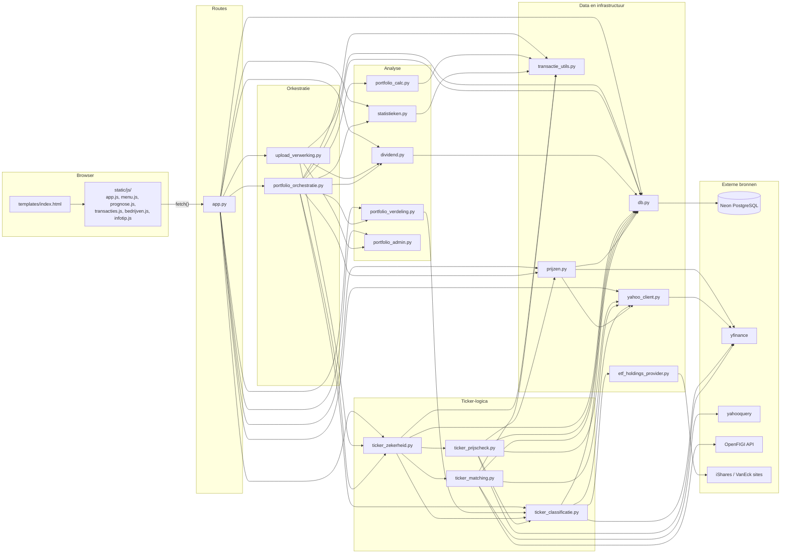

# Code-overzicht — Portfolio Dashboard (portfolioTracker)

> Geschreven op 2026-09-21, bijgewerkt op 2026-09-22, op basis van de code in de werkmap (laatste commit `9b12c52`, "fixes").
> Alles hieronder is uit de bronbestanden gelezen, niet uit CLAUDE.md overgenomen. Waar ik iets niet zeker
> kon vaststellen staat het woord **onzeker**. Waar CLAUDE.md en de code verschillen, staat dat onderaan
> bij [Afwijkingen](#afwijkingen-claudemd-versus-de-code).

## Inhoud

1. [Het grote plaatje](#1-het-grote-plaatje)
2. [De route van een upload, stap voor stap](#2-de-route-van-een-upload-stap-voor-stap)
3. [Per Python-module](#3-per-python-module)
4. [Database](#4-database)
5. [Frontend](#5-frontend)
6. [Externe bronnen](#6-externe-bronnen)
7. [Tests](#7-tests)
8. [Waar moet ik zijn als ik ... wil aanpassen?](#8-waar-moet-ik-zijn-als-ik--wil-aanpassen)
9. [Woordenlijst](#9-woordenlijst)
10. [Aanbevolen leesvolgorde](#10-aanbevolen-leesvolgorde)
11. [Afwijkingen: CLAUDE.md versus de code](#afwijkingen-claudemd-versus-de-code)
12. [Onzekerheden en open vragen](#onzekerheden-en-open-vragen)

---

## 1. Het grote plaatje

### Wat de app doet

Je uploadt een DeGiro-transactiebestand (Excel, en optioneel het "Rekeningoverzicht" voor dividend). De app:

1. leest de transacties in en koppelt elke positie aan een Yahoo Finance-ticker (zoeken op productnaam/ISIN, en controleren met de prijs);
2. haalt historische koersen op (yfinance) en berekent de waarde van je portfolio per dag;
3. slaat alles op in een PostgreSQL-database (Neon) onder een gegenereerde **3-letter-code** (bv. `ABC`), zodat je later
   met alleen die code je dashboard terug kunt zien;
4. toont dat in een single-page dashboard (rendement, verdeling ETF/aandeel, land/sector, top-bedrijven, ETF-overlap,
   statistieken, dividend, transacties, prognose).

Je kunt ook **"Niet opslaan"** kiezen: dan wordt er niets in de database bewaard en is er geen code.

### Ingangspunt en opstarten

| Wat | Waar | Toelichting |
|---|---|---|
| Ingangspunt | `app.py` | Bevat `app = Flask(__name__)` (regel 27). Dit `app`-object is wat een WSGI-server nodig heeft. |
| Database initialiseren | `app.py` regel 28: `init_db()` | Staat **op moduleniveau** (dus bij het *importeren* van `app.py`, niet in `if __name__ == "__main__"`). Daardoor draait het ook onder gunicorn, en ook in elke test die `app` importeert. |
| Lokaal draaien | `python app.py` | Onderaan `app.py`: `app.run(debug=True)`. Alleen bedoeld voor lokaal. |
| Configuratie | `.env` met `DATABASE_URL` | `db.py` roept `load_dotenv()` aan; `get_db_connection()` doet `psycopg2.connect(os.environ["DATABASE_URL"])`. Zonder `DATABASE_URL` crasht het importeren van `app.py` meteen met een `KeyError`. |
| Optionele omgevingsvariabele | `OPENFIGI_API_KEY` | Alleen gelezen in `ticker_matching.py`; mag ontbreken. |
| Productie (Render) | gunicorn | `gunicorn` staat in `requirements.txt`. Het **startcommando staat niet in de repo** (geen `Procfile`, `render.yaml` of dergelijke gevonden) — het is dus waarschijnlijk in het Render-dashboard ingesteld. Voor een Flask-object `app` in `app.py` is `gunicorn app:app` de gebruikelijke vorm, maar dat kan ik hier niet verifiëren: **onzeker**. |
| Gunicorn-timeout | niet in de repo | Diverse commentaren in de code gaan uit van "de standaard gunicorn-timeout van 30 s", en de frontend breekt zelf af na 55 s (`fetchMetTimeout`) resp. 60 s (upload). Wat er op Render echt is ingesteld: **onzeker**. |

Wat `init_db()` (in `db.py`) doet: één verbinding openen, dan `CREATE TABLE IF NOT EXISTS` voor elke tabel (zie [hoofdstuk 4](#4-database)),
`commit`, sluiten. Het is dus veilig om het bij elke start opnieuw uit te voeren — ook bij elke gunicorn-worker.

### Hoe de modules elkaar aanroepen

Lagen (van boven naar beneden): **browser → routes → orkestratie → analyse/ticker-logica → data/infra → extern**.
Pijlen betekenen "importeert" (en dus "roept aan"). `debug_utils.py` (alleen `dprint()`/`meet_tijd()`) is weggelaten uit
het diagram omdat bijna elke module het importeert; de exacte importlijst per module staat in de tabel eronder.



Als je Markdown-preview geen Mermaid toont: GitHub rendert dit blok wel.

Exacte imports tussen projectmodules (afgeleid uit de code, `debug_utils` staat erbij):

| Module | Importeert van andere projectmodules |
|---|---|
| `app.py` | `db`, `debug_utils`, `dividend`, `portfolio_admin`, `portfolio_orchestratie`, `portfolio_verdeling`, `prijzen`, `statistieken`, `ticker_zekerheid`, `upload_verwerking`, `yahoo_client` |
| `upload_verwerking.py` | `db`, `debug_utils`, `dividend`, `portfolio_admin`, `ticker_zekerheid` |
| `portfolio_orchestratie.py` | `db`, `debug_utils`, `dividend`, `portfolio_calc`, `portfolio_verdeling`, `prijzen`, `statistieken`, `ticker_classificatie`, `ticker_zekerheid`, `transactie_utils` |
| `portfolio_calc.py` | `debug_utils`, `transactie_utils` |
| `statistieken.py` | `transactie_utils` |
| `portfolio_verdeling.py` | `ticker_classificatie` |
| `dividend.py` | `db`, `debug_utils` |
| `ticker_zekerheid.py` | `db`, `debug_utils`, `ticker_classificatie`, `ticker_matching`, `ticker_prijscheck`, `transactie_utils` |
| `ticker_prijscheck.py` | `db`, `debug_utils`, `prijzen`, `ticker_classificatie`, `yahoo_client` |
| `ticker_matching.py` | `db`, `debug_utils`, `transactie_utils`, `yahoo_client` |
| `ticker_classificatie.py` | `db`, `debug_utils`, `etf_holdings_provider`, `yahoo_client` |
| `prijzen.py` | `db`, `debug_utils`, `yahoo_client` |
| `etf_holdings_provider.py` | `debug_utils` |
| `db.py`, `debug_utils.py`, `portfolio_admin.py`, `transactie_utils.py`, `yahoo_client.py` | *(geen)* — het zijn de "bladeren" van de boom |

Er zijn geen circulaire imports; dat is precies waarom `transactie_utils.py` en `yahoo_client.py` als losse, afhankelijkheidsloze
modules bestaan (zie de docstrings bovenin die bestanden).

### De vier "soorten" code, kort

- **Routes** (`app.py`): een request lezen, één orkestratiefunctie aanroepen, JSON teruggeven. (In de praktijk zitten er een paar
  routes met eigen SQL of logica in — zie [hoofdstuk 3](#3-per-python-module), sectie `app.py`.)
- **Orkestratie** (`portfolio_orchestratie.py`, `upload_verwerking.py`, en `_upload_impl()` in `app.py`): voegt taakfuncties samen tot een
  compleet antwoord.
- **Taakfuncties** (de domeinmodules): één berekening, één DB-call of één netwerkcall.
- **Frontend**: `templates/index.html` + `static/js/*.js` + `static/css/style.css`; praat met de routes via `fetch()`.

## 2. De route van een upload, stap voor stap

Dit hoofdstuk volgt één upload van klik tot dashboard. Er zijn twee takken die uit elkaar gaan in `_upload_impl()`:
**opslaan** (standaard) en **"Niet opslaan"**. Daarna staat de route waarmee je een bestaand portfolio met een code ophaalt.

### 2.0 Overzicht in één blik

```
Browser                      Flask (app.py)                       Domeinmodules
-------                      --------------                       -------------
uploadForm submit
  FormData ───────────────►  POST /upload  upload()
                               └─ _upload_impl()
                                    ├─ Excel → df              (upload_verwerking)
                                    ├─ niet_opslaan?  ──ja──►  ticker-resolutie → analyze_transacties()  ─► JSON
                                    └─ nee: order-ids → code → tickers → INSERT → ticker-backfill
                                            → build_portfolio_response(code)  ────────────────► JSON (kern)
toonDashboard(data)  ◄───────────────────────────────────────────────────────────────────────────┘
  └─ laadVerrijking(code) ──► GET /api/portfolio/<code>/verrijking  → analyze_transacties_verrijking ─► JSON
```

### 2.1 Stap voor stap: `POST /upload`

| # | Waar (bestand → functie) | Wat gebeurt er | Data in → data uit |
|---|---|---|---|
| 1 | `static/js/app.js` → submit-handler van `#uploadForm` | Bouwt een `FormData` uit het formulier (`naam`, `bestand1`, optioneel `bestand2`, vinkjes `niet_opslaan` en `herbepaal_alle_tickers`). Is er geen `bestand2` gekozen, dan wordt dat veld met `formData.delete("bestand2")` weggehaald. Toont de overlay "Analyseren..." en roept `fetchMetTimeout("/upload", ..., 60000)` aan. | formulier → `multipart/form-data` |
| 2 | `app.py` → `upload()` | Dunne wrapper om `_upload_impl()`: elke onverwachte exception wordt een nette JSON-foutmelding met status 500, in plaats van een hangende request. | request → `_upload_impl()`-resultaat of `{"error": ...}` |
| 3 | `app.py` → `_upload_impl()` | Zet de Yahoo-call-teller op nul (`reset_yahoo_call_teller()`), leest `naam`, controleert of `bestand1` er is (anders status 400). | |
| 4 | `upload_verwerking.py` → `_lees_transacties_excel()` | `pd.read_excel()`, kolomnamen `.strip()`, `Datum` → datetime (`dayfirst=True`). | bestandsobject → **DataFrame `df`** (kolommen zoals DeGiro ze heeft: `Datum`, `Tijd`, `Product`, `ISIN`, `Beurs`, `Aantal`, `Koers`, `Totaal EUR`, ...) |
| 5 | `upload_verwerking.py` → `_normaliseer_transactie_kolommen()` | Voegt drie hulpkolommen toe: `_kosten_eur` (uit `KOSTEN_KOLOM`), `_waarde_eur` (uit `WAARDE_KOLOM` = "Waarde EUR"), `_koers_eur` (= `Koers` gedeeld door `Wisselkoers` als die er is, anders `Koers`). Ontbreekt een kolom in dit DeGiro-formaat, dan NaN resp. ongewijzigde `Koers`. | `df` → `df` + 3 kolommen |
| 6 | `app.py` → `_upload_impl()` | Leest de vinkjes: `niet_opslaan` en `herbepaal_alle_tickers` (`== "on"`, want een aangevinkte HTML-checkbox stuurt "on"). **Hier splitst de route** ↓ | |

### 2.2 Tak A — "Niet opslaan" (geen database, geen code)

| # | Waar | Wat gebeurt er | Data |
|---|---|---|---|
| A1 | `upload_verwerking.py` → `_ticker_resolutie_niet_opslaan_pad(df)` | Groepeert `df` per **(ISIN, Beurs)**. Per groep een tuple `(productnaam, isin, beurs, [{datum, koers}, ...])`. Roept `basis_ticker_zekerheid_parallel()` aan (12 threads) → per positie `find_ticker_met_snelle_prijscheck()`. | `df` → `(ticker_by_isin_beurs, ticker_zekerheid, ticker_posities_ruw)`: een dict `{(isin, beurs): ticker}` plus twee lijsten van dicts |
| A2 | `upload_verwerking.py` → `_bouw_transacties_df_niet_opslaan()` | Bouwt een DataFrame met **dezelfde kolommen als wat normaal uit de database komt** (`datum`, `product`, `isin`, `beurs`, `ticker`, `aantal`, `koers`, `totaal_eur`, `echte_naam`, `transactiekosten`, `waarde_eur`, `tijd`). Zo hoeft de analysecode niet te weten waar de data vandaan komt. | `df` + dict → **`transacties_df`** |
| A3 | `portfolio_orchestratie.py` → `analyze_transacties(transacties_df, code=None, naam)` | Doet **kern én verrijking** achter elkaar (zie 2.4). `code=None`, dus geen dividend (dat zit in de database). | `transacties_df` → dict |
| A4 | `app.py` → `_upload_impl()` | Voegt `ticker_zekerheid` en `ticker_posities_ruw` aan het dict toe en geeft `jsonify(result)` terug. | dict → JSON |

Gevolgen van deze tak (allemaal zichtbaar in de code):

- Er worden **geen Order ID's** bepaald, niets naar Postgres geschreven, en er is **geen code**.
- `bestand2` (rekeningoverzicht) wordt **genegeerd**: de functie keert terug vóórdat `_verwerk_dividend_bestand_indien_aanwezig()` zou draaien.
- De frontend verbergt daarom de knoppen Instellingen, Bijnamen, Dividend en Transacties (`toonDashboard()`), en tabbladen die een code nodig hebben tonen een melding.
- De dure, prijs-geverifieerde ticker-check draait hier bewust **niet** mee; de frontend kan die later los aanvragen via `POST /api/ticker-zekerheid-check` (zie [hoofdstuk 5](#5-frontend)). Reden (uit de commentaren): een groter portfolio met koude cache liep anders over de gunicorn-timeout.

### 2.3 Tak B — Opslaan

| # | Waar | Wat gebeurt er | Data |
|---|---|---|---|
| B1 | `upload_verwerking.py` → `_bepaal_order_ids(bestand1, df)` | Leest het Excel-bestand **nog een keer** met `openpyxl` en zoekt per rij de cel die op een UUID lijkt (36 tekens, 4 streepjes). Reden: in het DeGiro-bestand staat de kop "Order ID" door samengevoegde cellen één kolom verschoven ten opzichte van de waarden, dus pandas vindt ze niet. Rijen zonder Order ID krijgen een **synthetische ID**: `"SYN-"` + eerste 16 tekens van de MD5 over `Datum\|Tijd\|Product\|ISIN\|Aantal\|Totaal EUR`, plus een volgnummer voor identieke rijen. | `df` → `df` + kolom `Order ID` |
| B2 | `app.py` → `get_db_connection()` | Opent één verbinding + cursor voor de volgende stappen. | |
| B3 | `upload_verwerking.py` → `_vind_of_maak_portfolio_code(cur, df, naam)` | Roept `find_matching_code()` (in `portfolio_admin.py`) aan: die vergelijkt de set Order ID's van deze upload met de set van **elk** bestaand portfolio. Is een bestaande set een deelverzameling van de nieuwe → dat is een update van hetzelfde portfolio (de ontbrekende ID's zijn de nieuwe rijen). Is de nieuwe set een deelverzameling van de bestaande → niets nieuws. Geen match → `generate_code(cur)` maakt een nieuwe, nog niet gebruikte 3-letter-code en er komt een rij in `portfolios`. Bij een match en een ingevulde `naam` wordt de naam bijgewerkt. | `df` → `(code, match_code, rows_to_insert)` |
| B4 | `upload_verwerking.py` → `_ticker_resolutie_opslaan_pad(cur, code, rows_to_insert, herbepaal_alle_tickers)` | Alleen voor de **nieuwe** rijen. Haalt (tenzij het vinkje aan staat) de al bekende tickers van deze code uit `transacties` op en geeft die door als `bekende_tickers`, zodat de dure yahooquery-zoekopdracht voor bekende posities wordt overgeslagen. Roept `vind_tickers_met_snelle_prijscheck_parallel()` aan (12 threads). | → dict `{(isin, beurs): ticker}` |
| B5 | `upload_verwerking.py` → `_insert_nieuwe_transacties()` | `INSERT ... ON CONFLICT (code, order_id) DO NOTHING` per rij. **Let op:** een `except Exception: pass` slikt elke fout per rij stilzwijgend in. | rijen → `transacties` |
| B6 | `app.py` → `conn.commit()` | Maakt de inserts definitief. | |
| B7 | `ticker_zekerheid.py` → `backfill_verouderde_tickers(code, forceer)` | Alleen bij een **bestaande** code (`match_code`): herbeoordeelt de opgeslagen tickers. Overschrijft alleen als de oude ticker een prijsprobleem heeft en de nieuwe kandidaat niet (of altijd herzoeken bij `forceer=True`, het vinkje). | |
| B8 | `upload_verwerking.py` → `_verwerk_dividend_bestand_indien_aanwezig(code)` | Is er een `bestand2`: `verwerk_rekeningoverzicht()` (in `dividend.py`) → lijst dividendrecords → `save_dividenden()` (upsert in `dividenden`). | Excel → records → DB |
| B9 | `portfolio_orchestratie.py` → `_wis_portfolio_basis_cache(code)` | Cache leegmaken ná alle mutaties hierboven, zodat het volgende stuk verse data ziet. | |
| B10 | `portfolio_orchestratie.py` → `build_portfolio_response(code)` | Haalt de "basis" op (zie 2.5) en roept `analyze_transacties_kern()` aan. Levert de **kern** (zonder verrijking). | code → dict |
| B11 | `app.py` → `_upload_impl()` | `log_yahoo_call_samenvatting()` en `jsonify(...)`. | dict → JSON |

### 2.4 Kern versus verrijking

De dashboardgegevens zijn in twee delen gesplitst zodat de Home-pagina snel klaar is. De reden staat in de docstrings: classificatie
en land/sector/holdings-opzoekingen zijn het netwerk-zware deel, dat bij een nieuw portfolio met koude cache de meeste tijd kost.

| | **Kern** — `analyze_transacties_kern()` | **Verrijking** — `analyze_transacties_verrijking()` |
|---|---|---|
| Geleverd via | `POST /upload`, `GET /api/portfolio/<code>`, en de antwoorden van bijnaam/reset-bijnaam/wijzig-code | `GET /api/portfolio/<code>/verrijking` (lui, door de frontend aangeroepen); bij "Niet opslaan" wordt het direct meegestuurd via `analyze_transacties()` |
| JSON-sleutels | `code`, `naam`, `chart_data` (`labels`, `waarde`, `geinvesteerd`, `rendement`), `per_ticker`, `per_ticker_aankoop`, `statistieken`, `tickers`, `ticker_waarschuwingen`, `laatste_koersdatum`, `laatst_opgehaald_op` | `verdeling`, `land_sector_verdeling`, `bedrijven_verdeling`, `etf_overlap` |
| Tabbladen die het gebruiken | Portfolio-home, Rendement, Per aandeel, Per aandeel aankoop, Statistieken, Prognose, Bijnamen (het tabblad "XIRR & rendement" heeft een eigen lui endpoint, zie hoofdstuk 5) | Verdeling, Land, Sector, Top 10 bedrijven, ETF-overlap |
| Kost | Koersen (uit cache, eventueel incrementeel verversen) + rekenwerk + DB-lezen (dividend, prijswaarschuwingen uit cache) | `classify_tickers()` + per ETF sector/holdings + per aandeel land/sector → mogelijk veel Yahoo-calls |
| Geen koersdata? | Geeft `{"code", "naam", "chart_data": None}` terug; de frontend toont "Geen koersdata gevonden" | Geeft lege structuren terug |

Wat `analyze_transacties_kern()` intern doet, in volgorde: (1) split-correctie + koersen ophalen — óf overslaan als
`prijs_data_al_klaar` is meegegeven; (2) `get_laatste_prijs_update()`; (3) `compute_value_over_time()`, `compute_per_ticker()`,
`compute_per_ticker_koers_en_aankopen()`; (4) ticker- en echte-namen-dicts; (5) `ticker_waarschuwingen_voor_transacties()`;
(6) `bereken_dividend_samenvatting(code)` (alleen als er een code is) voor "dividend per ticker"; (7) `bereken_statistieken()`; (8) alles
in één dict gieten. Let op: bij "Niet opslaan" draait `analyze_transacties_verrijking()` daarna nóg een keer split-correctie +
`get_prices()` (een warme cache-hit, maar dubbel werk — dat staat ook zo in de docstring).

### 2.5 De "basis" en de korte in-process cache

`_haal_portfolio_basis(code)` in `portfolio_orchestratie.py` is de gedeelde eerste stap voor de kern, de verrijking en de
Ticker-zekerheid-routes:

1. `SELECT` op `portfolios` (bestaat de code?) en op `transacties` (12 kolommen) → lijst tuples;
2. → **`transacties_df`** (DataFrame), `transactiekosten` en `waarde_eur` naar `float`;
3. `compute_split_adjusted_shares(transacties_df)` → voegt kolom `adj_aantal` toe;
4. `get_prices(tickers, start_date, verversen)` → **`price_data`** (DataFrame: index = datum, kolommen = tickers, waarden = koers in EUR);
5. resultaat `(naam, transacties_df, price_data)` wordt **20 seconden** bewaard in het dict `_basis_cache` (per proces, met een
   `threading.Lock`), zodat de 2–3 requests van één portfolio-bezoek niet drie keer hetzelfde ophalen.

`_wis_portfolio_basis_cache(code)` moet aangeroepen worden ná elke wijziging aan de transacties van een code (upload, bijnaam, code
wijzigen, verwijderen, geforceerde ticker-herberekening). Bij meerdere gunicorn-workers heeft elke worker zijn eigen cache; een miss
betekent alleen dat het request het "trage" pad neemt, niet dat er iets stukgaat.

### 2.6 Wat de frontend doet met het antwoord

`toonDashboard(data)` in `app.js`: `huidigeData = data`; alle per-portfolio-toestand resetten; knoppen tonen/verbergen afhankelijk van
`data.code`; de ticker-waarschuwingsbanner tonen; `wisselView("portfolio")`. Daarna: staat `data.verdeling` al in het antwoord
(niet-opslaan) → `verrijkingStatus = "klaar"`; is er een code → `laadVerrijking(code)` (haalt `/verrijking` op op de achtergrond en doet
`Object.assign(huidigeData, data)`, daarna tekent het het actieve tabblad opnieuw als dat een verrijkings-tabblad is).

### 2.7 Route: een bestaand portfolio ophalen met een code

Frontend: `#codeForm` submit-handler in `app.js` (code in hoofdletters) → `fetch("/api/portfolio/<CODE>")`, of met
`?herbepaal_alle_tickers=true` als het vinkje "Ticker-informatie ... opnieuw bepalen" aan staat → `toonDashboard(data)`.

Backend: `app.py` → `api_portfolio(code)`:

1. `code.strip().upper()`; `reset_yahoo_call_teller()`;
2. bij `?herbepaal_alle_tickers=true`: `backfill_verouderde_tickers(code, forceer=True)` en daarna `_wis_portfolio_basis_cache(code)`
   (anders zou de cache nog de oude tickers teruggeven);
3. `build_portfolio_response(code)` → `_haal_portfolio_basis()` → `analyze_transacties_kern()` (zie 2.4/2.5). `None` (code bestaat
   niet) → JSON-fout met status 404;
4. `log_yahoo_call_samenvatting()` en `jsonify(result)`.

Daarna volgt dezelfde `toonDashboard()` → `laadVerrijking()`-vervolgstap als bij een upload. Het verschil met een upload: er wordt niets
ingelezen of weggeschreven (behalve de optionele ticker-backfill), en de koersen worden wel opnieuw "ververst" — `get_prices()` heeft
standaard `verversen=True`, dus voor tickers waarvan de cache niet vers is wordt bij **elke** portfolio-opening incrementeel bij Yahoo
bijgehaald, tenzij dezelfde ticker minder dan 2 minuten eerder al is ververst (`DREMPEL_HERGEBRUIK_KOERS`).

## 3. Per Python-module

18 Python-modules (zonder tests), in de map `portfolioTracker/`. Per module: verantwoordelijkheid, een functietabel en bijzonderheden.
De kolom **"Aangeroepen door"** is met een script uit de code afgeleid (een AST-doorloop van alle `.py`-bestanden); "—" betekent: geen
aanroeper in de productiecode gevonden (de functie wordt dan alleen door tests, via een dict of via HTTP gebruikt — dat staat erbij).

### Waar staat wat? (snelle opzoektabel)

| Onderwerp | Bestand | Kernfuncties |
|---|---|---|
| Portfoliowaarde en geïnvesteerd bedrag per dag | `portfolio_calc.py` | `compute_value_over_time()` |
| Waarde/geïnvesteerd per aandeel | `portfolio_calc.py` | `compute_per_ticker()`, `compute_per_ticker_koers_en_aankopen()` |
| **Rendement** (totaal, per positie, per jaar) | `statistieken.py` | `bereken_totaal_rendement()`, `bereken_positie_rendement()`, `bereken_jaar_rendement()`, `bereken_jaren_overzicht()` |
| **XIRR** | `statistieken.py` | `bereken_xirr()` (via `pyxirr`), `_bouw_xirr_cashflows()` |
| **TWR** | `statistieken.py` | `bereken_twr()` |
| Rendement/XIRR/TWR over tijd | `statistieken.py` | `bereken_rendement_over_tijd()` |
| Benchmarkvergelijking | `statistieken.py` | `bereken_benchmark_vergelijking()`, `BENCHMARK_TICKERS` |
| **GAK en kostprijs** | `statistieken.py` | `bereken_holdings_en_gesloten()` (wrapper: `bereken_holdings_gak()`); een tweede, parallelle implementatie zit in `compute_per_ticker()` |
| **Split-correctie** (aantallen in de waardereeks) | `portfolio_calc.py` | `compute_split_adjusted_shares()` |
| Split-correctie (bij de prijscontrole van tickers) | `ticker_prijscheck.py` | `_haal_splits_op()`, `_cumulatieve_split_factor()` |
| **Koersen ophalen en cachen** | `prijzen.py` (+ `db.py`, `yahoo_client.py`) | `get_prices()`, `save_prices()`, `upsert_prices()`, `download_met_retry()` |
| Valuta naar EUR | `prijzen.py` | `_converteer_naar_eur()`, `_fx_prijzen_serie()` |
| **Ticker zoeken** | `ticker_matching.py` | `find_ticker_detailed()`, `_zoek_product_progressief()`, `BEURS_MAP`, `MANUAL_TICKER_OVERRIDES_ISIN` |
| **Ticker verifiëren** | `ticker_prijscheck.py`, `ticker_zekerheid.py`, `ticker_matching.py` | `vergelijk_prijs_op_datum()`, `find_ticker_met_snelle_prijscheck()` (licht), `verifieer_ticker_met_prijs()` (volledig), `haal_openfigi_resultaten()` |
| **ETF-holdings** | `etf_holdings_provider.py`, `ticker_classificatie.py` | `ETF_HOLDINGS_BRON`, `fetch_provider_holdings()`, `get_etf_holdings()` |
| **ETF-overlap** | `portfolio_verdeling.py` | `bereken_etf_overlap()`, `bereken_etf_overlap_detail()` |
| **Verdeling ETF/aandeel** | `portfolio_orchestratie.py` + `ticker_classificatie.py` | het `verdeling`-blok in `analyze_transacties_verrijking()`, `classify_tickers()` |
| **Land / sector / top-bedrijven** | `portfolio_verdeling.py` | `compute_land_sector_verdeling()`, `bereken_bedrijven_verdeling()` |
| **Statistieken** (tabblad) | `statistieken.py` | `bereken_statistieken()` |
| **Dividend** | `dividend.py` (+ `db.py`) | `verwerk_rekeningoverzicht()`, `bereken_dividend_samenvatting()` |
| **Prognose** | **geen Python** — alleen `static/js/prognose.js` en `app.js` | `berekenPrognose()`, `bouwPrognoseGrafiekData()` (JS) |

---

### `app.py` — de Flask-routes

**Verantwoordelijkheid:** het Flask-object aanmaken, `init_db()` draaien, en 19 routes definiëren. 20 functies in totaal (19 routes + `_upload_impl()`).

| Route | Methode | Functie | Wat | Aangeroepen door (frontend) |
|---|---|---|---|---|
| `/` | GET | `home()` | rendert `templates/index.html` | de browser |
| `/dbtest` | GET | `db_test()` | `SELECT 1` als verbindingstest | niet door de frontend gebruikt |
| `/upload` | POST | `upload()` → `_upload_impl()` | zie [hoofdstuk 2](#2-de-route-van-een-upload-stap-voor-stap) | submit-handler van `#uploadForm` |
| `/api/portfolio/<code>` | GET | `api_portfolio()` | kern voor een bestaande code | submit-handler van `#codeForm` |
| `/api/portfolio/<code>/verrijking` | GET | `portfolio_verrijking()` | verrijking (verdeling/land/sector/bedrijven/overlap) | `laadVerrijking()` |
| `/api/etf-overlap-detail` | GET | `etf_overlap_detail()` | holdings van één ETF-paar; query `a` en `b` | `toonEtfOverlapDetail()` |
| `/api/portfolio/<code>/benchmark-vergelijking` | GET | `benchmark_vergelijking()` | hypothetisch rendement als dezelfde cashflows in een benchmark (`?benchmark=`) of eigen ticker (`?eigen_ticker=`) waren gestoken | `wisselBenchmark()`, `wisselEigenAandeel()` |
| `/api/portfolio/<code>/rendement-over-tijd` | GET | `rendement_over_tijd()` | reeks rendement%/XIRR%/TWR% per maandeinde | `toonRendementOverTijd()` |
| `/api/portfolio/<code>/ticker-koers-bereik` | GET | `ticker_koers_bereik()` | extra koershistorie voor 1 ticker (`ticker`, `vanaf`, `tot`) | `laadMeerHistorie()` |
| `/api/portfolio/<code>/ticker-zekerheid` | GET | `ticker_zekerheid()` | volledige verificatie van álle posities in één request | **niet meer** door de frontend gebruikt (docstring: "blijft bestaan voor eventueel ander gebruik") |
| `/api/portfolio/<code>/ticker-zekerheid/lijst` | GET | `ticker_zekerheid_lijst()` | alleen de lijst posities, zonder prijscontrole | `toonInstellingenTicker()` |
| `/api/portfolio/<code>/ticker-zekerheid/positie` | GET | `ticker_zekerheid_positie()` | volledige verificatie van 1 positie (`isin`, `beurs`) | `toonInstellingenTicker()` |
| `/api/ticker-zekerheid-check` | POST | `ticker_zekerheid_check()` | volledige verificatie voor een "niet opslaan"-analyse, op meegestuurde transacties | `controleerTickerZekerheidUitgebreid()` |
| `/api/portfolio/<code>/dividend` | GET | `dividend()` | `bereken_dividend_samenvatting()`; `{"beschikbaar": False}` als er geen dividenden zijn | `toonDividend()` |
| `/api/portfolio/<code>/transacties` | GET | `transacties_overzicht()` | `{"lijst": get_transacties_overzicht(code)}` | `toonTransacties()` |
| `/api/portfolio/<code>/bijnaam` | POST | `set_bijnaam()` | `UPDATE transacties SET product = ...` voor alle rijen met die ticker | `slaBijnaamOp()` |
| `/api/portfolio/<code>/reset-bijnaam` | POST | `reset_bijnaam()` | `product = echte_naam` | `resetBijnaam()` |
| `/api/portfolio/<code>` | DELETE | `verwijder_portfolio()` | `delete_portfolio()` + cache wissen | handler van `#verwijderPortfolioBtn` |
| `/api/portfolio/<code>/wijzig-code` | POST | `wijzig_code()` | valideert met `is_geldige_code()`, dan `wijzig_portfolio_code()` | handler van `#wijzigCodeBtn` |

**Bijzonderheden en valkuilen**

- `app.py` is **niet helemaal "alleen dunne routes"**: `_upload_impl()` is een lange orkestratiefunctie, en `ticker_koers_bereik()`, `dividend()`,
  `transacties_overzicht()` doen een eigen SQL-check of berekening. `benchmark_vergelijking()` bevat validatielogica en roept `get_prices()` rechtstreeks aan.
- Er is **geen authenticatie of gebruikersbegrip**: wie een code kent, kan alles lezen, wijzigen en met de `DELETE`-route verwijderen.
- De route-functie `dividend()` en `ticker_zekerheid()` hebben dezelfde naam als de modules `dividend.py` en `ticker_zekerheid.py`. Dat werkt omdat `app.py`
  alleen losse functies uit die modules importeert, maar het is verwarrend bij zoeken.
- `import math` staat bovenin maar wordt in `app.py` nergens gebruikt; de `t0 = time.time()`-regels in de ticker-zekerheid-routes worden alleen door
  uitgecommentarieerde prints gelezen.
- Een aantal docstrings verwijst nog naar het oude `analysis.py` (zie [Afwijkingen](#afwijkingen-claudemd-versus-de-code)).

---

### `upload_verwerking.py` — taakfuncties achter `/upload`

**Verantwoordelijkheid:** Excel inlezen, kolommen normaliseren, tickers oplossen (twee paden), Order ID's bepalen, portfolio-code zoeken/maken,
inserten en het dividendbestand verwerken. `_upload_impl()` in `app.py` roept ze in volgorde aan (zie hoofdstuk 2).

Constanten: `KOSTEN_KOLOM` (`"Transactiekosten en/of kosten van derden EUR"`), `WAARDE_KOLOM` (`"Waarde EUR"`), `WISSELKOERS_KOLOM` (`"Wisselkoers"`).

| Functie | Wat | Input → output | Aangeroepen door |
|---|---|---|---|
| `_lees_transacties_excel()` | Excel → DataFrame, kolommen strippen, `Datum` parsen (`dayfirst=True`) | bestandsobject → DataFrame | `_upload_impl()` |
| `_normaliseer_transactie_kolommen()` | voegt `_kosten_eur`, `_waarde_eur`, `_koers_eur` toe | DataFrame → DataFrame | `_upload_impl()` |
| `_normaliseer_tijd()` | maakt van een tijdcel (string, `time` of `datetime`) een `"HH:MM:SS"`-string voor een Postgres-`TIME` | cel → tekst of `None` | `_insert_nieuwe_transacties()` |
| `_log_valuta_kolom_naast_koers()` | debug-onderzoek: logt de kolom direct rechts van `Koers` | DataFrame → (alleen logging) | `_upload_impl()`, `_ticker_resolutie_niet_opslaan_pad()` |
| `_ticker_resolutie_niet_opslaan_pad()` | lichte parallelle ticker-zekerheid per (ISIN, Beurs) | DataFrame → `(dict, lijst, lijst)` | `_upload_impl()` |
| `_bouw_transacties_df_niet_opslaan()` | bouwt een DataFrame in dezelfde vorm als uit de database | DataFrame + dict → DataFrame | `_upload_impl()` |
| `_bepaal_order_ids()` | Order ID's via `openpyxl`, synthetische ID's voor rijen zonder | bestand + DataFrame → DataFrame | `_upload_impl()` |
| `_vind_of_maak_portfolio_code()` | bestaande code zoeken (`find_matching_code()`) of nieuwe maken (`generate_code()`) | cursor, DataFrame, naam → `(code, match_code, rows_to_insert)` | `_upload_impl()` |
| `_ticker_resolutie_opslaan_pad()` | tickers voor de nieuwe rijen, met hergebruik van bekende tickers | cursor, code, DataFrame, vlag → dict | `_upload_impl()` |
| `_insert_nieuwe_transacties()` | `INSERT ... ON CONFLICT (code, order_id) DO NOTHING` per rij | rijen → aantal ingevoegd | `_upload_impl()` |
| `_verwerk_dividend_bestand_indien_aanwezig()` | leest `request.files["bestand2"]`, slaat dividenden op | code → (schrijft naar DB) | `_upload_impl()` |

**Bijzonderheden en valkuilen**

- `_koers_eur` = `Koers` / `Wisselkoers` (als die er is en niet 0). Dát is wat in de kolom `transacties.koers` terechtkomt: **altijd in EUR**, ook voor een
  niet-EUR-genoteerde positie.
- `_insert_nieuwe_transacties()` heeft `except Exception: pass` — een mislukte rij (bv. door een ontbrekende ticker in de dict) verdwijnt zonder melding.
- `_bepaal_order_ids()`: klopt het aantal gevonden rijen niet met `len(df)`, dan wordt **de hele** `Order ID`-kolom `None` en krijgt elke rij een synthetische ID.
- `_verwerk_dividend_bestand_indien_aanwezig()` importeert `request` uit Flask — deze module is daardoor niet buiten een request te draaien voor dit ene stuk.
- De docstrings nummeren de stappen "Taak 1/6 ... 6/6"; dat zijn dezelfde stappen als in hoofdstuk 2.

---

### `portfolio_orchestratie.py` — de laag tussen routes en domeinmodules

**Verantwoordelijkheid:** transacties + koersen ophalen (met korte cache), en daaruit de dashboard-respons opbouwen (kern + verrijking).

| Functie | Wat | Input → output | Aangeroepen door |
|---|---|---|---|
| `_haal_portfolio_basis()` | SELECT + split-correctie + `get_prices()`, 20 s gecachet in `_basis_cache` | `code` → `(naam, transacties_df, price_data)` of `(None, None, None)` | `portfolio_verrijking()`, `_ticker_zekerheid_groepen()`, `build_portfolio_response()` |
| `_wis_portfolio_basis_cache()` | verwijdert de cache-entry van een code | `code` → — | `_upload_impl()`, `api_portfolio()`, `set_bijnaam()`, `reset_bijnaam()`, `verwijder_portfolio()`, `wijzig_code()` |
| `_laad_transacties_en_resultaat()` | SELECT + split-correctie + `get_prices()` + `compute_value_over_time()` | `code` → `(transacties_df, resultaat)`; `(None, None)` als de code niet bestaat; `(df, None)` zonder koersdata | `benchmark_vergelijking()`, `rendement_over_tijd()` |
| `_ticker_zekerheid_groepen()` | groepeert transacties per (ISIN, Beurs), zonder corporate-action-rijen | `code` → lijst `((isin, beurs), info)` of `None` | `ticker_zekerheid()`, `ticker_zekerheid_lijst()`, `ticker_zekerheid_positie()` |
| `build_portfolio_response()` | basis ophalen → kern | `code, verversen` → dict of `None` | `_upload_impl()`, `api_portfolio()`, `set_bijnaam()`, `reset_bijnaam()`, `wijzig_code()` |
| `analyze_transacties_kern()` | de snelle helft van het dashboard | `transacties_df, code, naam, ...` → dict | `build_portfolio_response()`, `analyze_transacties()` |
| `analyze_transacties_verrijking()` | Verdeling, Land/Sector, Bedrijven, ETF-overlap | `transacties_df, code, ...` → dict | `portfolio_verrijking()`, `analyze_transacties()` |
| `analyze_transacties()` | kern + verrijking in één keer (voor "niet opslaan") | `transacties_df, code, naam` → dict | `_upload_impl()` |

**Bijzonderheden en valkuilen**

- `_laad_transacties_en_resultaat()` doet dezelfde SELECT als `_haal_portfolio_basis()` maar gebruikt **de cache niet** (en geeft altijd verse koersen via `get_prices()`
  met de standaardinstellingen). Wie een kolom aan `transacties` toevoegt moet **beide** SELECT-lijsten aanpassen.
- `import resource` is Unix-only; op Windows is `resource` dan `None` en vervallen de `[memory]`-logregels stilzwijgend.
- De cache is een gewoon `dict` in het proces: bij twee gunicorn-workers zijn dat twee aparte caches.
- Bij "niet opslaan" krijgt `analyze_transacties_verrijking()` het **niet-split-gecorrigeerde** `transacties_df` mee (de kern past de correctie alleen lokaal toe),
  en doet de correctie + `get_prices()` daarom zelf nog eens.

### `portfolio_admin.py` — portfolio-code beheren en uploads matchen

**Verantwoordelijkheid:** 3-letter-codes genereren/valideren en bepalen of een nieuwe upload bij een bestaand portfolio hoort (via Order ID-overlap).
Constante: `CODE_LENGTH = 3`. Heeft geen imports van andere projectmodules.

| Functie | Wat | Input → output | Aangeroepen door |
|---|---|---|---|
| `is_geldige_code()` | `re.fullmatch` op exact 3 hoofdletters A–Z | tekst → bool | `wijzig_code()` |
| `generate_code()` | willekeurige code, herhaalt tot hij nog niet in `portfolios` staat | cursor → tekst | `_vind_of_maak_portfolio_code()` |
| `get_order_id_sets()` | `{code: set(order_id)}` voor **alle** portfolio's | cursor → dict | `find_matching_code()` |
| `find_matching_code()` | eerste code waarvan de bestaande set ⊆ nieuwe set (dan: nieuwe − bestaande = te inserten), of nieuwe set ⊆ bestaande set (dan: niets nieuws) | cursor, set → `(code, set)` of `(None, None)` | `_vind_of_maak_portfolio_code()` |

**Valkuilen:** `get_order_id_sets()` leest bij elke upload alle Order ID's van alle portfolio's; de match is het *eerste* portfolio dat aan een van beide
deelverzameling-voorwaarden voldoet.

---

### `transactie_utils.py` — twee kleine gedeelde helpers

**Verantwoordelijkheid:** twee functies op ruwe transactierijen, zonder DB/netwerk, gebruikt door meerdere modules (daarom een eigen bestand: anders circulaire imports).

| Functie | Wat | Aangeroepen door |
|---|---|---|
| `_is_corporate_action_row()` | `True` als `beurs == "DEG"` (hoofdletters, gestript) of `"NON TRADEABLE"` in de productnaam: de boekingsrijen die DeGiro voor splits e.d. maakt | `compute_split_adjusted_shares()`, `_ticker_zekerheid_groepen()`, `_bouw_xirr_cashflows()`, `bereken_twr()`, `find_ticker_detailed()` |
| `_sorteer_chronologisch()` | sorteert op datum **plus tijd** (stabiele mergesort); rijen zonder tijd tellen als 00:00:00 | `compute_value_over_time()`, `compute_per_ticker()`, `compute_per_ticker_koers_en_aankopen()`, `bereken_holdings_en_gesloten()` |

**Waarom `_sorteer_chronologisch()` bestaat:** de database sorteert niet; een verkoop vóór de koop van dezelfde dag verwerken gaf een "onbekende" verkoopkoers (zie de docstring).

---

### `debug_utils.py` — logging

`DEBUG = True` (bovenin), `dprint()` (print alleen als `DEBUG`) en `meet_tijd(label)` (contextmanager die `[timing] label: 0.42s` print). Alles staat standaard
**aan**, dus ook productie print de `dprint`-regels. Een `dprint` met een emoji (✅/⚠️) kan op een Windows-console met cp1252 een `UnicodeEncodeError` geven;
zet dan `PYTHONUTF8=1` vóór het starten (dit staat ook in CLAUDE.md). Een groot deel van de andere `print(...)`-regels in het project is uitgecommentarieerd.

---

### `portfolio_calc.py` — tijdreeksen en split-correctie

**Verantwoordelijkheid:** de per-dag-berekeningen op `transacties_df` + `price_data` voor Home, Per aandeel en Per aandeel aankoop, plus de split-correctie.

| Functie | Wat | Input → output | Aangeroepen door |
|---|---|---|---|
| `compute_split_adjusted_shares()` | voegt kolom `adj_aantal` toe: het aantal aandelen zoals het na latere splits zou zijn | `transacties_df` → kopie met `adj_aantal` | `_haal_portfolio_basis()`, `_laad_transacties_en_resultaat()`, `analyze_transacties_kern()`, `analyze_transacties_verrijking()` |
| `compute_value_over_time()` | per handelsdag: `waarde`, `geinvesteerd`, `rendement` | `transacties_df, price_data` → DataFrame (index = datum) | `_laad_transacties_en_resultaat()`, `analyze_transacties_kern()` |
| `compute_per_ticker()` | per ticker: `labels`, `waarde`, `geinvesteerd`, `nog_in_bezit` | idem → dict per ticker | `analyze_transacties_kern()` |
| `compute_per_ticker_koers_en_aankopen()` | per ticker: kale koers, aantal aangehouden, aankoop- en verkoopdatums | idem → dict per ticker | `analyze_transacties_kern()` |
| `debug_position()` | handmatige diagnose-helper voor één positie (print) | — | — (alleen om zelf aan te roepen) |

**Hoe de split-correctie werkt** (`compute_split_adjusted_shares()`): per ISIN worden de corporate-action-rijen gezocht. Daarna een "conversierij": een echte
transactierij met `koers == 0` en `aantal > 0`. Per conversie: `shares_before` = som van `adj_aantal` van eerdere echte trades met koers > 0; `new_shares` = som
van positieve corporate-action-rijen tussen de laatste echte trade en de conversiedatum; `ratio = (shares_before + new_shares) / shares_before`. Alle eerdere
niet-corporate-action-rijen van die ISIN krijgen `adj_aantal *= ratio`. Vindt hij geen conversierij, dan wordt de split **stilzwijgend overgeslagen** (de
waarschuwings-`print` is uitgecommentarieerd).

**Bijzonderheden en valkuilen**

- **"Geïnvesteerd" betekent hier twee dingen.** In `compute_value_over_time()` is het de **netto cashflow**: `invested += -totaal_eur` bij elke rij (dus inclusief
  kosten, en een verkoop verlaagt het met de verkoopopbrengst). In `compute_per_ticker()` is het de **kostenbasis van de nu aangehouden stukken** volgens de
  gemiddelde-kostprijs-methode, op basis van `waarde_eur` (zonder kosten; valt terug op `totaal_eur` als die NULL is). Het portfolio-totaal op Home/Statistieken
  (`chart_data.geinvesteerd`, `statistieken.totalen.geinvesteerd`) is de eerste; de som van de per-aandeel-lijnen komt daar dus niet noodzakelijk mee overeen.
- In `compute_value_over_time()` geldt: een ticker zonder koersdata telt niet mee in `waarde`, maar zijn cashflow telt wel mee in `geinvesteerd` (er staat wel een
  `print`-waarschuwing, die is uitgecommentarieerd).
- De crop-range per ticker: begint 1 dag vóór de eerste activiteit, eindigt 1 dag ná de laatste als de positie niet meer wordt aangehouden. "Nog in bezit" is bepaald
  op het **aandelenaantal** (`abs(holdings) > 1e-6`), niet op `geinvesteerd` (dat blijft na een winstgevende verkoop > 0). Dit staat er met een lang commentaar bij.
- **Onzeker:** ik vond geen unit test die `compute_split_adjusted_shares()` zelf met een getal doorrekent (de tests geven `adj_aantal` als invoer of mocken de
  functie). Of de detectie voor alle DeGiro-variantexports werkt, kan ik dus niet uit de code alleen afleiden.

---

### `statistieken.py` — rendement, XIRR, TWR, GAK, jaaroverzicht

**Verantwoordelijkheid:** de berekeningen voor het Statistieken-tabblad en het "XIRR & rendement"-tabblad. Bijna alles zijn **pure functies** (getallen/DataFrames in,
getallen uit, geen DB/netwerk), daardoor met de hand na te rekenen en goed te testen. Enige externe library: `pyxirr`.

| Functie | Wat | Input → output | Aangeroepen door |
|---|---|---|---|
| `bereken_positie_rendement()` | rendement van 1 positie: `waarde = aantal × koers`, `geinvesteerd = gak × aantal` | `gak, aantal, koers` → dict | `bereken_statistieken()` |
| `bereken_totaal_rendement()` | `rendement_eur = waarde − geinvesteerd`; `rendement_pct` (None bij geinvesteerd 0) | twee getallen → dict | `bereken_statistieken()`, `bereken_rendement_over_tijd()` |
| `bereken_jaar_rendement()` | winst van 1 kalenderjaar; % = winst / (startwaarde + ingelegd) | drie getallen → dict | `bereken_jaren_overzicht()` |
| `bereken_xirr()` | geannualiseerd rendement via `pyxirr.xirr`; `None` bij < 2 cashflows of een fout | lijst `(datum, bedrag)` → fractie of `None` | `bereken_statistieken()`, `bereken_rendement_over_tijd()` |
| `bereken_twr()` | time-weighted return: sub-periode-rendement `waarde_eind / (waarde_start + cf) − 1`, aan elkaar vermenigvuldigd | `transacties_df, resultaat` → fractie of `None` | `bereken_statistieken()`, `bereken_rendement_over_tijd()` |
| `bereken_holdings_en_gesloten()` | **GAK/kostprijs**: per ticker één pas door de transacties; geeft open én gesloten posities | `transacties_df` → `(open, gesloten)` | `bereken_holdings_gak()`, `bereken_statistieken()` |
| `bereken_holdings_gak()` | dunne wrapper: alleen de open posities | `transacties_df` → dict | — (alleen tests) |
| `bereken_jaren_overzicht()` | per kalenderjaar: start/eind, ingelegd, winst, dagen verstreken | `resultaat, eerste_datum` → lijst dicts | `bereken_statistieken()` |
| `_bouw_xirr_cashflows()` | cashflow-lijst (echte transacties + fictieve eindwaarde) | `transacties_df, resultaat` → lijst | `bereken_statistieken()`, `bereken_benchmark_vergelijking()`, `bereken_rendement_over_tijd()` |
| `bereken_benchmark_vergelijking()` | simuleert dezelfde cashflows in een benchmark | `transacties_df, resultaat, koersen` → dict of `None` | `benchmark_vergelijking()` |
| `bereken_rendement_over_tijd()` | rendement%/XIRR%/TWR% per maandeinde (+ laatste datum) | `transacties_df, resultaat` → dict met lijsten | `rendement_over_tijd()` |
| `bereken_totale_transactiekosten()` | som van `transactiekosten`; `beschikbaar=False` als de kolom leeg is | `transacties_df` → dict | `bereken_statistieken()` |
| `bereken_statistieken()` | orkestratie voor het Statistieken-tabblad | `transacties_df, price_data, resultaat, ...` → dict | `analyze_transacties_kern()` |

Constante: `BENCHMARK_TICKERS = {"S&P 500": "VUSA.AS", "Nasdaq 100": "CNDX.AS", "AEX": "IAEA.AS"}`.

**Bijzonderheden en valkuilen**

- **GAK-methode** (`bereken_holdings_en_gesloten()`): lopend gemiddelde. Bij een koop: `aantal += n`, `kostprijs += waarde_eur` (zonder kosten; fallback `totaal_eur`). Bij een verkoop
  (alleen als er een echte cashflow is, `totaal_eur != 0`): de kostenbasis van de verkochte stukken (`GAK × verkocht`) gaat eraf. Een **split-boekingsrij** (aantal ≠ 0, `totaal_eur = 0`)
  verandert alleen het aantal, niet de kostenbasis; zo verdunt een split de GAK vanzelf. Voorbeeld uit `tests/test_rendement.py`: 10 stuks × €10, dan −10 (DEG) en +20 (conversie) →
  20 stuks, kostenbasis €100, GAK €5.
- **Gerealiseerd resultaat** = verkoopopbrengst (`totaal_eur`, dus mét kosten) − kostenbasis van het verkochte deel (GAK, zonder kosten). Aan de koopkant tellen kosten dus niet mee, aan de
  verkoopkant wel.
- **XIRR** gebruikt `totaal_eur` (inclusief kosten) plus één fictieve verkoop van de huidige waarde op de laatste datum.
- **All-time high** is de hoogste waarde van `rendement` (waarde − geïnvesteerd), niet de hoogste portefeuillewaarde.
- `gemiddeld_jaarrendement_pct` is het **rekenkundig gemiddelde** van de jaarlijkse `winst_pct`; `aantal_jaren` = dagen / 365,25.
- `bereken_rendement_over_tijd()` herrekent XIRR én TWR voor elke maandstap vanaf het begin; dat is de reden dat dit een apart, lui endpoint is.
- Een docstring in `bereken_totale_transactiekosten()` verwijst naar `KOSTEN_KOLOM in app.py`; die staat nu in `upload_verwerking.py`.

---

### `dividend.py` — het rekeningoverzicht en de dividend-samenvatting

**Verantwoordelijkheid:** het DeGiro-"Account"/rekeningoverzicht inlezen, per uitkering het netto-bedrag in EUR bepalen (inclusief koppelen aan valutaconversie-rijen), en de
opgeslagen dividenden samenvatten voor de UI.

| Functie | Wat | Input → output | Aangeroepen door |
|---|---|---|---|
| `_koppel_valutaconversie_paren()` | vindt paren "Valuta Debitering"/"Valuta Creditering" met exact hetzelfde `(Datum, Tijd)`; bepaalt per paar welke rij EUR is | DataFrame → lijst dicts | `verwerk_rekeningoverzicht_df()` |
| `_match_valutaconversie()` | zoekt het nog ongebruikte paar met dezelfde valuta en (binnen tolerantie 0,02) hetzelfde bedrag | paren, valuta, bedrag, datum → paar of `None` | `verwerk_rekeningoverzicht_df()` |
| `_clusters_binnen_venster()` | groepeert op datum gesorteerde items zolang twee opeenvolgende ≤ `max_dagen` uit elkaar liggen | items, dagen → lijst clusters | `verwerk_rekeningoverzicht_df()` |
| `verwerk_rekeningoverzicht_df()` | het eigenlijke rekenwerk: netten per (Datum, ISIN), omrekenen naar EUR, gepoolde conversies, `herinvesteerd`-vlag | DataFrame → lijst records | `verwerk_rekeningoverzicht()` |
| `verwerk_rekeningoverzicht()` | Excel inlezen + kolommen hernoemen, dan `verwerk_rekeningoverzicht_df()` | bestandsobject → lijst records | `_verwerk_dividend_bestand_indien_aanwezig()` |
| `bereken_dividend_samenvatting()` | leest `dividenden` (via `get_dividenden()`), koppelt ISIN → ticker/bijnaam via `transacties`, bouwt `totaal_netto`, `per_ticker`, `cumulatief`, `lijst` | `code` → dict of `None` | `dividend()` (route), `analyze_transacties_kern()` |

Constante: `DIVIDEND_POOL_MAX_DAGEN_VERSCHIL = 3`.

**Bijzonderheden en valkuilen**

- De kolomkoppen "Mutatie" en "Saldo" zijn in het Excel-bestand samengevoegd over twee kolommen; `verwerk_rekeningoverzicht()` hernoemt daarom **op positie-naam**:
  `"Mutatie"` → `valuta_mutatie`, `"Unnamed: 8"` → `mutatie`, `"Saldo"` → `valuta_saldo`, `"Unnamed: 10"` → `saldo`. Verschuift het DeGiro-formaat, dan breekt dit.
- Koppelen aan de conversie gaat op **tijdstip van de conversie-rijen onderling** plus valuta+bedrag — **nooit** op de Valutadatum van de dividendrij (die loopt vaak een dag vóór).
- "Dividend Herinvestering"-rijen worden **meegenomen** in het netten (anders klopt het netto-bedrag niet) en zetten de vlag `herinvesteerd`.
- Lukt de koppeling niet, dan blijven `bruto_eur`/`belasting_eur`/`netto_eur` expliciet `None`: nooit een gok. Zulke rijen blijven wel in `lijst` staan, maar tellen niet mee in `totaal_netto`.
- `dividend_id` = `"DIV-"` + eerste 16 tekens MD5 over `datum|isin|bruto_ruw|belasting_ruw` (de ruwe bedragen, dus stabiel bij latere verbeteringen aan de EUR-omrekening).

---

### `portfolio_verdeling.py` — verdeling, land, sector, bedrijven, overlap

**Verantwoordelijkheid:** portfoliobrede aggregaties over alle huidige holdings (aantal × laatste koers). Gebruikt de **ruwe** kolom `aantal`, niet `adj_aantal`.

| Functie | Wat | Input → output | Aangeroepen door |
|---|---|---|---|
| `compute_land_sector_verdeling()` | land en sector portfoliobreed (in €), plus per ETF en per bron | `transacties_df, price_data, is_etf_map` → dict met `land`, `land_europa`, `sector`, `per_etf`, `land_per_bron`, `land_per_bron_europa`, `sector_per_bron` | `analyze_transacties_verrijking()` |
| `bereken_bedrijven_verdeling()` | top-N onderliggende bedrijven (via ETF-holdings en losse aandelen) met uitsplitsing per bron | idem (+ `top_n`, standaard `BEDRIJVEN_TOP_N_STANDAARD` = 10) → dict met `top`, `overig`, `dekking_pct`, `totaal_waarde`, `top_n_standaard`, `bronnen` | `analyze_transacties_verrijking()` |
| `bereken_etf_overlap()` | overlapmatrix tussen aangehouden ETF's: Σ min(gewicht) over gedeelde bedrijven; `{}` bij < 2 ETF's | idem → dict `{a: {b: fractie}}` | `analyze_transacties_verrijking()` |
| `bereken_etf_overlap_detail()` | gewichten per bedrijf voor één ETF-paar | `etf_a, etf_b` → lijst | `etf_overlap_detail()` |
| `_holdings_gewicht_en_naam_per_bedrijf()` | holdings van 1 ETF, samengevoegd per genormaliseerde bedrijfsnaam | ticker → `(gewichten, namen)` | `bereken_etf_overlap()`, `bereken_etf_overlap_detail()` |
| `_normaliseer_bedrijfsnaam()` | lowercase, leestekens weg, `BEDRIJF_NAAM_OVERRIDES` toepassen | naam → sleutel | `bereken_bedrijven_verdeling()`, `_holdings_gewicht_en_naam_per_bedrijf()` |
| `_sorteer_tickers_voor_dropdown()` | eerst nog-in-bezit (groot→klein), dan verkocht (op piekwaarde) | `per_ticker` → gesorteerde tickers | `analyze_transacties_kern()` |
| `_sorteer_verdeling_groot_naar_klein()` | sorteert op `waarde` aflopend | lijst → lijst | `analyze_transacties_verrijking()` |
| `_voeg_kleine_landen_samen()` | landen < `LAND_OVERIG_DREMPEL` (0,5%) → "Overig" | dict → dict | `compute_land_sector_verdeling()` |
| `_groepeer_europa_samen()` | alle `EUROPESE_LANDEN` → "Europe" | dict → dict | `compute_land_sector_verdeling()` |
| `_groepeer_europa_samen_per_bron()` | idem op de per-bron-structuur | dict → dict | `compute_land_sector_verdeling()` |

Constanten: `LAND_OVERIG_DREMPEL`, `EUROPESE_LANDEN` (frozenset; Rusland en Turkije zijn bewust **niet** opgenomen), `BEDRIJF_NAAM_OVERRIDES`, en `BEDRIJVEN_TOP_N_STANDAARD = 10` en
`BEDRIJVEN_TOP_N_MAX = 50`. `analyze_transacties_verrijking()` vraagt `top_n=BEDRIJVEN_TOP_N_MAX` op; de frontend knipt de lijst zelf in tot de gekozen N (geen nieuw request bij wisselen tussen 10/20/50).

**Bijzonderheden en valkuilen**

- Wat niet gedekt is (bijv. bij `yfinance_top10` alles buiten de top 10, of een leeg antwoord) gaat naar `"Unknown"`, zodat de totalen kloppen en onbekend zichtbaar blijft.
- Gewichten van ETF-holdings zijn **fracties 0–1**; bedragen zijn in euro; `bereken_bedrijven_verdeling()` geeft percentages van het portfolio.
- Overlap telt alleen bedrijven waarvan de genormaliseerde naam gelijk is; providers schrijven namen verschillend (`BEDRIJF_NAAM_OVERRIDES` vangt uitzonderingen zoals ASML op).
- Dit bestand roept veel `get_etf_holdings()`/`get_land_sector()` aan; die zijn gecachet in de database, en `_verwarm_land_sector_cache_parallel()` warmt de cache parallel voordat deze
  functies sequentieel draaien.

### `prijzen.py` — koersen ophalen en cachen, valuta naar EUR

**Verantwoordelijkheid:** `get_prices()` levert een DataFrame met koersen in EUR voor een lijst tickers, met de tabel `prijzen` als cache en Yahoo als bron.

| Functie | Wat | Input → output | Aangeroepen door |
|---|---|---|---|
| `get_prices()` | koersen (EUR) ophalen: uit cache, nieuwe tickers volledig downloaden, verouderde incrementeel verversen | `tickers, start_date, verversen=True` → DataFrame (index = datum, kolommen = tickers) | `_haal_portfolio_basis()`, `_laad_transacties_en_resultaat()`, `analyze_transacties_kern()`, `analyze_transacties_verrijking()`, `benchmark_vergelijking()`, `ticker_koers_bereik()`, `_fx_prijzen_serie()` |
| `_converteer_naar_eur()` | rekent `raw[t]` in-place om voor tickers in USD, GBP of GBp (pence, gedeeld door 100) | `raw, tickers, verversen` → — | `get_prices()` |
| `_fx_prijzen_serie()` | FX-koersreeks (bv. `USDEUR=X`) vanaf `FX_ANKER_DATUM`, via dezelfde cache; gememoized per request op Flask's `g`; één lock per FX-paar | `valuta, verversen` → Series (leeg bij onbekende valuta) | `_converteer_naar_eur()`, `_fx_koers_op_datum()` |

Constanten: `FX_PAAR_PER_VALUTA` (`USD`→`USDEUR=X`, `GBP` en `GBp`→`GBPEUR=X`), `FX_ANKER_DATUM = 2005-01-01`, `DREMPEL_HERGEBRUIK_KOERS` (2 minuten), `_fx_serie_locks`.

**De logica van `get_prices()`:**

1. Eén query naar `prijzen` voor de vroegste én laatste gecachte datum per ticker, één voor de `bijgewerkt_op` van "vandaag", één voor alle rijen vanaf `start_date`.
2. Per ticker: niet in cache, **of** cache begint > 5 dagen ná `start_date` → **missing** (volledig downloaden). Anders: tenzij de rij van vandaag < 2 minuten geleden is ververst → **stale**.
3. `missing`: één bulk-`download_met_retry()`, `ffill`, `_converteer_naar_eur()`, dan `save_prices()` (`ON CONFLICT DO NOTHING`).
4. `stale` (en `verversen=True`): per ticker een download vanaf de laatste gecachte datum, omrekenen, dan `upsert_prices()` (`DO UPDATE`, ook `bijgewerkt_op`).
5. Alles samenvoegen, `pivot()` en `ffill()`.

**Valkuilen**

- `yf.download(..., auto_adjust=True)`: de koersen zijn gecorrigeerd voor splits én dividend, en historische rijen worden bij `save_prices()` nooit overschreven. Of dat na een latere dividenduitkering
  merkbaar inconsistent wordt, kon ik niet uit de code afleiden: **onzeker**.
- `_converteer_naar_eur()` doet per te downloaden ticker een `yf.Ticker(t).info.get("currency")`-call, zonder retry en zonder cache; bij een fout wordt aangenomen dat de valuta EUR is. Alleen USD/GBP/GBp
  worden omgerekend — een ticker in een andere valuta zou als EUR behandeld worden.
- `FX_ANKER_DATUM` moet **na** Yahoo's echte eerste datum van elk FX-paar liggen, anders ziet `get_prices()` de cache steeds als "te kort" en downloadt hij elke keer opnieuw (uitleg in het commentaar bij de constante).
- `verversen=False` (gebruikt bij bijnaam/code wijzigen) slaat de incrementele verversing over; nog niet gecachte tickers worden altijd gedownload.

---

### `yahoo_client.py` — gedeelde Yahoo-infrastructuur

**Verantwoordelijkheid:** tellen van Yahoo-calls (voor de performance-meting) en de retry-logica. Geen imports van projectmodules.

| Functie | Wat | Aangeroepen door |
|---|---|---|
| `reset_yahoo_call_teller()` | zet de teller op 0 | `_upload_impl()`, `api_portfolio()` |
| `_tel_yahoo_call()` | telt één call van een soort (bv. `"yf.download"`), thread-safe met een lock | `download_met_retry()`, `_fetch_yf_info()`, `_yahoo_search()`, `_haal_*_op()`, `_converteer_naar_eur()`, ... |
| `log_yahoo_call_samenvatting()` | print `[timing] Yahoo-calls sinds laatste reset: N totaal -> {...}` | `_upload_impl()`, `api_portfolio()`, `portfolio_verrijking()` |
| `_is_rate_limit_fout()` | herkent "rate limit", "too many requests", "invalid crumb", "error 401" in de foutmelding | `_met_rate_limit_retry()` |
| `_met_rate_limit_retry()` | voert een callable uit met max. `RATE_LIMIT_POGINGEN` (3) pogingen en oplopende wachttijd (`RATE_LIMIT_WACHTTIJD_BASIS` × poging = 8 s, 16 s); geeft `(resultaat, None)` of `(None, fout)` | `_fetch_yf_info()`, `_haal_slotkoers_op()`, `_haal_dagrange_op()`, `_haal_koers_en_dagrange_op()` |
| `download_met_retry()` | `yf.download` met 3 pogingen en **vaste** 5 s wachttijd; retryt op **elke** fout; geeft bij mislukken een lege `Series` | `get_prices()` |

**Waarom twee retry-varianten:** `_met_rate_limit_retry()` retryt alleen bij rate-limit-achtige fouten (met backoff); `download_met_retry()` bij álle fouten met vaste wachttijd en een andere "leeg"-vorm. Ze zijn bewust niet samengevoegd.

---

### `ticker_matching.py` — welke Yahoo-ticker hoort bij deze DeGiro-positie?

**Verantwoordelijkheid:** zoeken via `yahooquery`, beurs-matching, handmatige overrides en de OpenFIGI-lookup als extra signaal.

Constanten: `BEURS_MAP` (DeGiro-beurscode → lijst Yahoo-exchange-codes: `EAM`, `XAMS`, `XET`, `FRA`, `TDG`, `LSE`, `XLON`, `NYSE`, `NASDAQ`, `ARCA`, `EPA`, `EBR`, `BME`, `BIT`, `SWX`, `TSE`, `ASX`, `NDQ`),
`MANUAL_TICKER_OVERRIDES` (naam-prefix → ticker; alleen als fallback), `MANUAL_TICKER_OVERRIDES_ISIN` (`(ISIN, Beurs)` → ticker; wordt **vóór** het zoeken gecheckt), `OPENFIGI_API_KEY`.

| Functie | Wat | Input → output | Aangeroepen door |
|---|---|---|---|
| `find_ticker_detailed()` | hoofdfunctie: overrides → zoeken op naam (progressief inkorten) → zoeken op ISIN → fallbacks | `product, isin, beurs` → `{"ticker", "zekerheid", "alternatieven"}` | `find_ticker_met_snelle_prijscheck()`, `verifieer_ticker_met_prijs()`, `find_ticker()` |
| `find_ticker()` | wrapper: alleen de ticker | idem → tekst | — (geen aanroeper) |
| `_zoek_product_progressief()` | zoekt de volledige naam; geen beurs-match → laatste woord eraf, opnieuw, tot 2 woorden | `product, beurs, targets` → `(symbol, zekerheid, alternatieven)` | `find_ticker_detailed()` |
| `_woorden_varianten()` | de naam van vol naar ingekort (min. 2 woorden) | tekst → lijst | `_zoek_product_progressief()` |
| `_yahoo_search()` | `yahooquery.search()`, geeft altijd een lijst (leeg bij een fout) | query → lijst quotes | `_zoek_product_progressief()`, `find_ticker_detailed()`, `_verzamel_extra_kandidaten()`, `_verrijk_met_openfigi_kandidaten()` |
| `_kies_beurs_match()` | eerste kandidaat op een van de verwachte beurzen | quotes, targets → `(symbol, exchange)` of `None` | `_zoek_product_progressief()`, `find_ticker_detailed()` |
| `_onzeker_fallback()` | neemt het eerste zoekresultaat als "onzeker" | quotes → `(symbol, alternatieven)` | idem |
| `haal_openfigi_resultaten()` | OpenFIGI-lookup per ISIN, met permanente DB-cache | `isin` → `{"resultaten": [...], "fout": ...}` | `_verrijk_met_openfigi_kandidaten()`, `_voeg_openfigi_check_toe()`, `prijswaarschuwing_voor_ticker()` |
| `_openfigi_root_matches()` | telt OpenFIGI-resultaten waarvan de ticker-root gelijk is aan of begint met die van de ticker (zonder Yahoo-suffix) | ticker, resultaten → int of `None` | `_voeg_openfigi_check_toe()`, `prijswaarschuwing_voor_ticker()` |
| `_openfigi_root_bekend()` | bool-variant van de vorige | idem → bool of `None` | — (geen aanroeper in productiecode) |

**Volgorde in `find_ticker_detailed()`:**
(1) corporate-action-rij → `geen_match`; (2) `MANUAL_TICKER_OVERRIDES_ISIN` → `zeker`; (3) `targets = BEURS_MAP.get(beurs, [])`; (4) `_zoek_product_progressief()`; (5) alleen als dat niet `zeker` was: ook op ISIN zoeken;
(6) "zeker" wint altijd van "onzeker"; (7) is er geen `zeker`: `MANUAL_TICKER_OVERRIDES` (`product.upper().startswith(sleutel)`) → `zeker`; (8) anders het beste "onzeker"-resultaat, of `geen_match`.
Zekerheid is dus altijd één van `"zeker"`, `"onzeker"`, `"geen_match"`.

**Valkuilen**

- `_yahoo_search()` heeft **geen retry** en slikt fouten in: een rate limit geeft `[]`, en dat is niet te onderscheiden van "niets gevonden".
- Een beurscode die niet in `BEURS_MAP` staat geeft `targets = []`: er kan dan nooit een "zekere" beurs-match uit het zoeken komen.
- Yahoo's zoekindex geeft niet elke notering terug voor elke spelling van een naam; daarvoor is `MANUAL_TICKER_OVERRIDES_ISIN` (voorbeeld in de code: BYD → `BY6.MU`, en `("IE00B3RBWM25", "EAM")` → `VWRL.AS`).
- OpenFIGI "geen match" wordt als lege lijst gecachet; fouten en rate limits niet.

---

### `ticker_prijscheck.py` — prijsvergelijking Yahoo ↔ DeGiro voor één (ticker, datum)

**Verantwoordelijkheid:** de historische Yahoo-slotkoers (en dagrange high/low) ophalen, omrekenen naar EUR, corrigeren voor splits, en vergelijken met de DeGiro-transactieprijs.

Constanten: `PRIJSCHECK_DREMPEL_OK = 0.02`, `PRIJSCHECK_DREMPEL_WAARSCHUWING = 0.06`, `DAGRANGE_TOLERANTIE = 0.05`.

| Functie | Wat | Input → output | Aangeroepen door |
|---|---|---|---|
| `vergelijk_prijs_op_datum()` | **de kern**: cache lezen/vullen (`ticker_prijscheck`), FX + split-correctie, afwijking en `niveau` bepalen | `ticker, datum, bekende_koers` → dict (`yahoo_koers`, `afwijking_pct`, `niveau` = `"ok"`/`"mild"`/`"waarschuwing"`, `match`, `high`, `low`, `binnen_dagrange`, ...) | `_ticker_heeft_prijsprobleem()`, `_zoek_betere_alternatieven()`, `find_ticker_met_snelle_prijscheck()`, `prijswaarschuwing_voor_ticker()`, `verifieer_ticker_met_prijs()` |
| `_prijscheck_is_probleem()` | is dit één check een "probleem"? Primair: valt de koers buiten de dagrange (± 5%)? Zonder dagrange: `match is False` (afwijking ≥ 6%) | check-dict → bool | `_ticker_heeft_prijsprobleem()`, `find_ticker_met_snelle_prijscheck()`, `prijswaarschuwing_voor_ticker()`, `verifieer_ticker_met_prijs()` |
| `_haal_koers_en_dagrange_op()` | slotkoers + high + low in één `yf.download` | ticker, datum → `(close, high, low)` of `(None,)*3` | `vergelijk_prijs_op_datum()` |
| `_haal_dagrange_op()` | alleen `(high, low)` | idem → tuple | `vergelijk_prijs_op_datum()` |
| `_haal_slotkoers_op()` | alleen de slotkoers | → float of `None` | — (geen aanroeper in productiecode; alleen tests verwijzen ernaar) |
| `_haal_splits_op()` | splitsgeschiedenis via `yf.Ticker(t).splits`, 30 dagen gecachet in `ticker_splits` | ticker → `{iso_datum: ratio}` | `_cumulatieve_split_factor()` |
| `_cumulatieve_split_factor()` | product van alle splitsratio's ná een datum | ticker, datum → float | `vergelijk_prijs_op_datum()` |
| `_fx_koers_op_datum()` | EUR-koers van een valuta op de eerste handelsdag op/na een datum | valuta, datum → float of `None` | `vergelijk_prijs_op_datum()` |

**Bijzonderheden en valkuilen**

- Alle downloads gebruiken een buffer van 7 dagen en pakken de **eerste geldige handelsdag op of na** de datum (weekend/feestdag).
- Drie niveaus: afwijking < 2% → `ok`; 2–6% → `mild` (telt niet als probleem); ≥ 6% → `waarschuwing`. `match` is `False` alleen bij `waarschuwing`.
- Waarom de split-correctie nodig is: `auto_adjust=True` geeft historische koersen op de *huidige* aandelenbasis, terwijl DeGiro de destijds werkelijke prijs vermeldt.
- De cache `ticker_prijscheck` is **permanent** en cachet ook mislukte lookups (`yahoo_slotkoers = NULL`); een rij zonder high/low wordt bij een volgend gebruik aangevuld.
- Geen FX-koers beschikbaar (andere valuta dan USD/GBP/GBp) → geen vergelijking (`match = None`), bewust geen rauwe vergelijking tussen verschillende valuta.

---

### `ticker_classificatie.py` — ETF of aandeel, plus land/sector/holdings met cache

**Verantwoordelijkheid:** bepalen of een ticker een ETF is en land/sector/holdings opzoeken, met de database als cache.

| Functie | Wat | Input → output | Aangeroepen door |
|---|---|---|---|
| `classify_tickers()` | batch-variant met 1,5 s pauze tussen niet-gecachete Yahoo-calls | lijst tickers → `{ticker: bool}` | `analyze_transacties_verrijking()` |
| `classify_ticker()` | één ticker, cache-first (`ticker_info`) | ticker → bool | `_land_sector_voor_weergave()`, `_zoek_betere_alternatieven()`, `verifieer_ticker_met_prijs()` |
| `_classify_ticker_uncached()` | de echte yfinance-lookup: `quoteType`, land, sector, valuta, beurs, fondsfamilie, categorie | ticker → dict of `None` (rate limit) | `classify_ticker()`, `classify_tickers()`, `_ticker_details_met_cache()` |
| `_fetch_yf_info()` | `yf.Ticker(t).info` met `_met_rate_limit_retry()` | ticker → dict of `None` | `_classify_ticker_uncached()`, `get_land_sector()` |
| `_ticker_details_met_cache()` | land/sector/valuta/... uit `ticker_info`; opnieuw ophalen als `valuta` en `quote_type` beide NULL zijn | ticker → dict | `vergelijk_prijs_op_datum()`, `_zoek_betere_alternatieven()`, `verifieer_ticker_met_prijs()` |
| `get_land_sector()` | land + sector van een los aandeel (30 dagen cache in `ticker_land_sector`); `"Unknown"` i.p.v. `None` | ticker → `(land, sector)` | `compute_land_sector_verdeling()`, `_verwarm_land_sector_cache_parallel()`, `get_etf_holdings()`, `_land_sector_voor_weergave()` |
| `get_etf_sector_verdeling()` | `funds_data.sector_weightings`, 30 dagen cache | ticker → `{sector: fractie}` (leeg bij mislukking, dan niet gecachet) | `compute_land_sector_verdeling()`, `_verwarm_land_sector_cache_parallel()`, `_sector_samenvatting()` |
| `get_etf_holdings()` | holdings: eerst provider (`fetch_provider_holdings()`), dan `funds_data.top_holdings` (max 10); 30 dagen cache | ticker → lijst dicts (`holding_naam`, `holding_ticker`, `gewicht`, `land`, `bron`) | `bereken_bedrijven_verdeling()`, `compute_land_sector_verdeling()`, `_holdings_gewicht_en_naam_per_bedrijf()`, `_verwarm_land_sector_cache_parallel()`, `_top_holding_land()` |
| `_verwarm_land_sector_cache_parallel()` | vult de caches parallel (`ThreadPoolExecutor`, 8 workers) | tickers, `is_etf_map` → — | `analyze_transacties_verrijking()` |
| `_sector_naam()` | `consumer_cyclical` → `Consumer Cyclical` | tekst → tekst | `get_etf_sector_verdeling()` |

**Bijzonderheden en valkuilen**

- ETF's hebben **geen** land/sector in `.info`; daarom `sector_weightings`/`top_holdings` voor ETF's en `.info` alleen voor losse aandelen.
- Is `quoteType` leeg, dan beslist een heuristiek (≥ 2 van 5 signalen → ETF).
- `_classify_ticker_uncached()` schrijft als bijproduct ook `ticker_land_sector` weg, zodat `get_land_sector()` daarna geen tweede identieke call hoeft te doen.
- `get_etf_holdings()`: een verse `yfinance_top10`-cache telt niet als "goed genoeg" zodra er inmiddels een provider-URL bekend is (`ETF_HOLDINGS_BRON`); dan wordt geprobeerd te upgraden naar `provider_csv`.
- `get_cached_classifications()` (in `db.py`) heeft **geen** leeftijdscheck: `ticker_info` verloopt nooit. Alleen `_ticker_details_met_cache()` herhaalt bij stale rijen.
- Bij een mislukte call wordt `False` (= "aandeel") teruggegeven maar **niet** gecachet; die keer telt de positie dus als aandeel.

---

### `ticker_zekerheid.py` — hoe zeker zijn we van deze ticker?

**Verantwoordelijkheid:** de orkestratie die prijscontrole (`ticker_prijscheck.py`), zoekresultaten (`ticker_matching.py`), OpenFIGI en classificatie combineert tot een zekerheidsoordeel. Er zijn **twee niveaus**:
een **lichte** check die bij elke upload draait, en een **volledige** check die alleen op de Ticker-zekerheid-pagina draait.

Constanten: `PRIJSCHECK_DREMPEL_ALTERNATIEVEN = 0.10`, `MIN_MATCHES_VOOR_AUTOMATISCHE_CORRECTIE = 2`, `MIN_STEEKPROEF_VOOR_VOLLEDIGE_MATCH = 2`, `TICKER_RESOLUTIE_POOL_GROOTTE = 12`.

| Functie | Wat | Aangeroepen door |
|---|---|---|
| `find_ticker_met_snelle_prijscheck()` | **licht**: ticker zoeken, prijs op de laatste transactiedatum vergelijken, alleen bij afwijking escaleren (zie hieronder) | `vind_tickers_met_snelle_prijscheck_parallel()`, `_ticker_resolutie_opslaan_pad()`, `backfill_verouderde_tickers()`, `basis_ticker_zekerheid()` |
| `vind_tickers_met_snelle_prijscheck_parallel()` | de vorige voor meerdere posities in een `ThreadPoolExecutor` (12 workers), met optionele `bekende_tickers` | `basis_ticker_zekerheid_parallel()`, `_ticker_resolutie_opslaan_pad()` |
| `basis_ticker_zekerheid_parallel()` | idem, resultaat in dezelfde vorm als de volledige check (`_naar_basis_vorm()`) | `_ticker_resolutie_niet_opslaan_pad()` |
| `basis_ticker_zekerheid()` | één positie, zelfde vorm | — (geen aanroeper in productiecode) |
| `_naar_basis_vorm()` | wikkelt een lichte resultaat in de vorm die de frontend-kaart verwacht (velden die alleen de volledige check kent staan op `None`, `basis_alleen: True`) | `basis_ticker_zekerheid()`, `basis_ticker_zekerheid_parallel()` |
| `verifieer_ticker_met_prijs()` | **volledig**: 3 steekproefdatums, land/sector/valuta/beurs, alternatieven, OpenFIGI-kandidaten | `ticker_zekerheid_positie()`, `verifieer_tickers_met_prijs_parallel()` |
| `verifieer_tickers_met_prijs_parallel()` | de vorige voor meerdere posities (6 workers) | `ticker_zekerheid()`, `ticker_zekerheid_check()` |
| `_zoek_betere_alternatieven()` | rekent kandidaat-tickers door tegen de steekproef; stopt bij een overtuigende match | `find_ticker_met_snelle_prijscheck()`, `verifieer_ticker_met_prijs()` |
| `_verzamel_extra_kandidaten()` | extra zoekopdracht (volledige naam en ISIN, zonder beurs-beperking) als er geen alternatieven zijn | `verifieer_ticker_met_prijs()` |
| `_verrijk_met_openfigi_kandidaten()` | voegt kandidaten toe via de OpenFIGI-ticker-roots | `verifieer_ticker_met_prijs()` |
| `_voeg_openfigi_check_toe()` | zet `openfigi_root_bekend`/`openfigi_root_matches`; bij "root niet gevonden" een extra waarschuwing en "zeker" → "onzeker" | `find_ticker_met_snelle_prijscheck()`, `verifieer_ticker_met_prijs()` |
| `_kies_steekproef_transacties()` | eerste, middelste en laatste transactie met koers > 0 | `find_ticker_met_snelle_prijscheck()`, `verifieer_ticker_met_prijs()` |
| `_land_sector_voor_weergave()` | land/sector-weergave voor de kaart; voor een ETF geen los land, maar top-3 sectoren en "land grootste holding" | `verifieer_ticker_met_prijs()`, `_zoek_betere_alternatieven()` |
| `_sector_samenvatting()` | top-N sectoren van een ETF als tekst (sectoren op 0% tellen niet mee) | `_land_sector_voor_weergave()` |
| `_top_holding_land()` | land van de zwaarste holding van een ETF | `_land_sector_voor_weergave()` |
| `backfill_verouderde_tickers()` | herbeoordeelt opgeslagen tickers van een code en corrigeert de database | `_upload_impl()`, `api_portfolio()` |
| `_ticker_heeft_prijsprobleem()` | heeft een gevonden ticker een prijsprobleem op de laatste transactiedatum (of geen koersdata)? | `backfill_verouderde_tickers()` |
| `prijswaarschuwing_voor_ticker()` | leest alleen de gecachete prijscheck + OpenFIGI, geeft een waarschuwingstekst of `None`; doet **geen** live zoekopdracht | `ticker_waarschuwingen_voor_transacties()` |
| `ticker_waarschuwingen_voor_transacties()` | de vorige voor elke ticker in `transacties_df` | `analyze_transacties_kern()` |

**Het escalatietrapje in `find_ticker_met_snelle_prijscheck()`:**

1. Zoek de ticker met `find_ticker_detailed()` — óf sla dat over als `bekende_ticker` is meegegeven.
2. Vergelijk **alleen de laatste transactiedatum** (`vergelijk_prijs_op_datum()`; meestal 1 gecachete call). Geen afwijking → klaar.
3. Bij een probleem (buiten de dagrange, of helemaal geen koersdata): ook de rest van de steekproef (eerste/middelste/laatste) controleren, en een waarschuwing maken.
4. Is de grootste afwijking nog steeds > 10% (of nog steeds geen koersdata): alternatieven doorrekenen met `_zoek_betere_alternatieven()` en mogelijk **automatisch vervangen**:
   - **Tier 1:** alternatief op een verwachte beurs én ≥ 2 kloppende datums;
   - **Tier 2** (alleen als tier 1 niets vond): op een andere beurs, maar klopt op **alle** gecontroleerde datums (≥ 2 gecontroleerd);
   - anders hooguit een `aanbevolen_alternatief` als suggestie.
5. Op elk return-pad volgt `_voeg_openfigi_check_toe()`.

**Bijzonderheden en valkuilen**

- `ticker_zekerheid.py` importeert `classify_ticker`, `get_land_sector`, ... twee keer (regel ~21 en regel ~138) en `vergelijk_prijs_op_datum`/`_prijscheck_is_probleem` ook twee keer; dat is een restant van de module-splitsing en onschuldig.
- Het veld `openfigi_kandidaten_debug` is **tijdelijk/diagnostisch** (volgens de eigen docstring), en bijbehorende UI-code staat in `maakOpenfigiKandidatenDebugBlok()` in `app.js`.
- Een automatische correctie gebeurt alleen in `find_ticker_met_snelle_prijscheck()`; `backfill_verouderde_tickers()` overschrijft alleen als de **nieuwe** kandidaat zelf géén prijsprobleem heeft.
- Bij `bekende_ticker` heeft de escalatie geen alternatieven (die kwamen uit de overgeslagen zoekopdracht); dat is bewust — `backfill_verouderde_tickers()` vangt dat daarna op.

---

### `etf_holdings_provider.py` — volledige ETF-holdings bij de fondsaanbieder

**Verantwoordelijkheid:** de volledige holdingslijst (incl. land per positie) downloaden en parsen, i.p.v. yfinance's top 10.

`ETF_HOLDINGS_BRON` is een dict `{ticker: {"provider", "url", optioneel "locale"}}`. Ingevuld voor 11 tickers. iShares: `CSPX.AS`, `IWDA.AS`, `IMAE.AS`, `EMIM.AS`, `IS3N.DE`, `CNDX.AS`, `EUEA.AS`. VanEck: `GDX.L`, `G2X.DE`, `TDT.AS`, `VE6I.DE`.
`IS3N.DE` en `G2X.DE` zijn een andere notering van hetzelfde fonds als `EMIM.AS` resp. `GDX.L` en gebruiken dezelfde bron-URL.

| Functie | Wat | Aangeroepen door |
|---|---|---|
| `fetch_provider_holdings()` | `requests.get(url, timeout=30)`, juiste parser kiezen, ontdubbelen; `None` bij elke fout | `get_etf_holdings()` |
| `_parse_ishares_holdings()` | iShares-CSV (`skiprows=2`; kolommen `Name`, `Weight (%)`, `Sector`, `Location`/`Country`) | via `_PROVIDER_PARSERS` (dict, dus niet als directe aanroep zichtbaar) |
| `_parse_vaneck_holdings()` | VanEck-XLSX (`skiprows=2`; kolomnamen wisselen per fonds/site; land uit een kolom, anders uit de ISIN-prefix) | via `_PROVIDER_PARSERS` |
| `_parse_vanguard_holdings()` | Vanguard-XLSX (`skiprows=6`) | via `_PROVIDER_PARSERS`; **geen enkele ETF in `ETF_HOLDINGS_BRON` gebruikt `"vanguard"`** |
| `_parse_percentage_waarde()` | `"10,74%"` / `7.68` → float, afhankelijk van `locale` | de `_parse_*`-functies |
| `_holding_rij()` | normaliseert één rij (`naam`, `gewicht`, `land`, `sector`); land wordt `"Unknown"` als leeg | de `_parse_*`-functies |
| `_vertaal_land_nl()` + `NL_LAND_VERTALING` | Nederlandse landnaam → Engelse (zodat één land niet twee taartpunten wordt) | `_parse_ishares_holdings()` |
| `_land_via_isin()` | land uit de eerste 2 tekens van een ISIN, via `pycountry` | `_parse_vaneck_holdings()` |
| `_regio_naar_land()` | Vanguard-regiocode → landnaam, via `pycountry` | `_parse_vanguard_holdings()` |
| `_dedupliceer_holdings()` | holdings met dezelfde naam samenvoegen (som van gewicht) | `fetch_provider_holdings()` |
| `test_holdings_url()` | testhulp om een nieuwe URL te controleren vóór je hem toevoegt; **geen** unittest ondanks de naam | — (handmatig aanroepen) |

**Valkuilen**

- `locale` is een eigenschap van de **bron-URL**, niet van het fonds: Nederlands getalformaat (`5,25%`) gelezen als Engels geeft een gewichtensom van ~10000%. Zie de lange uitleg bovenin het bestand.
- Voor iShares/blackrock.com-URL's mag **geen `asOfDate`** in de URL (een datum die niet exact klopt geeft een lege CSV, geen fout).
- VWCE.AS en VUSA.AS (Vanguard) staan er bewust niet in: de Vanguard-download loopt via een GraphQL-API; ze vallen terug op `yfinance_top10`.

---

### `db.py` — database-connectie, schema, opslag en cache-helpers

**Verantwoordelijkheid:** het meeste wat `psycopg2` aanraakt. Losse SQL-queries staan ook in `app.py`, `portfolio_orchestratie.py`, `dividend.py`, `ticker_zekerheid.py` en `prijzen.py`
(die openen zelf een verbinding via `get_db_connection()`), en in `upload_verwerking.py` en `portfolio_admin.py` (die gebruiken een doorgegeven cursor).
Hoofdstuk 4 beschrijft de tabellen; hier alleen de functies.

| Groep | Functies | Aangeroepen door |
|---|---|---|
| Verbinding en schema | `get_db_connection()`, `init_db()` | overal; `init_db()` alleen op moduleniveau in `app.py` |
| Classificatie (`ticker_info`) | `get_cached_classifications()`, `save_classification()`, `get_ticker_details()` | `classify_ticker()`, `classify_tickers()`, `_ticker_details_met_cache()` |
| Land/sector (`ticker_land_sector`) | `get_cached_land_sector()`, `save_land_sector()` | `get_land_sector()`, `_classify_ticker_uncached()` |
| ETF-caches | `get_cached_etf_sector_verdeling()`, `save_etf_sector_verdeling()`, `get_cached_etf_holdings()`, `save_etf_holdings()` | `get_etf_sector_verdeling()`, `get_etf_holdings()` |
| Prijscheck/splits/OpenFIGI | `get_cached_prijscheck()`, `save_prijscheck()`, `get_cached_splits()`, `save_splits()`, `get_cached_openfigi()`, `save_openfigi()` | `vergelijk_prijs_op_datum()`, `_haal_splits_op()`, `haal_openfigi_resultaten()` |
| Koersen (`prijzen`) | `save_prices()`, `upsert_prices()`, `get_laatste_prijs_update()` | `get_prices()`, `analyze_transacties_kern()` |
| Portfolio beheren | `delete_portfolio()`, `wijzig_portfolio_code()` | `verwijder_portfolio()`, `wijzig_code()` |
| Dividend | `save_dividenden()`, `get_dividenden()` | `_verwerk_dividend_bestand_indien_aanwezig()`, `bereken_dividend_samenvatting()` |
| Transactieoverzicht | `get_transacties_overzicht()` | `transacties_overzicht()` |

**Bijzonderheden en valkuilen**

- **Elke functie opent en sluit zijn eigen verbinding** (geen connection pool). Dat is eenvoudig, maar betekent veel round-trips naar Neon.
- `CACHE_GELDIGHEID = "30 days"` geldt voor `ticker_land_sector`, `etf_sector_verdeling`, `etf_holdings` en `ticker_splits`.
- `save_dividenden()` en `save_prijscheck()` zijn **upserts** (`DO UPDATE`), `save_prices()` is `DO NOTHING` en `upsert_prices()` is `DO UPDATE`: kies bewust welke je nodig hebt.
- `wijzig_portfolio_code()` maakt eerst een nieuwe `portfolios`-rij, verhuist dan transacties/dividenden en verwijdert daarna de oude rij (de foreign key laat een directe hernoeming niet toe).
- Sommige docstrings verwijzen nog naar `analysis.py`.

## 4. Database

Alle tabellen worden aangemaakt in `init_db()` (`db.py`), PostgreSQL bij Neon. Er zijn **11 tabellen**: 3 met persoonlijke data (`portfolios`, `transacties`, `dividenden`) en 8 die
"anonieme marktdata/cache" zijn (`prijzen`, `ticker_info`, `ticker_land_sector`, `etf_sector_verdeling`, `etf_holdings`, `ticker_prijscheck`, `ticker_splits`, `openfigi_cache`).
`delete_portfolio()` verwijdert alleen de eerste groep; de caches blijven staan.

### 4.1 Persoonlijke data

#### `portfolios`
| Kolom | Type | Betekenis |
|---|---|---|
| `code` | TEXT, primary key | de 3-letter-code |
| `naam` | TEXT | optionele naam |
| `aangemaakt_op` | TIMESTAMP, default nu | |

Schrijven: `_vind_of_maak_portfolio_code()` (INSERT en naam-UPDATE), `wijzig_portfolio_code()`, `delete_portfolio()`.
Lezen: `generate_code()` (bestaat de code al?), `_haal_portfolio_basis()`, `_laad_transacties_en_resultaat()`, de routes `ticker_koers_bereik()`, `dividend()`, `transacties_overzicht()`, `wijzig_portfolio_code()`.

#### `transacties`
| Kolom | Type | Betekenis |
|---|---|---|
| `id` | SERIAL, primary key | |
| `code` | TEXT, NOT NULL, foreign key → `portfolios(code)` | |
| `datum` | DATE, NOT NULL | transactiedatum |
| `tijd` | TIME | uitvoeringstijd; nodig voor de chronologische volgorde binnen een dag |
| `product` | TEXT, NOT NULL | **bijnaam** (standaard gelijk aan `echte_naam`, aanpasbaar via Instellingen → Bijnamen) |
| `echte_naam` | TEXT | de productnaam zoals in het Excel-bestand; dit gaat naar de Yahoo-zoekopdracht |
| `isin` | TEXT, NOT NULL | |
| `beurs` | TEXT | DeGiro-beurscode (sleutel in `BEURS_MAP`); corporate-action-rijen hebben `DEG` |
| `ticker` | TEXT | gevonden Yahoo-ticker |
| `aantal` | NUMERIC, NOT NULL | negatief bij verkoop |
| `koers` | NUMERIC | koers per stuk **in EUR** (`_koers_eur`, zie hoofdstuk 3) |
| `totaal_eur` | NUMERIC, NOT NULL | totaalbedrag inclusief kosten/AutoFX; negatief bij koop |
| `waarde_eur` | NUMERIC | kale waarde (aantal × koers, zonder kosten); basis voor de GAK |
| `transactiekosten` | NUMERIC | DeGiro-transactiekosten; `NULL` als de kolom in het Excel-bestand ontbreekt |
| `order_id` | TEXT | echte UUID of synthetische `SYN-...` |
| | `UNIQUE (code, order_id)` | voorkomt dubbele rijen bij herhaalde upload |

Schrijven: `_insert_nieuwe_transacties()` (INSERT); `backfill_verouderde_tickers()`
(UPDATE `ticker`); `set_bijnaam()`/`reset_bijnaam()` (UPDATE `product`); `wijzig_portfolio_code()` (UPDATE `code`); `delete_portfolio()`.
Lezen: `_haal_portfolio_basis()`, `_laad_transacties_en_resultaat()`, `get_order_id_sets()`, `_ticker_resolutie_opslaan_pad()`, `backfill_verouderde_tickers()`,
`bereken_dividend_samenvatting()`, `get_transacties_overzicht()`.

#### `dividenden`
| Kolom | Type | Betekenis |
|---|---|---|
| `id` | SERIAL, primary key | |
| `code` | TEXT, NOT NULL | portfolio-code (**geen** foreign key in het schema) |
| `dividend_id` | TEXT, NOT NULL | `DIV-` + hash van datum, ISIN en de ruwe bedragen |
| `datum`, `product`, `isin`, `valuta` | | |
| `bruto_eur`, `belasting_eur`, `netto_eur` | NUMERIC | in EUR; `NULL` als de valutaconversie niet te koppelen was |
| `herinvesteerd` | BOOLEAN, default FALSE | er was ook een "Dividend Herinvestering"-rij |
| | `UNIQUE (code, dividend_id)` | |

Schrijven: `save_dividenden()` (**upsert**), `wijzig_portfolio_code()`, `delete_portfolio()`. Lezen: `get_dividenden()` (via `bereken_dividend_samenvatting()`).

### 4.2 Marktdata en caches

| Tabel | Kolommen (behalve de sleutel) | Betekenis | Schrijft | Leest |
|---|---|---|---|---|
| `prijzen` — PK `(ticker, datum)` | `koers_eur`, `bijgewerkt_op` | dagkoersen in EUR; ook FX-paren (bv. `USDEUR=X`) omdat yfinance die als ticker behandelt | `save_prices()`, `upsert_prices()` (beide vanuit `get_prices()`) | `get_prices()` (directe SQL), `get_laatste_prijs_update()` |
| `ticker_info` — PK `ticker` | `is_etf`, `land`, `sector`, `quote_type`, `valuta`, `yahoo_beurs`, `fund_family`, `category`, `bijgewerkt_op` | ETF/aandeel-classificatie + Yahoo-metadata | `save_classification()` | `get_cached_classifications()`, `get_ticker_details()` |
| `ticker_land_sector` — PK `ticker` | `land`, `sector`, `bijgewerkt_op` | land/sector van een los aandeel of holding-ticker | `save_land_sector()` | `get_cached_land_sector()` |
| `etf_sector_verdeling` — PK `(etf_ticker, sector)` | `gewicht`, `bijgewerkt_op` | sectorverdeling per ETF, gewicht als fractie 0–1 | `save_etf_sector_verdeling()` (delete + bulk insert) | `get_cached_etf_sector_verdeling()` |
| `etf_holdings` — PK `(etf_ticker, holding_naam)` | `holding_ticker`, `gewicht`, `land`, `bron`, `bijgewerkt_op` | holdings per ETF; `bron` is `'provider_csv'` of `'yfinance_top10'` | `save_etf_holdings()` (delete + bulk insert) | `get_cached_etf_holdings()` |
| `ticker_prijscheck` — PK `(ticker, datum)` | `yahoo_slotkoers`, `valuta`, `high`, `low`, `opgehaald_op` | historische Yahoo-slotkoers + dagrange voor de prijsvergelijking | `save_prijscheck()` (upsert) | `get_cached_prijscheck()` |
| `ticker_splits` — PK `ticker` | `splits` (JSONB), `bijgewerkt_op` | `{iso_datum: ratio}` | `save_splits()` | `get_cached_splits()` |
| `openfigi_cache` — PK `isin` | `resultaten` (JSONB), `opgehaald_op` | OpenFIGI-antwoord per ISIN | `save_openfigi()` | `get_cached_openfigi()` |

De functies die deze helpers aanroepen: zie de tabel "db.py" in hoofdstuk 3 (bv. `classify_ticker()`, `get_land_sector()`, `get_etf_holdings()`, `vergelijk_prijs_op_datum()`, `_haal_splits_op()`, `haal_openfigi_resultaten()`).

### 4.3 Cache-gedrag per tabel

| Cache | Vervalt na | Mislukte lookup | Bijzonderheid |
|---|---|---|---|
| `prijzen` | nooit als geheel; wel **incrementeel verversen** vanaf de laatste gecachte datum bij elke portfolio-opening, tenzij < 2 minuten geleden | niets opslaan (`download_met_retry()` geeft een lege `Series`) | een cache die te laat begint (> 5 dagen na `start_date`) telt als "missing" en wordt volledig opnieuw gedownload |
| `ticker_info` | **nooit** (`get_cached_classifications()` filtert niet op leeftijd) | niet cachen; die keer telt de ticker als "aandeel" | `_ticker_details_met_cache()` haalt een rij opnieuw op als `valuta` en `quote_type` beide NULL zijn |
| `ticker_land_sector` | 30 dagen | niet cachen | `land = NULL` (Yahoo heeft het niet) wordt wél gecachet |
| `etf_sector_verdeling` | 30 dagen | lege uitkomst niet cachen | |
| `etf_holdings` | 30 dagen | lege uitkomst niet cachen | een verse `yfinance_top10`-cache wordt overruled zodra er een provider-URL bekend is |
| `ticker_prijscheck` | **nooit** (historische koersen veranderen niet) | **wél** cachen (met `NULL`) | rij zonder high/low wordt bij een volgend gebruik aangevuld |
| `ticker_splits` | 30 dagen | fout: niet cachen; "geen splits" (lege dict): wel cachen | |
| `openfigi_cache` | **nooit** | fout/rate limit: niet cachen; "geen match": wél cachen (lege lijst) | |

Naast de database bestaan er drie **in-process** caches: `_basis_cache` (20 s, `portfolio_orchestratie.py`), de per-request FX-memo op Flask's `g` (`_fx_serie_cache`, `prijzen.py`) en de Yahoo-call-teller (`yahoo_client.py`).

### 4.4 Backfill-mechanismen

"Backfill" betekent hier: een waarde die in een bestaande rij nog `NULL` (of verouderd) is, alsnog invullen. Er zijn twee mechanismen:

1. **Ticker-backfill**: `backfill_verouderde_tickers()` (bij upload naar een bestaande code of bij "ophalen met code" met het vinkje) herbeoordeelt de opgeslagen tickers; zie hoofdstuk 3.
2. **"Self-healing" bij lezen** (geen apart commando): `_ticker_details_met_cache()` (stale `ticker_info`), `vergelijk_prijs_op_datum()` (mist high/low → aanvullen), `get_etf_holdings()` (upgrade van
   `yfinance_top10` naar `provider_csv`), `get_prices()` (cache begint te laat → opnieuw downloaden) en `save_dividenden()` als upsert (een herberekening overschrijft een oude `NULL`-rij; met `DO NOTHING` bleef een foute rij voor altijd staan).

**Geen data-backfill voor `transacties`:** een upload naar een bestaande code voegt alleen nieuwe Order ID's in (`ON CONFLICT (code, order_id) DO NOTHING`).
Staat `transactiekosten`, `waarde_eur` of `tijd` in een al opgeslagen rij op `NULL`, dan wordt die bij een latere upload **niet** meer aangevuld.
Herstel: het portfolio verwijderen (Instellingen) en het bestand opnieuw uploaden. Zolang `waarde_eur` `NULL` is, valt de GAK-berekening terug op `totaal_eur`.

**Let op bij tests:** een deel van de tests werkt met een **echte database** (zie hoofdstuk 7) en gebruikt eigen test-codes (zoals `TESTDIV`); er is geen aparte testdatabase.

## 5. Frontend

### 5.1 De bestanden en hoe ze samenwerken

| Bestand | Rol |
|---|---|
| `templates/index.html` | De **enige pagina**. Twee grote blokken: `#uploadSection` (upload- en code-formulier) en `#dashboardSection` (zijmenu + `.content`). Alle tabblad-secties staan er al in als verborgen `<div>`'s (`#statistiekenSectie`, `#transactiesSectie`, `#etfOverlapSectie`, `#prognoseSectie`, ...). Eén gedeelde `<canvas id="rendementChart">` in `#chartWrapper` dient voor **alle** grafiek-tabbladen. |
| `static/js/app.js` | Vrijwel alle logica (~4000 regels): globale toestand, `fetch()`-aanroepen, tekenen van grafieken en tabellen, navigatie, event-handlers. |
| `static/js/prognose.js` | Rekenkern van het Prognose-tabblad: `berekenPrognose()` (gebruikt `berekenPrognosePad()`, `berekenGeinvesteerdPad()` en `maandRenteVanJaarPct()`), `valideerPrognoseInvoer()`, `genereerToekomstDatums()` en `bouwPrognoseGrafiekData()`. Puur JS, geen DOM. Maandrente = `(1 + jaarrendement)^(1/12) − 1`; inleg komt na de groei van die maand erbij. |
| `static/js/menu.js` | Twee kleine pure functies voor het hamburgermenu: `volgendeMenuOpenStatus()`, `menuOpenStatusNaViewKeuze()`. |
| `static/js/transacties.js` | Sorteren en pagineren voor het Transacties-tabblad: `sorteerTransacties()`, `totaalPaginas()`, `pagineer()`. |
| `static/js/bedrijven.js` | Pure logica voor het Top-N-bedrijven-tabblad: `maakBedrijfsnaamLeesbaar()` en `maakUniekeWeergaveNamen()` (nettere namen, **alleen voor weergave**; de ruwe naam blijft de sleutel), `breekLabelAf()`, `effectieveTopN()`, `kiesTopN()`, `snijTopBedrijven()` (lijst inkorten tot N en het restant herberekenen), `gebruikHorizontaleStaven()`, `bedrijvenTitel()` en de constante `BEDRIJVEN_TOP_N_KNOPPEN`. |
| `static/js/infotip.js` | Bouwt van `<span class="infoTip">` een (i)-knop met tooltip (`initInfoTips()`, start vanzelf bij `DOMContentLoaded`). Raakt de DOM, heeft geen exports en (nog) geen test. |
| `static/css/style.css` | Opmaak; onder `@media (max-width: 768px)` (en liggend tot 900 px) wordt het zijmenu een uitschuifbaar paneel met hamburgerknop. |

**Laadvolgorde in `index.html`:** eerst de externe bibliotheken van cdnjs (Chart.js 4.4.0, hammer.js 2.0.8, chartjs-plugin-zoom 2.0.1, chartjs-plugin-datalabels 2.2.0,
chartjs-plugin-annotation 3.0.1, luxon 3.7.2, chartjs-adapter-luxon 1.3.1), dan `prognose.js`, `menu.js`, `bedrijven.js`, `infotip.js`, `transacties.js` en als laatste `app.js`.
Ze zijn gewone `<script>`-tags, geen ES-modules.

**Het "pure module"-patroon.** `prognose.js`, `menu.js`, `transacties.js` en `bedrijven.js` zijn een IIFE `(function (root) { ... })(window of globalThis)` die aan het eind ofwel
`module.exports` zet (onder Node, voor de tests) ofwel `Object.assign(root, exportsObj)` (in de browser). Daardoor worden hun functies gewone **globale functies** waar `app.js` ze
zonder `import` kan aanroepen — en tegelijk zijn ze met `node --test` te testen zonder browser. Zo'n bestand raakt bewust geen DOM aan.

**Waarom één `<canvas>`?** Elke `toon...()`-functie roept eerst `chart.destroy()` aan en maakt daarna een nieuwe `new Chart(...)` op dezelfde canvas. De variabele `chart` (globaal) houdt de huidige grafiek vast.
Tabbladen zonder grafiek (Statistieken, Transacties, ETF-overlap, Instellingen) verbergen `#chartWrapper`.

### 5.2 Hoe de data na de upload in de frontend bewaard wordt

- Het JSON-antwoord komt in de globale variabele **`huidigeData`** (in het geheugen). Later binnenkomende delen worden erbij gevoegd met `Object.assign(huidigeData, data)`: de verrijking (`laadVerrijking()`), en de antwoorden van
  bijnaam/reset/wijzig-code — zo verdwijnen de al opgehaalde verrijkingsvelden niet.
- Er wordt **niets** in `localStorage`/`sessionStorage` bewaard (geen enkel gebruik in de JS-bestanden gevonden). Pagina verversen betekent dus terug naar het uploadscherm; met je code haal je alles weer op.
- Overige toestand in `app.js`: `chart`, `verrijkingStatus` (`null`/`"laden"`/`"fout"`/`"klaar"`), `prognoseInvoer` en `prognoseResultaat`, `benchmarkVergelijkingData` en `eigenAandeelVergelijkingData`,
  `transactiesRuweLijst` met sorteer- en paginatoestand, `landSectorWeergave` (`"taart"`/`"staaf"`), `meerHistorieUitgeput`, `menuOpen` en `bedrijvenTopN`.
- `toonDashboard()` **reset** de toestand die bij één portfolio hoort (prognose, benchmarkkeuzes, meer-historie-knoppen, transactielijst), zodat niets van een vorige portfolio blijft hangen.

### 5.3 Navigatie en menu

1. Elke menuknop is `<button class="menuBtn" data-view="...">`. `subMenuBtn` is alleen een inspringing in de CSS; het is dezelfde soort knop.
2. Klik → `wisselView(view)` → korte fade (class `tabWisselt`, 90 ms) → **`pasViewToe(view)`**.
3. `pasViewToe()` doet twee dingen: (a) een lange reeks `style.display`-regels om precies de elementen van dat tabblad te tonen (zoomknop, dropdowns, secties, canvas-wrapper, ...) en (b) de bijbehorende
   `toon...()`-functie aanroepen (zie de tabel hieronder). **Wie een tabblad toevoegt, moet beide aanpassen.**
4. Hamburgermenu (mobiel): `pasMenuStatusToe(open)` toggelt de classes `open` op `#sidebarMenu` en `#menuOverlay`, plus `menuOpen` op `document.body` (CSS-scroll-lock op de achtergrond zolang het menu open staat, zie `style.css`); de nieuwe stand komt uit `volgendeMenuOpenStatus()` en na een tabkeuze uit `menuOpenStatusNaViewKeuze()` (altijd `false`). Een `matchMedia("(max-width: 768px)")`-listener herbergt het Top-N-bedrijven-tabblad (staand/liggend, zie `tekenBedrijven()`) bij het kantelen van het scherm of een venster-formaatwijziging over dat breakpoint heen, als dat tabblad open staat.
5. Bij een "niet opslaan"-analyse (`data.code` is leeg) verbergt `toonDashboard()` de menuknoppen Instellingen, Bijnamen, Dividend en Transacties.
6. "Terug naar upload": `gaTerugNaarUpload()` verbergt `#dashboardSection` en toont `#uploadSection`.

### 5.4 Tabel per tabblad

| Menu (`data-view`) | Tekent | Data/API | Grafiek of tabel |
|---|---|---|---|
| Portfolio-home (`portfolio`) | `toonPortfolio()` | `huidigeData.chart_data` en `statistieken.totalen`; komt uit `/upload` of `GET /api/portfolio/<code>` | lijngrafiek Waarde + Geïnvesteerd via `updateChart()`; tegels `maakTotalenSectie()`; regel "Koersen laatst opgehaald ..." |
| Rendement (`rendement`) | `toonRendement()`; `wisselBenchmark()`, `wisselEigenAandeel()` | `chart_data.rendement`; optioneel `GET .../benchmark-vergelijking?benchmark=` of `?eigen_ticker=` | lijngrafiek (`updateChart()`), met een gestippelde extra lijn per gekozen vergelijking |
| Per aandeel (`peraandeel`) | `toonPerAandeel(ticker)`, `toonEtfDrilldown()` | `per_ticker[ticker]`, `land_sector_verdeling.per_etf` | lijngrafiek Waarde/Geïnvesteerd + bij een ETF twee lijstjes land/sector |
| Per aandeel aankoop (`peraandeelaankoop`) | `toonPerAandeelAankoop(ticker)`, `laadMeerHistorie()` | `per_ticker_aankoop[ticker]`; knoppen "+6 maanden/+1 jaar/+3 jaar/Tot nu" → `GET .../ticker-koers-bereik` | **eigen** `new Chart` (niet `updateChart()`): koers + trapvormige lijn "aantal aandelen" op een tweede y-as, aankoop-/verkoopmomenten als verticale annotatielijnen (annotation-plugin) |
| Verdeling (`verdeling`) | `toonVerdeling()` | `huidigeData.verdeling` (verrijking) | cirkeldiagram; ETF-vlakken met diagonaal streeppatroon (`maakStrepenPatroon()`), labels via de datalabels-plugin |
| Land (`land`) | `toonLand()` | `land_sector_verdeling` (`land`, `land_europa`, `land_per_bron`, `land_per_bron_europa`) | cirkel (`toonPlatteVerdeling()`) of gestapelde staaf per bron (`renderGestapeldeStaafgrafiek()`), wisselbaar met `weergaveToggleBtn`; vinkje "Europese landen samenvoegen" (`#europaCheckbox`) |
| Sector (`sector`) | `toonSector()` | `land_sector_verdeling.sector` / `sector_per_bron` | idem |
| Top N bedrijven (`bedrijven`) | `toonBedrijven()` (en `tekenBedrijven()`) | `bedrijven_verdeling` (verrijking) | gestapelde staaf (`renderGestapeldeStaafgrafiek()`), met keuzeknoppen 10/20/50 en een invulveld |
| ETF-overlap (`etfoverlap`) | `renderEtfOverlapTabel()`; klik op een vakje → `toonEtfOverlapDetail()` | `etf_overlap`; detail via `GET /api/etf-overlap-detail?a=&b=` | **HTML-tabel**, geen Chart.js: matrix met achtergrondintensiteit; detailtabel `maakEtfOverlapDetailTabel()` |
| Statistieken (`statistieken`) | `toonStatistieken()` | `huidigeData.statistieken` | tabellen (`maakPositieTabel()`, `maakGeslotenPositiesTabel()`, `maakJarenTabel()`, `maakGeavanceerdSectie()`) via `maakSorteerbareTabel()`; geen grafiek |
| Transacties (`transacties`) | `toonTransacties()`, `renderTransactiesTabel()` | `GET .../transacties` (één keer, dan onthouden in `transactiesRuweLijst`) | eigen tabel met sorteren over de **volledige** lijst en paginering (25 of 50 per pagina) via `transacties.js` |
| XIRR & rendement (`xirr-rendement`) | `toonRendementOverTijd()` | `GET .../rendement-over-tijd` (bij elke opening opnieuw) | lijngrafiek met drie lijnen Rendement%, XIRR%, TWR% (tooltip via `formatPct`) |
| Prognose (`prognose`) | `toonPrognose()`, `berekenEnToonPrognose()`, `tekenPrognoseChart()` | **geen API**: `huidigeData.chart_data` + `prognose.js` | lijngrafiek met een echte **tijd-as** (luxon-adapter), gestippelde prognose- en bandbreedtelijnen |
| Dividend (`dividend`) | `toonDividend()` | `GET .../dividend` | gestapelde cumulatieve lijngrafiek (`toonDividendChart()`), totalentabel (`maakDividendTabel()`) en de volledige uitkeringenlijst (`maakDividendUitkeringenTabel()`) |
| Instellingen (`instellingen`) | *(geen toon-functie; statische sectie `#instellingenHoofdSectie`)* | `DELETE /api/portfolio/<code>`; `POST .../wijzig-code` | twee formulier-achtige knoppen: data verwijderen, code wijzigen |
| Bijnamen (`instellingen-bijnamen`) | `toonInstellingen()`; `slaBijnaamOp()`, `resetBijnaam()` | `huidigeData.tickers`; `POST .../bijnaam` en `.../reset-bijnaam` | invoerrij per ticker |
| Ticker-zekerheid (`instellingen-ticker`) | `toonInstellingenTicker()` (opgeslagen) of `toonInstellingenTickerBasis()` (niet opslaan) | `GET .../ticker-zekerheid/lijst`, dan per positie `GET .../ticker-zekerheid/positie` (maximaal 4 tegelijk, `voerMetConcurrencyLimietUit()`, 30 s per aanroep); bij "niet opslaan" `huidigeData.ticker_zekerheid` en `POST /api/ticker-zekerheid-check` | kaarten per positie (`maakTickerZekerheidKaart()`, `maakPrijscontroleTabel()`, `maakAlternatievenTabel()`, ...) |

Bij Verdeling/Land/Sector/Bedrijven/ETF-overlap begint elke `toon...()` met `toonVerrijkingWachtstatusIndienNodig()`: staat `verrijkingStatus` op `"laden"` of `"fout"`, dan wordt "Bezig met laden..." resp. een foutmelding met "Opnieuw proberen"-knop
(`#verrijkingOpnieuwBtn` → `laadVerrijking()`) getoond en stopt de functie.

### 5.5 Foutafhandeling en laadgedrag

- `toonLaadOverlay(tekst)` / `verbergLaadOverlay()`: een volledig scherm-overlay bij acties die merkbaar duren (upload, code ophalen, bijnaam opslaan, benchmark ophalen, verwijderen). Niet gebruikt bij de Prognose (puur client-side).
- `fetchMetTimeout(url, opties, timeoutMs = 55000)` breekt zelf af en gooit `Error("TIMEOUT")`; de upload gebruikt 60 000 ms. De Ticker-zekerheid-positie-aanroepen gebruiken een eigen `AbortController` van 30 s.
- De banner `#tickerWaarschuwingBanner` (`toonTickerWaarschuwingBanner()`) toont `ticker_waarschuwingen` bij elk tabblad, met een knop die naar Ticker-zekerheid springt.

## 6. Externe bronnen

### 6.1 Overzicht per bron

| Bron | Waarvoor | Waar in de code | Retry / rate limit | Cache |
|---|---|---|---|---|
| **Yahoo — `yf.download`** (yfinance) | historische dagkoersen van alle tickers en FX-paren | `get_prices()` via `download_met_retry()` in `yahoo_client.py` | 3 pogingen, **vaste** 5 s wachttijd, op elke fout; daarna een lege `Series` | tabel `prijzen` |
| **Yahoo — `yf.download`** (slotkoers, high, low) | prijsvergelijking voor de ticker-zekerheid | `_haal_koers_en_dagrange_op()`, `_haal_dagrange_op()`, `_haal_slotkoers_op()` in `ticker_prijscheck.py` | `_met_rate_limit_retry()`: 3 pogingen, 8 s en 16 s wachten, alleen bij rate-limit-achtige fouten | tabel `ticker_prijscheck` (permanent) |
| **Yahoo — `yf.Ticker(t).info`** | ETF-of-aandeel, land, sector, valuta, beurs, fondsfamilie, categorie | `_fetch_yf_info()` in `ticker_classificatie.py` | `_met_rate_limit_retry()` (zoals hierboven) | `ticker_info`, `ticker_land_sector` |
| **Yahoo — `yf.Ticker(t).info`** (alleen `currency`) | bepalen of een koers omgerekend moet worden | `_converteer_naar_eur()` in `prijzen.py` | **geen retry, geen cache**; bij een fout wordt "EUR" aangenomen | — |
| **Yahoo — `funds_data`** (`sector_weightings`, `top_holdings`, `fund_overview`) | sectorverdeling en top-10 van ETF's; categorie als fallback | `get_etf_sector_verdeling()`, `get_etf_holdings()`, `_classify_ticker_uncached()` | **geen retry**: een fout geeft een lege uitkomst (die niet gecachet wordt) | `etf_sector_verdeling`, `etf_holdings` (30 dagen) |
| **Yahoo — `yf.Ticker(t).splits`** | splitsgeschiedenis voor de prijscontrole | `_haal_splits_op()` in `ticker_prijscheck.py` | **geen retry**; bij een fout `{}` en niet cachen | `ticker_splits` (30 dagen) |
| **yahooquery — `search`** | ticker zoeken op productnaam, ISIN of OpenFIGI-root | `_yahoo_search()` in `ticker_matching.py` | **geen retry**; fouten geven `[]` | **geen** (bewust niet: elke upload zoekt live, tenzij `bekende_ticker` de zoekopdracht overslaat) |
| **OpenFIGI** (`POST https://api.openfigi.com/v3/mapping`) | alle bekende noteringen per ISIN, als extra validatiesignaal | `haal_openfigi_resultaten()` in `ticker_matching.py`; timeout 10 s; optionele header `X-OPENFIGI-APIKEY` uit `OPENFIGI_API_KEY` | HTTP 429 en andere fouten geven een foutmelding zonder te cachen | tabel `openfigi_cache` (permanent; "geen match" wordt als lege lijst gecachet) |
| **ETF-aanbieders** (blackrock.com/ishares.com, vaneck.com) | volledige holdingslijst met land per positie | `fetch_provider_holdings()` in `etf_holdings_provider.py`; `requests.get` met een browser-`User-Agent`, timeout 30 s | geen retry; elke fout → `None` → terugval op yfinance-top-10 | `etf_holdings` (30 dagen, `bron = 'provider_csv'`) |
| **cdnjs.cloudflare.com** (in de browser) | Chart.js en plugins, hammer.js, luxon | `templates/index.html` | — | de browsercache |
| **Neon PostgreSQL** | alle opslag | `db.py`, via `DATABASE_URL` | — | — |

### 6.2 Rate limits en gelijktijdigheid

Yahoo's rate limiting is het bekende pijnpunt van dit project; dat zie je terug in de opzet:

- **Herkenning:** `_is_rate_limit_fout()` kijkt in de tekst van de fout naar "rate limit", "too many requests", "invalid crumb" en "error 401" (de laatste twee komen voor bij veel gelijktijdige calls).
- **Spreiding over threads (`ThreadPoolExecutor`):** de lichte ticker-resolutie gebruikt 12 threads (`TICKER_RESOLUTIE_POOL_GROOTTE`, volgens het commentaar empirisch bepaald op een test met 28 posities), de volledige verificatie 6
  (`verifieer_tickers_met_prijs_parallel()`), het opwarmen van de land/sector-cache 8 (`_verwarm_land_sector_cache_parallel()`). De frontend doet maximaal 4 gelijktijdige `/ticker-zekerheid/positie`-aanroepen.
- **Bewust traag:** `classify_tickers()` wacht 1,5 s tussen twee niet-gecachete Yahoo-calls.
- **Zo min mogelijk calls:** permanente en 30-dagen-caches (zie [hoofdstuk 4](#4-database)); het "bekende ticker"-pad (`bekende_ticker`, `bekende_tickers`) dat de zoekopdracht overslaat; escaleren pas bij een echte afwijking
  (`find_ticker_met_snelle_prijscheck()`); en `DREMPEL_HERGEBRUIK_KOERS` (2 min) tegen dubbele koersverversing binnen één portfolio-opening.
- **Meten:** elke Yahoo-call wordt geteld per soort (`_tel_yahoo_call()`); `log_yahoo_call_samenvatting()` print aan het eind van een upload/opening `[timing] Yahoo-calls sinds laatste reset: N totaal -> {...}`.
  `meet_tijd("...")` print de duur per stap als `[timing] label: 1.23s`. Dit zijn de eerste plekken om te kijken als iets traag is.
- **Timeouts:** `requests` heeft timeouts (10 s OpenFIGI, 30 s providers). yfinance-calls hebben in de code **geen eigen timeout**; de bovengrens is de gunicorn-timeout op Render (**onzeker** hoeveel die is) en aan de frontend-kant `fetchMetTimeout()`.

## 7. Tests

### 7.1 Opzet

- **Python:** `unittest` (geen pytest), 49 bestanden `tests/test_*.py` met samen 398 `def test_...`-methodes (geteld op 2026-09-25). Geen `tests/__init__.py`; elk bestand zet zelf
  `sys.path.insert(0, <projectmap>)` zodat `import statistieken` enz. werkt.
- **JavaScript:** 4 bestanden `tests/test_*.js` met Node's ingebouwde testrunner (`node --test`), geen `package.json`. Op 2026-09-21 slaagden alle 73 tests (`test_prognose.js` 21, `test_menu.js` 8, `test_transacties.js` 14, `test_bedrijven.js` 30).
  Getest wordt alleen wat in de "pure module"-bestanden zit (`prognose.js`, `menu.js`, `transacties.js`, `bedrijven.js`).
  `test_menu.js` leest daarnaast `style.css` en `index.html` als tekst om mobiele CSS-regels te bewaken.
- **Afspraak (CLAUDE.md):** elke feature of bugfix krijgt kleine, gerichte unit tests, bij voorkeur op pure rekenfuncties met met de hand na te rekenen voorbeelden.
- **Wat ik zelf gedaan heb:** de JS-tests uitgevoerd. De Python-tests heb ik **niet** uitgevoerd, omdat een deel ervan de echte database aanraakt (zie hieronder).

### 7.2 Welk testbestand hoort bij welke module

Tussen haakjes het aantal tests. **[DB]** = het bestand wordt overgeslagen zonder `DATABASE_URL` (het importeert `app.py`, dat `init_db()` draait, of raakt de database echt aan).

| Module | Testbestanden |
|---|---|
| `statistieken.py` | `test_rendement.py` (38), `test_twr.py` (6), `test_rendement_over_tijd.py` (6), `test_benchmark_vergelijking.py` (5), `test_gak_waarde_eur.py` (4), `test_gedeeltelijke_verkoop.py` (8), `test_chronologische_sortering.py` (11, ook `portfolio_calc` en `transactie_utils`) |
| `portfolio_calc.py` | `test_nog_in_bezit.py` (4), `test_per_ticker_koers_en_aankopen.py` (7), `test_performance_regressie.py` (4) |
| `dividend.py` | `test_dividend.py` (12, database-vrij) |
| `portfolio_verdeling.py` | `test_bedrijven_verdeling.py` (10), `test_etf_overlap.py` (7), `test_europa_groepering.py` (11), `test_land_overig.py` (8), `test_land_sector_per_bron.py` (3), `test_verdeling_sortering.py` (5) |
| `prijzen.py`, `yahoo_client.py`, `ticker_classificatie.py` | `test_koersen_cache.py` (7), `test_fx_caching_en_retry.py` (13), `test_fx_serie_memoization.py` (7), `test_prijzen_upsert.py` (2) |
| `ticker_matching.py` | `test_ticker_zoeken.py` (10), `test_beurs_map_tdg.py` (3), `test_openfigi.py` (31, ook `ticker_zekerheid`) |
| `ticker_prijscheck.py` | `test_koers_dagrange_samenvoegen.py` (5), `test_dagrange_prijscheck.py` (7, deels **[DB]**), `test_ticker_verificatie.py` (22, deels **[DB]**) |
| `ticker_zekerheid.py` | `test_snelle_prijscheck.py` (23), `test_escalatiepoort_dagrange.py` (5), `test_automatische_ticker_correctie.py` (3), `test_alternatieve_kandidaten.py` (11), `test_basis_ticker_zekerheid.py` (4), `test_niet_opslaan_performance.py` (2), `test_backfill_ticker.py` (11, **[DB]**) |
| `etf_holdings_provider.py` | `test_etf_holdings_bron.py` (26) |
| `portfolio_admin.py` | `test_code_validatie.py` (5) |
| `db.py` (echte database) | `test_wijzig_code_db.py` (3), `test_dividend_db.py` (4), `test_laatste_prijs_update.py` (3) — allemaal **[DB]** |
| Routes en orkestratie (`app.py`, `portfolio_orchestratie.py`, `upload_verwerking.py`) | `test_upload_route_foutafhandeling.py` (5), `test_basis_cache.py` (3), `test_gefaseerd_laden.py` (4), `test_herbepaal_tickers_ophalen_route.py` (4), `test_ticker_koers_bereik_route.py` (5), `test_transacties_overzicht_route.py` (4), `test_etf_overlap_detail_route.py` (2), `test_benchmark_vergelijking_eigen_ticker.py` (4), `test_ticker_zekerheid_positie_route.py` (4), `test_corporate_action_filtering.py` (7) — allemaal **[DB]** |
| JavaScript | `test_prognose.js`, `test_menu.js`, `test_transacties.js`, `test_bedrijven.js` |

**Niet (direct) getest, voor zover ik zag:** `debug_utils.py`, `infotip.js`, `app.js` als geheel, en `compute_split_adjusted_shares()` met een echt getal.

### 7.3 Draaien

Vanuit de projectmap (Windows cmd, zoals in CLAUDE.md; zet eventueel eerst `set PYTHONUTF8=1` tegen de emoji-`UnicodeEncodeError` in `dprint`):

```
:: alle Python-tests (uitgebreide uitvoer)
python -m unittest discover -s tests -v

:: alleen één testbestand
python -m unittest discover -s tests -p "test_rendement.py" -v

:: alle JavaScript-tests (zelfde commando als de CI, inclusief test_bedrijven.js)
node --test tests/test_prognose.js tests/test_menu.js tests/test_transacties.js tests/test_bedrijven.js
```

**Let op — echte database:** de **[DB]**-tests lezen `DATABASE_URL` (ook uit je `.env`, want die bestanden roepen zelf `load_dotenv()` aan) en schrijven met eigen test-codes (zoals `TESTDIV`) in **dezelfde Neon-database** als de app; er is geen aparte testdatabase.
Ze ruimen na afloop op (`setUp`/`tearDown` verwijderen de test-code), maar draai ze dus bewust. Zonder `DATABASE_URL` worden ze overgeslagen.

### 7.4 CI (GitHub Actions)

`.github/workflows/tests.yml` draait bij **elke push** twee jobs: `test` (Python 3.13, `pip install -r requirements.txt`, `python -m unittest discover -s tests -v`) en `test-js` (Node 20, `node --test ...`).
In de CI is geen `DATABASE_URL` ingesteld, dus de **[DB]**-tests worden daar overgeslagen: alleen lokaal draai je de volledige suite. De lijst JS-bestanden in het workflowbestand is handmatig; een nieuw `test_*.js` moet je daar zelf aan toevoegen.

## 8. Waar moet ik zijn als ik ... wil aanpassen?

### 8.1 Een nieuwe tab/pagina toevoegen

Uitgangspunt: een tabblad is een knop in het menu + een sectie in de HTML + een `toon...()`-functie + eventueel een API-route. Volgorde:

1. **`templates/index.html`:** voeg een `<button class="menuBtn" data-view="mijnview">Mijn tab</button>` toe in `#sidebarMenu` (gebruik `subMenuBtn` voor een submenu-inspringing). Voeg in `.content` een `<div id="mijnviewSectie" style="display: none;"></div>` toe
   (of hergebruik `#chartWrapper` als je een grafiek wilt).
2. **`static/js/app.js`, `pasViewToe(view)`:** neem je view op in de `display`-regels die bepalen wat zichtbaar is — minimaal de `display` van je eigen sectie, en controleer de regels voor `resetZoomBtn` en `chartWrapper` (die hebben expliciete lijsten van
   views) en de reset-blokken onderaan (`if (view !== "...")`) als je eigen hulpelementen hebt. Voeg dan `else if (view === "mijnview") toonMijnView();` toe aan de aanroepketen.
3. **Schrijf een `toon...()`-functie** in `app.js` (hieronder `toonMijnView()` genoemd: een verzonnen voorbeeldnaam, die bestaat dus niet). Patroon: data uit `huidigeData` lezen, of een lazy `fetch()` (zie `toonDividend()` of `toonTransacties()`); voor verrijkingsdata begin je met `toonVerrijkingWachtstatusIndienNodig()`.
   Voor een grafiek: `updateChart(labels, datasets)` (lijn) of een eigen `new Chart(...)` op `#rendementChart` na `if (chart) chart.destroy()`.
4. **Alleen voor opgeslagen portfolio's?** Voeg dan in `toonDashboard()` een regel toe die de menuknop verbergt als `data.code` leeg is (zoals bij Dividend en Transacties), en vang `!huidigeData.code` af in je `toon`-functie.
5. **Backend nodig?** Nieuwe route in `app.py` (dun houden), rekenwerk in een domeinmodule, eventueel `_laad_transacties_en_resultaat()` of `_haal_portfolio_basis()` hergebruiken.
6. **Tests:** pure rekenlogica in Python testen (`tests/`), pure JS-logica in een eigen `static/js/<naam>.js` in het "pure module"-patroon en een `tests/test_<naam>.js`; voeg dat bestand toe aan de `node --test`-regel in `.github/workflows/tests.yml`.
7. **CSS:** `static/css/style.css`; denk aan de mobiele `@media`-blokken.

### 8.2 Een nieuwe analyse of grafiek toevoegen

1. **Schrijf een pure functie** in het passende domeinmodule (`statistieken.py` voor rendement/statistiek, `portfolio_calc.py` voor tijdreeksen, `portfolio_verdeling.py` voor aggregaties over holdings): DataFrames/getallen in, dict uit, geen DB/netwerk. Test met een met de hand na te rekenen voorbeeld.
2. **Kies waar hij wordt aangeroepen:**
   - goedkoop en altijd nodig → in `analyze_transacties_kern()` (`portfolio_orchestratie.py`), en voeg een sleutel aan het teruggegeven dict toe;
   - netwerkzwaar (Yahoo, holdings) → in `analyze_transacties_verrijking()`;
   - alleen bij een specifiek tabblad of duur → een apart lui endpoint in `app.py`, zoals `rendement_over_tijd()` en `benchmark_vergelijking()` (gebruik `_laad_transacties_en_resultaat()`).
3. **Frontend:** een `toon...()`-functie die de nieuwe sleutel uit `huidigeData` leest (zie 8.1), of een `fetch()` naar het nieuwe endpoint.
4. Controleer of de nieuwe sleutel **JSON-veilig** is: `NaN` wordt door Flask als het ongeldige token `NaN` geserialiseerd en breekt `response.json()` in de browser (zie het commentaar in `compute_per_ticker_koers_en_aankopen()`; gebruik `pd.notna()` en geef `None`).
5. Rekenen met bedragen uit Postgres: cast `NUMERIC` (Decimal) expliciet naar `float`.

### 8.3 Een nieuwe kolom in `transacties` toevoegen

Voorbeeld uit de code: `waarde_eur`. Hetzelfde pad volgden `transactiekosten` en `tijd`.

1. **`db.py`, `init_db()`:** voeg de kolom toe (achteraan de kolomlijst) in `CREATE TABLE transacties`. Let op: `CREATE TABLE IF NOT EXISTS` raakt een al bestaande tabel niet aan — voeg de kolom in de bestaande Neon-database dus eenmalig met de hand toe (bv. `ALTER TABLE transacties ADD COLUMN <kolom> <type>;` in Neon's SQL-editor).
2. **`upload_verwerking.py`:**
   - lees de Excel-kolom in `_normaliseer_transactie_kolommen()` (met een nette fallback als de kolom in dit DeGiro-formaat ontbreekt) en gebruik een constante zoals `WAARDE_KOLOM`;
   - neem hem op in de `INSERT` van `_insert_nieuwe_transacties()` (kolomlijst **en** `VALUES`-plaatsaanduiding **en** parameters);
   - neem hem op in `_bouw_transacties_df_niet_opslaan()` zodat "niet opslaan" dezelfde kolommen heeft.
3. **`portfolio_orchestratie.py`:** voeg de kolom toe aan de `SELECT` **en** aan de `columns=[...]` in **zowel** `_haal_portfolio_basis()` **als** `_laad_transacties_en_resultaat()` (twee kopieën); cast `NUMERIC` naar `float` waar nodig.
4. **Tonen?** Dan ook `get_transacties_overzicht()` in `db.py`, `TRANSACTIES_KOLOMMEN`/`renderTransactiesTabel()` in `app.js` en `VERGELIJKERS` in `transacties.js`.
5. **Tests + bestaande data:** test de nieuwe kolom met een eigen test-code. Al opgeslagen rijen krijgen de kolom niet vanzelf gevuld (er is geen data-backfill, zie 4.4): portfolio verwijderen en opnieuw uploaden.

### 8.4 Een ticker-probleem oplossen

Symptomen: een waarschuwingsbanner bovenaan ("koers wijkt af van Yahoo"), een positie zonder koersdata, of "Onzeker" op de Ticker-zekerheid-pagina.

1. **Kijk eerst op Instellingen → Ticker-zekerheid.** Per positie zie je de gevonden ticker, de prijscontrole per datum (`niveau`, dagrange), alternatieven en de OpenFIGI-regel.
2. **Klopt een alternatief, en de automatische correctie greep niet?** Dan zet je het handmatig vast in `ticker_matching.py`:
   - `MANUAL_TICKER_OVERRIDES_ISIN[(ISIN, Beurs)] = "TICKER.XX"` — geldt **vóór** het zoeken en overschrijft ook een "zekere" match (zo is BYD opgelost);
   - `MANUAL_TICKER_OVERRIDES["NAAM-PREFIX"]` — alleen als fallback ná een mislukte zoekopdracht.
3. **Beurscode niet herkend?** Voeg de DeGiro-beurscode toe aan `BEURS_MAP` in `ticker_matching.py` (zonder vermelding is `targets` leeg en komt er nooit een "zekere" beurs-match).
4. **Al opgeslagen tickers herberekenen:** upload het bestand opnieuw met het vinkje "Ticker-informatie voor alle posities opnieuw bepalen", of gebruik hetzelfde vinkje bij "Ophalen met code" (`backfill_verouderde_tickers(code, forceer=True)`). Zonder vinkje herzoekt de backfill alleen posities met een prijsprobleem.
5. **Koers zelf fout (niet de ticker)?** Kijk of de valuta USD/GBP/GBp is; andere valuta's worden in `_converteer_naar_eur()` en `_fx_koers_op_datum()` niet omgerekend. Bij een split: `compute_split_adjusted_shares()` (waardereeks) en `_cumulatieve_split_factor()` (prijscheck).
6. **Logs lezen:** `[ticker]`, `[prijscheck-debug]`, `[alternatieven-debug]`, `[timing]`-regels (`DEBUG = True` in `debug_utils.py`). Veel `print`-regels in productiecode zijn uitgecommentarieerd; zet ze terug om dieper te kijken.
7. **Snelste handmatige fix in de data** (aan je eigen risico, controleer eerst met een `SELECT` met dezelfde `WHERE`): `UPDATE transacties SET ticker = ... WHERE code = ... AND isin = ... AND beurs = ...`, gevolgd door een verse portfolio-opening (de basis-cache van 20 s verloopt vanzelf).

### 8.5 Een ETF toevoegen aan `ETF_HOLDINGS_BRON`

1. Zoek op de site van de aanbieder de knop "Holdings downloaden"/"Full holdings"; rechtsklik → "Kopieer linkadres". Bij iShares/blackrock.com-URL's: **laat `asOfDate` weg**.
2. Test de URL **voordat** je hem toevoegt, vanuit de projectmap:
   ```
   python -c "from etf_holdings_provider import test_holdings_url; h = test_holdings_url('<URL>', 'ishares', locale='nl'); print(len(h), sum(x['gewicht'] for x in h))"
   ```
   (`provider` is `"ishares"`, `"vaneck"` of `"vanguard"`; `locale` is `"nl"` als de site Nederlands getalformaat geeft, anders `"en"`.) De gewichtensom moet dicht bij 100 liggen; ~10000 wijst op een verkeerde `locale`.
   In de functie zelf staan de `print`-regels uitgecommentarieerd; bekijk daarom de teruggegeven lijst zoals hierboven.
3. Voeg een entry toe aan `ETF_HOLDINGS_BRON` in `etf_holdings_provider.py`: `"TICKER.AS": {"provider": "...", "locale": "...", "url": "..."}`. Een andere notering van hetzelfde fonds (zoals `IS3N.DE` naast `EMIM.AS`) krijgt gewoon dezelfde URL.
4. Komt er een Nederlandse landnaam voor die niet in `NL_LAND_VERTALING` staat, dan blijft die onvertaald staan (als aparte taartpunt) — vul de tabel aan.
5. Je hoeft de cache niet te legen: `get_etf_holdings()` probeert een verse `yfinance_top10`-cache alsnog te upgraden naar `provider_csv` zodra er een provider-URL bekend is.
6. Test: zie `tests/test_etf_holdings_bron.py` als voorbeeld. Vanguard-ETF's (VWCE.AS, VUSA.AS) horen er bewust niet in.

### 8.6 De kleine UI-aanpassingen van de laatste tijd, als voorbeeld

Beide zaten in commit `584e224` ("small fixes", 2026-09-21). Dat commit raakte 9 bestanden; hier alleen wat bij deze twee wijzigingen hoorde.

**Het Land-vinkje ("Europese landen samenvoegen") verplaatsen**

| Bestand | Wat er gebeurde |
|---|---|
| `templates/index.html` | Het blok `<label id="europaCheckboxWrapper">` verhuisde van binnen `#landWeergaveOpties` (naast de weergave-knop) naar direct onder `#chartWrapper`. |
| `static/js/app.js` | **Niet nodig** voor de verplaatsing zelf: `toonLand()` zoekt het element op `id` (`europaCheckboxWrapper`, `europaCheckbox`), dus zolang de id's gelijk blijven werkt de JS ongewijzigd. |

Les: verplaats je een element **zonder de id te wijzigen**, dan blijft de HTML-wijziging genoeg.

**Hulptekst-icoontjes (i) in plaats van vaste hulptekst**

| Bestand | Wat er gebeurde |
|---|---|
| `templates/index.html` | De `<p class="hint">…</p>` onder een label werd `<div class="labelRij"><label>…</label><span class="infoTip" data-label="…">uitlegtekst</span></div>`; plus een `<script src=".../infotip.js">`-regel. |
| `static/js/infotip.js` | **Nieuw bestand**: bouwt van elke `.infoTip` een (i)-knop met tooltip (hover, focus, tik; Escape en klik buiten sluiten). |
| `static/css/style.css` | `.hint` weg; nieuw: `.labelRij`, `.infoTipKnop`, `.infoTipTekst`, `.infoTip.open .infoTipTekst`. |
| Tests | Geen: `infotip.js` heeft geen test en de CI draait er geen JS-test voor. |

Ander werk in dezelfde commit: de knop "Bereken per dag" is verwijderd (`index.html`, `app.js`, `app.py`, `statistieken.py`, `tests/test_rendement_over_tijd.py`); in het Transacties-tabblad zijn de kolommen Datum en Tijd samengevoegd tot "Datum & tijd" (`transacties.js`, `app.js`, `tests/test_transacties.js`);
en er kwam een hint "Klik op een vakje om de vergelijking te zien." op het ETF-overlap-tabblad (`app.js`).

**Vuistregel uit deze voorbeelden:** puur visuele wijziging = `index.html` (structuur) en `style.css` (uiterlijk); gedrag = `app.js` of een eigen `static/js/*.js`; verandert een JSON-vorm, dan ook de bijbehorende Python-functie én de test.

## 9. Woordenlijst

| Term | Uitleg | Waar in de code |
|---|---|---|
| **GAK** | Gemiddelde aankoopkoers (kostprijs per stuk) volgens de lopende-gemiddelde-methode: bij elke koop `kostprijs += waarde`, `aantal += n`; bij een verkoop gaat `GAK × verkocht` van de kostprijs af en verandert de GAK zelf niet. Gebaseerd op `waarde_eur` (zonder kosten). | `bereken_holdings_en_gesloten()`, `compute_per_ticker()` |
| **Kostenbasis / kostprijs** | `GAK × aantal`: wat je betaald hebt voor wat je nu bezit. De noemer van het positierendement. | `bereken_positie_rendement()` |
| **Geïnvesteerd** | Kan twee dingen betekenen: netto cashflow (Home, totaal) of kostenbasis van de huidige stukken (per aandeel). Zie de valkuil bij `portfolio_calc.py`. | `compute_value_over_time()`, `compute_per_ticker()` |
| **Rendement (€ / %)** | `waarde − geïnvesteerd`, en dat gedeeld door geïnvesteerd. Houdt géén rekening met *wanneer* je inlegde. | `bereken_totaal_rendement()` |
| **XIRR** | Geannualiseerd rendement dat wél rekening houdt met de datum van elke in- en uitleg (zoals een rente op rente). Cashflows: transacties plus een fictieve verkoop van de huidige waarde. Via `pyxirr`. | `bereken_xirr()`, `_bouw_xirr_cashflows()` |
| **TWR** | Time-weighted return: rendement per sub-periode aan elkaar vermenigvuldigd, zodat de *timing* van stortingen het cijfer niet vertekent. | `bereken_twr()` |
| **Split-correctie** | DeGiro boekt een aandelensplitsing als "NON TRADEABLE"/`DEG`-rijen. `adj_aantal` corrigeert oude aantallen naar de post-split-basis; bij de prijscontrole wordt Yahoo's koers met de cumulatieve split-factor vermenigvuldigd. | `compute_split_adjusted_shares()`, `_cumulatieve_split_factor()` |
| **Corporate action / DEG-rij** | Boekingsrij van DeGiro die geen echte koop/verkoop is (`beurs == "DEG"` of "NON TRADEABLE" in de productnaam). | `_is_corporate_action_row()` |
| **Order ID** | Unieke ID (UUID, 36 tekens met 4 streepjes) per DeGiro-order. Staat in het Excel-bestand één kolom verschoven ten opzichte van de kop, dus wordt met `openpyxl` apart gelezen. | `_bepaal_order_ids()` |
| **Synthetische ID** | Vervanging voor een ontbrekende Order ID: `"SYN-" + md5(datum\|tijd\|product\|isin\|aantal\|totaal)[:16] + "-" + volgnummer`. Deterministisch, dus stabiel bij herupload. | `_bepaal_order_ids()` |
| **Portfolio-code** | 3 hoofdletters; de enige "sleutel" tot je data. | `generate_code()`, `is_geldige_code()` |
| **(ISIN, Beurs)** | Het paar waarop tickers gekoppeld worden, niet ISIN alleen: hetzelfde fonds kan op meerdere beurzen (met andere ticker en koers) genoteerd staan. | `upload_verwerking.py`, `_ticker_zekerheid_groepen()` |
| **Ticker** | Het Yahoo-symbool (bv. `VUSA.AS`). DeGiro geeft alleen productnaam, ISIN en beurs. | `find_ticker_detailed()` |
| **Ticker-zekerheid** | Hoe zeker we zijn dat de ticker klopt: `zeker`/`onzeker`/`geen_match`, versterkt of afgezwakt door de prijscontrole en OpenFIGI. | `ticker_zekerheid.py` |
| **Prijscontrole / niveau** | Vergelijking DeGiro-prijs ↔ Yahoo-slotkoers op dezelfde datum: `ok` (< 2%), `mild` (2–6%), `waarschuwing` (≥ 6%). | `vergelijk_prijs_op_datum()` |
| **Dagrange** | Het intraday-`High`/`Low` van de handelsdag. Valt de DeGiro-prijs (± 5%) erbuiten, dan is dat het primaire "probleem"-criterium. | `_prijscheck_is_probleem()`, `DAGRANGE_TOLERANTIE` |
| **Escalatietrapje** | De lichte check begint met 1 datum en kost meer moeite (meer datums, dan alternatieve tickers) alleen als er een afwijking is. | `find_ticker_met_snelle_prijscheck()` |
| **Tier 1 / Tier 2** | De twee voorwaarden waaronder een alternatieve ticker automatisch wordt overgenomen (beurs + ≥ 2 datums, resp. alle datums kloppen). | `find_ticker_met_snelle_prijscheck()` |
| **Override** | Handmatig vastgezette ticker: op naam-prefix (fallback) of op `(ISIN, Beurs)` (vóór het zoeken). | `MANUAL_TICKER_OVERRIDES(_ISIN)` |
| **OpenFIGI-root** | Het deel van een ticker vóór het Yahoo-beurssuffix (`BY6` in `BY6.MU`); wordt vergeleken met OpenFIGI's lijst noteringen voor de ISIN. | `_openfigi_root_matches()` |
| **Kern / verrijking** | De snelle helft van de dashboard-respons (koersen en berekeningen) versus de netwerk-zware helft (verdeling, land, sector, bedrijven, overlap), die lui wordt opgehaald. | `analyze_transacties_kern()`, `analyze_transacties_verrijking()` |
| **Basis** | `(naam, transacties_df, price_data)`, 20 s gecachet, gedeeld door meerdere requests van één bezoek. | `_haal_portfolio_basis()` |
| **Niet opslaan** | Analyse zonder database en zonder code; kern en verrijking komen in één antwoord. | `analyze_transacties()` |
| **Backfill** | Een verouderde waarde in bestaande rijen alsnog corrigeren (hier: opgeslagen tickers). | `backfill_verouderde_tickers()` |
| **`missing` / `stale`** | In `get_prices()`: `missing` = ticker niet (genoeg) in de cache → volledig downloaden; `stale` = wel gecachet maar verouderd → incrementeel bijwerken. | `get_prices()` |
| **`verversen`** | Parameter van `get_prices()`: `False` slaat het incrementeel verversen over (bijnaam/code wijzigen). | `get_prices()` |
| **FX-anker** | Vaste startdatum (2005-01-01) voor de FX-koersreeks, zodat de cache na de eerste keer altijd "ver genoeg terug" is. | `FX_ANKER_DATUM` |
| **Wisselkoers / `_koers_eur`** | DeGiro's eigen omrekenkoers per transactie; `koers / wisselkoers` wordt als EUR-koers opgeslagen. | `_normaliseer_transactie_kolommen()` |
| **Totaal EUR vs Waarde EUR** | `totaal_eur` bevat AutoFX en transactiekosten; `waarde_eur` is aantal × koers zonder kosten. GAK en kostprijs gebruiken `waarde_eur`. | `transacties`-tabel |
| **AutoFX** | DeGiro's automatische valutaconversie bij een niet-EUR-transactie (kosten zitten in `totaal_eur`). | commentaar in `portfolio_calc.py` |
| **`provider_csv` / `yfinance_top10`** | Herkomst van ETF-holdings: volledige lijst van de aanbieder, of Yahoo's top 10 (dekking ~35–40% voor brede fondsen). | `etf_holdings.bron`, `get_etf_holdings()` |
| **Unknown / Overig / Europe** | Land- en sectorbuckets: niet-gedekt of onbekend; landen onder 0,5%; en de samenvoeging van Europese landen. | `portfolio_verdeling.py` |
| **ETF-overlap** | Voor twee ETF's: Σ min(gewicht) over gedeelde bedrijven (genormaliseerde naam). | `bereken_etf_overlap()` |
| **Herinvestering (dividend)** | DeGiro-rij "Dividend Herinvestering" die (een deel van) het "Dividend"-bedrag opheft; wordt meegenomen in het netten en zet `herinvesteerd`. | `verwerk_rekeningoverzicht_df()` |
| **Gepoolde conversie / STAP A** | Meerdere dividenden van dezelfde valuta en dagen in één valutaconversie; aandelen naar rato verdeeld. | `verwerk_rekeningoverzicht_df()`, `_clusters_binnen_venster()` |
| **`dprint` / `meet_tijd`** | Debug-print en tijdmeting (`[timing]`). | `debug_utils.py` |
| **Neon / Render / gunicorn** | Neon = gehoste PostgreSQL; Render = de hostingdienst; gunicorn = de WSGI-server waarmee Flask in productie draait. | buiten de code (zie hoofdstuk 1) |

## 10. Aanbevolen leesvolgorde

Van eenvoudig naar complex. Bij elke stap: wat te lezen, en een vraag of oefening waarvan het antwoord in de code (of de bijbehorende tests) staat.

| # | Lees | Waarom nu | Vraag of oefening |
|---|---|---|---|
| 1 | `debug_utils.py`, `transactie_utils.py`, `portfolio_admin.py` | Klein, geen afhankelijkheden; je ziet de stijl van het project. | Wat gebeurt er in `_sorteer_chronologisch()` met een rij zonder tijd? Bedenk drie ongeldige codes voor `is_geldige_code()` en kijk in `tests/test_code_validatie.py` of ze al getest worden. |
| 2 | `db.py`: eerst `init_db()`, dan één `get_cached_*`/`save_*`-paar | Het datamodel is de ruggengraat. | Wat gebeurt er met een al bestaande tabel als je een kolom aan zijn `CREATE TABLE IF NOT EXISTS` toevoegt? Wat is het verschil tussen `save_prices()` en `upsert_prices()`? Welke tabellen zijn na `delete_portfolio()` nog gevuld? |
| 3 | `static/js/menu.js`, `static/js/prognose.js`, `tests/test_menu.js`, `tests/test_prognose.js`; draai `node --test` | Pure JS, geen DOM: de makkelijkste ingang tot de frontend. | Waarom `Math.pow(1 + r/100, 1/12) - 1` als maandrente? Controleer met de hand dat 12 maanden bij 10% jaarrendement weer 10% geeft. |
| 4 | `templates/index.html` (alleen doorbladeren) en de routelijst in hoofdstuk 3 → `app.py` | Je ziet welke schermen en routes er zijn. | Welke routes gebruikt de frontend niet (zoek de `fetch(`-aanroepen in `app.js`)? |
| 5 | `upload_verwerking.py` + `find_matching_code()` in `portfolio_admin.py` | De ingang van alle data. | Wat gebeurt er als je dezelfde Excel twee keer uploadt? En bij een upload met 5 nieuwe en zonder 2 oude transacties (denk aan de twee deelverzameling-regels)? |
| 6 | `portfolio_orchestratie.py`: `_haal_portfolio_basis()`, `analyze_transacties_kern()`, `analyze_transacties_verrijking()` | Hier zie je hoe alles aan elkaar hangt. | Teken op papier welke functies `analyze_transacties_kern()` aanroept en welke JSON-sleutels eruit komen. Waarom bestaat `_wis_portfolio_basis_cache()`? |
| 7 | `statistieken.py` met `tests/test_rendement.py` en `tests/test_twr.py` | Pure functies: rekenen kun je controleren. | Reken na: 10 stuks à €10 gekocht, 4 verkocht à €20. Wat zijn GAK, kostenbasis van de rest en het gerealiseerde resultaat? (Antwoord volgt uit `bereken_holdings_en_gesloten()`.) |
| 8 | `portfolio_calc.py` met `tests/test_nog_in_bezit.py`, `tests/test_per_ticker_koers_en_aankopen.py` | De tijdreeksen achter de grafieken. | Waarom wordt "nog in bezit" bepaald op het aantal en niet op `geinvesteerd`? Waarom kan de Home-"geïnvesteerd" afwijken van de som van de per-aandeel-lijnen? |
| 9 | `prijzen.py` en `yahoo_client.py`, met `tests/test_koersen_cache.py`, `tests/test_fx_caching_en_retry.py` | Alles hangt aan koersen. | Wanneer wordt een ticker `missing`, wanneer `stale`? Waarom staat `FX_ANKER_DATUM` op 2005-01-01? Waarom bestaan er twee retry-functies? |
| 10 | `dividend.py` met `tests/test_dividend.py` | Een compleet, afgerond stukje domeinlogica met veel randgevallen. | Waarom mag je een dividendrij niet koppelen op `Valutadatum`? Bedenk zelf een voorbeeld met twee dividenden in één conversie en volg `verwerk_rekeningoverzicht_df()` (STAP A). |
| 11 | `ticker_classificatie.py`, `etf_holdings_provider.py`, `portfolio_verdeling.py` | De verrijking: hoe land/sector/overlap ontstaan. | Hoe komt `"Unknown"` in de landverdeling? Wat gebeurt er als de provider-download mislukt? Waarom is de landverdeling van VWCE.AS grotendeels `Unknown`? |
| 12 | `ticker_matching.py` → `ticker_prijscheck.py` → `ticker_zekerheid.py`, met `tests/test_ticker_zoeken.py` en `tests/test_snelle_prijscheck.py` | Het ingewikkeldste deel; nu heb je de bouwstenen. | Een positie heeft op de laatste datum 8% afwijking, maar de koers valt binnen de dagrange (± 5%). Escaleert `find_ticker_met_snelle_prijscheck()`? (Kijk naar `_prijscheck_is_probleem()`.) |
| 13 | `static/js/app.js` in deze volgorde: `toonDashboard()`, `wisselView()`/`pasViewToe()`, `updateChart()`, `toonPortfolio()`, `laadVerrijking()`, tenslotte `toonInstellingenTicker()` | De grootste file; lees hem via de datastroom, niet van boven naar beneden. | Voeg op papier een tab "Notities" toe met de stappen uit 8.1. Welke bestanden raak je? |
| 14 | `static/css/style.css` en `static/js/infotip.js` | Uiterlijk en gedrag van de kleine onderdelen. | Wat verandert er onder `@media (max-width: 768px)` aan het menu? Hoe werkt de (i)-knop met toetsenbord, muis en tik? |

Tip: gebruik bij het lezen de tabellen in hoofdstuk 3 als kaart en zoek in de code op de naam van de functie. Veel functies hebben een docstring die het waarom uitlegt; lees die eerst.

## Afwijkingen: CLAUDE.md versus de code

CLAUDE.md is op 2026-09-22 gesynchroniseerd met deze analyse (zie CLAUDE.md's eigen Wijzigingslog): de ETF-tellers, database-
kolommen, ticker-zekerheid-route-beschrijving, bestandsstructuur, legacy-verwijzing, `instance/`-notitie, all-time-high-omschrijving,
de opmerking over routes met eigen SQL, en de eerder ontbrekende tabbladen/features (Rendement-vergelijkingen, XIRR & rendement/TWR,
Per aandeel aankoop, Top-N bedrijven, ETF-overlap-detail, Transacties, Prognose, Instellingen "Code wijzigen", Statistieken
"Verkochte posities", ticker-zekerheid-escalatietrapje, hamburgermenu, infotips, `fetchMetTimeout()`) zijn er nu in verwerkt.
Ook zijn de meest verwarrende `analysis.py`-verwijzingen in de code zelf (die naar niet-bestaande functies/modules wezen)
rechtgezet — zie hieronder. Geen bekende afwijkingen meer op de punten die in de vorige versie van dit document stonden.

**Nog niet in scope van deze sync (bewust niet aangepakt)**

- **`README.md`** toont nog `analysis.py`, `class_degiro.py` en `trading_degiro.py` in zijn eigen bestandsstructuur, en "~300+"
  Python-tests (er zijn er 406, plus 73 JS). Dit document beschrijft alleen CLAUDE.md versus de code; `README.md` viel buiten deze
  sync-opdracht en is dus nog niet bijgewerkt.
- **`.gitignore` bevat nog `CLAUDE.md`** — geen inhoudelijke afwijking, maar wel een curiositeit: het bestand staat niet in
  `git ls-files` terwijl het wel in de werkmap bestaat en hier als bron is gebruikt.

**Verouderde verwijzingen in de code zelf — grotendeels opgeruimd**

Bij het bijwerken zijn de verwarrende `analysis.py`-verwijzingen (die naar niet-bestaande functies/modules wezen, niet naar de
huidige module) rechtgezet: 9 regels in `app.py`/`db.py`/`portfolio_orchestratie.py`/`ticker_classificatie.py`/
`transactie_utils.py` en alle 9 in `static/js/app.js`. Wat overblijft (13 regels, in vrijwel elke domeinmodule) zijn bewuste
historische notities in de vorm "Losgetrokken uit `analysis.py`; ongewijzigd overgenomen" — die kloppen nog en zijn niet
verwarrend (ze verwijzen niet naar een functienaam die je ergens anders zou zoeken).

## Onzekerheden en open vragen

Dingen die ik niet met zekerheid uit de code kon vaststellen, of waar mijn beschrijving op aannames berust:

1. **Productie-opstart:** het gunicorn-startcommando, het aantal workers en de timeout staan niet in de repo. `gunicorn app:app` is een aanname op grond van de bestandsnaam.
2. **Split-detectie:** `compute_split_adjusted_shares()` schaalt op basis van *positieve* corporate-action-rijen. In `tests/test_rendement.py` is het voorbeeld-splitpatroon voor de GAK juist een *negatieve* DEG-rij (−10) plus een conversierij (+20).
   Of de schaling voor dat patroon iets doet of wordt overgeslagen, kan ik niet uit de code alleen afleiden; er is geen unit test met een getalvoorbeeld voor deze functie.
3. **`auto_adjust=True` en de `prijzen`-cache:** koersen zijn dividend- en splitgecorrigeerd op het moment van downloaden, en historische rijen worden nooit overschreven. Of dat na latere dividenden zichtbaar inconsistent wordt, weet ik niet.
4. **Valuta's:** alleen USD, GBP en GBp worden naar EUR omgerekend. Wat er in de praktijk met een ticker in een andere valuta gebeurt (vermoedelijk: behandeld als EUR), heb ik niet getest.
5. **Yahoo-timeouts:** er staat nergens een expliciete timeout op yfinance-calls; wat yfinance zelf doet, weet ik niet.
6. **Hoe DeGiro's exportformaat precies is:** kolomnamen (`Waarde EUR`, `Wisselkoers`, de lange kostenkolom), positie-afhankelijke hernoemingen in het rekeningoverzicht (`Unnamed: 8`/`10`) en het Order-ID-gedrag beschrijf ik zoals de code ze verwacht, niet zoals DeGiro ze nu levert.
7. **Diepte van mijn lezing:** de Python-modules heb ik volledig gelezen. `app.js` (circa 4000 regels) heb ik gelezen via de datastroom en de belangrijkste functies; enkele opmaakfuncties (`maakPositieTabel()`, `maakGeslotenPositiesTabel()`,
   `maakJarenTabel()`, `maakTickerZekerheidKaart()`, `renderPrognoseFormulier()`, ...) beschrijf ik op grond van naam, commentaar en aanroeper, niet regel voor regel. De 51 Python-testbestanden heb ik niet allemaal doorgelezen; de koppeling test ↔ module is gebaseerd op imports, bestandsnamen en docstrings.
8. **Niet uitgevoerd:** de Python-tests (ze raken deels de echte database) en de app zelf. Alleen de JS-tests draaiden (73 geslaagd).
9. **Mermaid-diagram:** ik heb het niet kunnen renderen; de syntax is met zorg geschreven maar niet visueel gecontroleerd.
