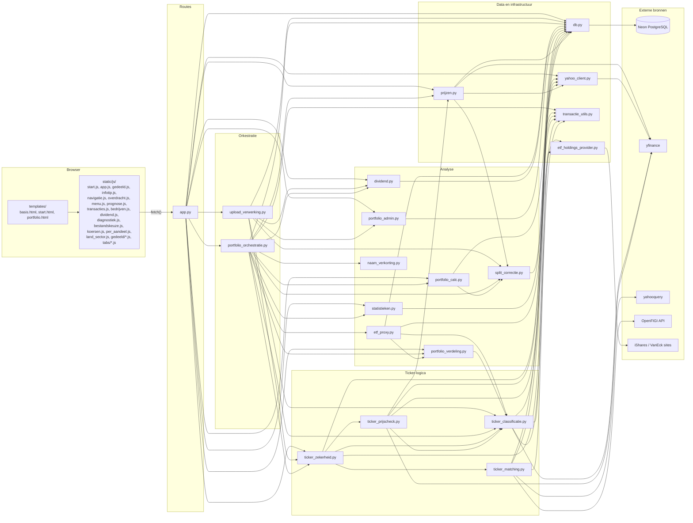
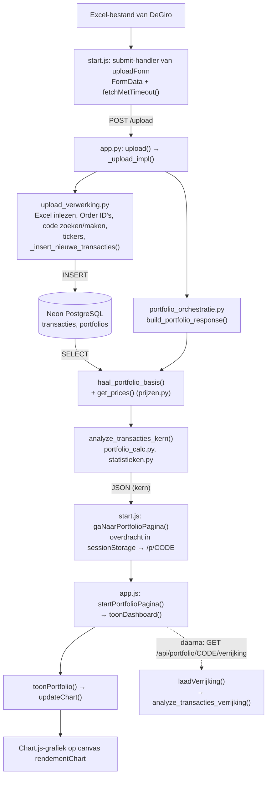

# Code-overzicht — Portfolio Dashboard (portfolioTracker)

> Laatst gecontroleerd tegen de code op 06-10-2026: ruwe koersen (`koersen`/`koers_splits`) en `split_correctie.py`, Bijnamen via `/bijnamen`,
> de OTC-status bij de beurscontrole (`beurs_status()`), land/sector per aandeel, `koersen.js` en `per_aandeel.js`, Bestanden bijwerken (`/bijwerken`),
> de ETF-land-proxy (`etf_proxy.py`, `land_sector.js`), de kolom `transacties.wisselkoers`, de dagrange-marge in euro, en de testaantallen (geteld op 06-10-2026).
> Alles hieronder is uit de bronbestanden gelezen, niet uit CLAUDE.md overgenomen. Waar ik iets niet zeker
> kon vaststellen staat het woord **onzeker**. Hoe CLAUDE.md en de code zich tot elkaar verhouden, staat onderaan
> bij [Stand van zaken](#stand-van-zaken-claudemd-en-de-code).

## Inhoud

1. [Het grote plaatje](#1-het-grote-plaatje)
2. [De route van een upload, stap voor stap](#2-de-route-van-een-upload-stap-voor-stap)
3. [Per Python-module](#3-per-python-module)
4. [Database](#4-database)
5. [Frontend](#5-frontend)
6. [Externe bronnen](#6-externe-bronnen)
7. [Tests](#7-tests)
8. [Waar moet ik zijn als ik ... wil aanpassen?](#8-waar-moet-ik-zijn-als-ik--wil-aanpassen)
9. [Woordenlijst](#9-woordenlijst)
10. [Leesgids: van full-stack-basis naar deze code](#10-leesgids-van-full-stack-basis-naar-deze-code)
11. [Stand van zaken: CLAUDE.md en de code](#stand-van-zaken-claudemd-en-de-code)
12. [Onzekerheden en open vragen](#onzekerheden-en-open-vragen)

---

## 1. Het grote plaatje

### Wat de app doet

Je uploadt een DeGiro-transactiebestand (Excel, en optioneel het "Rekeningoverzicht" voor dividend). De app:

1. leest de transacties in en koppelt elke positie aan een Yahoo Finance-ticker (zoeken op productnaam/ISIN, en controleren met de prijs);
2. haalt historische koersen op (yfinance) en berekent de waarde van je portfolio per dag;
3. slaat alles op in een PostgreSQL-database (Neon) onder een gegenereerde **3-letter-code** (bv. `ABC`), zodat je later
   met alleen die code je dashboard terug kunt zien;
4. toont dat in een dashboard op een eigen pagina (`/p/<code>`) (rendement, verdeling ETF/aandeel, land/sector/valuta, top-bedrijven, ETF-overlap,
   statistieken, dividend, transacties, prognose).

Je kunt ook **"Niet opslaan"** kiezen: dan wordt er niets in de database bewaard en is er geen code.

### Ingangspunt en opstarten

| Wat | Waar | Toelichting |
|---|---|---|
| Ingangspunt | `app.py` | Bevat `app = Flask(__name__)`, direct onder de imports. Dit `app`-object is wat een WSGI-server nodig heeft. |
| Database initialiseren | `app.py`: `db_init()`, direct onder `app = Flask(__name__)` | Staat **op moduleniveau** (dus bij het *importeren* van `app.py`, niet in `if __name__ == "__main__"`), achter `if os.environ.get("DATABASE_URL")`. Daardoor draait het onder gunicorn, en in een test die `app` importeert alleen als `DATABASE_URL` is ingesteld. |
| Lokaal draaien | `python app.py` | Onderaan `app.py`: `app.run(debug=True)`. Alleen bedoeld voor lokaal. |
| Configuratie | `.env` met `DATABASE_URL` | `db.py` roept `load_dotenv()` aan; `db_connect()` doet `psycopg2.connect(os.environ["DATABASE_URL"])`. Zonder `DATABASE_URL` slaat `app.py` `db_init()` over; pas de eerste echte databasecall crasht dan met een `KeyError`. |
| Optionele omgevingsvariabele | `OPENFIGI_API_KEY` | Alleen gelezen in `ticker_matching.py`; mag ontbreken. |
| Productie (Render) | gunicorn | `gunicorn` staat in `requirements.txt`. Het **startcommando staat niet in de repo** (geen `Procfile`, `render.yaml` of dergelijke gevonden) — het is dus waarschijnlijk in het Render-dashboard ingesteld. Voor een Flask-object `app` in `app.py` is `gunicorn app:app` de gebruikelijke vorm, maar dat kan ik hier niet verifiëren: **onzeker**. |
| Gunicorn-timeout | niet in de repo | Diverse commentaren in de code gaan uit van "de standaard gunicorn-timeout van 30 s", en de frontend breekt zelf af na 55 s (`fetchMetTimeout`) resp. 60 s (upload). Wat er op Render echt is ingesteld: **onzeker**. |

Wat `db_init()` (in `db.py`) doet: één verbinding openen, dan `CREATE TABLE IF NOT EXISTS` voor elke tabel (zie [hoofdstuk 4](#4-database)),
`commit`, sluiten. Het is dus veilig om het bij elke start opnieuw uit te voeren — ook bij elke gunicorn-worker.

### Hoe de modules elkaar aanroepen

Lagen (van boven naar beneden): **browser → routes → orkestratie → analyse/ticker-logica → data/infra → extern**.
Pijlen betekenen "importeert" (en dus "roept aan"). `debug_utils.py` (alleen `dprint()`/`meet_tijd()`) en `diagnostiek.py` (meldingen
per laadbeurt) zijn weggelaten uit het diagram omdat veel modules ze importeren; de exacte importlijst per module staat in de tabel eronder.


```mermaid
flowchart LR
    subgraph FE["Browser"]
        HTML["templates/<br/>basis.html, start.html, portfolio.html"]
        JS["static/js/<br/>start.js, app.js, gedeeld.js, infotip.js,<br/>navigatie.js, overdracht.js, menu.js, prognose.js,<br/>transacties.js, bedrijven.js, dividend.js,<br/>diagnostiek.js, bestandskeuze.js, koersen.js, per_aandeel.js,<br/>land_sector.js, gedeeld/*.js, tabs/*.js"]
    end

    subgraph ROUTES["Routes"]
        APP["app.py"]
    end

    subgraph ORK["Orkestratie"]
        UPL["upload_verwerking.py"]
        ORC["portfolio_orchestratie.py"]
    end

    subgraph ANA["Analyse"]
        CALC["portfolio_calc.py"]
        STAT["statistieken.py"]
        VERD["portfolio_verdeling.py"]
        DIV["dividend.py"]
        ADM["portfolio_admin.py"]
        SPLIT["split_correctie.py"]
        NAAM["naam_verkorting.py"]
        PROXY["etf_proxy.py"]
    end

    subgraph TICK["Ticker-logica"]
        ZEK["ticker_zekerheid.py"]
        MATCH["ticker_matching.py"]
        PCHK["ticker_prijscheck.py"]
        CLASS["ticker_classificatie.py"]
    end

    subgraph DATA["Data en infrastructuur"]
        DB["db.py"]
        PRIJ["prijzen.py"]
        YC["yahoo_client.py"]
        ETFP["etf_holdings_provider.py"]
        UTIL["transactie_utils.py"]
    end

    subgraph EXT["Externe bronnen"]
        NEON[("Neon PostgreSQL")]
        YF["yfinance"]
        YQ["yahooquery"]
        FIGI["OpenFIGI API"]
        PROV["iShares / VanEck sites"]
    end

    HTML --> JS
    JS -- "fetch()" --> APP

    APP --> UPL
    APP --> ORC
    APP --> VERD
    APP --> STAT
    APP --> DIV
    APP --> ADM
    APP --> ZEK
    APP --> CALC
    APP --> PRIJ
    APP --> YC
    APP --> DB

    UPL --> ZEK
    UPL --> ADM
    UPL --> DIV
    UPL --> SPLIT
    UPL --> CLASS
    UPL --> DB

    ORC --> CALC
    ORC --> STAT
    ORC --> VERD
    ORC --> DIV
    ORC --> ZEK
    ORC --> CLASS
    ORC --> PRIJ
    ORC --> SPLIT
    ORC --> NAAM
    ORC --> PROXY
    ORC --> UTIL
    ORC --> DB

    PROXY --> VERD
    PROXY --> CLASS
    PROXY --> ETFP
    PROXY --> DB

    CALC --> SPLIT
    CALC --> UTIL
    SPLIT --> UTIL
    STAT --> UTIL
    VERD --> CLASS
    DIV --> DB
    ADM --> DB

    ZEK --> MATCH
    ZEK --> PCHK
    ZEK --> CLASS
    ZEK --> DB
    ZEK --> UTIL
    PCHK --> PRIJ
    PCHK --> CLASS
    PCHK --> YC
    PCHK --> DB
    MATCH --> YC
    MATCH --> UTIL
    MATCH --> DB
    CLASS --> ETFP
    CLASS --> YC
    CLASS --> DB
    PRIJ --> YC
    PRIJ --> SPLIT
    PRIJ --> DB

    DB --> NEON
    PRIJ --> YF
    YC --> YF
    CLASS --> YF
    PCHK --> YF
    MATCH --> YQ
    MATCH --> FIGI
    ETFP --> PROV
```

Als je Markdown-preview geen Mermaid toont: GitHub rendert dit blok wel.

Exacte imports tussen projectmodules (afgeleid uit de code, `debug_utils` en `diagnostiek` staan erbij):

| Module | Importeert van andere projectmodules |
|---|---|
| `app.py` | `db`, `debug_utils`, `diagnostiek`, `dividend`, `portfolio_admin`, `portfolio_calc`, `portfolio_orchestratie`, `portfolio_verdeling`, `prijzen`, `statistieken`, `ticker_classificatie`, `ticker_zekerheid`, `transactie_utils`, `upload_verwerking`, `yahoo_client` |
| `upload_verwerking.py` | `db`, `debug_utils`, `diagnostiek`, `dividend`, `portfolio_admin`, `split_correctie`, `ticker_classificatie`, `ticker_zekerheid`, `transactie_utils` |
| `portfolio_orchestratie.py` | `db`, `debug_utils`, `diagnostiek`, `diagnostiek_checks`, `dividend`, `etf_proxy`, `naam_verkorting`, `portfolio_calc`, `portfolio_verdeling`, `prijzen`, `split_correctie`, `statistieken`, `ticker_classificatie`, `ticker_zekerheid`, `transactie_utils` |
| `etf_proxy.py` | `db`, `debug_utils`, `etf_holdings_provider`, `portfolio_verdeling`, `ticker_classificatie` |
| `portfolio_calc.py` | `debug_utils`, `diagnostiek`, `split_correctie`, `transactie_utils` |
| `split_correctie.py` | `transactie_utils` |
| `statistieken.py` | `transactie_utils` |
| `portfolio_verdeling.py` | `ticker_classificatie` |
| `dividend.py` | `db`, `transactie_utils` (`OngeldigExcelBestand`) |
| `portfolio_admin.py` | `db` |
| `ticker_zekerheid.py` | `db`, `debug_utils`, `ticker_classificatie`, `ticker_matching`, `ticker_prijscheck`, `transactie_utils` |
| `ticker_prijscheck.py` | `db`, `debug_utils`, `prijzen`, `ticker_classificatie`, `yahoo_client` |
| `ticker_matching.py` | `db`, `debug_utils`, `transactie_utils`, `yahoo_client` |
| `ticker_classificatie.py` | `db`, `debug_utils`, `etf_holdings_provider`, `yahoo_client` |
| `prijzen.py` | `db`, `debug_utils`, `diagnostiek`, `split_correctie`, `yahoo_client` |
| `etf_holdings_provider.py` | `debug_utils` |
| `diagnostiek_checks.py` | `diagnostiek`, `portfolio_calc`, `split_correctie`, `ticker_matching`, `ticker_zekerheid` (alleen `beurs_status()`), `transactie_utils` |
| `debug_utils.py` | `diagnostiek` |
| `yahoo_client.py` | `diagnostiek`, `transactie_utils` |
| `db.py` | `transactie_utils` |
| `diagnostiek.py`, `transactie_utils.py`, `naam_verkorting.py` | *(geen)* — het zijn de "bladeren" van de boom |

Er zijn geen circulaire imports; dat is precies waarom `transactie_utils.py` en `yahoo_client.py` als losse modules bestaan, die
zelf hooguit `diagnostiek` importeren: helpers die meerdere domeinmodules nodig hebben, zouden anders een import in een kring opleveren.

### De vier "soorten" code, kort

- **Routes** (`app.py`): een request lezen, één orkestratiefunctie aanroepen, JSON teruggeven. (In de praktijk zitten er een paar
  routes met eigen validatie of logica in — zie [hoofdstuk 3](#3-per-python-module), sectie `app.py`. SQL staat nergens buiten `db.py`.)
- **Orkestratie** (`portfolio_orchestratie.py`, `upload_verwerking.py`, en `_upload_impl()` in `app.py`): voegt taakfuncties samen tot een
  compleet antwoord.
- **Taakfuncties** (de domeinmodules): één berekening, één DB-call of één netwerkcall.
- **Frontend**: `templates/*.html` (startpagina en portfolio-pagina) + `static/js/` (met de mappen `gedeeld/` en `tabs/`, zie 5.1) + `static/css/style.css`; praat met de routes via `fetch()`.

## 2. De route van een upload, stap voor stap

Dit hoofdstuk volgt één upload van klik tot dashboard. Er zijn twee takken die uit elkaar gaan in `_upload_impl()`:
**opslaan** (standaard) en **"Niet opslaan"**. Daarna staat de route waarmee je een bestaand portfolio met een code ophaalt.

### 2.0 Overzicht in één blik

```
Browser                      Flask (app.py)                       Domeinmodules
-------                      --------------                       -------------
uploadForm submit
  FormData ───────────────►  POST /upload  upload()
                               └─ _upload_impl()
                                    ├─ Excel → df              (upload_verwerking)
                                    ├─ niet_opslaan?  ──ja──►  _analyseer_zonder_opslaan()  ────────────► JSON
                                    └─ nee: _upload_opslaan(): order-ids → code → (backfill) → tickers → INSERT
                                            → _kern_na_opslaan(code)  ─────────────────────────► JSON (kern)
start.js: overdracht bewaren  ◄─────────────────────────────────────────────────────────────────┘
  └─ naar /p/<code> of /analyse (nieuwe pagina, zie 2.6)
app.js: toonDashboard(data)
  └─ laadVerrijking(code) ──► GET /api/portfolio/<code>/verrijking  → analyze_transacties_verrijking ─► JSON
```

### 2.1 Stap voor stap: `POST /upload`

| # | Waar (bestand → functie) | Wat gebeurt er | Data in → data uit |
|---|---|---|---|
| 1 | `static/js/start.js` → submit-handler van `#uploadForm` | Bouwt een `FormData` uit het formulier (`naam`, `bestand1`, optioneel `bestand2`, vinkjes `niet_opslaan` en `herbepaal_alle_tickers`). Is er geen `bestand2` gekozen, dan wordt dat veld met `formData.delete("bestand2")` weggehaald. Toont de overlay "Analyseren..." en roept `fetchMetTimeout("/upload", ..., 60000)` aan. | formulier → `multipart/form-data` |
| 2 | `app.py` → `upload()` | Dunne wrapper om `_upload_impl()`: elke onverwachte exception wordt een nette JSON-foutmelding met status 500, in plaats van een hangende request. | request → `_upload_impl()`-resultaat of `{"error": ...}` |
| 3 | `app.py` → `_upload_impl()` | Zet de Yahoo-call-teller op nul (`reset_yahoo_call_teller()`), leest `naam`, controleert of `bestand1` er is (anders status 400). | |
| 4 | `upload_verwerking.py` → `lees_transacties_excel()` | `pd.read_excel()`, kolomnamen `.strip()`, controle op `VERWACHTE_KOLOMMEN` (ontbreekt er een → `OngeldigExcelBestand`; `_upload_impl()` geeft dan een 400 met "Ongeldig Excel-bestand: kolom(men) ontbreken: …" en stopt), `Datum` → datetime (`dayfirst=True`), `Order ID` uit de kolom zelf of (als die leeg is) uit de naamloze buurkolom (`_kolom_of_naamloze_buurkolom()`), de `Unnamed`-kolommen weg, en `_meld_order_ids()` voor Diagnostiek. | bestandsobject → **DataFrame `df`** (kolommen zoals DeGiro ze heeft: `Datum`, `Tijd`, `Product`, `ISIN`, `Beurs`, `Aantal`, `Koers`, `Totaal EUR`, ...) |
| 5 | `upload_verwerking.py` → `voeg_koers_eur_toe()` | Voegt de hulpkolom `_koers_eur` toe (= `Koers` gedeeld door `Wisselkoers` als die er is en niet 0, anders `Koers`) en meldt in Diagnostiek hoeveel transacties een wisselkoers gebruikten. Kosten en `Waarde EUR` worden rechtstreeks uit `KOSTEN_KOLOM` resp. `WAARDE_KOLOM` gelezen (al EUR); de kolommen bestaan altijd (zie stap 4), een lege cel geeft NaN. | `df` → `df` + 1 kolom |
| 6 | `app.py` → `_upload_impl()` | Is er een `bestand2`, dan eerst `lees_rekeningoverzicht()` (`dividend.py`): mist het de kolommen uit `VERWACHTE_KOLOMMEN_REKENING`, dan een 400 met "Dit lijkt geen DeGiro-rekeningoverzicht…" vóór er iets is opgeslagen. Het ingelezen `rekening_df` gaat naar **beide** takken mee; het bestand wordt dus maar één keer ingelezen. Daarna de vinkjes: `niet_opslaan` en `herbepaal_alle_tickers` (`== "on"`, want een aangevinkte HTML-checkbox stuurt "on"). **Hier splitst de route** ↓ naar `_analyseer_zonder_opslaan()` of `_upload_opslaan()`. Na beide takken: `meld_yahoo_samenvatting()`, `jsonify(...)` en `log_yahoo_call_samenvatting()`. | |

### 2.2 Tak A — "Niet opslaan" (geen database, geen code)

| # | Waar | Wat gebeurt er | Data |
|---|---|---|---|
| A1 | `upload_verwerking.py` → `ticker_resolutie_niet_opslaan(df)` | `_bouw_posities(df)` groepeert `df` per **(ISIN, Beurs)**. Per groep een tuple `(productnaam, isin, beurs, [{datum, koers}, ...])`. Roept `basis_ticker_zekerheid_parallel()` aan (12 threads) → per positie `find_ticker_met_snelle_prijscheck()`. | `df` → `(ticker_by_isin_beurs, ticker_zekerheid, ticker_posities_ruw)`: een dict `{(isin, beurs): ticker}` plus twee lijsten van dicts |
| A2 | `upload_verwerking.py` → `bouw_transacties_df_niet_opslaan()` | Bouwt een DataFrame met **dezelfde kolommen als wat normaal uit de database komt** (`datum`, `product`, `isin`, `beurs`, `ticker`, `aantal`, `koers`, `totaal_eur`, `echte_naam`, `transactiekosten`, `waarde_eur`, `tijd`, `wisselkoers`). Zo hoeft de analysecode niet te weten waar de data vandaan komt. | `df` + dict → **`transacties_df`** |
| A3 | `portfolio_orchestratie.py` → `analyze_transacties(transacties_df, code=None, naam, kassaldo)` | Doet **kern én verrijking** achter elkaar (zie 2.4). `code=None`, dus geen dividend uit de database; het kassaldo komt wel mee: `_analyseer_zonder_opslaan()` berekent het vooraf met `bereken_kassaldo(rekening_df)` (`None` zonder bestand 2). De verrijking draait met `gebruik_proxy=False` (geen ETF-land-proxy, zie `etf_proxy.py`). | `transacties_df` → dict |
| A4 | `app.py` → `_analyseer_zonder_opslaan()` | Voegt `ticker_zekerheid`, `ticker_posities_ruw`, `transacties_lijst` (`transacties_overzicht_uit_df()`) en `dividend` (`_dividend_niet_opslaan(transacties_df, rekening_df)`: het al ingelezen rekeningoverzicht via `verwerk_dividend_zonder_opslaan(rekening_df)`, daarna `bouw_dividend_samenvatting()`; `{"beschikbaar": False}` zonder bestand 2) aan het dict toe. | dict → (in `_upload_impl()`) JSON |

Gevolgen van deze tak (allemaal zichtbaar in de code):

- Er worden **geen Order ID's** bepaald, niets naar Postgres geschreven, en er is **geen code**.
- `bestand2` (rekeningoverzicht) wordt wel verwerkt, maar niet opgeslagen: `_dividend_niet_opslaan()` (zie A4) en het kassaldo (zie A3). Transacties en Dividend lezen `transacties_lijst` en `dividend` uit het antwoord in plaats van een fetch.
- De frontend verbergt alleen de tabbladen die de database nodig hebben (Algemeen, Bestanden bijwerken en Bijnamen, `VIEWS_MET_CODE`, zie 5.3).
- De dure, prijs-geverifieerde ticker-check draait hier bewust **niet** mee; de frontend kan die later los aanvragen via `POST /api/ticker-zekerheid-check` (zie [hoofdstuk 5](#5-frontend)). Reden (uit de commentaren): een groter portfolio met koude cache liep anders over de gunicorn-timeout.
- Om dezelfde reden geen ETF-land-proxy: die zoektocht (iShares-screener + holdings-CSV's) kost met een koude cache ~9 s binnen `/upload`. Land komt dan uit de eigen top-10 van Yahoo.

### 2.3 Tak B — Opslaan

| # | Waar | Wat gebeurt er | Data |
|---|---|---|---|
| B1 | `upload_verwerking.py` → `vul_synthetische_order_ids_aan(df)` | De echte Order ID's zijn al ingelezen in stap 4 (in het DeGiro-bestand staat de kop "Order ID" door samengevoegde cellen één kolom verschoven; daarom pakt `_kolom_of_naamloze_buurkolom()` bij een lege kolom de naamloze buurkolom). Deze stap vult alleen de ontbrekende aan: rijen zonder Order ID krijgen een **synthetische ID**: `"SYN-"` + eerste 16 tekens van de MD5 over `Datum\|Tijd\|ISIN\|Aantal\|Totaal EUR` (bewust zonder `Product`: DeGiro hernoemt producten soms, bv. `BYD CO LTD` → `BYD COMPANY LIMITED`), plus een volgnummer voor identieke rijen. Daarna maakt `_maak_deelorder_ids_uniek()` de Order ID's van **deelorders** uniek: DeGiro geeft elke deeluitvoering van één order een eigen rij met dezelfde Order ID, en door `UNIQUE(code, order_id)` viel alles na de eerste rij weg. De eerste rij (in bestandsvolgorde) houdt de kale ID, de volgende krijgen `-1`, `-2`, ... | `df` → `df` + kolom `Order ID` |
| B2 | `app.py` → `_upload_opslaan()` → `with db_transactie() as cur:` | Opent één verbinding + cursor voor B3 t/m B7. Na het blok volgt een commit; gaat er binnen het blok iets mis, dan een rollback (er blijft dan ook geen lege nieuwe portfolio staan, en geen transacties zonder hun dividend). De verbinding gaat in beide gevallen dicht. | |
| B3 | `upload_verwerking.py` → `vind_of_maak_portfolio(cur, df, naam)` | Roept `find_matching_code()` (in `portfolio_admin.py`) aan. Die haalt via `db_get_order_id_sets_met_overlap()` alleen de Order ID-sets op van portfolio's die minstens één Order ID met deze upload delen, en vergelijkt die met de set van de upload. Is een bestaande set een deelverzameling van de nieuwe → dat is een update van hetzelfde portfolio (de ontbrekende ID's zijn de nieuwe rijen). Is de nieuwe set een deelverzameling van de bestaande → niets nieuws. Geen match → `generate_code(cur)` maakt een nieuwe, nog niet gebruikte 3-letter-code en er komt een rij in `portfolios`. Bij een match en een ingevulde `naam` wordt de naam bijgewerkt. Daarna meldt `meld_portfolio_opslaan()` de datakwaliteit van de nieuwe rijen (zie Diagnostiek). | `df` → `(code, bestaand, rows_to_insert)`; `bestaand` is een bool |
| B4 | `app.py` → `_herbepaal_tickers(code)` | Alleen bij een **bestaande** code én het vinkje "opnieuw bepalen": `backfill_verouderde_tickers(code)` herbeoordeelt de opgeslagen tickers (overschrijft alleen door een kandidaat zónder prijsprobleem) en `db_wis_etf_proxies_voor_portfolio(code)` wist de opgeslagen ETF-land-proxy's. Ophalen met code (2.7) gebruikt dezelfde functie. | |
| B5 | `upload_verwerking.py` → `voeg_nieuwe_transacties_toe(cur, code, rows_to_insert, herbepaal_alle_tickers)` | Doet niets als er geen nieuwe rijen zijn. Anders drie stappen, elk met een `meet_tijd()`: **(a)** `_ticker_resolutie_opslaan()`: alleen de **nieuwe** rijen, gegroepeerd met `_bouw_posities()`. Haalt (tenzij het vinkje aan staat) de al bekende tickers van deze code op als `bekende_tickers`, zodat de dure yahooquery-zoekopdracht voor bekende posities wordt overgeslagen; `vind_tickers_met_snelle_prijscheck_parallel()` (12 threads); gaf een groep geen ticker, dan probeert `_probeer_andere_productnamen()` de namen van de andere rijen. **(b)** `_product_per_ticker_opslaan()`: `product` per ticker (bestaand blijft, nieuw krijgt Yahoo's `longName`). **(c)** `_insert_nieuwe_transacties()`: `INSERT ... ON CONFLICT (code, order_id) DO NOTHING` per rij; een mislukte rij wordt overgeslagen en in Diagnostiek gemeld. | rijen → `transacties` |
| B6 | `upload_verwerking.py` → `sla_dividend_bestand_op(cur, code, rekening_df)` en `sla_kassaldo_op(cur, code, rekening_df)` | Alleen met `bestand2`, nog binnen de transactie: `verwerk_rekeningoverzicht_df()` (in `dividend.py`) → lijst dividendrecords → `db_save_dividenden(cur, ...)` (upsert in `dividenden`); daarna `bereken_kassaldo()` → `db_save_kassaldo(cur, ...)` (upsert in `kassaldo`, één rij per code: het laatst geüploade rekeningoverzicht wint). | DataFrame → records → DB |
| B7 | einde `with`-blok | Commit: portfolio, transacties, dividend en kassaldo worden in één keer definitief. | |
| B8 | `app.py` → `_kern_na_opslaan(code)` | Binnen `with db_deel_verbinding():` (samen met B9): `wis_portfolio_basis_cache(code)` (ná alle mutaties hierboven), dan `build_portfolio_response(code)`. Alle `db_`-leesfuncties van de basis (zie 2.5) en de valutacheck delen zo één verbinding. Levert de **kern** (zonder verrijking). | code → dict |
| B9 | `app.py` → `_meld_valuta_na_opslaan()` → `meld_valuta_consistentie()` | Vergelijkt de valuta uit de Excel met die van de tickers (uit de net gebouwde basis via `ticker_per_isin_beurs_uit_basis()`). | → Diagnostiek |

Een upload naar een bestaande portfolio opent zo twee databaseverbindingen: de schrijftransactie (B2–B7) en de gedeelde leesverbinding
(B8–B9). `upload()` en `bijwerken()` printen het aantal als `[timing] DB-verbindingen ...`, plus `upload_totaal`/`bijwerken_totaal`.

`/api/portfolio/<code>/bijwerken` (zie 2.9) gebruikt B5 t/m B9, zonder B3 en B4.

### 2.4 Kern versus verrijking

De dashboardgegevens zijn in twee delen gesplitst zodat de Home-pagina snel klaar is (zie ook CLAUDE.md, Flows): classificatie
en land/sector/holdings-opzoekingen zijn het netwerk-zware deel, dat bij een nieuw portfolio met koude cache de meeste tijd kost.

| | **Kern** — `analyze_transacties_kern()` | **Verrijking** — `analyze_transacties_verrijking()` |
|---|---|---|
| Geleverd via | `POST /upload`, `GET /api/portfolio/<code>`, en de antwoorden van `/bijnamen` (en de oudere bijnaam-routes) en wijzig-code | `GET /api/portfolio/<code>/verrijking` (lui, door de frontend aangeroepen); bij "Niet opslaan" wordt het direct meegestuurd via `analyze_transacties()` |
| JSON-sleutels | `code`, `naam`, `chart_data` (`labels`, `waarde`, `geinvesteerd`, `rendement`), `per_ticker`, `per_ticker_aankoop` (per ticker ook `splits`: `[{datum, ratio}]` voor de grafiek), `statistieken`, `tickers`, `ticker_waarschuwingen`, `laatste_koersdatum`, `laatst_opgehaald_op`, `koersen_compleet`, `koersen_onvolledig`, `koersen_ontbreken` (`bepaal_koersstatus()`, voor de koersmelding bovenaan) | `verdeling`, `verdeling_samenvatting`, `land_sector_verdeling` (incl. `per_aandeel`), `valuta_verdeling`, `bedrijven_verdeling`, `etf_overlap` |
| Tabbladen die het gebruiken | Portfolio-home, Rendement, Per aandeel, Per aandeel aankoop, Statistieken, Prognose, Bijnamen (de %-weergave van het tabblad Rendement heeft een eigen lui endpoint, zie hoofdstuk 5) | Verdeling, Land, Sector, Valuta, Top N bedrijven, ETF-overlap |
| Kost | Koersen (uit cache, eventueel incrementeel verversen) + rekenwerk + DB-lezen (dividend, prijswaarschuwingen uit cache) | `classify_tickers()` + per ETF sector/holdings + per aandeel land/sector → mogelijk veel Yahoo-calls; plus, alleen met een code, de ETF-land-proxy (bij een cache-miss iShares-screener en holdings-CSV's) |
| Geen koersdata? | Geeft `{"code", "naam", "chart_data": None}` plus de koersstatus terug; de frontend toont "Geen koersdata gevonden" | Geeft lege structuren terug |

Wat `analyze_transacties_kern()` intern doet, in volgorde: (1) split-correctie, koersen ophalen en `pas_effectieve_datums_toe()` — óf overslaan als
`prijs_data_al_klaar` is meegegeven; (2) `bepaal_koersstatus()` en `db_get_laatste_koers_update()`; (3) `compute_value_over_time()`, `compute_per_ticker()`
(+ `_meld_plausibiliteit()`), `compute_per_ticker_koers_en_aankopen()` met de splits per ticker (`db_get_koers_splits()`); (4) ticker- en echte-namen-dicts;
(5) `ticker_waarschuwingen_voor_transacties()`, die naast de waarschuwingen ook de gebruikte prijschecks teruggeeft, en `_meld_tickers()` met die prijschecks;
(6) `bereken_dividend_samenvatting(code)` en `db_get_kassaldo(code)` (alleen als er een code is; anders het meegegeven `kassaldo`) voor "dividend per ticker", de cash-tegel en het DeGiro-totaal; (7) `bereken_statistieken()`; (8) alles
in één dict gieten. Let op: bij "Niet opslaan" draait `analyze_transacties_verrijking()` daarna nóg een keer split-correctie +
`get_prices()` (een warme cache-hit, maar dubbel werk). Bij opslaan en ophalen gebeurt dat niet: dan geeft `build_portfolio_response()`
de al opgehaalde koersen door via `prijs_data_al_klaar`.

### 2.5 De "basis" en de korte in-process cache

`haal_portfolio_basis(code)` in `portfolio_orchestratie.py` is de gedeelde eerste stap voor de kern, de verrijking en de
Ticker-zekerheid-routes:

1. `db_get_portfolio_naam_en_transacties()` (`SELECT` op `portfolios`: bestaat de code? en op `transacties`: de 13 kolommen van `TRANSACTIE_KOLOMMEN`) → naam + lijst tuples;
2. → **`transacties_df`** (DataFrame), `transactiekosten` en `waarde_eur` naar `float`; `_meld_datakwaliteit()` voor Diagnostiek;
3. `compute_split_adjusted_shares(transacties_df)` → voegt `adj_aantal`, `effectieve_datum` (voorlopig = `datum`) en `is_wisselrij` toe;
4. `get_prices(tickers, start_date, verversen)` → **`price_data`** (DataFrame: index = datum, kolommen = tickers, waarden = **ruwe** koers in EUR, zoals hij die dag noteerde);
5. `pas_effectieve_datums_toe()`: koppelt DeGiro's splitboekingen aan Yahoo's splits (die staan na stap 4 in `koers_splits`) en zet bij een gekoppelde
   boeking `effectieve_datum` op Yahoo's splitdatum; daarna `_meld_koersdekking()`;
6. resultaat `(naam, transacties_df, price_data)` wordt **20 seconden** bewaard in het dict `_basis_cache` (per proces, met een
   `threading.Lock`), zodat de 2–3 requests van één portfolio-bezoek niet drie keer hetzelfde ophalen.

`wis_portfolio_basis_cache(code)` moet aangeroepen worden ná elke wijziging aan de transacties van een code (upload, bijnaam, code
wijzigen, verwijderen, geforceerde ticker-herberekening). Bij meerdere gunicorn-workers heeft elke worker zijn eigen cache; een miss
betekent alleen dat het request het "trage" pad neemt, niet dat er iets stukgaat.

### 2.6 Wat de frontend doet met het antwoord

De upload gebeurt op de startpagina (`/`), het dashboard staat op een andere pagina (`/p/<code>`, of `/analyse` bij "niet opslaan"). Het antwoord
moet dus mee naar die pagina: `gaNaarPortfolioPagina(data)` in `start.js` zet het met `bewaarOverdracht()` (`overdracht.js`) eenmalig in
`sessionStorage` en navigeert met `location.assign()`. Op de portfolio-pagina leest `startPortfolioPagina()` (`app.js`) het met `haalOverdracht()`,
dat de overdracht meteen wist. Zo blijven de Excel-meldingen van de upload (Diagnostiek) behouden en hoeft de server niet nog een keer te rekenen.
Past het antwoord niet in `sessionStorage`: bij opslaan navigeert de startpagina toch (de portfolio-pagina haalt dan zelf op, zie 2.8), bij
"niet opslaan" blijft ze staan met een melding.

`toonDashboard(data)` in `app.js`: `huidigeData = data`; alle per-portfolio-toestand resetten; knoppen tonen/verbergen afhankelijk van
`data.code`; de ticker-waarschuwingsbanner tonen; `wisselView(viewUitUrl())` (het tabblad uit de URL-hash, zie 5.3). Daarna: staat `data.verdeling` al in het antwoord
(niet-opslaan) → `verrijkingStatus = "klaar"`; is er een code → `laadVerrijking(code)` (haalt `/verrijking` op op de achtergrond en doet
`Object.assign(huidigeData, data)`, daarna tekent het het actieve tabblad opnieuw als dat een verrijkings-tabblad is).

### 2.7 Route: een bestaand portfolio ophalen met een code

Frontend: `#codeForm` submit-handler in `start.js` (code in hoofdletters) → `fetch("/api/portfolio/<CODE>")`, of met
`?herbepaal_alle_tickers=true` als het vinkje "Ticker-informatie ... opnieuw bepalen" aan staat → dezelfde overdracht als bij een upload
(2.6) → `/p/<CODE>` → `toonDashboard(data)`. Een onbekende code geeft de foutmelding direct op de startpagina. Het vinkje komt bewust nooit in
de URL van de portfolio-pagina: een refresh zou de dure herbepaling herhalen. Let op: dit vinkje (en dat bij de upload) staat sinds 06-10-2026
in `start.html` verborgen (`<div class="labelRij" hidden>`); de code erachter werkt nog, maar via de UI is hij nu niet aan te zetten.

Backend: `app.py` → `api_portfolio(code)`:

1. `code.strip().upper()`; `reset_yahoo_call_teller()`;
2. bij `?herbepaal_alle_tickers=true`: `_herbepaal_tickers(code)` (dezelfde als B4 in 2.3: `backfill_verouderde_tickers(code)` en
   `db_wis_etf_proxies_voor_portfolio(code)`, zodat de volgende verrijking de land-proxy opnieuw zoekt) en daarna
   `wis_portfolio_basis_cache(code)` (anders zou de cache nog de oude tickers teruggeven);
3. `build_portfolio_response(code)` → `haal_portfolio_basis()` → `analyze_transacties_kern()` (zie 2.4/2.5). `None` (code bestaat
   niet) → JSON-fout met status 404;
4. `log_yahoo_call_samenvatting()` en `jsonify(result)`.

Daarna volgt dezelfde `toonDashboard()` → `laadVerrijking()`-vervolgstap als bij een upload. Het verschil met een upload: er wordt niets
ingelezen of weggeschreven (behalve de optionele ticker-backfill), en de koersen worden wel opnieuw "ververst" — `get_prices()` heeft
standaard `verversen=True`, dus voor tickers waarvan de cache niet vers is wordt bij **elke** portfolio-opening incrementeel bij Yahoo
bijgehaald, tenzij dezelfde ticker minder dan 2 minuten eerder al is ververst (`DREMPEL_HERGEBRUIK_KOERS`).

### 2.8 Route: de portfolio-pagina openen of verversen (`/p/<code>`)

1. `app.py` → `portfolio_pagina(code)`: geeft alleen `portfolio.html` terug met de code in `<body data-code="ABC">`. Geen database. Kleine
   letters → redirect naar `/p/ABC`; een code die niet aan `is_geldige_code()` voldoet → redirect naar `/?melding=ongeldige-code`.
2. `app.js` → `startPortfolioPagina()`: ligt er een overdracht klaar (direct na upload of ophalen), dan `toonDashboard()`. Anders (refresh,
   bookmark, gedeelde link) `haalPortfolioOp()`: `GET /api/portfolio/<code>` → `toonDashboard()`.
3. Fouten in `haalPortfolioOp()`: status 404 → `location.replace("/?melding=onbekende-code")`; elke andere fout (timeout, 500, netwerk) →
   het blok `#laadFout` met de knop "Opnieuw proberen".
4. `/analyse` (`analyse_pagina()`) is dezelfde template zonder code. Zonder overdracht valt er niets te tonen: terug naar `/`. Een refresh
   van een "niet opslaan"-analyse brengt je dus naar de startpagina.
5. De startpagina toont de melding uit `?melding=` als vaste tekst per sleutel (`startMeldingTekst()` in `navigatie.js`) en haalt de query
   daarna weg met `history.replaceState()`.

### 2.9 Route: bestanden bijwerken (Instellingen > Bestanden bijwerken)

`POST /api/portfolio/<code>/bijwerken` met `bestand1` (transacties) en/of `bestand2` (rekeningoverzicht). Anders dan `/upload` zoekt deze
route geen portfolio op: de code staat vast, en elk bestand moet **eerst** bewijzen dat het bij deze portfolio hoort.

1. `bijwerken()` → `_bijwerken_impl()`: 404 als de code niet bestaat, 400 zonder bestand (een leeg bestandsveld telt niet).
2. `bestand1`: `lees_transacties_excel()` → `voeg_koers_eur_toe()` → `vul_synthetische_order_ids_aan()`; daarna
   in één `db_transactie()` `db_get_order_ids(cur, code)` (= `opgeslagen`) en `db_get_order_ids_bij_andere_portfolios(cur, code, nieuw)`
   (alleen de ID's uit het bestand die al bij een andere portfolio staan; niet meer alle Order ID's van alle portfolio's), en dan
   `controleer_eigen_transactiebestand(opgeslagen, nieuw, ids_andere_portfolios)` (`portfolio_admin.py`). Regel (superset): alle opgeslagen
   Order ID's van deze portfolio moeten in het bestand zitten (`opgeslagen ⊆ nieuw`), het bestand mag geen ID van een andere portfolio
   bevatten en moet met deze portfolio overlappen. Toe te voegen: `nieuw − opgeslagen` (mag leeg zijn).
3. `bestand2`: `lees_rekeningoverzicht()` één keer (geen rekeningoverzicht → 400, zie stap 6 in 2.1), Order ID's uit de kolom `Order Id` (`order_ids_uit_rekeningoverzicht_df()`), dan
   `controleer_eigen_rekeningoverzicht()`: minstens één Order ID, en allemaal in `opgeslagen ∪ nieuw`.
4. Is één bestand afgekeurd, dan 400 met een vaste melding (`MELDING_PER_EIGENDOMSFOUT` in `app.py`; nooit de code van een andere portfolio)
   en wordt er niets opgeslagen. Anders `meld_portfolio_opslaan(True, rows_to_insert)` (Diagnostiek); alleen als er nieuwe rijen zijn
   alleen met nieuwe rijen of een rekeningoverzicht één `db_transactie()` met `voeg_nieuwe_transacties_toe()` (zonder "opnieuw bepalen")
   en (met `bestand2`) `sla_dividend_bestand_op()` + `sla_kassaldo_op()`; dan in één `db_deel_verbinding()` `_kern_na_opslaan(code)` en (met `bestand1`) `_meld_valuta_na_opslaan()`. De naam blijft ongewijzigd.
5. Antwoord: de kern, plus `bijwerken: {nieuwe_transacties, dividend_verwerkt}`. De frontend (`tabs/bestanden_bijwerken.js`) toont het
   dashboard opnieuw met `toonDashboard(data)` (verrijking en tab-toestand horen bij de oude transacties) en een melding via
   `bijwerkenSuccesTekst()` (`bestandskeuze.js`).

## 3. Per Python-module

23 Python-modules (zonder tests), in de map `portfolioTracker/`. Per module: verantwoordelijkheid, een functietabel en bijzonderheden.
De kolom **"Aangeroepen door"** is met een script uit de code afgeleid (een AST-doorloop van alle `.py`-bestanden); "—" betekent: geen
aanroeper in de productiecode gevonden (de functie wordt dan alleen door tests, via een dict of via HTTP gebruikt — dat staat erbij).

### Waar staat wat? (snelle opzoektabel)

| Onderwerp | Bestand | Kernfuncties |
|---|---|---|
| Portfoliowaarde en geïnvesteerd bedrag per dag | `portfolio_calc.py` | `compute_value_over_time()` |
| Waarde/geïnvesteerd per aandeel | `portfolio_calc.py` | `compute_per_ticker()`, `compute_per_ticker_koers_en_aankopen()` |
| **Rendement** (totaal, per positie, per jaar) | `statistieken.py` | `bereken_totaal_rendement()`, `bereken_positie_rendement()`, `bereken_jaar_rendement()`, `bereken_jaren_overzicht()` |
| **XIRR** | `statistieken.py` | `bereken_xirr()` (via `pyxirr`), `_bouw_xirr_cashflows()` |
| **TWR** | `statistieken.py` | `bereken_twr()` |
| Rendement/XIRR/TWR over tijd | `statistieken.py` | `bereken_rendement_over_tijd()` |
| Benchmarkvergelijking | `statistieken.py` | `bereken_benchmark_vergelijking()`, `BENCHMARK_TICKERS` |
| **GAK en kostprijs** | `statistieken.py` | `bereken_holdings_en_gesloten()`; een tweede, parallelle implementatie zit in `compute_per_ticker()` |
| **Splits** (ruwe koers terugrekenen, DeGiro-boekingen aan Yahoo-splits koppelen) | `split_correctie.py` | `ruwe_koers()`, `continue_reeks()`, `vind_wisselparen()`, `koppel_degiro_aan_yahoo_splits()`, `bepaal_effectieve_datums()` |
| Splitboekingen herkennen en melden | `portfolio_calc.py` | `compute_split_adjusted_shares()`, `bepaal_split_boekingen()`, `meld_split_koppeling()` |
| Split-correctie (bij de prijscontrole van tickers) | `ticker_prijscheck.py` | `_haal_splits_op()`, `_cumulatieve_split_factor()` |
| **Koersen ophalen en cachen** | `prijzen.py` (+ `db.py`, `yahoo_client.py`) | `get_prices()`, `db_save_koersen()`, `db_get_gecachte_koersen()`, `download_koersen_met_retry()` |
| Valuta naar EUR | `prijzen.py` | `_converteer_naar_eur()`, `_fx_prijzen_serie()` |
| **Ticker zoeken** | `ticker_matching.py` | `find_ticker_detailed()`, `_zoek_product_progressief()`, `BEURS_MAP`, `MANUAL_TICKER_OVERRIDES_ISIN` |
| **Ticker verifiëren** | `ticker_prijscheck.py`, `ticker_zekerheid.py`, `ticker_matching.py` | `vergelijk_prijs_op_datum()`, `find_ticker_met_snelle_prijscheck()` (licht), `verifieer_ticker_met_prijs()` (volledig), `haal_openfigi_resultaten()` |
| **ETF-holdings** | `etf_holdings_provider.py`, `ticker_classificatie.py` | `ETF_HOLDINGS_BRON`, `fetch_provider_holdings()`, `get_etf_holdings()` |
| **Land van een ETF met alleen een top-10** (land-proxy) | `etf_proxy.py` | `land_proxies_voor_etfs()`, `vergelijk_top10()`, `kies_proxy()` |
| **ETF-overlap** | `portfolio_verdeling.py` | `bereken_etf_overlap()`, `bereken_etf_overlap_detail()` |
| **Verdeling ETF/aandeel** | `portfolio_orchestratie.py` + `portfolio_verdeling.py` + `ticker_classificatie.py` | het `verdeling`-blok in `analyze_transacties_verrijking()`, `bereken_verdeling_samenvatting()`, `classify_tickers()` |
| **Land / sector / top-bedrijven** | `portfolio_verdeling.py` | `compute_land_sector_verdeling()`, `bereken_bedrijven_verdeling()` |
| **Statistieken** (tabblad) | `statistieken.py` | `bereken_statistieken()` |
| **Dividend** | `dividend.py` (+ `db.py`) | `lees_rekeningoverzicht()`, `verwerk_rekeningoverzicht_df()`, `bereken_dividend_samenvatting()`; in de UI `maakDividendUitkeringenTabel()` (incl. het "herinvesteerd"-label) |
| **Prognose** | **geen Python** — alleen `static/js/prognose.js` (rekenkern) en `static/js/tabs/prognose.js` (formulier en grafiek) | `berekenPrognose()`, `bouwPrognoseGrafiekData()` (JS) |

---

### `app.py` — de Flask-routes

**Verantwoordelijkheid:** het Flask-object aanmaken, `db_init()` draaien, en 23 routes definiëren. Naast de routes een paar helpers met één taak: `_upload_impl()` (bestanden lezen, tak kiezen), `_analyseer_zonder_opslaan()`, `_dividend_niet_opslaan()`, `_upload_opslaan()`, `_herbepaal_tickers()` (backfill + land-proxy's wissen, ook voor `api_portfolio()`), `_kern_na_opslaan()` (cache wissen + kern in `db_deel_verbinding()`), `_bijwerken_impl()`, `_gekozen_bestand()` en `_korte_namen_voorstellen_of_fout()`. Schrijfwerk loopt via `with db_transactie() as cur:`; `app.py` opent zelf geen `db_connect()`.

| Route | Methode | Functie | Wat | Aangeroepen door (frontend) |
|---|---|---|---|---|
| `/` | GET | `home()` | rendert `templates/start.html` (startpagina) | de browser |
| `/p/<code>` | GET | `portfolio_pagina()` | rendert `templates/portfolio.html` met `data-code`; redirect bij kleine letters of een ongeldige code (zie 2.8). Geen database | de browser; `gaNaarPortfolioPagina()` |
| `/analyse` | GET | `analyse_pagina()` | dezelfde template zonder code, voor "niet opslaan" | `gaNaarPortfolioPagina()` |
| `/upload` | POST | `upload()` → `_upload_impl()` | zie [hoofdstuk 2](#2-de-route-van-een-upload-stap-voor-stap) | submit-handler van `#uploadForm` |
| `/api/portfolio/<code>/bijwerken` | POST | `bijwerken()` → `_bijwerken_impl()` | nieuwere export(s) toevoegen aan deze portfolio, na de eigendomscheck (zie 2.9) | submit-handler van `#bestandenBijwerkenForm` |
| `/api/portfolio/<code>` | GET | `api_portfolio()` | kern voor een bestaande code | submit-handler van `#codeForm` (`start.js`), `haalPortfolioOp()` (`app.js`) |
| `/api/portfolio/<code>/verrijking` | GET | `portfolio_verrijking()` | verrijking (verdeling/land/sector/bedrijven/overlap) | `laadVerrijking()` |
| `/api/etf-overlap-detail` | GET | `etf_overlap_detail()` | holdings van één ETF-paar; query `a` en `b` | `toonEtfOverlapDetail()` |
| `/api/portfolio/<code>/benchmark-vergelijking` | GET | `benchmark_vergelijking()` | hypothetisch rendement als dezelfde cashflows in een benchmark (`?benchmark=`) of eigen ticker (`?eigen_ticker=`) waren gestoken; de vergelijkingskoers gaat eerst door `continue_koersreeks()` (geen sprongen op splitdagen) | `wisselBenchmark()`, `wisselEigenAandeel()` |
| `/api/portfolio/<code>/rendement-over-tijd` | GET | `rendement_over_tijd()` | reeks rendement%/XIRR%/TWR% per maandeinde | `toonRendementOverTijd()` |
| `/api/portfolio/<code>/ticker-koers-bereik` | GET | `ticker_koers_bereik()` | extra koershistorie voor 1 ticker (`ticker`, `vanaf`, `tot`): `labels`, `koers`, `holdings` (aantal stuks per datum, via `holdings_op_datums()`), `vroegste_beschikbare_datum` | `laadMeerHistorie()` |
| `/api/portfolio/<code>/ticker-zekerheid/lijst` | GET | `ticker_zekerheid_lijst()` | alleen de lijst posities, zonder prijscontrole | `toonInstellingenTicker()` |
| `/api/portfolio/<code>/ticker-zekerheid/positie` | GET | `ticker_zekerheid_positie()` | volledige verificatie van 1 positie (`isin`, `beurs`) | `toonInstellingenTicker()` |
| `/api/ticker-zekerheid-check` | POST | `ticker_zekerheid_check()` | volledige verificatie voor een "niet opslaan"-analyse, op meegestuurde transacties | `controleerTickerZekerheidUitgebreid()` |
| `/api/portfolio/<code>/dividend` | GET | `dividend()` | `bereken_dividend_samenvatting()`; `{"beschikbaar": False}` als er geen dividenden zijn | `toonDividend()` |
| `/api/portfolio/<code>/transacties` | GET | `transacties_overzicht()` | `{"lijst": db_get_transacties_overzicht(code)}` | `toonTransacties()` |
| `/api/portfolio/<code>/bijnamen` | POST | `set_bijnamen()` | body `{"namen": {ticker: naam}}`; lege namen vallen weg, de rest in één transactie via `db_wijzig_bijnamen()`; geeft de kern terug | `pasBijnamenToe()` (alle knoppen en het invoerveld op Bijnamen) |
| `/api/portfolio/<code>/bijnaam` | POST | `set_bijnaam()` | `UPDATE transacties SET product = ...` voor alle rijen met die ticker | — (alleen tests; de frontend gebruikt `/bijnamen`) |
| `/api/portfolio/<code>/reset-bijnaam` | POST | `reset_bijnaam()` | `product` = live `longName` (`haal_long_names()`), anders `echte_naam` | — (alleen tests) |
| `/api/portfolio/<code>/korte-namen` | GET | `get_korte_namen()` | `{"namen": bepaal_korte_naam_voorstellen()}`: `[{ticker, huidig, long_name, voorstel}]`, schrijft niets; 502 als Yahoo niets teruggeeft | `laadYahooNamen()` |
| `/api/portfolio/<code>/korte-namen` | POST | `pas_korte_namen_toe()` | berekent de voorstellen opnieuw, `db_wijzig_bijnamen()` voor alle tickers met een voorstel (één transactie) | — (alleen tests; "Alle korte namen" gaat via `/bijnamen`) |
| `/api/portfolio/<code>` | DELETE | `verwijder_portfolio()` | `db_delete_portfolio()` + cache wissen | handler van `#verwijderPortfolioBtn` |
| `/api/portfolio/<code>/wijzig-code` | POST | `wijzig_code()` | valideert met `is_geldige_code()`, dan `db_wijzig_portfolio_code()` | handler van `#wijzigCodeBtn` |

**Bijzonderheden en valkuilen**

- `app.py` is **niet helemaal "alleen dunne routes"**: `_upload_impl()` is een lange orkestratiefunctie, en `ticker_koers_bereik()`, `dividend()`,
  `transacties_overzicht()` doen een eigen validatie of berekening (de "bestaat de code?"-check via `db_portfolio_bestaat()`). `benchmark_vergelijking()` bevat validatielogica en roept `get_prices()` rechtstreeks aan.
- Er is **geen authenticatie of gebruikersbegrip**: wie een code kent, kan alles lezen, wijzigen en met de `DELETE`-route verwijderen.
- De route-functie `dividend()` heeft dezelfde naam als de module `dividend.py`. Dat werkt omdat `app.py` alleen losse functies uit die module
  importeert, maar het is verwarrend bij zoeken.
- Drie routes gebruikt de frontend niet meer: `/bijnaam`, `/reset-bijnaam` en `POST /korte-namen` (sinds Bijnamen alles via `/bijnamen` doet); ze worden nog wel getest. Ticker-zekerheid gaat in twee stappen: `/ticker-zekerheid/lijst` (snel) en daarna per positie
  `/ticker-zekerheid/positie`, zodat geen enkel request lang genoeg duurt voor de gunicorn-timeout.

---

### `upload_verwerking.py` — taakfuncties achter `/upload`

**Verantwoordelijkheid:** Excel inlezen, kolommen normaliseren, tickers oplossen (twee paden), Order ID's bepalen, portfolio-code zoeken/maken,
inserten en het dividendbestand verwerken. `_upload_impl()` in `app.py` roept ze in volgorde aan (zie hoofdstuk 2).

Constanten: `VERWACHTE_KOLOMMEN` (de 15 benoemde kolommen die een geldig bestand moet hebben, zonder de `Unnamed: n`-kolommen; volgorde maakt niet uit), `KOSTEN_KOLOM` (`"Transactiekosten en/of kosten van derden EUR"`), `WAARDE_KOLOM` (`"Waarde EUR"`), `WISSELKOERS_KOLOM` (`"Wisselkoers"`).

| Functie | Wat | Input → output | Aangeroepen door |
|---|---|---|---|
| `lees_transacties_excel()` | Excel → DataFrame, kolommen strippen, controle op `VERWACHTE_KOLOMMEN` (anders `OngeldigExcelBestand`), `Datum` parsen (`dayfirst=True`) | bestandsobject → DataFrame | `_upload_impl()`, `_bijwerken_impl()` |
| `voeg_koers_eur_toe()` | voegt `_koers_eur` toe en meldt het gebruik van de wisselkoers in Diagnostiek | DataFrame → DataFrame | `_upload_impl()`, `_bijwerken_impl()` |
| `_kolom_of_naamloze_buurkolom()` | de `Order ID`-kolom, of bij een lege kolom de naamloze buurkolom | DataFrame, kolomnaam → Series | `lees_transacties_excel()` |
| `_normaliseer_tijd()` | maakt van een tijdcel (string, `time` of `datetime`) een `"HH:MM:SS"`-string voor een Postgres-`TIME` | cel → tekst of `None` | `_insert_nieuwe_transacties()` |
| `ticker_resolutie_niet_opslaan()` | lichte parallelle ticker-zekerheid per (ISIN, Beurs) | DataFrame → `(dict, lijst, lijst)` | `_analyseer_zonder_opslaan()` |
| `bepaal_product_per_ticker()` | `{ticker: product}`: bestaande tickers houden hun product, nieuwe krijgen Yahoo's `longName` (anders de DeGiro-naam) | DataFrame, dict, bestaand → dict | `_analyseer_zonder_opslaan()`, `_product_per_ticker_opslaan()` |
| `bouw_transacties_df_niet_opslaan()` | bouwt een DataFrame in dezelfde vorm als uit de database | DataFrame + dict → DataFrame | `_analyseer_zonder_opslaan()` |
| `vul_synthetische_order_ids_aan()` | synthetische ID's voor rijen zonder Order ID, daarna `_maak_deelorder_ids_uniek()` | DataFrame → DataFrame | `_upload_opslaan()`, `_bijwerken_impl()` |
| `_maak_deelorder_ids_uniek()` | herhaalde Order ID's (deelorders) krijgen `-1`, `-2`, ...; de eerste houdt de kale ID | DataFrame → DataFrame | `vul_synthetische_order_ids_aan()` |
| `_meld_order_ids()` | Diagnostiek-melding over echte versus synthetische ID's | Series → — | `lees_transacties_excel()` |
| `vind_of_maak_portfolio()` | bestaande code zoeken (`find_matching_code()`) of nieuwe maken (`generate_code()`), en daarna `meld_portfolio_opslaan()` | cursor, DataFrame, naam → `(code, bestaand, rows_to_insert)` | `_upload_opslaan()` |
| `meld_portfolio_opslaan()` | Diagnostiek: nieuwe / aangevulde / ongewijzigde portfolio en de datakwaliteit van de nieuwe rijen | bool, DataFrame → — | `vind_of_maak_portfolio()`, `_bijwerken_impl()` |
| `voeg_nieuwe_transacties_toe()` | ticker-resolutie, product per ticker en insert voor de nieuwe rijen, in de transactie van de aanroeper; niets bij een lege DataFrame | cursor, code, DataFrame, vlag → — | `_upload_opslaan()`, `_bijwerken_impl()` |
| `_ticker_resolutie_opslaan()` | tickers voor de nieuwe rijen, met hergebruik van bekende tickers | cursor, code, DataFrame, vlag → dict | `voeg_nieuwe_transacties_toe()` |
| `_product_per_ticker_opslaan()` | `bepaal_product_per_ticker()` met de al opgeslagen producten van deze code | cursor, code, DataFrame, dict → dict | `voeg_nieuwe_transacties_toe()` |
| `_bouw_posities()` | groepeert per (ISIN, Beurs) tot `(product, isin, beurs, transacties)`; product is dat van de eerste rij | DataFrame → lijst | `ticker_resolutie_niet_opslaan()`, `_ticker_resolutie_opslaan()` |
| `_probeer_andere_productnamen()` | probeert de lichte check met de productnaam van elke rij van een groep tot er een ticker is | groep, transacties, bekende ticker → resultaat-dict | `_ticker_resolutie_opslaan()` |
| `_insert_nieuwe_transacties()` | roept per rij `db_insert_transactie()` aan (`INSERT ... ON CONFLICT (code, order_id) DO NOTHING`) | rijen → aantal ingevoegd | `voeg_nieuwe_transacties_toe()` |
| `sla_dividend_bestand_op()` | dividendrecords uit het ingelezen rekeningoverzicht berekenen en opslaan, met Diagnostiek | code, DataFrame → (schrijft naar DB) | `_upload_opslaan()`, `_bijwerken_impl()` |
| `verwerk_dividend_zonder_opslaan()` | hetzelfde zonder opslaan; geeft de records terug | DataFrame → lijst | `_dividend_niet_opslaan()` |
| `sla_kassaldo_op()` | `bereken_kassaldo()` en, als er EUR-rijen zijn, `db_save_kassaldo()` | cursor, code, DataFrame → (schrijft naar DB) | `_upload_opslaan()`, `_bijwerken_impl()` |

**Bijzonderheden en valkuilen**

- `_koers_eur` = `Koers` / `Wisselkoers` (als die er is en niet 0). Dát is wat in de kolom `transacties.koers` terechtkomt: **altijd in EUR**, ook voor een
  niet-EUR-genoteerde positie.
- `_insert_nieuwe_transacties()` vangt per rij elke exception af en gaat door: een mislukte rij (bv. door een ontbrekende ticker in de dict) wordt niet opgeslagen. `_meld_insert_resultaat()` meldt het aantal als `FOUT` in Diagnostiek. De teruggegeven teller telt ook rijen die door `ON CONFLICT` genegeerd werden; alleen de tests gebruiken hem.
- `_kolom_of_naamloze_buurkolom()`: is de `Order ID`-kolom helemaal leeg, dan wordt de eerste niet-lege naamloze buurkolom gebruikt (rechts, dan links); is die er niet, dan blijft de lege kolom staan en krijgt elke rij via `vul_synthetische_order_ids_aan()` een synthetische ID.
- `OngeldigExcelBestand` staat in `transactie_utils.py` (niet meer hier), zodat ook `dividend.py` hem kan gooien zonder een import in een kring.
- De module kent geen Flask-`request`: `app.py` leest de bestanden en geeft DataFrames mee. Zo zijn alle functies zonder request te testen.
- `_ticker_resolutie_opslaan()` koppelt het resultaat per positie aan zijn groep via de sleutel `(isin, beurs)`, niet via de volgorde van twee aparte `groupby`'s.
- De taakfuncties volgen dezelfde stappen als in hoofdstuk 2; `_upload_opslaan()` en `_bijwerken_impl()` in `app.py` roepen ze in die volgorde aan.

---

### `portfolio_orchestratie.py` — de laag tussen routes en domeinmodules

**Verantwoordelijkheid:** transacties + koersen ophalen (met korte cache), en daaruit de dashboard-respons opbouwen (kern + verrijking).

| Functie | Wat | Input → output | Aangeroepen door |
|---|---|---|---|
| `haal_portfolio_basis()` | `db_get_portfolio_naam_en_transacties()` + split-correctie + `get_prices()` + `pas_effectieve_datums_toe()`, 20 s gecachet in `_basis_cache` | `code` → `(naam, transacties_df, price_data)` of `(None, None, None)` | `portfolio_verrijking()`, `ticker_per_isin_beurs_uit_basis()`, `build_portfolio_response()` |
| `pas_effectieve_datums_toe()` | `bepaal_split_boekingen()` + `bepaal_effectieve_datums()` met de splits uit `koers_splits`, daarna `meld_split_koppeling()`. Pas ná `get_prices()`: dan staan de splits in de cache | `transacties_df` → `transacties_df` met `effectieve_datum` | `haal_portfolio_basis()`, `laad_transacties_en_resultaat()`, `analyze_transacties_kern()`, `ticker_koers_bereik()` |
| `continue_koersreeks()` | ruwe koersreeks → reeks zonder sprongen op splitdagen (`continue_reeks()`), voor vergelijkingen die stukken "kopen" tegen de koers van toen | `ticker, ruwe_reeks` → Series | `benchmark_vergelijking()` |
| `bepaal_koersstatus()` | `{koersen_compleet, koersen_onvolledig, koersen_ontbreken}`: onvolledig = nog niet opgehaald (tijdbudget), ontbreken = Yahoo gaf niets | tickers, tickers met koers, onvolledig, namen → dict | `analyze_transacties_kern()` |
| `splits_voor_grafiek()` | `{iso_datum: ratio}` → `[{datum, ratio}]` op datum, voor de splitlijnen in Per aandeel aankoop | dict → lijst | `analyze_transacties_kern()` |
| `wis_portfolio_basis_cache()` | verwijdert de cache-entry van een code | `code` → — | `_upload_impl()`, `api_portfolio()`, de bijnaam-routes, `pas_korte_namen_toe()`, `verwijder_portfolio()`, `wijzig_code()` |
| `laad_split_gecorrigeerde_transacties()` | `db_get_portfolio_naam_en_transacties()` + `compute_split_adjusted_shares()`, **zonder** koersen en zonder cache | `code` → `transacties_df` of `None` als de code niet bestaat | `laad_transacties_en_resultaat()`, `ticker_koers_bereik()` |
| `laad_transacties_en_resultaat()` | `laad_split_gecorrigeerde_transacties()` + `get_prices()` + `pas_effectieve_datums_toe()` + `compute_value_over_time()` | `code` → `(transacties_df, resultaat)`; `(None, None)` als de code niet bestaat; `(df, None)` zonder koersdata | `benchmark_vergelijking()`, `rendement_over_tijd()` |
| `ticker_zekerheid_groepen()` | groepeert transacties per (ISIN, Beurs), zonder corporate-action- en wisselrijen (`vind_wisselparen()`) | `code` → lijst `((isin, beurs), info)` of `None` | `ticker_zekerheid_lijst()`, `ticker_zekerheid_positie()` |
| `ticker_per_isin_beurs_uit_basis()` | `{(isin, beurs): ticker}` uit de net gebouwde basis | `code` → dict | `_upload_impl()` (voor `meld_valuta_consistentie()`) |
| `bepaal_korte_naam_voorstellen()` | live `longName` per ticker (`haal_long_names()`) + `kies_korte_namen()`; schrijft niets; `YahooNamenOnbeschikbaar` als Yahoo geen enkele naam geeft | `code` → `[{ticker, huidig, long_name, voorstel}]` | `get_korte_namen()`, `pas_korte_namen_toe()` |
| `build_portfolio_response()` | basis ophalen → kern | `code, verversen` → dict of `None` | `_upload_impl()`, `api_portfolio()`, de bijnaam-routes, `pas_korte_namen_toe()`, `wijzig_code()` |
| `analyze_transacties_kern()` | de snelle helft van het dashboard | `transacties_df, code, naam, ...` → dict | `build_portfolio_response()`, `analyze_transacties()` |
| `analyze_transacties_verrijking()` | Verdeling (+ `verdeling_samenvatting`), Land/Sector, Valuta, Bedrijven, ETF-overlap; met `gebruik_proxy=True` (standaard) eerst de land-proxy's via `_bepaal_land_proxies()` (fase `verrijking_land_proxy`), ná het opwarmen van de holdings-cache | `transacties_df, code, prijs_data_al_klaar, gebruik_proxy` → dict | `portfolio_verrijking()`, `analyze_transacties()` |
| `_bepaal_land_proxies()` | ISIN per ETF-ticker (laatste rij), dan `land_proxies_voor_etfs()`; `{}` bij elke fout (de proxy mag de verrijking nooit breken) | `transacties_df, is_etf_map` → `{ticker: etf_proxy-rij}` | `analyze_transacties_verrijking()` |
| `analyze_transacties()` | kern + verrijking in één keer (voor "niet opslaan"), verrijking met `gebruik_proxy=False` | `transacties_df, code, naam` → dict | `_upload_impl()` |

Daarnaast de Diagnostiek-helpers `_meld_datakwaliteit()`, `_meld_plausibiliteit()`, `_meld_koersdekking()`, `_meld_tickers()`, `meld_valuta_consistentie()`
en `_meld_etf_holdings()` (met `_meld_etf_land_proxy()` en `_meld_etf_onbekend_land()`): ze roepen de checks uit `diagnostiek_checks.py` (of
`bereken_land_dekking()`) aan en zetten de bevindingen met `meld()` in de juiste categorie (zie `diagnostiek.py`).

**Bijzonderheden en valkuilen**

- `laad_split_gecorrigeerde_transacties()` (en dus `laad_transacties_en_resultaat()`) haalt dezelfde gegevens op als `haal_portfolio_basis()` (via dezelfde db-functie) maar gebruikt **de cache niet** (en geeft altijd verse koersen via `get_prices()`
  met de standaardinstellingen). De kolomlijst staat op één plek: `TRANSACTIE_KOLOMMEN` in `db.py`. Verschil: alleen `haal_portfolio_basis()` cast `transactiekosten`/`waarde_eur` naar `float`; de andere laat ze als `Decimal`.
- `import resource` is Unix-only; op Windows is `resource` dan `None` en vervallen de `[memory]`-logregels stilzwijgend.
- De cache is een gewoon `dict` in het proces: bij twee gunicorn-workers zijn dat twee aparte caches.
- Bij "niet opslaan" krijgt `analyze_transacties_verrijking()` het **niet-split-gecorrigeerde** `transacties_df` mee (de kern past de correctie alleen lokaal toe),
  en doet de correctie + `get_prices()` daarom zelf nog eens.

### `portfolio_admin.py` — portfolio-code beheren en uploads matchen

**Verantwoordelijkheid:** 3-letter-codes genereren/valideren, bepalen of een nieuwe upload bij een bestaand portfolio hoort (via Order ID-overlap), en de strengere eigendomscheck van Bestanden bijwerken (pure functies met foutcodes `FOUT_...`).
Constante: `CODE_LENGTH = 3`; `app.py` geeft die ook als `code_lengte` mee aan `portfolio.html` (de `maxlength` van het veld "Nieuwe code"). Importeert alleen uit `db.py` (de SQL zelf staat daar).

| Functie | Wat | Input → output | Aangeroepen door |
|---|---|---|---|
| `is_geldige_code()` | `re.fullmatch` op exact `CODE_LENGTH` hoofdletters A–Z | tekst → bool | `portfolio_pagina()`, `wijzig_code()` |
| `generate_code()` | willekeurige code, herhaalt tot `db_portfolio_bestaat_met_cursor()` zegt dat hij nog niet in `portfolios` staat | cursor → tekst | `vind_of_maak_portfolio()` |
| `find_matching_code()` | eerste code waarvan de bestaande set (uit `db_get_order_id_sets_met_overlap()`: alleen portfolio's die minstens één Order ID met de upload delen) ⊆ nieuwe set (dan: nieuwe − bestaande = te inserten), of nieuwe set ⊆ bestaande set (dan: niets nieuws) | cursor, set → `(code, set)` of `(None, None)` | `vind_of_maak_portfolio()` |
| `controleer_eigen_transactiebestand()` | superset-regel: alle opgeslagen ID's in het bestand, geen ID van een andere portfolio, wel overlap | drie sets → `(foutcode, None)` of `(None, toe_te_voegen)` | `_bijwerken_impl()` |
| `controleer_eigen_rekeningoverzicht()` | minstens één Order ID, allemaal bekend | twee sets → foutcode of `None` | `_bijwerken_impl()` |

**Valkuilen:** de match is het *eerste* portfolio dat aan een van beide deelverzameling-voorwaarden voldoet. Een portfolio zonder enige
overlap komt niet eens uit de database (vroeger werden alle Order ID's van alle portfolio's gelezen); een upload zonder Order ID's matcht
dus nooit.

---

### `transactie_utils.py` — kleine gedeelde helpers

**Verantwoordelijkheid:** kleine functies op ruwe transactierijen, datums en getallen, zonder DB/netwerk, gebruikt door meerdere modules (daarom een eigen bestand: anders circulaire imports).
Ook de exception `OngeldigExcelBestand` staat hier (gegooid door `lees_transacties_excel()` en `lees_rekeningoverzicht()`, opgevangen in `_upload_impl()` en `_bijwerken_impl()`).

| Functie | Wat | Aangeroepen door |
|---|---|---|
| `getal_nl()` | getal in Nederlandse notatie (komma als decimaalteken) voor meldingen | `portfolio_calc.py` (split-meldingen), `yahoo_client.py` |
| `formatteer_transacties_overzicht()` | rijen `(datum, tijd, product, aantal, koers, totaal_eur, transactiekosten, isin, beurs, wisselkoers)` → de lijst voor het tabblad Transacties | `db_get_transacties_overzicht()`, `transacties_overzicht_uit_df()` |
| `transacties_overzicht_uit_df()` | dezelfde lijst uit een DataFrame, voor "niet opslaan" (sortering zoals Postgres: nieuwste eerst, ontbrekende tijd bovenaan) | `_upload_impl()` |
| `_is_corporate_action_row()` | `True` als `beurs == "DEG"` (hoofdletters, gestript) of `"NON TRADEABLE"` in de productnaam: de boekingsrijen die DeGiro voor splits e.d. maakt | `compute_split_adjusted_shares()`, `ticker_zekerheid_groepen()`, `_meld_koersdekking()`, `_meld_nieuwe_rijen_kwaliteit()`, `_bouw_xirr_cashflows()`, `bereken_twr()`, `find_ticker_detailed()` |
| `_sorteer_chronologisch()` | sorteert op datum **plus tijd** (stabiele mergesort); rijen zonder tijd tellen als 00:00:00 | `compute_value_over_time()`, `compute_per_ticker()`, `compute_per_ticker_koers_en_aankopen()`, `bereken_holdings_en_gesloten()` |
| `formatteer_datum_nl()` | datum (date, Timestamp of ISO-string) als `dd-mm-jjjj` voor meldingen die de gebruiker ziet | `compute_split_adjusted_shares()`, `_meld_dividend_records()`, `prijswaarschuwing_voor_ticker()`, `verifieer_ticker_met_prijs()` |

**Waarom `_sorteer_chronologisch()` bestaat:** de database sorteert niet, en `datum` is alleen een DATE (het tijdstip staat in `tijd`). Een verkoop vóór de koop van
dezelfde dag verwerken gaf een "onbekende" verkoopkoers op Statistieken. Een ontbrekende tijd telt als 00:00:00; mergesort houdt de volgorde daarbinnen stabiel.

---

### `debug_utils.py` — logging

`DEBUG = True` (bovenin), `dprint()` (print alleen als `DEBUG`) en `meet_tijd(label)` (contextmanager die `[timing] label: 0.42s` print). Alles staat standaard
**aan**, dus ook productie print de `dprint`-regels. Alle geprinte vaste tekst is ASCII (`WARN`/`OK` i.p.v. emoji), zodat een Windows-console met cp1252
niet crasht. Er staan geen uitgecommentarieerde prints in de code: wat niet gelogd hoeft te worden, staat er niet.

---

### `diagnostiek.py` — meldingen per laadbeurt (Instellingen > Diagnostiek)

**Verantwoordelijkheid:** meldingen verzamelen over wat er tijdens het laden goed ging, minder verwacht was of misging, en die meesturen in het
JSON-antwoord. Geen afhankelijkheden op andere projectmodules, niets in de database.

- **Meldingsformaat:** een dict `{categorie, niveau, tekst, sleutel}`, optioneel met `tabel: {kolommen, rijen}` (getoond onder de tekst). Niveaus zijn constanten: `FOUT`, `LET_OP`, `INFO`, `GOED`.
- **Categorieën** (constanten `CATEGORIE_...`, in deze volgorde in `diagnostiek.py`): Wisselkoersen, Order ID's, Opslaan, Dividend, Koersen, Splits,
  ETF-holdings, Laadtijden, Data, Plausibiliteit, Tickers. De tabellen hieronder zeggen per categorie waar de meldingen vandaan komen.
- **`meld(categorie, niveau, tekst, sleutel=None, tabel=None)`** voegt een melding toe aan de huidige request (op Flask's `g`). Een tweede melding met dezelfde
  `(categorie, sleutel)` vervangt de eerste; zonder sleutel geldt de tekst als sleutel. Een ongeldig niveau wordt `INFO`. Gooit nooit een exception.
- **Alleen per laadbeurt:** de meldingen leven één request lang. Buiten een app-context (unittests, losse scripts, én de worker-threads van een
  `ThreadPoolExecutor`, zoals de prijscheck bij ticker-resolutie) is `meld()` een stille no-op. Daarom meldt `ticker_prijscheck.py` niets.
- **Meesturen:** `voeg_diagnostiek_toe(resultaat)` zet `haal_meldingen()` onder de sleutel `diagnostiek`. Gebruikt in `app.py` bij upload (opslaan
  en niet opslaan), ophalen met code en `/verrijking`. Niet bij bijnaam/code wijzigen.
- **Basis-cache:** `haal_portfolio_basis()` bewaart bij een miss de meldingen die tijdens het ophalen ontstonden (`meldingen_sinds()`) in de
  cache-entry en geeft ze bij een hit opnieuw door (`meld_opnieuw()`). Laadtijden gaan bewust niet mee: bij een hit is die tijd niet besteed.
- **Threads:** meldingen alleen vanuit hoofdthread-code. Bij parallel werk (ticker-resolutie, ETF-cache opwarmen) volgt een samenvatting ná de
  parallelle stap. De Yahoo-tellers zijn wel globaal, dus calls uit threads tellen mee; de melding zelf komt uit de hoofdthread.
- **Frontend:** `static/js/diagnostiek.js` (puur, getest) voegt samen (nieuwste wint per categorie + sleutel), telt, groepeert en bepaalt het
  hoogste niveau per categorie (`hoogsteNiveau()`, `categorieStandaardOpen()`); `diagnostiekTabelRijen()` maakt van een `tabel` tekstcellen (kolom "Weging" als
  `76,3%`), die `maakDiagnostiekTabel()` onder de melding tekent. `tabs/diagnostiek.js` bewaart de meldingen in `diagnostiekMeldingen`, gereset in
  `toonDashboard()` (nieuwe upload of andere code). Elke categorie is een `<details>`-blok: open bij `LET_OP`/`FOUT`, anders ingeklapt; een eigen
  open/dicht-keuze blijft staan tot een nieuwe upload/code.

**Categorie Wisselkoersen** (de eerste):

| Waar | Melding |
|---|---|
| `voeg_koers_eur_toe()` | Excel-bron: `GOED` (wisselkoers gebruikt voor N van M transacties), `INFO` (kolom leeg). Een ontbrekende kolom komt hier niet meer: dat is een `OngeldigExcelBestand`. Alleen bij een upload. |
| `_haal_valuta_op()` | `LET_OP` per ticker: valuta niet op te halen, geen valuta van Yahoo, of valuta zonder FX-paar (bv. CHF). Er is geen print meer naast. |
| `_fx_prijzen_serie()` | Per FX-paar: `GOED` (N koersen vanaf datum; uit cache / gedownload / ververst) of `FOUT` (geen koersdata). De herkomst noteert `get_prices()` via `_noteer_fx_bron()`. |

Geen FX-melding betekent: bij deze laadbeurt is niets gedownload of ververst (alles vers uit de cache), niet dat er iets mis is.

**Upload-categorieën** (alleen direct na een upload; Order ID's en Opslaan alleen in het opslaan-pad):

| Categorie | Waar | Melding |
|---|---|---|
| Order ID's | `lees_transacties_excel()` → `_meld_order_ids()` | `GOED` alle ID's echt; `INFO` N van M synthetisch; `LET_OP` aantal ID-rijen ≠ aantal transacties (alles synthetisch; een eerder opgeslagen portfolio met echte ID's kan dan niet herkend worden, zie `find_matching_code()`). Nooit ID-waarden in de tekst. |
| Opslaan | `vind_of_maak_portfolio()` | `INFO` nieuwe portfolio / bestaande aangevuld met N / geen nieuwe transacties. |
| Opslaan | `_meld_nieuwe_rijen_kwaliteit()` (vanuit `vind_of_maak_portfolio()`) | `LET_OP` N gewone aankopen zonder `Waarde EUR` (GAK valt terug op `Totaal EUR`); `INFO` N corporate-action-rijen zonder ticker. Losse lege kostencellen bewust niet (kan echt €0 zijn). |
| Opslaan | `_insert_nieuwe_transacties()` → `_meld_insert_resultaat()` | `GOED` N opgeslagen (`cur.rowcount`), `INFO` K genegeerd (ON CONFLICT), `FOUT` J mislukt met alleen het fouttype. Bij een `psycopg2.Error` alleen de `FOUT` ("kan de hele upload hebben teruggedraaid"): na een DB-fout faalt de rest van de transactie. Het insert-gedrag zelf is ongewijzigd. |
| Tickers | `_ticker_resolutie_opslaan()` / `ticker_resolutie_niet_opslaan()` → `_meld_zoekstappen()` | `INFO` per positie waarvoor bij Yahoo gezocht is: aantal zoekopdrachten en de gekozen ticker, met een tabel Zoekopdracht / Resultaten (beurs) / Match op verwachte beurs. De stappen komen uit `find_ticker_detailed()` (`zoekstappen`), omdat het zoeken in worker-threads draait waar `meld()` niets doet. Bekende tickers en ISIN-overrides zoeken niet en geven dus geen melding; bij "niet opslaan" wordt het veld uit het antwoord gehaald. Probeert het opslaan-pad nog andere productnamen, dan staan alle pogingen in één tabel. |
| Dividend | `sla_dividend_bestand_op()` → `_meld_dividend_records()` | `GOED`/`INFO` samenvatting (EUR, gekoppeld, herinvesteerd, zonder conversie); `LET_OP` per uitkering zonder valutaconversie, max. `MAX_LOSSE_DIVIDEND_MELDINGEN` (5), daarboven één "Nog K ..."-melding. |
| Dividend | `verwerk_dividend_zonder_opslaan()` | Bij "niet opslaan": zelfde `_meld_dividend_records()`-meldingen, zonder `db_save_dividenden`. |

**Laad-categorieën:**

| Categorie | Waar | Melding |
|---|---|---|
| Koersen | `get_prices()` → `_noteer_koers_bron()` + `_meld_koersen()` | `GOED` "N tickers: X uit cache, Y nieuw gedownload, Z ververst" (alleen niet-FX; per request opgeteld, per ticker telt de sterkste herkomst); `LET_OP` per ticker zonder koersdata (telt niet mee in de waarde, de inleg wel). |
| Koersen | `get_prices()` | `LET_OP` "Koersen nog niet compleet" als het downloaden van nieuwe tickers over `KOERS_TIJDBUDGET_SECONDEN` (20 s) ging: de rest staat in `price_data.attrs["koersen_onvolledig"]` en komt bij de volgende opening. |
| Koersen | `_meld_koersdekking()` (in `haal_portfolio_basis()` en de niet-opslaan-kern) | `LET_OP` per ticker waarvan de eerste koers meer dan `MARGE_EERSTE_KOERS_DAGEN` (5) na de eerste echte transactie van die ticker ligt: tot dan telt de positie met waarde 0, de inleg wel. |
| Koersen | `_meld_koersdekking()` → `check_koers_stilstand()` | `LET_OP` per ticker waarvan de koers langer dan `MAX_FORWARD_FILL_DAGEN` (10) handelsdagen op rij exact gelijk staat terwijl de positie open is: `get_prices()` forward-fillt, dus dat is het enige spoor van ontbrekende koersen ("gedelist?" als het tot de laatste dag loopt). |
| Koersen | `compute_value_over_time()` (`portfolio_calc.py`) | `LET_OP` als er transacties ná de laatste koersdatum liggen: die tellen niet mee in de waarde-tijdreeks (mogelijk een verouderde koerscache). |
| Koersen | `meld_yahoo_samenvatting()` (`yahoo_client.py`, vanuit de routes) | `INFO` Yahoo-calls, retries met de totale wachttijd in seconden, en mislukte calls; `LET_OP` bij retries, `FOUT` bij mislukte calls. `/verrijking` meldt het verschil t.o.v. de stand bij de start (`yahoo_teller_stand()`). De retry-tellers veranderen niets aan het retry-gedrag. |
| Splits | `compute_split_adjusted_shares()` | `INFO` per toegepaste split (datum, factor); `LET_OP` per ISIN met corporate-action-rijen zonder bepaalde factor (met reden). Niet als alle corporate-action-rijen van die ISIN wisselrijen zijn: die wissel meldt `meld_split_koppeling()`. |
| Splits | `meld_split_koppeling()` (via `pas_effectieve_datums_toe()`) | `INFO` één regel per herkende ISIN-wissel met Yahoo's ratio, bv. "Reverse split 1:3 van XELA op 26-01-2021 met ISIN-wissel (oud -> nieuw): 14 stuks uit, 4 stuks in, fractie 0,67 stuk contant uitbetaald"; `INFO` bij een conversierij-split die DeGiro op een andere dag boekte dan Yahoo; `LET_OP` voor een DeGiro-boeking zonder Yahoo-split of een Yahoo-split zonder boeking. |
| Splits | `check_isin_wissels()` (in `_meld_datakwaliteit()`) | `INFO` per ticker met meerdere ISIN's **zonder** herkend wisselpatroon. |
| Data | `_meld_datakwaliteit()` (in `haal_portfolio_basis()`) | `check_ontbrekende_kolommen()`, `check_posities_zonder_ticker()`, `check_synthetische_order_ids()`, `check_corporate_action_rijen()`. Wissel- en corporate-action-rijen tellen niet mee bij ontbrekende kosten en synthetische Order ID's: die hebben dat van nature. |
| Plausibiliteit | `_meld_plausibiliteit()` (in `analyze_transacties_kern()`, na `compute_per_ticker()`) | Transactiekoers vs. rekenkoers (`LET_OP` per positie met mediaan en max., anders één `GOED`), waarde vs. inleg (`LET_OP`), dagsprong (`INFO`, `LET_OP` alleen als dezelfde positie ook bij de transactiekoersen afwijkt: meme-aandelen bewegen echt zo hard). Zie `diagnostiek_checks.py`. |
| Tickers | `_meld_tickers()` (in `analyze_transacties_kern()`, na de lichte ticker-check) | DIS/ACC-strijdigheid en OpenFIGI-root-mismatch (`LET_OP`), lege OpenFIGI-cache, onvolledige `ticker_info` en "nu OTC, waarschijnlijk na delisting" (`INFO`), en één samenvatting zeker/onzeker/met waarschuwing met de redenen (beurs, prijs, OpenFIGI, DIS/ACC). Het beursoordeel komt uit `beurs_status()`, met de prijscheck van de lichte check als invoer (zelfde oordeel als de Ticker-zekerheid-kaart). Alleen caches en die prijschecks: `db_get_ticker_details()` en `db_get_cached_openfigi_voor_isins()`, geen extra Yahoo-call. |
| Tickers | `meld_valuta_consistentie()` (in `_upload_impl()`, beide paden) | Alleen direct na een upload: `LET_OP` als `ticker_info` een niet-EUR-valuta heeft terwijl de Excel geen `Wisselkoers` heeft, of andersom. |
| ETF-holdings | `_meld_etf_holdings()` (na het `verrijking_totaal`-blok) | Per ETF uit `per_etf[..]["land_bron"]`: `GOED` volledige holdings van de aanbieder; `INFO` alleen Yahoo-top-10; `LET_OP` geen holdings met landinformatie. Geen extra `get_etf_holdings()`-calls. |
| ETF-holdings | `_meld_etf_land_proxy()` (vanuit `_meld_etf_holdings()`, als er een proxy-rij is) | `INFO` "land benaderd via <proxy> (top-10 wijkt max. X pp af)", of `LET_OP` "geen iShares-proxy gevonden" met de reden en eventueel de beste kandidaat; met een tabel Bedrijf / Bronfonds / Proxy / Verschil (pp). Bij een netwerkfout is de reden "iShares niet bereikbaar, volgende keer opnieuw". Crasht de proxy zelf (`_bepaal_land_proxies()`), dan één `LET_OP` met het fouttype. |
| ETF-holdings | `_meld_etf_onbekend_land()` (niet als er een gekozen proxy is) | `LET_OP` als meer dan `DREMPEL_ONBEKEND_LAND_PCT` (50%) van het land van een ETF onbekend is, met een tabel Bedrijf / Weging / Land / Sector uit `bereken_land_dekking()`. Leest de holdings alleen uit de cache (`get_etf_holdings_uit_cache()`), nooit Yahoo. |
| (eigen categorie) | `_meld_check_mislukt()` (`portfolio_orchestratie.py`) | `LET_OP` "<check> niet gecontroleerd door een fout (fouttype: melding)" als een check zelf crasht: datakwaliteit (Data), tickers en valuta-consistentie (Tickers), plausibiliteit (Plausibiliteit), koersstilstand (Koersen), land-dekking van een ETF (ETF-holdings). Zo ontbreekt een check niet meer stil. |
| Laadtijden | `meet_tijd()` → `meld_laadtijd()` | Alleen de fasen in `LAADTIJD_FASEN`; `INFO` met de duur, `LET_OP` boven `DREMPEL_LAADTIJD_LET_OP_SECONDEN` (10 s; aanname: een derde van de standaard gunicorn-timeout van 30 s, de echte waarde staat niet in de repo). De `[timing]`-print blijft. |

**Nieuwe categorie toevoegen:** een constante `CATEGORIE_...` in `diagnostiek.py`, en `meld(CATEGORIE_..., niveau, tekst, sleutel=...)` naast de
bestaande logica. Een print die alleen herhaalt wat Diagnostiek al meldt, laat je weg. Meld vanuit de hoofdthread; vanuit een thread gaat de melding verloren. Per categorie een
samenvatting; losse meldingen per ticker/ISIN alleen voor `LET_OP`/`FOUT`. De frontend hoeft niets te weten van nieuwe categorieën.

`debug_utils.py` importeert `diagnostiek` (voor de `meet_tijd`-hook). Dat geeft geen circulaire import zolang `diagnostiek.py` zelf alleen Flask importeert.

---

### `diagnostiek_checks.py` — pure checks voor Diagnostiek

**Verantwoordelijkheid:** controles op data die al geladen is: DataFrames/dicts in, een lijst bevindingen `{niveau, tekst, sleutel}` uit. Geen
database, geen Yahoo, geen OpenFIGI en geen `meld()` (de import van `ticker_zekerheid` is alleen voor de pure functie `beurs_status()`): dat doet de aanroeper in `portfolio_orchestratie.py` (`_meld_datakwaliteit()`,
`_meld_plausibiliteit()`, `_meld_koersdekking()`, `_meld_tickers()`, `meld_valuta_consistentie()`), elk in een eigen try/except zodat
Diagnostiek het laden nooit breekt. Per check hooguit `MAX_BEVINDINGEN_PER_CHECK` (5) bevindingen, ernstigste eerst, plus één "... en X meer".
Bedragen en percentages in Nederlandse notatie (`_eur()`, `_pct()`), datums via `formatteer_datum_nl()`.

| Categorie | Functie | Wat |
|---|---|---|
| Data | `check_ontbrekende_kolommen()`, `check_posities_zonder_ticker()`, `check_synthetische_order_ids()`, `check_corporate_action_rijen()` | zie de tabel bij `diagnostiek.py`; `_gewone_rijen()` laat wissel- (`vind_wisselparen()`) en corporate-action-rijen weg |
| Splits | `check_isin_wissels()` | meerdere ISIN's per ticker zonder wisselpatroon |
| Plausibiliteit | `check_transactiekoers_vs_rekenkoers()` | DeGiro-koers (EUR) per transactie tegen `price_data` op die dag (`asof`); zonder corporate-action-, wissel- en conversierijen (koers 0) |
| Plausibiliteit | `check_waarde_vs_inleg()` | `waarde` tegen `geinvesteerd` (GAK-basis) uit `compute_per_ticker()` |
| Plausibiliteit | `check_dagsprong()`, `tickers_met_koersafwijking()` | waardesprong op een dag zonder transactie; boek- en effectieve datum (dus ook een gekoppelde split) tellen als transactiedag, een weekendboeking op de volgende koersdag |
| Koersen | `check_koers_stilstand()` | langste reeks gelijke koersen tijdens een open positie (`holdings_op_datums()`) |
| Tickers | `dis_acc_strijdigheden()` + `check_dis_acc()` | `echte_naam` (DeGiro, niet de bijnaam) tegen `ticker_info.long_name`; kenmerken in `DIS_KENMERKEN`/`ACC_KENMERKEN`, op woordgrens |
| Tickers | `openfigi_root_mismatches()` + `check_openfigi_root()` | `_openfigi_root_matches()` = 0 terwijl OpenFIGI resultaten heeft; toont de roots die OpenFIGI wél kent |
| Tickers | `check_openfigi_leeg()`, `check_ticker_info_onvolledig()` | lege lijst in `openfigi_cache` (permanent, dus ook een tijdelijke "geen match"); `valuta` of `quote_type` leeg |
| Tickers | `beurs_oordeel()`, `check_otc_na_delisting()`, `check_ticker_samenvatting()`, `ticker_bevindingen()` | `beurs_oordeel()` vertaalt `beurs_status()` (`ticker_zekerheid.py`): Yahoo-beurs (`ticker_info.yahoo_beurs`) tegen `BEURS_MAP[DeGiro-beurs]` → zeker / beurs (waarschuwing) / onzeker (niet te controleren, bv. NSQ) / `otc_na_delisting` (Amerikaanse beurs in Excel, OTC bij Yahoo, prijs klopt: `INFO` via `check_otc_na_delisting()`, telt als zeker). De prijschecks komen uit `ticker_waarschuwingen_voor_transacties()`; `ticker_bevindingen()` voert alle Tickers-checks uit |
| Tickers | `check_valuta_consistentie()` | Excel (`ISIN`, `Beurs`, `Product`, `Wisselkoers`) tegen `ticker_info.valuta` |

**Drempels** (benoemde constanten bovenin het bestand, elk met een korte waarom-comment):

| Constante | Waarde | Waarom |
|---|---|---|
| `MAX_TRANSACTIE_AFWIJKING_FRACTIE` | 0,25 | intraday vs. slot en DeGiro- vs. Yahoo-FX zijn enkele procenten; een gemiste split is ≥ 50% |
| `MAX_WAARDE_INLEG_FACTOR` | 20 | een echte 20x binnen één positie is zeldzaam; een verkeerde splitbasis geeft een veel groter veelvoud |
| `MAX_DAGSPRONG_FRACTIE` | 0,4 | vangt een gemiste 2:1-split (−50% / +100%) |
| `MIN_BEDRAG_EUR` | 1,0 | kleinere bedragen zijn afrondingsresten; een verhouding zegt dan niets |
| `MAX_FORWARD_FILL_DAGEN` | 10 | twee beursweken: langer dan een handelsstop of feestdagen |

**Valkuil:** de DIS/ACC-check heeft `ticker_info.long_name` nodig. `_classify_ticker_uncached()` vult die voor nieuwe tickers; bestaande
rijen pas na "Korte namen" of "bijnaam herstellen" (beide roepen `haal_long_names()` aan, dat de naam wegschrijft). Zonder naam: geen melding.

---

### `portfolio_calc.py` — tijdreeksen en split-correctie

**Verantwoordelijkheid:** de per-dag-berekeningen op `transacties_df` + `price_data` voor Home, Per aandeel en Per aandeel aankoop, plus het herkennen
en melden van DeGiro's splitboekingen. De pure splitlogica zelf staat in `split_correctie.py`.

| Functie | Wat | Input → output | Aangeroepen door |
|---|---|---|---|
| `compute_split_adjusted_shares()` | voegt `adj_aantal` (aantal na latere splits, alleen nog intern gebruikt om de ratio van een conversie te bepalen), `effectieve_datum` (= `datum`) en `is_wisselrij` toe; meldt per herkende conversie een `INFO` (Splits) | `transacties_df` → kopie met die kolommen | `haal_portfolio_basis()`, `laad_split_gecorrigeerde_transacties()`, `analyze_transacties_kern()`, `analyze_transacties_verrijking()` |
| `bepaal_split_boekingen()` | alle DeGiro-splitboekingen als `SplitBoeking`: het conversierij-patroon (via `_vind_conversies()` op de ruwe aantallen) en het wisselpaar (ISIN-wissel, via `vind_wisselparen()`) | uitvoer van `compute_split_adjusted_shares()` → lijst | `pas_effectieve_datums_toe()` |
| `meld_split_koppeling()` | Diagnostiek-meldingen (Splits) bij het koppelen aan Yahoo: één regel per ISIN-wissel met Yahoo's ratio, een afwijkende boekdatum, een boeking zonder Yahoo-split of een Yahoo-split zonder boeking | `SplitKoppelResultaat` → — | `pas_effectieve_datums_toe()` |
| `split_tekst()` | Yahoo-ratio als tekst: 4 → "Split 4:1", 1/3 → "Reverse split 1:3" (zoals `splitLabel()` in `koersen.js`) | ratio → tekst | `meld_split_koppeling()` |
| `compute_value_over_time()` | per handelsdag: `waarde`, `geinvesteerd`, `rendement` | `transacties_df, price_data` → DataFrame (index = datum) | `laad_transacties_en_resultaat()`, `analyze_transacties_kern()` |
| `compute_per_ticker()` | per ticker: `labels`, `waarde`, `geinvesteerd`, `nog_in_bezit` | idem → dict per ticker | `analyze_transacties_kern()` |
| `compute_per_ticker_koers_en_aankopen()` | per ticker: koers, aantal aangehouden, `nog_in_bezit` (zelfde drempel als `compute_per_ticker()`), aankoop- en verkoopdatums | idem → dict per ticker | `analyze_transacties_kern()` |
| `holdings_op_datums()` | cumulatief **ruw** aantal op elke gevraagde datum, geteld vanaf de `effectieve_datum`; vóór de eerste trade en na volledige verkoop 0, tussentijdse nul-periodes blijven staan | `trades_df` (1 ticker), `datums` → lijst floats | `ticker_koers_bereik()`, `check_koers_stilstand()` |

**Hoe de waarde rond een split klopt.** De koersen zijn **ruw** (de koers zoals hij die dag noteerde, zie `prijzen.py`) en de aantallen ook (de kolom `aantal`,
splitconversie-rijen zijn gewone rijen). Waarde = ruw aantal × ruwe koers. Het enige wat moet kloppen is de dag waarop het aantal verandert: die moet gelijkvallen
met de dag waarop de koers van basis wisselt. Daarom tellen aantallen in `compute_value_over_time()`, `compute_per_ticker()` en `holdings_op_datums()` mee vanaf
de `effectieve_datum`, en het geld (cashflow, kostenbasis) vanaf de boekdatum. Een DeGiro-splitboeking die aan een Yahoo-split gekoppeld is, krijgt Yahoo's splitdatum
als `effectieve_datum` (`bepaal_effectieve_datums()`); al het andere houdt zijn eigen datum.

**Conversies herkennen** (`_vind_conversies()`, voor `compute_split_adjusted_shares()` en `bepaal_split_boekingen()`): per ISIN met corporate-action-rijen een
"conversierij": een echte transactierij met `koers == 0` en `aantal > 0`. `shares_before` = som van eerdere echte trades met koers > 0; `new_shares` = som van positieve
corporate-action-rijen tussen de laatste echte trade en de conversiedatum; `ratio = (shares_before + new_shares) / shares_before`. Lukt dat niet (geen conversierij,
geen aandelen vóór de conversie, of geen nieuwe aandelen), dan volgt een `LET_OP` (Splits), behalve als alle corporate-action-rijen van die ISIN wisselrijen zijn.

**Bijzonderheden en valkuilen**

- **"Geïnvesteerd" betekent hier twee dingen.** In `compute_value_over_time()` is het de **netto cashflow**: `invested += -totaal_eur` bij elke rij (dus inclusief
  kosten, en een verkoop verlaagt het met de verkoopopbrengst). In `compute_per_ticker()` is het de **kostenbasis van de nu aangehouden stukken** volgens de
  gemiddelde-kostprijs-methode, op basis van `waarde_eur` (zonder kosten; valt terug op `totaal_eur` als die NULL is). Het portfolio-totaal op Home/Statistieken
  (`chart_data.geinvesteerd`, `statistieken.totalen.geinvesteerd`) is de eerste; de som van de per-aandeel-lijnen komt daar dus niet noodzakelijk mee overeen.
- In `compute_value_over_time()` geldt: een ticker zonder koersdata telt niet mee in `waarde`, maar zijn cashflow telt wel mee in `geinvesteerd` (de `LET_OP`-melding daarover komt uit `get_prices()`, niet uit deze functie).
  Transacties ná de laatste koersdatum tellen ook niet mee; dáárvoor meldt hij een `LET_OP` (Koersen) in Diagnostiek.
- De crop-range per ticker: begint 1 dag vóór de eerste activiteit, eindigt 1 dag ná de laatste als de positie niet meer wordt aangehouden. "Nog in bezit" is bepaald
  op het **aandelenaantal** (`abs(holdings) > 1e-6`), niet op `geinvesteerd` (dat blijft na een winstgevende verkoop > 0). De crop-range telt ook datums met "activiteit" mee, zodat een koop + volledige
  verkoop op één dag (aantal per saldo 0) toch zichtbaar blijft. `compute_per_ticker_koers_en_aankopen()` gebruikt dezelfde crop-logica (bewust gekopieerd, niet gedeeld).
- Getest in `tests/backend/test_waarde_latere_splits.py` (van Yahoo-download tot waardereeks, zonder database) en `tests/backend/test_wisselpaar_en_effectieve_datum.py`
  (de echte XELA-rijen met ISIN-wissel). **Onzeker:** of de herkenning voor alle DeGiro-variantexports werkt, is niet uit de code alleen af te leiden.

---

### `split_correctie.py` — pure splitlogica

**Verantwoordelijkheid:** rekenen met splits, zonder database, netwerk of `meld()`: Yahoo's split-gecorrigeerde Close terugrekenen naar de ruwe koers,
DeGiro's splitboekingen herkennen en ze aan Yahoo's splits koppelen. Importeert alleen `transactie_utils`.

Constanten: `KOERS_DECIMALEN` (6; float-ruis uit Yahoo's gecorrigeerde koersen wegwerken), `SPLIT_KOPPEL_MAX_DAGEN` (5; zoveel dagen mogen DeGiro's boeking en
Yahoo's splitdatum uit elkaar liggen), `SPLIT_KOPPEL_EXTRA_STUKS_ONDER` (1; DeGiro boekt hele stukken, dus het nieuwe aantal mag een stuk onder `floor(verwacht)` liggen,
tot `ceil(verwacht)`; absoluut, niet relatief), `BOEKING_TIJD` (00:00, de tijd van omboekingen).
Gegevensvormen (`NamedTuple`): `DegiroSplitGebeurtenis` (datum, oud aantal, nieuw aantal), `SplitBoeking` (ticker, gebeurtenis, rijen, patroon `"conversierij"`/`"wisselpaar"`,
ISIN's), `Wisselpaar`, `SplitKoppeling` en `SplitKoppelResultaat` (`gekoppeld`, `zonder_yahoo`, `zonder_boeking`).

| Functie | Wat | Aangeroepen door |
|---|---|---|
| `ruwe_koers()` | Close × product van de ratio's van alle splits ná die dag (de splitdag zelf is al post-split), afgerond op `KOERS_DECIMALEN` | `_download_ruwe_koersen_in_eur()` (`prijzen.py`) |
| `continue_reeks()` | het omgekeerde: een ruwe reeks zonder sprongen op splitdagen, voor de benchmark-vergelijking met een eigen ticker en de koersgrafiek | `continue_koersreeks()` |
| `vind_wisselparen()` | een split met ISIN-wissel: zelfde dag, tijd 00:00, zonder kosten, koers > 0, oude ISIN uit en nieuwe in. Geeft `(paren, onduidelijke_datums)`; meer dan één ISIN per kant is onduidelijk | `compute_split_adjusted_shares()`, `bepaal_split_boekingen()`, `ticker_zekerheid_groepen()`, `diagnostiek_checks.py` |
| `koppel_degiro_aan_yahoo_splits()` | beste paar eerst (kleinste afwijking in stuks, dan kleinste datumverschil), elke split hooguit één keer | `bepaal_effectieve_datums()` |
| `bepaal_effectieve_datums()` | zet `effectieve_datum` van de rijen van een gekoppelde boeking op Yahoo's splitdatum; verzamelt boekingen zonder Yahoo-split en Yahoo-splits zonder boeking (terwijl je stukken hield) | `pas_effectieve_datums_toe()` |

**Valkuil:** de splits komen uit `koers_splits`, dus pas nadat `get_prices()` de ticker heeft gedownload. Een ticker zonder koersen heeft daar geen splitlijst
(`db_get_koers_splits()` laat hem weg); een lege lijst betekent "geen splits sinds de eerste koers".

---

### `statistieken.py` — rendement, XIRR, TWR, GAK, jaaroverzicht

**Verantwoordelijkheid:** de berekeningen voor het Statistieken-tabblad en het Rendement-tabblad (%-weergave). Bijna alles zijn **pure functies** (getallen/DataFrames in,
getallen uit, geen DB/netwerk), daardoor met de hand na te rekenen en goed te testen. Enige externe library: `pyxirr`.

| Functie | Wat | Input → output | Aangeroepen door |
|---|---|---|---|
| `bereken_positie_rendement()` | rendement van 1 positie: `waarde = aantal × koers`, `geinvesteerd = gak × aantal` | `gak, aantal, koers` → dict | `bereken_statistieken()` |
| `bereken_totaal_rendement()` | `rendement_eur = waarde − geinvesteerd`; `rendement_pct` (None bij geinvesteerd 0) | twee getallen → dict | `bereken_statistieken()`, `bereken_rendement_over_tijd()` |
| `bereken_jaar_rendement()` | winst van 1 kalenderjaar; % = winst / (startwaarde + ingelegd) | drie getallen → dict | `bereken_jaren_overzicht()` |
| `bereken_xirr()` | geannualiseerd rendement via `pyxirr.xirr`; `None` bij < 2 cashflows of een fout | lijst `(datum, bedrag)` → fractie of `None` | `bereken_statistieken()`, `bereken_rendement_over_tijd()` |
| `bereken_twr()` | time-weighted return: sub-periode-rendement `waarde_eind / (waarde_start + cf) − 1`, aan elkaar vermenigvuldigd | `transacties_df, resultaat` → fractie of `None` | `bereken_statistieken()`, `bereken_rendement_over_tijd()` |
| `bereken_holdings_en_gesloten()` | **GAK/kostprijs**: per ticker één pas door de transacties; geeft open én gesloten posities | `transacties_df` → `(open, gesloten)` | `bereken_statistieken()` |
| `bereken_jaren_overzicht()` | per kalenderjaar: start/eind, ingelegd, winst, dagen verstreken | `resultaat, eerste_datum` → lijst dicts | `bereken_statistieken()` |
| `_bouw_xirr_cashflows()` | cashflow-lijst (echte transacties + fictieve eindwaarde) | `transacties_df, resultaat` → lijst | `bereken_statistieken()`, `bereken_benchmark_vergelijking()`, `bereken_rendement_over_tijd()` |
| `bereken_benchmark_vergelijking()` | simuleert dezelfde cashflows in een benchmark | `transacties_df, resultaat, koersen` → dict of `None` | `benchmark_vergelijking()` |
| `bereken_rendement_over_tijd()` | rendement%/XIRR%/TWR% per maandeinde (+ laatste datum) | `transacties_df, resultaat` → dict met lijsten | `rendement_over_tijd()` |
| `bereken_totale_transactiekosten()` | som van `transactiekosten`; `beschikbaar=False` als de kolom leeg is | `transacties_df` → dict | `bereken_statistieken()` |
| `bereken_totaal_degiro()` | DeGiro's totaal: `waarde + kassaldo − netto gestort`; `None` als het rekeningoverzicht niet vanaf de opening loopt (`vanaf_opening`) of niet alle transacties dekt (begint na de eerste of eindigt vóór de laatste transactie) | waarde, kassaldo-dict, eerste en laatste transactiedatum → getal of `None` | `bereken_statistieken()` |
| `bereken_statistieken()` | orkestratie voor het Statistieken-tabblad; `totalen` bevat ook `dividend_netto`, `kassaldo_eur`, `kassaldo_per_datum` en `totaal_degiro_eur` (de tegels op home en Statistieken) | `transacties_df, price_data, resultaat, ..., kassaldo` → dict | `analyze_transacties_kern()` |

Constante: `BENCHMARK_TICKERS = {"S&P 500": "VUSA.AS", "Nasdaq 100": "CNDX.AS", "AEX": "IAEA.AS"}`.

**Bijzonderheden en valkuilen**

- **GAK-methode** (`bereken_holdings_en_gesloten()`): lopend gemiddelde. Bij een koop: `aantal += n`, `kostprijs += waarde_eur` (zonder kosten; fallback `totaal_eur`). Bij een verkoop
  (alleen als er een echte cashflow is, `totaal_eur != 0`): de kostenbasis van de verkochte stukken (`GAK × verkocht`) gaat eraf. Een **split-boekingsrij** (aantal ≠ 0, `totaal_eur = 0`)
  verandert alleen het aantal, niet de kostenbasis; zo verdunt een split de GAK vanzelf. Voorbeeld uit `tests/backend/test_rendement.py`: 10 stuks × €10, dan −10 (DEG) en +20 (conversie) →
  20 stuks, kostenbasis €100, GAK €5.
- **Gerealiseerd resultaat** = verkoopopbrengst (`totaal_eur`, dus mét kosten) − kostenbasis van het verkochte deel (GAK, zonder kosten). Aan de koopkant tellen kosten dus niet mee, aan de
  verkoopkant wel.
- **XIRR** gebruikt `totaal_eur` (inclusief kosten) plus één fictieve verkoop van de huidige waarde op de laatste datum.
- **All-time high** is de hoogste waarde van `rendement` (waarde − geïnvesteerd), niet de hoogste portefeuillewaarde.
- `gemiddeld_jaarrendement_pct` is het **rekenkundig gemiddelde** van de jaarlijkse `winst_pct`; `aantal_jaren` = dagen / 365,25.
- `bereken_rendement_over_tijd()` herrekent XIRR én TWR voor elke maandstap vanaf het begin; dat is de reden dat dit een apart, lui endpoint is. Elke stap
  krijgt een eigen fictieve eind-cashflow (de waarde op die datum). Vlak na een storting lopen XIRR en TWR duidelijk uiteen; dat is verwacht, geen bug.
- **TWR**: de cashflow telt mee in de noemer van de sub-periode die op die datum eindigt; corporate-action-rijen tellen niet als cashflow; sub-periodes
  met een noemer ≈ 0 (vóór de eerste aankoop) worden overgeslagen. XIRR is volgorde-onafhankelijk; alleen de GAK-boekhouding hangt van de verwerkingsvolgorde af.
- **Benchmark-vergelijking**: dezelfde cashflows (datum, bedrag) worden in de benchmark gestoken. De benchmarks zijn accumulerende UCITS-ETF's in EUR (geen
  dividend-boekhouding nodig). IAEA.AS (AEX) heeft pas koersen vanaf 29-07-2020; begint een benchmark later dan de eerste cashflow, dan begint de reeks later en is
  `onvolledige_dekking` `True`.

---

### `dividend.py` — het rekeningoverzicht en de dividend-samenvatting

**Verantwoordelijkheid:** het DeGiro-"Account"/rekeningoverzicht inlezen, per uitkering het netto-bedrag in EUR bepalen (inclusief koppelen aan valutaconversie-rijen),
de opgeslagen dividenden samenvatten voor de UI, en het EUR-kassaldo ("vrije ruimte") plus het netto gestorte bedrag bepalen.

| Functie | Wat | Input → output | Aangeroepen door |
|---|---|---|---|
| `_koppel_valutaconversie_paren()` | vindt paren "Valuta Debitering"/"Valuta Creditering" met exact hetzelfde `(Datum, Tijd)`; bepaalt per paar welke rij EUR is | DataFrame → lijst dicts | `verwerk_rekeningoverzicht_df()` |
| `_match_valutaconversie()` | zoekt het nog ongebruikte paar met dezelfde valuta en (binnen tolerantie 0,02) hetzelfde bedrag | paren, valuta, bedrag, datum → paar of `None` | `verwerk_rekeningoverzicht_df()` |
| `_clusters_binnen_venster()` | groepeert op datum gesorteerde items zolang twee opeenvolgende ≤ `max_dagen` uit elkaar liggen | items, dagen → lijst clusters | `verwerk_rekeningoverzicht_df()` |
| `verwerk_rekeningoverzicht_df()` | het eigenlijke rekenwerk: netten per (Datum, ISIN), omrekenen naar EUR, gepoolde conversies, `herinvesteerd`-vlag | DataFrame → lijst records | `sla_dividend_bestand_op()`, `verwerk_dividend_zonder_opslaan()` |
| `lees_rekeningoverzicht()` | Excel inlezen, controle op `VERWACHTE_KOLOMMEN_REKENING` (anders `OngeldigExcelBestand`, in `/upload` en `/bijwerken` een 400 vóór er iets wordt opgeslagen), kolommen hernoemen | bestandsobject → DataFrame | `_upload_impl()`, `_bijwerken_impl()` |
| `bereken_kassaldo()` | EUR-cash uit het rekeningoverzicht: vaakst voorkomende beginsaldo + som van de mutaties (zonder "Cash Sweep"-rijen); netto gestort = som van de rijen met een woord uit `STORTING_TREFWOORDEN` | DataFrame → `{saldo_eur, netto_gestort_eur, eerste_datum, per_datum, vanaf_opening}` of `None` (geen EUR-rijen) | `sla_kassaldo_op()`, `_analyseer_zonder_opslaan()` |
| `order_ids_uit_rekeningoverzicht_df()` | niet-lege waarden uit de kolom `Order Id` (`ORDER_ID_KOLOM_REKENING`) | DataFrame → set | `_bijwerken_impl()` |
| `bereken_dividend_samenvatting()` | leest `dividenden` (via `db_get_dividenden()`), koppelt ISIN → ticker/bijnaam via `transacties`, bouwt `totaal_netto`, `per_ticker`, `cumulatief`, `lijst` | `code` → dict of `None` | `dividend()` (route), `analyze_transacties_kern()` |

Constanten: `DIVIDEND_POOL_MAX_DAGEN_VERSCHIL = 3`; `STORTING_TREFWOORDEN = ("ideal", "storting", "deposit", "withdrawal", "opname")` (hoofdletterongevoelig;
dekt "iDEAL Deposit", "Reservation iDEAL", "flatex Storting", "flatex terugstorting" en "Processed Flatex Withdrawal"; het teken van de mutatie maakt een opname negatief).

**Bijzonderheden en valkuilen**

- De kolomkoppen "Mutatie" en "Saldo" zijn in het Excel-bestand samengevoegd over twee kolommen; `lees_rekeningoverzicht()` hernoemt daarom **op positie-naam**:
  `"Mutatie"` → `valuta_mutatie`, `"Unnamed: 8"` → `mutatie`, `"Saldo"` → `valuta_saldo`, `"Unnamed: 10"` → `saldo`. Verschuift het DeGiro-formaat, dan breekt dit.
- Koppelen aan de conversie gaat op **tijdstip van de conversie-rijen onderling** plus valuta+bedrag — **nooit** op de Valutadatum van de dividendrij (die loopt vaak een dag vóór).
- "Dividend Herinvestering"-rijen worden **meegenomen** in het netten (anders klopt het netto-bedrag niet) en zetten de vlag `herinvesteerd`. Die vlag
  komt als echte bool in `lijst[].herinvesteerd` (`db_get_dividenden()` cast naar `bool`); de frontend toont er een groen label "herinvesteerd" mee in de
  uitkeringenlijst (zie hoofdstuk 5). Getest in `tests/backend/test_dividend.py` (`TestDividendSamenvattingHerinvesteerd`).
- Lukt de koppeling niet, dan blijven `bruto_eur`/`belasting_eur`/`netto_eur` expliciet `None`: nooit een gok. Zulke rijen blijven wel in `lijst` staan, maar tellen niet mee in `totaal_netto`.
- `dividend_id` = `"DIV-"` + eerste 16 tekens MD5 over `datum|isin|bruto_ruw|belasting_ruw` (de ruwe bedragen, dus stabiel bij latere verbeteringen aan de EUR-omrekening).
- **Kassaldo en flatex-sweeps.** DeGiro parkeert cash bij flatexDEGIRO Bank en boekt elke verschuiving als paar: "Degiro Cash Sweep Transfer" (met bedrag) en
  "Overboeking van/naar uw geldrekening bij flatexDEGIRO Bank" (lege `Mutatie`, bedrag alleen in de tekst). Netto doet zo'n paar niets, maar de tussensaldi zijn
  onzin (soms negatief) en de volgorde van de twee rijen binnen één minuut wisselt. Het saldo van de bovenste rij is dus niet betrouwbaar. `bereken_kassaldo()`
  laat de sweeprijen weg, rekent per rij `saldo − cumulatieve mutatie` uit (het beginsaldo vóór het bestand) en neemt de waarde die het vaakst voorkomt.
  Een export vanaf de opening van de rekening heeft beginsaldo 0 (`vanaf_opening`); alleen dan is netto gestort compleet en toont de frontend het DeGiro-totaal.
  Alleen EUR telt mee: een saldo in vreemde valuta is met AutoFX normaal 0.

---

### `portfolio_verdeling.py` — verdeling, land, sector, bedrijven, overlap

**Verantwoordelijkheid:** portfoliobrede aggregaties over alle huidige holdings (ruw `aantal` × laatste ruwe koers).

| Functie | Wat | Input → output | Aangeroepen door |
|---|---|---|---|
| `compute_land_sector_verdeling()` | land en sector portfoliobreed (in €), plus per ETF, per bron en per aandeel. Heeft een ETF in `land_proxies` een `proxy_isin`, dan komt zijn land uit `proxy_land` (`land_bron = "proxy"`, sector blijft van Yahoo) | `transacties_df, price_data, is_etf_map, land_proxies=None` → dict met `land`, `land_europa`, `sector`, `per_etf` (`{ticker: {land, sector, land_bron, land_proxy: {naam, max_afwijking_pp} of None}}`), `per_aandeel` (`{ticker: {land, sector}}` voor elk niet-ETF-aandeel, ook gesloten posities; voor het blok Land/Sector op Per aandeel), `land_per_bron_top`, `land_per_bron_europa_top`, `sector_per_bron` | `analyze_transacties_verrijking()` |
| `compute_valuta_verdeling()` | huidige holdings (aantal × laatste koers, in €) per noteringsvaluta, ook van een ETF; kleine valuta's < `LAND_OVERIG_DREMPEL` naar "Overig" via `_voeg_kleine_landen_samen()` | `transacties_df, price_data` → dict met `valuta` (taart) en `valuta_per_bron` (staaf) | `analyze_transacties_verrijking()` |
| `bereken_bedrijven_verdeling()` | top-N onderliggende bedrijven (via ETF-holdings en losse aandelen) met uitsplitsing per bron | idem (+ `top_n`, standaard `BEDRIJVEN_TOP_N_STANDAARD` = 10) → dict met `top`, `overig`, `dekking_pct`, `totaal_waarde`, `top_n_standaard`, `bronnen` | `analyze_transacties_verrijking()` |
| `bereken_etf_overlap()` | overlapmatrix tussen aangehouden ETF's: Σ min(gewicht) over gedeelde bedrijven; `{}` bij < 2 ETF's | idem → dict `{a: {b: fractie}}` | `analyze_transacties_verrijking()` |
| `bereken_etf_overlap_detail()` | gewichten per bedrijf voor één ETF-paar | `etf_a, etf_b` → lijst | `etf_overlap_detail()` |
| `_holdings_gewicht_en_naam_per_bedrijf()` | holdings van 1 ETF, samengevoegd per genormaliseerde bedrijfsnaam | ticker → `(gewichten, namen)` | `bereken_etf_overlap()`, `bereken_etf_overlap_detail()` |
| `_normaliseer_bedrijfsnaam()` | lowercase, leestekens weg, `BEDRIJF_NAAM_OVERRIDES` toepassen | naam → sleutel | `bereken_bedrijven_verdeling()`, `_holdings_gewicht_en_naam_per_bedrijf()` |
| `_sorteer_tickers_voor_dropdown()` | eerst nog-in-bezit (groot→klein), dan verkocht (op piekwaarde) | `per_ticker` → gesorteerde tickers | `analyze_transacties_kern()` |
| `_sorteer_verdeling_groot_naar_klein()` | sorteert op `waarde` aflopend | lijst → lijst | `analyze_transacties_verrijking()` |
| `bereken_verdeling_samenvatting()` | ETF- vs. aandeelwaarde en -percentage (0–100) van de verdelingslijst; NaN/None/≤ 0 overgeslagen | lijst → dict `totaal`, `etf_pct`, `aandeel_pct` | `analyze_transacties_verrijking()` |
| `_voeg_kleine_landen_samen()` | landen < `LAND_OVERIG_DREMPEL` (0,5%) → "Overig" (de **taart**) | dict → dict | `compute_land_sector_verdeling()` |
| `_beperk_tot_top_n_per_bron()` | top `LAND_STAAF_TOP_N` (10) categorieën op totaal, de rest per bron opgeteld in "Overig" (de **staaf**) | `{categorie: {bron: bedrag}}` → idem | `compute_land_sector_verdeling()` |
| `_groepeer_europa_samen()` | alle `EUROPESE_LANDEN` → "Europe" | dict → dict | `compute_land_sector_verdeling()` |
| `_groepeer_europa_samen_per_bron()` | idem op de per-bron-structuur | dict → dict | `compute_land_sector_verdeling()` |
| `bereken_land_dekking()` | **puur**: hoeveel % van het land van één ETF bekend is, plus de rijen voor de Diagnostiek-tabel (zwaarste eerst, restrij "Niet in holdingsdata") | holdings (gewicht 0–1) → `{onbekend_pct, dekking_pct, rijen}` | `_meld_etf_onbekend_land()`, `_heeft_proxy_nodig()` (`etf_proxy.py`) |

Constanten: `DREMPEL_ONBEKEND_LAND_PCT = 50` (boven dit % onbekend land: Diagnostiek-melding, en de ETF komt in aanmerking voor een land-proxy), `LAND_OVERIG_DREMPEL`, `LAND_STAAF_TOP_N = 10`, `EUROPESE_LANDEN` (frozenset; Rusland en Turkije zijn bewust **niet** opgenomen), `BEDRIJF_NAAM_OVERRIDES`, en `BEDRIJVEN_TOP_N_STANDAARD = 10` en
`BEDRIJVEN_TOP_N_MAX = 50`. `analyze_transacties_verrijking()` vraagt `top_n=BEDRIJVEN_TOP_N_MAX` op; de frontend knipt de lijst zelf in tot de gekozen N (geen nieuw request bij wisselen tussen 10/20/50).

**Bijzonderheden en valkuilen**

- **"Overig" bij Land is bewust per weergave anders:** de taart (`land`/`land_europa`) voegt landen < 0,5% samen, de gestapelde staaf (`land_per_bron_top`/`land_per_bron_europa_top`) toont de top 10 + de rest. De onbeperkte land-per-bron-dict bestaat alleen
  intern in `compute_land_sector_verdeling()` en gaat niet mee in de JSON.
- Wat niet gedekt is (bijv. bij `yfinance_top10` alles buiten de top 10, of een leeg antwoord) gaat naar `"Unknown"`, zodat de totalen kloppen en onbekend zichtbaar blijft.
- Gewichten van ETF-holdings zijn **fracties 0–1**; bedragen zijn in euro; `bereken_bedrijven_verdeling()` geeft percentages van het portfolio.
- Overlap telt alleen bedrijven waarvan de genormaliseerde naam gelijk is; providers schrijven namen verschillend (`BEDRIJF_NAAM_OVERRIDES` vangt uitzonderingen zoals ASML op).
- Dit bestand roept veel `get_etf_holdings()`/`get_land_sector()` aan; die zijn gecachet in de database, en `_verwarm_land_sector_cache_parallel()` warmt de cache parallel voordat deze
  functies sequentieel draaien.

### `prijzen.py` — koersen ophalen en cachen, valuta naar EUR

**Verantwoordelijkheid:** `get_prices()` levert een DataFrame met **ruwe** koersen in EUR (de koers zoals hij die dag noteerde, nooit achteraf voor splits
gecorrigeerd) voor een lijst tickers, met de tabellen `koersen` en `koers_splits` als cache en Yahoo als bron.

| Functie | Wat | Input → output | Aangeroepen door |
|---|---|---|---|
| `get_prices()` | koersen (EUR) ophalen: uit cache, nieuwe tickers volledig downloaden (in groepjes, binnen een tijdbudget), verouderde incrementeel verversen | `tickers, start_date, verversen=True` → DataFrame (index = datum, kolommen = tickers); `.attrs["koersen_onvolledig"]` = tickers die niet meer binnen het tijdbudget pasten | `haal_portfolio_basis()`, `laad_transacties_en_resultaat()`, `analyze_transacties_kern()`, `analyze_transacties_verrijking()`, `benchmark_vergelijking()`, `ticker_koers_bereik()`, `_fx_prijzen_serie()` |
| `_download_ruwe_koersen_in_eur()` | `download_koersen_met_retry()` → Close + splits uit dezelfde response; per ticker `ruwe_koers()`, dán `ffill()`, dan `_converteer_naar_eur()`. Een ticker zonder splitlijst valt weg (zijn ruwe koers zou onbetrouwbaar zijn) | tickers, vanaf, verversen → `(DataFrame, {ticker: splits})` | `get_prices()` |
| `_converteer_naar_eur()` | rekent `raw[t]` in-place om voor tickers in USD, GBP of GBp (pence, gedeeld door 100) | `raw, tickers, verversen` → — | `_download_ruwe_koersen_in_eur()` |
| `_valuta_per_ticker()` | valuta per ticker uit de `ticker_info`-cache (FX-paren zijn al EUR); alleen bij een gemiste cache `_haal_valuta_op()` | tickers → `{ticker: valuta}` | `_converteer_naar_eur()` |
| `_haal_valuta_op()` | noteringsvaluta via `yf.Ticker(t).info["currency"]`; mislukte opvraging of geen valuta → `"EUR"` met een `LET_OP` (Wisselkoersen); een valuta zonder FX-paar (bv. CHF) wordt teruggegeven, ook met een `LET_OP` | ticker → valutacode | `_valuta_per_ticker()` |
| `_fx_prijzen_serie()` | FX-koersreeks (bv. `USDEUR=X`) vanaf `FX_ANKER_DATUM`, via dezelfde cache; gememoized per request op Flask's `g`; één lock per FX-paar | `valuta, verversen` → Series (leeg bij onbekende valuta) | `_converteer_naar_eur()`, `_fx_koers_op_datum()` |

Constanten: `FX_PAAR_PER_VALUTA` (`USD`→`USDEUR=X`, `GBP` en `GBp`→`GBPEUR=X`), `FX_PAREN`, `FX_ANKER_DATUM = pd.Timestamp("2005-01-01")`, `DREMPEL_HERGEBRUIK_KOERS` (2 minuten),
`KOERS_DOWNLOAD_GROEPJE` (10 tickers per download), `KOERS_TIJDBUDGET_SECONDEN` (20), `_fx_serie_locks`.

Niet in de tabel: de Diagnostiek-helpers `_noteer_koers_bron()`, `_meld_koersen()`, `_noteer_fx_bron()`, `_fx_bron()` en `_meld_fx_reeks()`. Ze houden per request bij of een reeks uit de cache kwam, gedownload of ververst is, en maken daar de meldingen van (zie `diagnostiek.py`).

**De logica van `get_prices()`:**

1. `db_get_gecachte_koersen()`: per ticker de vroegste én laatste gecachte datum, de `bijgewerkt_op` van "vandaag", en alle rijen vanaf `start_date` (tabel `koersen`).
2. Per ticker: niet in cache, **of** cache begint > 5 dagen ná `start_date` → **missing** (volledig downloaden). Anders: tenzij de rij van vandaag < 2 minuten geleden is ververst → **stale**.
3. `missing`: in groepjes van `KOERS_DOWNLOAD_GROEPJE` via `_download_ruwe_koersen_in_eur()`, dan `db_save_koersen()` (koersen én splits in één transactie, `DO UPDATE`).
   Is `KOERS_TIJDBUDGET_SECONDEN` op, dan worden de resterende groepjes overgeslagen: die staan in `.attrs["koersen_onvolledig"]`, met een `LET_OP` in Diagnostiek.
4. `stale` (en `verversen=True`): per ticker een download vanaf de laatste gecachte datum, terugrekenen en omrekenen, dan `db_save_koersen()`.
5. Alles samenvoegen, `pivot()` en `ffill()`.

**Valkuilen**

- `download_koersen_met_retry()` gebruikt `auto_adjust=False` en `actions=True`: de Close is dan split-gecorrigeerd maar **niet** dividend-gecorrigeerd, en de splits
  komen uit dezelfde response. `ruwe_koers()` rekent de splitcorrectie terug. Een gecachete ruwe koers verandert dus niet meer als er later een split komt; een nieuwe
  split staat bij de volgende verversing in `koers_splits`.
- `ffill()` pas ná het terugrekenen: zo is een doorgetrokken koers altijd de laatste echte koers van vóór die dag, met de splitfactor van zijn eigen datum.
- `_converteer_naar_eur()` haalt de valuta normaal uit `ticker_info`; alleen bij een gemiste cache volgt een `yf.Ticker(t).info.get("currency")`-call, zonder retry; bij een fout of een ontbrekende valuta wordt EUR aangenomen. Alleen USD/GBP/GBp
  worden omgerekend — een ticker in een andere valuta wordt als EUR behandeld. In al die gevallen verschijnt een `LET_OP` onder Wisselkoersen in Diagnostiek, zodat een mogelijk verkeerde koers terug te vinden is.
- De oude tabel `prijzen` (split- én dividend-gecorrigeerde koersen) wordt door `get_prices()` niet meer gelezen of geschreven; de `db_*_prices`-functies in `db.py` bestaan nog, maar alleen tests roepen ze aan.
- `FX_ANKER_DATUM` moet **na** Yahoo's echte eerste datum van elk FX-paar liggen, anders ziet `get_prices()` de cache steeds als "te kort" en downloadt hij elke keer opnieuw. Getest: USDEUR=X begint op 01-12-2003, GBPEUR=X op 17-09-2003. Het is een vaste datum (niet per aanroep), omdat
  `get_prices()` een cache tot 5 dagen na de startdatum al goed genoeg vindt; voor een punt-in-tijd-FX-lookup kan dat een andere handelsdag opleveren.
- De FX-memo op `g` onthoudt ook met welke `verversen`-waarde hij gevuld is: een memo met `verversen=False` (prijscheck tegen een historische datum)
  mag een latere aanroep met `verversen=True` (actuele koersen omrekenen) in hetzelfde request niet blokkeren. Er is bewust geen module-brede cache:
  die zou de 2-minuten-verversing van `get_prices()` omzeilen. De lock per FX-paar voorkomt dat parallelle threads hetzelfde paar tegelijk downloaden.
- `verversen=False` (gebruikt bij bijnaam/code wijzigen) slaat de incrementele verversing over; nog niet gecachte tickers worden altijd gedownload.

---

### `yahoo_client.py` — gedeelde Yahoo-infrastructuur

**Verantwoordelijkheid:** tellen van Yahoo-calls (voor de performance-meting en Diagnostiek) en de retry-logica. Importeert van de projectmodules alleen `diagnostiek` en `transactie_utils` (`getal_nl()`).
De tellers zijn **globaal per proces** (één dict met een lock), niet per request of thread: gelijktijdige requests tellen bij elkaar op.
Daarom meldt `/verrijking` het verschil t.o.v. een eerdere stand, en is de teller niet geschikt om calls aan één positie toe te kennen.

| Functie | Wat | Aangeroepen door |
|---|---|---|
| `reset_yahoo_call_teller()` | zet de teller op 0 | `_upload_impl()`, `api_portfolio()` |
| `_tel_yahoo_call()` | telt één call van een soort (bv. `"yf.download"`), thread-safe met een lock | `download_koersen_met_retry()`, `_fetch_yf_info()`, `_classify_ticker_uncached()`, `get_etf_sector_verdeling()`, `get_etf_holdings()`, `_yahoo_search()`, `_haal_koers_en_dagrange_op()`, `_haal_dagrange_op()`, `_haal_splits_op()`, `_haal_valuta_op()` |
| `_tel_yahoo_retry(soort, wachttijd=0)` | telt een retry of een definitief mislukte call, plus de wachttijd van die retry in seconden (alleen voor Diagnostiek; verandert het retry-gedrag niet) | `_met_rate_limit_retry()`, `download_koersen_met_retry()` |
| `yahoo_teller_stand()` | `(calls, retries, mislukt, wachttijd)`: de huidige stand, om later het verschil te kunnen melden | `portfolio_verrijking()`, `meld_yahoo_samenvatting()` |
| `meld_yahoo_samenvatting()` | zet het aantal calls, retries (met totale wachttijd) en mislukte calls als melding in Diagnostiek (categorie Koersen) | `_upload_impl()`, `api_portfolio()`, `portfolio_verrijking()` |
| `log_yahoo_call_samenvatting()` | print `[timing] Yahoo-calls sinds laatste reset: N totaal -> {...}` | `_upload_impl()`, `api_portfolio()`, `portfolio_verrijking()` |
| `_is_rate_limit_fout()` | herkent "rate limit", "too many requests", "invalid crumb", "error 401" in de foutmelding | `_met_rate_limit_retry()` |
| `_met_rate_limit_retry(actie, pogingen, wachttijd)` | voert een callable uit met max. `RATE_LIMIT_POGINGEN` (3) pogingen en oplopende wachttijd (`RATE_LIMIT_WACHTTIJD_BASIS` × poging = 8 s, 16 s); geeft `(resultaat, None)` of `(None, fout)` | `_fetch_yf_info()`, `_haal_dagrange_op()`, `_haal_koers_en_dagrange_op()` |
| `download_koersen_met_retry()` | `yf.download(..., auto_adjust=False, actions=True)` met `BULK_DOWNLOAD_POGINGEN` (3) pogingen en **vaste** `BULK_DOWNLOAD_WACHTTIJD` (5 s); retryt op **elke** fout; geeft `(Close, splits)`, bij mislukken een leeg DataFrame en `{}`. Een ticker zonder `Stock Splits`-kolom staat niet in `splits` | `_download_ruwe_koersen_in_eur()` |

**Waarom twee retry-varianten:** `_met_rate_limit_retry()` retryt alleen bij rate-limit-achtige fouten (met backoff); `download_koersen_met_retry()` bij álle fouten met vaste wachttijd en een andere "leeg"-vorm. Ze zijn bewust niet samengevoegd.

---

### `ticker_matching.py` — welke Yahoo-ticker hoort bij deze DeGiro-positie?

**Verantwoordelijkheid:** zoeken via `yahooquery`, beurs-matching, handmatige overrides en de OpenFIGI-lookup als extra signaal.

Constanten: `BEURS_MAP` (DeGiro-beurscode → lijst Yahoo-exchange-codes: `EAM`, `XAMS`, `XET`, `FRA`, `TDG`, `LSE`, `XLON`, `NYSE`, `NSY`, `NASDAQ`, `NDQ`, `ARCA`, `EPA`, `EBR`, `BME`, `BIT`, `SWX`, `TSE`, `ASX`;
`NSY` → `NYQ`; `NDQ` en `NASDAQ` → `NMS`, `NGM`, `NCM`, omdat Yahoo Nasdaq splitst in Global Select, Global Market en Capital Market; `TDG` ook naar `NMS`/`NYQ`, achteraan),
`AMERIKAANSE_BEURZEN` (`NDQ`, `NSY`, `NASDAQ`, `NYSE`) en `OTC_BEURZEN` (`PNK`, `OQB`, `OQX`) voor de OTC-status in `beurs_status()` (`ticker_zekerheid.py`),
`MANUAL_TICKER_OVERRIDES` (naam-prefix → ticker; alleen als fallback), `MANUAL_TICKER_OVERRIDES_ISIN` (`(ISIN, Beurs)` → ticker; wordt **vóór** het zoeken gecheckt), `OPENFIGI_API_KEY`.

| Functie | Wat | Input → output | Aangeroepen door |
|---|---|---|---|
| `find_ticker_detailed()` | hoofdfunctie: overrides → zoeken op naam (progressief inkorten) → zoeken op ISIN → fallbacks | `product, isin, beurs` → `{"ticker", "zekerheid", "alternatieven", "zoekstappen"}` (`zoekstappen` = `[{query, resultaten, beurs_match}]`, alleen als er gezocht is) | `find_ticker_met_snelle_prijscheck()`, `verifieer_ticker_met_prijs()` |
| `_zoek_product_progressief()` | zoekt de volledige naam; geen beurs-match → laatste woord eraf, opnieuw, tot 2 woorden | `product, beurs, targets, stappen=None` → `(symbol, zekerheid, alternatieven)`; elke zoekopdracht gaat via `_noteer_stap()` in `stappen` | `find_ticker_detailed()` |
| `_zoek_op_isin()` | zoekt op ISIN; zelfde uitkomst als `_zoek_product_progressief()` | `isin, targets, beurs, stappen=None` → `(symbol, zekerheid, alternatieven)` | `find_ticker_detailed()` |
| `_kies_beste()` | een "zekere" kandidaat wint van een onzekere, verder gaat de eerste voor | twee kandidaat-tuples → tuple | `find_ticker_detailed()` |
| `_naam_override()` | ticker uit `MANUAL_TICKER_OVERRIDES` (`product.upper().startswith(sleutel)`) of `None` | product → tekst of `None` | `find_ticker_detailed()` |
| `_als_resultaat()` | kandidaat-tuple → `{ticker, zekerheid, alternatieven}`, geen symbol = `geen_match` | tuple → dict | `find_ticker_detailed()` |
| `_alternatieven_naast()` | de overige quotes als `[{symbol, exchange}]` | quotes, symbol → lijst | `_zoek_product_progressief()`, `_zoek_op_isin()` |
| `_woorden_varianten()` | de naam van vol naar ingekort (min. 2 woorden) | tekst → lijst | `_zoek_product_progressief()` |
| `_yahoo_search()` | `yahooquery.search()`, geeft altijd een lijst (leeg bij een fout) | query → lijst quotes | `_zoek_product_progressief()`, `find_ticker_detailed()`, `_verzamel_extra_kandidaten()`, `_verrijk_met_openfigi_kandidaten()` |
| `_kies_beurs_match()` | eerste kandidaat op een van de verwachte beurzen | quotes, targets → `(symbol, exchange)` of `None` | `_zoek_product_progressief()`, `find_ticker_detailed()` |
| `_onzeker_fallback()` | neemt het eerste zoekresultaat als "onzeker" | quotes → `(symbol, alternatieven)` | idem |
| `haal_openfigi_resultaten()` | OpenFIGI-lookup per ISIN, met permanente DB-cache | `isin` → `{"resultaten": [...], "fout": ...}` | `find_ticker_met_snelle_prijscheck()`, `verifieer_ticker_met_prijs()`, `_verrijk_met_openfigi_kandidaten()`, `_voeg_openfigi_check_toe()`, `prijswaarschuwing_delen()` |
| `_openfigi_root_matches()` | telt OpenFIGI-resultaten waarvan de ticker-root gelijk is aan of begint met die van de ticker (zonder Yahoo-suffix) | ticker, resultaten → int of `None` | `_openfigi_root_oordeel()`, `prijswaarschuwing_delen()`, `openfigi_root_mismatches()` |

**Volgorde in `find_ticker_detailed()`:**
(1) corporate-action-rij → `geen_match`; (2) `MANUAL_TICKER_OVERRIDES_ISIN` → `zeker`; (3) `targets = BEURS_MAP.get(beurs, [])`; (4) `_zoek_product_progressief()`; (5) alleen als dat niet `zeker` was: ook op ISIN zoeken;
(6) "zeker" wint altijd van "onzeker"; (7) is er geen `zeker`: `MANUAL_TICKER_OVERRIDES` (`product.upper().startswith(sleutel)`) → `zeker` (als laatste regel in `zoekstappen`); (8) anders het beste "onzeker"-resultaat, of `geen_match`.
Na stap 3 krijgt het resultaat `zoekstappen` mee; die meldt `_meld_zoekstappen()` (`upload_verwerking.py`) in Diagnostiek.
Zekerheid is dus altijd één van `"zeker"`, `"onzeker"`, `"geen_match"`.

**Valkuilen**

- `_yahoo_search()` heeft **geen retry** en slikt fouten in: een rate limit geeft `[]`, en dat is niet te onderscheiden van "niets gevonden".
- Een beurscode die niet in `BEURS_MAP` staat geeft `targets = []`: er kan dan nooit een "zekere" beurs-match uit het zoeken komen.
- OTC-codes (`PNK` enz.) staan bewust **niet** in `BEURS_MAP`: dan zou het zoeken een OTC-notering (bv. `BBRYF` voor BlackBerry) kunnen kiezen voor een aandeel dat
  gewoon op de beurs staat. Een aandeel dat na een delisting alleen nog OTC noteert (XELA) zoekt dus "onzeker"; `beurs_status()` herkent dat geval pas als de prijs klopt.
- Yahoo's zoekindex geeft niet elke notering terug voor elke spelling van een naam; daarvoor is `MANUAL_TICKER_OVERRIDES_ISIN` (voorbeeld in de code: BYD → `BY6.MU`, en `("IE00B3RBWM25", "EAM")` → `VWRL.AS`).
- OpenFIGI "geen match" wordt als lege lijst gecachet; fouten en rate limits niet.

---

### `ticker_prijscheck.py` — prijsvergelijking Yahoo ↔ DeGiro voor één (ticker, datum)

**Verantwoordelijkheid:** de historische Yahoo-slotkoers (en dagrange high/low) ophalen, omrekenen naar EUR, corrigeren voor splits, en vergelijken met de DeGiro-transactieprijs.

Constanten: `PRIJSCHECK_DREMPEL_OK = 0.02`, `PRIJSCHECK_DREMPEL_WAARSCHUWING = 0.06`, `DAGRANGE_TOLERANTIE = 0.05`, `DAGRANGE_TOLERANTIE_EUR = 0.50`.

| Functie | Wat | Input → output | Aangeroepen door |
|---|---|---|---|
| `vergelijk_prijs_op_datum()` | **de kern**: cache lezen/vullen (`ticker_prijscheck`), FX + split-correctie, afwijking en `niveau` bepalen | `ticker, datum, bekende_koers` → dict (`yahoo_koers`, `afwijking_pct`, `niveau` = `"ok"`/`"mild"`/`"waarschuwing"`, `match`, `high`, `low`, `binnen_dagrange`, ...) | `_ticker_heeft_prijsprobleem()`, `_zoek_betere_alternatieven()`, `_voeg_prijscheck_laatste_toe()`, `_voeg_steekproef_toe()`, `_voeg_prijsoordeel_toe()`, `prijscheck_laatste()` |
| `_prijscheck_is_probleem()` | is dit één check een "probleem"? Primair: valt de koers buiten de dagrange (per grens de ruimste van ± 5% en € 0,50)? Zonder dagrange: `match is False` (afwijking ≥ 6%) | check-dict → bool | `_ticker_heeft_prijsprobleem()`, `_moet_escaleren()`, `_voeg_prijsoordeel_toe()`, `_zoek_betere_alternatieven()`, `_corrigeer_met_alternatief()`, `beurs_status()`, `prijswaarschuwing_delen()` |
| `dagrange_grenzen()` | **puur**: `(ondergrens, bovengrens)` rond low/high in EUR (na FX en split) | `low_eur, high_eur` → tuple | `vergelijk_prijs_op_datum()` |
| `_haal_koers_en_dagrange_op()` | slotkoers + high + low in één `yf.download` | ticker, datum → `(close, high, low)` of `(None,)*3` | `vergelijk_prijs_op_datum()` |
| `_haal_dagrange_op()` | alleen `(high, low)` | idem → tuple | `vergelijk_prijs_op_datum()` |
| `_haal_splits_op()` | splitsgeschiedenis via `yf.Ticker(t).splits`, 30 dagen gecachet in `ticker_splits` | ticker → `{iso_datum: ratio}` | `_cumulatieve_split_factor()` |
| `_cumulatieve_split_factor()` | product van alle splitsratio's ná een datum | ticker, datum → float | `vergelijk_prijs_op_datum()` |
| `_fx_koers_op_datum()` | EUR-koers van een valuta op de eerste handelsdag op/na een datum | valuta, datum → float of `None` | `vergelijk_prijs_op_datum()` |

**Bijzonderheden en valkuilen**

- Alle downloads gebruiken een buffer van 7 dagen en pakken de **eerste geldige handelsdag op of na** de datum (weekend/feestdag).
- Drie niveaus: afwijking < 2% → `ok`; 2–6% → `mild` (telt niet als probleem); ≥ 6% → `waarschuwing`. `match` is `False` alleen bij `waarschuwing`.
  Een kleine afwijking is normaal: Yahoo's slotkoers wordt vergeleken met een intraday-transactieprijs.
- `DAGRANGE_TOLERANTIE` (5%): exact `low <= koers <= high` bleek te strak; bekend-goede tickers (VUSA.AS, G2X.DE) vielen er ~1–2% buiten.
- `DAGRANGE_TOLERANTIE_EUR` (€ 0,50): per grens geldt de ruimste van 5% en € 0,50. Bij een goedkoop aandeel is 5% maar een paar cent (Nokia op 27-01-2021: high 3,632, koers 3,971 → toch binnen).
- De %-afwijking t.o.v. de slotkoers (`afwijking_pct`, `niveau`, `match`) blijft in de dict als "is er koersdata" en als fallback zonder high/low, maar wordt niet meer getoond.
- Zonder FX-omrekening leek bv. NFLX (Yahoo in USD) ~17% af te wijken; zonder splitcorrectie "week" een oude BYD-transactie 71% af.
- Beide downloads gebruiken `auto_adjust=False`: Close/High/Low zijn dan niet dividend-gecorrigeerd. Met `auto_adjust=True` verlaagde Yahoo oude koersen met alle latere dividenden, waardoor bij uitkerende ETF's/aandelen de DeGiro-koers steeds verder boven de dagrange viel naarmate de transactie ouder was (TDT.AS op 06-12-2023: +6,7%). `Adj Close` wordt niet gebruikt.
- Waarom de split-correctie nodig is: Yahoo's Close/High/Low staan (ook met `auto_adjust=False`) op de *huidige* aandelenbasis, terwijl DeGiro de destijds werkelijke prijs vermeldt.
- De cache `ticker_prijscheck` is **permanent** en cachet ook mislukte lookups (`yahoo_slotkoers = NULL`); een rij zonder high/low wordt bij een volgend gebruik aangevuld. Verandert de manier waarop de prijscheck-koersen worden opgehaald (zoals `auto_adjust`), leeg dan de tabel met de hand in Neon (`TRUNCATE ticker_prijscheck;`), anders blijven al gecontroleerde datums de oude waarden houden. Na een deploy nog een keer legen: Render kan tot dan met de oude code hebben gecachet.
- Geen FX-koers beschikbaar (andere valuta dan USD/GBP/GBp) → geen vergelijking (`match = None`), bewust geen rauwe vergelijking tussen verschillende valuta. Dit print een `[prijscheck] WARN`-regel.
- Valuta onbekend (`None` in `ticker_info`) → de Yahoo-koers wordt als EUR behandeld, met een `[prijscheck] WARN`-regel.

---

### `ticker_classificatie.py` — ETF of aandeel, plus land/sector/holdings met cache

**Verantwoordelijkheid:** bepalen of een ticker een ETF is en land/sector/holdings opzoeken, met de database als cache.

| Functie | Wat | Input → output | Aangeroepen door |
|---|---|---|---|
| `classify_tickers()` | batch-variant met 1,5 s pauze tussen niet-gecachete Yahoo-calls | lijst tickers → `{ticker: bool}` | `analyze_transacties_verrijking()` |
| `classify_ticker()` | één ticker, cache-first (`ticker_info`) | ticker → bool | `_land_sector_voor_weergave()`, `_zoek_betere_alternatieven()`, `verifieer_ticker_met_prijs()` |
| `_classify_ticker_uncached()` | de echte yfinance-lookup: `quoteType`, land, sector, valuta, beurs, fondsfamilie, categorie, `longName` | ticker → dict of `None` (rate limit) | `classify_ticker()`, `classify_tickers()`, `_ticker_details_met_cache()` |
| `_fetch_yf_info()` | `yf.Ticker(t).info` met `_met_rate_limit_retry()` | ticker → dict of `None` | `_classify_ticker_uncached()`, `get_land_sector()` |
| `_ticker_details_met_cache()` | land/sector/valuta/... uit `ticker_info`; opnieuw ophalen als `valuta` en `quote_type` beide NULL zijn | ticker → dict | `vergelijk_prijs_op_datum()`, `_zoek_betere_alternatieven()`, `verifieer_ticker_met_prijs()` |
| `get_valuta()` | noteringsvaluta uit `ticker_info` (via `_ticker_details_met_cache()`); `"Unknown"` i.p.v. `None`, en Yahoo's `GBp` telt als `GBP` | ticker → tekst | `compute_valuta_verdeling()`, `_verwarm_land_sector_cache_parallel()` |
| `get_land_sector()` | land + sector van een los aandeel (30 dagen cache in `ticker_land_sector`); `"Unknown"` i.p.v. `None` | ticker → `(land, sector)` | `compute_land_sector_verdeling()`, `_verwarm_land_sector_cache_parallel()`, `get_etf_holdings()`, `_land_sector_voor_weergave()` |
| `get_etf_sector_verdeling()` | `funds_data.sector_weightings`, 30 dagen cache | ticker → `{sector: fractie}` (leeg bij mislukking, dan niet gecachet) | `compute_land_sector_verdeling()`, `_verwarm_land_sector_cache_parallel()`, `_sector_samenvatting()` |
| `get_etf_holdings()` | holdings: eerst provider (`fetch_provider_holdings()`), dan `funds_data.top_holdings` (max 10); 30 dagen cache | ticker → lijst dicts (`holding_naam`, `holding_ticker`, `gewicht`, `land`, `bron`) | `bereken_bedrijven_verdeling()`, `compute_land_sector_verdeling()`, `_holdings_gewicht_en_naam_per_bedrijf()`, `_verwarm_land_sector_cache_parallel()`, `_top_holding_land()` |
| `_verwarm_land_sector_cache_parallel()` | vult de caches parallel (`ThreadPoolExecutor`, 8 workers) | tickers, `is_etf_map` → — | `analyze_transacties_verrijking()` |
| `get_etf_holdings_uit_cache()` | holdings **alleen uit de cache** (nooit Yahoo), met sector via `ticker_land_sector` | ticker → `[{naam, gewicht, land, sector}]` | `_meld_etf_onbekend_land()` |
| `_sector_naam()` | `consumer_cyclical` → `Consumer Cyclical` | tekst → tekst | `get_etf_sector_verdeling()` |

**Bijzonderheden en valkuilen**

- ETF's hebben **geen** land/sector in `.info`; daarom `sector_weightings`/`top_holdings` voor ETF's en `.info` alleen voor losse aandelen.
- Is `quoteType` leeg, dan beslist een heuristiek (≥ 2 van 5 signalen → ETF).
- `_classify_ticker_uncached()` schrijft als bijproduct ook `ticker_land_sector` weg, zodat `get_land_sector()` daarna geen tweede identieke call hoeft te doen.
- `get_etf_holdings()`: een verse `yfinance_top10`-cache telt niet als "goed genoeg" zodra er inmiddels een provider-URL bekend is (`ETF_HOLDINGS_BRON`); dan wordt geprobeerd te upgraden naar `provider_csv`.
- `db_get_cached_classifications()` (in `db.py`) heeft **geen** leeftijdscheck: `ticker_info` verloopt nooit. Alleen `_ticker_details_met_cache()` herhaalt bij stale rijen.
- Bij een mislukte call wordt `False` (= "aandeel") teruggegeven maar **niet** gecachet; die keer telt de positie dus als aandeel.
- `haal_long_names()` schrijft de opgehaalde namen ook naar `ticker_info.long_name` (`db_save_long_names()`, alleen bestaande rijen), voor de
  DIS/ACC-check in Diagnostiek. Hij leest die kolom nooit als cache: een bijnaam herstellen haalt altijd de live naam op.
  `db_save_classification()` overschrijft een bekende `long_name` niet met `None`.

---

### `ticker_zekerheid.py` — hoe zeker zijn we van deze ticker?

**Verantwoordelijkheid:** de orkestratie die prijscontrole (`ticker_prijscheck.py`), zoekresultaten (`ticker_matching.py`), OpenFIGI en classificatie combineert tot een zekerheidsoordeel. Er zijn **twee niveaus**:
een **lichte** check die bij elke upload draait, en een **volledige** check die alleen op de Ticker-zekerheid-pagina draait.

Constanten: `MIN_MATCHES_VOOR_AUTOMATISCHE_CORRECTIE = 2`, `MIN_STEEKPROEF_VOOR_VOLLEDIGE_MATCH = 2`, `TICKER_RESOLUTIE_POOL_GROOTTE = 12`, `BEURS_OTC_NA_DELISTING = "otc_na_delisting"`.

| Functie | Wat | Aangeroepen door |
|---|---|---|
| `find_ticker_met_snelle_prijscheck()` | **licht**: ticker zoeken, prijs op de laatste transactiedatum vergelijken, alleen bij afwijking escaleren (zie hieronder) | `vind_tickers_met_snelle_prijscheck_parallel()`, `_ticker_resolutie_opslaan()`, `backfill_verouderde_tickers()` |
| `_begin_resultaat()`, `_voeg_prijscheck_laatste_toe()`, `_moet_escaleren()`, `_voeg_steekproef_toe()`, `_corrigeer_met_alternatief()` | de stappen van `find_ticker_met_snelle_prijscheck()`: elke krijgt de resultaat-dict en geeft een nieuwe terug (zie hieronder) | `find_ticker_met_snelle_prijscheck()` |
| `vind_tickers_met_snelle_prijscheck_parallel()` | de vorige voor meerdere posities in een `ThreadPoolExecutor` (12 workers), met optionele `bekende_tickers` | `basis_ticker_zekerheid_parallel()`, `_ticker_resolutie_opslaan()` |
| `basis_ticker_zekerheid_parallel()` | idem, resultaat in dezelfde vorm als de volledige check (`_naar_basis_vorm()`); het "niet opslaan"-pad | `ticker_resolutie_niet_opslaan()` |
| `_naar_basis_vorm()` | wikkelt een lichte resultaat in de vorm die de frontend-kaart verwacht (velden die alleen de volledige check kent staan op `None`); geeft ook `zoekstappen` door, die `ticker_resolutie_niet_opslaan()` er na het melden weer uit haalt | `basis_ticker_zekerheid_parallel()` |
| `verifieer_ticker_met_prijs()` | **volledig**: 3 steekproefdatums, land/sector/valuta/beurs, OpenFIGI-check, alternatieven, OpenFIGI-kandidaten | `ticker_zekerheid_positie()`, `verifieer_tickers_met_prijs_parallel()` |
| `_leeg_resultaat()`, `_voeg_prijsoordeel_toe()`, `_voeg_kaartvelden_toe()`, `_voeg_openfigi_check_toe()`, `_voeg_alternatieven_toe()` | de stappen van `verifieer_ticker_met_prijs()`, in deze volgorde, elk krijgt de resultaat-dict en geeft een nieuwe terug: lege kaart; steekproefchecks + zekerheid/waarschuwing; ETF/land/sector/valuta/beurs (`beurs_klopt` uit `beurs_status()`; bij `otc_na_delisting` wordt "onzeker" weer "zeker"); OpenFIGI-root (maakt "zeker" eventueel "onzeker", en moet dus **vóór** de alternatieven); alternatieven + OpenFIGI-kandidaten (alleen als niet "zeker") | `verifieer_ticker_met_prijs()` |
| `beurs_status()` | **puur**: `True` (Yahoo-beurs in `BEURS_MAP[Excel-beurs]`), `False`, `None` (niet te beoordelen) of `BEURS_OTC_NA_DELISTING` (`"otc_na_delisting"`: Excel-beurs in `AMERIKAANSE_BEURZEN`, Yahoo in `OTC_BEURZEN`, en alle bekende prijschecks kloppen; zonder koersdata of bij een afwijking blijft het `False`) | `_voeg_kaartvelden_toe()`, `beurs_oordeel()` (Diagnostiek) |
| `verifieer_tickers_met_prijs_parallel()` | de vorige voor meerdere posities (6 workers) | `ticker_zekerheid_check()` |
| `_zoek_betere_alternatieven()` | rekent kandidaat-tickers door tegen de steekproef; per alternatief `aantal_matches` (datums binnen de dagrange, via `_prijscheck_is_probleem()`) en `aantal_gecontroleerd` (datums met koersdata); stopt bij een overtuigende match | `find_ticker_met_snelle_prijscheck()`, `verifieer_ticker_met_prijs()` |
| `_verzamel_extra_kandidaten()` | extra zoekopdracht (volledige naam en ISIN, zonder beurs-beperking) als er geen alternatieven zijn | `_voeg_alternatieven_toe()` |
| `_verrijk_met_openfigi_kandidaten()` | voegt kandidaten toe via de OpenFIGI-ticker-roots | `_voeg_alternatieven_toe()`, `_corrigeer_met_alternatief()` |
| `_voeg_openfigi_check_toe()` | zet `openfigi_root_bekend`/`openfigi_root_matches`; bij "root niet gevonden" een extra waarschuwing en "zeker" → "onzeker" | `find_ticker_met_snelle_prijscheck()`, `verifieer_ticker_met_prijs()` |
| `_kies_steekproef_transacties()` | eerste, middelste en laatste transactie met koers > 0 | `_voeg_steekproef_toe()`, `_corrigeer_met_alternatief()`, `verifieer_ticker_met_prijs()` |
| `_geldige_transacties()` | transacties zonder splitrijen (koers 0 of leeg) | lijst → lijst | `find_ticker_met_snelle_prijscheck()`, `_kies_steekproef_transacties()`, `_ticker_heeft_prijsprobleem()`, `prijswaarschuwing_voor_ticker()` |
| `_grootste_afwijking()` | grootste `afwijking_pct` van een lijst checks, `None` als er geen is | lijst → getal of `None` | `_steekproef_waarschuwing()` |
| `_steekproef_waarschuwing()` | waarschuwingstekst na de steekproef: dagrange-tekst met de vroegste datum erbuiten; de %-tekst alleen als geen enkele check een dagrange heeft | ticker, checks → tekst | `_voeg_steekproef_toe()` |
| `_land_sector_voor_weergave()` | land/sector-weergave voor de kaart; voor een ETF geen los land, maar top-3 sectoren en "land grootste holding" | `verifieer_ticker_met_prijs()`, `_zoek_betere_alternatieven()` |
| `_sector_samenvatting()` | top-N sectoren van een ETF als tekst (sectoren op 0% tellen niet mee) | `_land_sector_voor_weergave()` |
| `_top_holding_land()` | land van de zwaarste holding van een ETF | `_land_sector_voor_weergave()` |
| `backfill_verouderde_tickers()` | herbeoordeelt opgeslagen tickers van een code en corrigeert de database | `_upload_impl()`, `api_portfolio()` |
| `_ticker_heeft_prijsprobleem()` | heeft een gevonden ticker een prijsprobleem op de laatste transactiedatum (of geen koersdata)? | `backfill_verouderde_tickers()` |
| `prijscheck_laatste()` | de prijscheck (met `datum`) op de laatste geldige transactie, of `None`; normaal een cache-hit | `ticker_waarschuwingen_voor_transacties()`, `prijswaarschuwing_delen()` |
| `prijswaarschuwing_delen()` | leest alleen de gecachete prijscheck + OpenFIGI; `{koers, openfigi}` met per reden een tekst of `None`; doet **geen** live zoekopdracht. Een al berekende `check` kan worden meegegeven | `ticker_waarschuwingen_voor_transacties()`, `prijswaarschuwing_voor_ticker()` |
| `prijswaarschuwing_voor_ticker()` | de teksten van `prijswaarschuwing_delen()` onder elkaar, of `None` | tests |
| `ticker_waarschuwingen_voor_transacties()` | `(waarschuwingen, prijs_checks)`: `[{ticker, naam, boodschap, redenen}]` voor elke ticker met een waarschuwing (`redenen` ⊆ `["koers", "openfigi"]` bepaalt de bannertekst), en `{ticker: [prijscheck_laatste()]}` voor elke ticker, die `_meld_tickers()` aan het beursoordeel van Diagnostiek doorgeeft. Eén prijscheck per ticker, voor beide gebruikt | `analyze_transacties_kern()` |

**Het escalatietrapje in `find_ticker_met_snelle_prijscheck()`:**

1. Zoek de ticker met `find_ticker_detailed()` — óf sla dat over als `bekende_ticker` is meegegeven.
2. Vergelijk **alleen de laatste transactiedatum** (`vergelijk_prijs_op_datum()`; meestal 1 gecachete call), en haal de OpenFIGI-resultaten op (permanent gecachet).
3. Bij een probleem (buiten de dagrange, of helemaal geen koersdata): ook de rest van de steekproef (eerste/middelste/laatste) controleren, en een waarschuwing maken.
4. Valt nog steeds minstens één datum buiten de dagrange (zonder high/low: afwijking ≥ 6%), of is er geen koersdata, **of** ontbreekt de ticker-root bij OpenFIGI: alternatieven doorrekenen met `_zoek_betere_alternatieven()`
   (bij een ontbrekende root aangevuld met OpenFIGI-kandidaten) en mogelijk **automatisch vervangen**:
   - **Tier 1:** alternatief op een verwachte beurs én ≥ 2 kloppende datums;
   - **Tier 2** (alleen als tier 1 niets vond): op een andere beurs, maar klopt op **alle** gecontroleerde datums (≥ 2 gecontroleerd);
   - alleen een root-mismatch (prijs in orde): vervangen pas als alle datums kloppen én de beurs of de root klopt;
   - anders hooguit een `aanbevolen_alternatief` als suggestie.
   Bij een automatische vervanging worden alleen `ticker`/`zekerheid` overschreven; er komt geen apart veld bij dat de oude ticker noemt.
5. Aan het eind volgt `_voeg_openfigi_check_toe()` over de uiteindelijke (eventueel vervangen) ticker.

De functie is een reeks stappen op één resultaat-dict: `_begin_resultaat()` (1), `_voeg_prijscheck_laatste_toe()` (2), `_moet_escaleren()` beslist over (3) `_voeg_steekproef_toe()`, en escalatie of een ontbrekende root over (4) `_corrigeer_met_alternatief()`. Zonder ticker of zonder geldige transacties doen de stappen niets.

**Bijzonderheden en valkuilen**

- Het veld `openfigi_kandidaten_debug` is **tijdelijk/diagnostisch** (volgens de eigen docstring), en bijbehorende UI-code staat in `maakOpenfigiKandidatenDebugBlok()` in `static/js/tabs/ticker_zekerheid.js`.
- Een automatische correctie gebeurt alleen in `find_ticker_met_snelle_prijscheck()`; `backfill_verouderde_tickers()` overschrijft alleen als de **nieuwe** kandidaat zelf géén prijsprobleem heeft.
- Bij `bekende_ticker` heeft de escalatie geen alternatieven (die kwamen uit de overgeslagen zoekopdracht); dat is bewust — `backfill_verouderde_tickers()` vangt dat daarna op.
- Het beursoordeel staat op één plek: `beurs_status()`. De kaart (volledige check, hele steekproef) en Diagnostiek (alleen de prijscheck op de laatste transactie)
  gebruiken het allebei; bij een uitschieter op een andere datum dan de laatste kan hun oordeel dus nog verschillen.

---

### `etf_holdings_provider.py` — volledige ETF-holdings bij de fondsaanbieder

**Verantwoordelijkheid:** de volledige holdingslijst (incl. land per positie) downloaden en parsen, i.p.v. yfinance's top 10.

`ETF_HOLDINGS_BRON` is een dict `{ticker: {"provider", "url", optioneel "locale"}}`. Ingevuld voor 11 tickers. iShares: `CSPX.AS`, `IWDA.AS`, `IMAE.AS`, `EMIM.AS`, `IS3N.DE`, `CNDX.AS`, `EUEA.AS`. VanEck: `GDX.L`, `G2X.DE`, `TDT.AS`, `VE6I.DE`.
`IS3N.DE` en `G2X.DE` zijn een andere notering van hetzelfde fonds als `EMIM.AS` resp. `GDX.L` en gebruiken dezelfde bron-URL.

| Functie | Wat | Aangeroepen door |
|---|---|---|
| `fetch_provider_holdings()` | `requests.get(url, timeout=30)`, juiste parser kiezen, ontdubbelen; `None` bij elke fout | `get_etf_holdings()` |
| `_parse_ishares_holdings()` | iShares-CSV (`skiprows=2`; kolommen `Name`, `Weight (%)`, `Sector`, `Location`/`Country`) | via `_PROVIDER_PARSERS` (dict, dus niet als directe aanroep zichtbaar) |
| `_parse_vaneck_holdings()` | VanEck-XLSX (`skiprows=2`; kolomnamen wisselen per fonds/site; land uit een kolom, anders uit de ISIN-prefix) | via `_PROVIDER_PARSERS` |
| `_parse_percentage_waarde()` | `"10,74%"` / `7.68` → float, afhankelijk van `locale` | de `_parse_*`-functies |
| `_holding_rij()` | normaliseert één rij (`naam`, `gewicht`, `land`, `sector`, `ticker`); land wordt `"Unknown"` als leeg | de `_parse_*`-functies |
| `fetch_ishares_fondsenlijst()` + `_parse_ishares_screener()` | alle iShares-ETF's uit de JSON van de iShares-productscreener, met de taalonafhankelijke `aladdin*Code`'s (asset class, regio, markttype, sub-asset-class, strategieën) en de fondsgrootte; `None` bij een fout of lege lijst | `_ishares_fondsen()` (`etf_proxy.py`) |
| `fetch_ishares_holdings_via_productpagina()` + `_vind_holdings_csv_link()` | haalt de productpagina op (`?siteEntryPassthrough=true`), zoekt daarin de link naar de holdings-CSV en parset die (`locale="nl"`); `None` bij elke fout | `_bepaal_proxy()` (`etf_proxy.py`) |
| `_vertaal_land_nl()` + `NL_LAND_VERTALING` | Nederlandse landnaam → Engelse (zodat één land niet twee taartpunten wordt) | `_parse_ishares_holdings()` |
| `_land_via_isin()` | land uit de eerste 2 tekens van een ISIN, via `pycountry` | `_parse_vaneck_holdings()` |
| `_dedupliceer_holdings()` | holdings met dezelfde naam samenvoegen (som van gewicht) | `fetch_provider_holdings()` |

**Valkuilen**

- `locale` is een eigenschap van de **bron-URL**, niet van het fonds: Nederlands getalformaat (`5,25%`) gelezen als Engels geeft een gewichtensom van ~10000%. De blackrock.com-bron (CSPX.AS, CNDX.AS, `locale=en_GB` in de URL) is Engels; ishares.com/nl
  (IWDA.AS, IMAE.AS, EMIM.AS) en VanEck's Nederlandse site (GDX.L) zijn Nederlands, ook qua landnamen. TDT.AS gaat via VanEck's Engelstalige NL-site (`/nl/en/`).
- `NL_LAND_VERTALING` gebruikt de gangbare Engelse namen zoals yfinance ("South Korea"), niet de ISO-namen van pycountry; anders wordt één land twee taartpunten.
- `_dedupliceer_holdings()` is nodig omdat `etf_holdings` als PK `(etf_ticker, holding_naam)` heeft: EMIM.AS levert bv. `INR/USD` 29 keer (FX-hedges).
- Land via ISIN-prefix is het land van registratie, niet waar het bedrijf actief is (bv. een Britse ISIN voor het Zuid-Afrikaanse AngloGold Ashanti).
- Voor iShares/blackrock.com-URL's mag **geen `asOfDate`** in de URL (een datum die niet exact klopt geeft een lege CSV, geen fout).
- VWCE.AS en VUSA.AS (Vanguard) staan er bewust niet in: de Vanguard-download loopt via een GraphQL-API; ze vallen terug op `yfinance_top10`.
  Er is daarom ook geen Vanguard-parser; `_PROVIDER_PARSERS` kent alleen `"ishares"` en `"vaneck"`. Hun land wordt wél benaderd via `etf_proxy.py`.
- De screener-JSON (`ISHARES_SCREENER_URL`) bestaat alleen op de Nederlandse iShares-site; de Engelse/UK-variant geeft 404.
- Zonder `siteEntryPassthrough=true` toont een iShares-productpagina eerst een keuze van beleggerstype, zonder CSV-link.

---

### `etf_proxy.py` — land van een ETF benaderen via een iShares-ETF

**Verantwoordelijkheid:** voor een ETF waarvan alleen Yahoo's top-10 bekend is (Vanguard, bv. VWCE), een iShares-ETF zoeken met (bijna) dezelfde
holdings, en diens volledige landverdeling gebruiken. De keuze rust op een vergelijking van de top-10, **nooit** op de naam van het fonds.

Werkwijze van `land_proxies_voor_etfs(isin_per_etf)` (aangeroepen via `_bepaal_land_proxies()`, ná `_verwarm_land_sector_cache_parallel()`, want
hij leest de holdings uit de cache):

1. Alleen ETF's met `bron = yfinance_top10` en meer dan `DREMPEL_ONBEKEND_LAND_PCT` (50%) onbekend land (`_heeft_proxy_nodig()`).
2. Eerst de cache `etf_proxy` (op ISIN; ook "geen proxy gevonden" staat erin). Alleen bij een miss `_bepaal_proxy()`:
3. Regio uit Yahoo's `category` (bv. "Global Large-Cap Blend Equity" → Wereldwijd), anders uit de landen van de top-10 (`regio_bronfonds()`); markttype
   ontwikkeld/opkomend (`markttype_bronfonds()`).
4. De iShares-fondsenlijst (`_ishares_fondsen()`: tabel `ishares_fondsen`, 7 dagen geldig, anders opnieuw van de screener) → `kies_kandidaten()`: aandelen-ETF's
   in dezelfde regio, één per fonds (share classes delen de fondsgrootte), zonder sector/factor/dividend/thematisch; gewone vóór duurzame, niet-afgedekte
   vóór valuta-afgedekte, dan op fondsgrootte; maximaal `MAX_PROXY_KANDIDATEN` (5).
5. Van elke kandidaat de holdings (parallel, 5 threads), dan `vergelijk_top10()`: koppelen op ticker-root (`ticker_root()`), anders op genormaliseerde naam
   (`normaliseer_holdingnaam()`), en per bedrijf het verschil in procentpunten.
6. `kies_proxy()`: geaccepteerd als alle tien bedrijven gevonden zijn en het grootste verschil ≤ `MAX_AFWIJKING_PROXY_PP` (1,0 pp); daarvan de laagste afwijking.
   Anders geen proxy, met de "minst slechte" kandidaat en de reden voor Diagnostiek.
7. Resultaat (`_resultaat()`, de vorm van een `etf_proxy`-rij: `proxy_isin`, `proxy_naam`, `max_afwijking_pp`, `proxy_land` = `land_uit_holdings()`,
   `vergelijking`) opslaan met `db_save_etf_proxy()`. Een netwerkfout geeft `None`: niet cachen, volgende keer opnieuw. `land_proxies_voor_etfs()` zet dan een
   niet-gecachete rij zonder `proxy_isin` met reden "iShares niet bereikbaar, volgende keer opnieuw" in het resultaat, alleen voor de melding in Diagnostiek.

**Valkuilen**

- De screener-codes (`ASSET_CLASS_AANDELEN`, `REGIO_...`, `UITGESLOTEN_STRATEGIEEN`, ...) zijn iShares' eigen `aladdin*Code`-waarden; de Nederlandse labels
  worden bewust niet gebruikt.
- `_LANDEN_PER_REGIO` kent alleen ontwikkelde markten: iShares zet opkomende-marktenfondsen onder "Wereldwijd", ook als ze Aziatisch zijn.
- Alleen de verrijking van een opgeslagen portfolio gebruikt de proxy; bij "niet opslaan" staat hij uit (zie 2.2).
- "Opnieuw bepalen" wist de proxy-rijen van de ISIN's van deze portfolio (`db_wis_etf_proxies_voor_portfolio()`); verder verloopt de cache niet.

---

### `db.py` — database-connectie, schema, opslag en cache-helpers

**Verantwoordelijkheid:** alle SQL van de app; buiten `db.py` staat geen `cur.execute`. Elke functie begint met `db_`, zodat je op de aanroepplek ziet dat de database wordt geraakt.
Functies met een `cur`-parameter draaien binnen de transactie van de aanroeper. In `app.py` is dat altijd `with db_transactie() as cur:`
(commit na het blok, rollback bij een exception, verbinding altijd dicht); `backfill_verouderde_tickers()` opent en commit nog zelf.
Alle andere functies openen en sluiten zelf een verbinding via `db_connect()`. Binnen `with db_deel_verbinding():` (alleen om leeswerk
heen, zoals `build_portfolio_response()`) geeft `db_connect()` steeds dezelfde verbinding terug, wat per functie een nieuwe verbinding
(~65 ms naar Neon) scheelt; het sluiten wordt daar een rollback, dus nooit om een open schrijftransactie heen zetten.
Hoofdstuk 4 beschrijft de tabellen; hier alleen de functies.

| Groep | Functies | Aangeroepen door |
|---|---|---|
| Verbinding en schema | `db_connect()`, `db_transactie()`, `db_deel_verbinding()`, `db_init()` | overal; `db_transactie()` in `app.py` en de tests; `db_deel_verbinding()` in `api_portfolio()`, `portfolio_verrijking()` en `_kern_na_opslaan()`; `db_init()` alleen op moduleniveau in `app.py` |
| Classificatie (`ticker_info`) | `db_get_cached_classifications()`, `db_save_classification()`, `db_get_ticker_details()` (incl. `long_name`), `db_save_long_names()` | `classify_ticker()`, `classify_tickers()`, `_ticker_details_met_cache()`, `haal_long_names()`, `_meld_tickers()`, `meld_valuta_consistentie()` |
| Land/sector (`ticker_land_sector`) | `db_get_cached_land_sector()`, `db_save_land_sector()` | `get_land_sector()`, `_classify_ticker_uncached()` |
| ETF-caches | `db_get_cached_etf_sector_verdeling()`, `db_save_etf_sector_verdeling()`, `db_get_cached_etf_holdings()`, `db_save_etf_holdings()` | `get_etf_sector_verdeling()`, `get_etf_holdings()` |
| Prijscheck/splits/OpenFIGI | `db_get_cached_prijscheck()`, `db_save_prijscheck()`, `db_get_cached_splits()`, `db_save_splits()`, `db_get_cached_openfigi()`, `db_get_cached_openfigi_voor_isins()`, `db_save_openfigi()` | `vergelijk_prijs_op_datum()`, `_haal_splits_op()`, `haal_openfigi_resultaten()`, `_meld_tickers()` (één query voor alle ISIN's) |
| Koersen (`koersen`, `koers_splits`) | `db_get_gecachte_koersen()`, `db_save_koersen()` (koersen + splits in één transactie), `db_get_koers_splits()`, `db_get_laatste_koers_update()` | `get_prices()`, `pas_effectieve_datums_toe()`, `continue_koersreeks()`, `analyze_transacties_kern()` |
| Niet meer in gebruik | `db_get_gecachte_prijzen()`, `db_save_prices()`, `db_upsert_prices()`, `db_get_laatste_prijs_update()` (oude tabel `prijzen`); `db_get_cached_prijscheck_koers()`, `db_save_prijscheck_koers()` (tabel `prijscheck_koersen`, nog door niets gebruikt) | alleen tests |
| Portfolio beheren | `db_delete_portfolio()`, `db_wijzig_portfolio_code()`, `db_portfolio_bestaat()`, `db_portfolio_bestaat_met_cursor()` (cur), `db_maak_portfolio()` (cur), `db_zet_portfolio_naam()` (cur), `db_get_order_id_sets_met_overlap()` (cur), `db_get_order_ids()` (cur), `db_get_order_ids_bij_andere_portfolios()` (cur) | `verwijder_portfolio()`, `wijzig_code()`, `dividend()`, `transacties_overzicht()`, `generate_code()`, `find_matching_code()`, `vind_of_maak_portfolio()`, `_bijwerken_impl()` |
| Transacties lezen | `TRANSACTIE_KOLOMMEN` en `ORDER_ID_KOLOMMEN` (constanten), `db_get_order_id_rijen()` (Order ID's met hun rijgegevens, voor `check_synthetische_order_ids()`), `db_get_portfolio_naam_en_transacties()`, `db_get_transacties_overzicht()`, `db_get_isin_ticker_product()`, `db_get_bekende_tickers()` (cur), `db_get_transacties_voor_tickercheck()` (cur) | `haal_portfolio_basis()`, `laad_split_gecorrigeerde_transacties()`, `transacties_overzicht()`, `bereken_dividend_samenvatting()`, `_ticker_resolutie_opslaan()`, `backfill_verouderde_tickers()` |
| Transacties schrijven | `db_insert_transactie()` (cur), `db_wijzig_ticker()` (cur), `db_wijzig_bijnamen()`, `db_wijzig_bijnaam()`, `db_herstel_echte_naam()` | `_insert_nieuwe_transacties()`, `backfill_verouderde_tickers()`, `set_bijnamen()`, `pas_korte_namen_toe()`, `set_bijnaam()`, `reset_bijnaam()` |
| Dividend | `db_save_dividenden()` (cur), `db_get_dividenden()` | `sla_dividend_bestand_op()`, `bereken_dividend_samenvatting()` |
| Kassaldo | `db_save_kassaldo()` (cur, upsert), `db_get_kassaldo()` (`None` als er geen rij is) | `sla_kassaldo_op()`, `analyze_transacties_kern()` |
| ETF-land-proxy (`ishares_fondsen`, `etf_proxy`) | `db_get_ishares_fondsen()` (`None` als leeg of ouder dan `ISHARES_FONDSEN_GELDIGHEID` = 7 dagen), `db_save_ishares_fondsen()` (delete + bulk insert, niet met een lege lijst), `db_get_etf_proxies()`, `db_save_etf_proxy()` (upsert), `db_wis_etf_proxies_voor_portfolio()` | `_ishares_fondsen()`, `land_proxies_voor_etfs()`, `_herbepaal_tickers()` |

Functies met `(cur)` krijgen een cursor van de aanroeper.

**Bijzonderheden en valkuilen**

- **Elke functie zonder `cur`-parameter opent en sluit zijn eigen verbinding** (geen connection pool). Dat is eenvoudig, maar betekent veel round-trips naar Neon.
- `CACHE_GELDIGHEID = "30 days"` geldt voor `ticker_land_sector`, `etf_sector_verdeling`, `etf_holdings` en `ticker_splits`.
- `db_save_dividenden()`, `db_save_kassaldo()`, `db_save_prijscheck()` en `db_save_koersen()` zijn **upserts** (`DO UPDATE`); de inserts in `transacties` zijn `DO NOTHING`: kies bewust welke je nodig hebt.
- `db_wijzig_portfolio_code()` maakt eerst een nieuwe `portfolios`-rij, verhuist dan transacties/dividenden/kassaldo en verwijdert daarna de oude rij (de foreign key laat een directe hernoeming niet toe).

## 4. Database

Alle tabellen worden aangemaakt in `db_init()` (`db.py`), PostgreSQL bij Neon. Er zijn **17 tabellen**: 4 met persoonlijke data (`portfolios`, `transacties`, `dividenden`, `kassaldo`) en 13 die
"anonieme marktdata/cache" zijn (`koersen`, `koers_splits`, `ticker_info`, `ticker_land_sector`, `etf_sector_verdeling`, `etf_holdings`, `ticker_prijscheck`, `ticker_splits`, `openfigi_cache`,
`ishares_fondsen`, `etf_proxy`, plus de niet meer gebruikte `prijzen` en de nog niet gebruikte `prijscheck_koersen`).
`db_delete_portfolio()` verwijdert alleen de eerste groep; de caches blijven staan.

### 4.1 Persoonlijke data

#### `portfolios`
| Kolom | Type | Betekenis |
|---|---|---|
| `code` | TEXT, primary key | de 3-letter-code |
| `naam` | TEXT | optionele naam |
| `aangemaakt_op` | TIMESTAMP, default nu | |

Schrijven: `vind_of_maak_portfolio()` (via `db_maak_portfolio()` en `db_zet_portfolio_naam()`), `db_wijzig_portfolio_code()`, `db_delete_portfolio()`.
Lezen: `generate_code()` (bestaat de code al? via `db_portfolio_bestaat_met_cursor()`), `haal_portfolio_basis()`, `laad_split_gecorrigeerde_transacties()` (voor `ticker_koers_bereik()`, `benchmark_vergelijking()`, `rendement_over_tijd()`; beide via `db_get_portfolio_naam_en_transacties()`), de routes `dividend()` en `transacties_overzicht()` (via `db_portfolio_bestaat()`), `db_wijzig_portfolio_code()`.

#### `transacties`
| Kolom | Type | Betekenis |
|---|---|---|
| `id` | SERIAL, primary key | |
| `code` | TEXT, NOT NULL, foreign key → `portfolios(code)` | |
| `datum` | DATE, NOT NULL | transactiedatum |
| `tijd` | TIME | uitvoeringstijd; nodig voor de chronologische volgorde binnen een dag |
| `product` | TEXT, NOT NULL | **bijnaam** (bij een nieuwe ticker Yahoo's `longName`, anders `echte_naam`; één waarde per ticker per portfolio; aanpasbaar via Instellingen → Bijnamen) |
| `echte_naam` | TEXT | de productnaam zoals in het Excel-bestand; dit gaat naar de Yahoo-zoekopdracht |
| `isin` | TEXT, NOT NULL | |
| `beurs` | TEXT | DeGiro-beurscode (sleutel in `BEURS_MAP`); corporate-action-rijen hebben `DEG` |
| `ticker` | TEXT | gevonden Yahoo-ticker |
| `aantal` | NUMERIC, NOT NULL | negatief bij verkoop |
| `koers` | NUMERIC | koers per stuk **in EUR** (`_koers_eur`, zie hoofdstuk 3) |
| `totaal_eur` | NUMERIC, NOT NULL | totaalbedrag inclusief kosten/AutoFX; negatief bij koop |
| `waarde_eur` | NUMERIC | kale waarde (aantal × koers, zonder kosten); basis voor de GAK |
| `transactiekosten` | NUMERIC | DeGiro-transactiekosten; `NULL` als de cel in het Excel-bestand leeg is |
| `order_id` | TEXT | echte UUID, UUID + `-n` (2e, 3e, ... deel van een deelorder) of synthetische `SYN-...` |
| `wisselkoers` | NUMERIC | DeGiro's wisselkoers uit het Excel-bestand (kolom `Wisselkoers`); alleen getoond op Transacties, `koers` is al in EUR. `NULL` bij rijen van vóór deze kolom (geen backfill, zie 4.4). Moet in een bestaande database met de hand worden toegevoegd (`ALTER TABLE transacties ADD COLUMN wisselkoers NUMERIC;`); of dat in Neon gebeurd is, staat niet in de repo |
| | `UNIQUE (code, order_id)` | voorkomt dubbele rijen bij herhaalde upload |

Schrijven: `_insert_nieuwe_transacties()` (INSERT via `db_insert_transactie()`); `backfill_verouderde_tickers()`
(UPDATE `ticker` via `db_wijzig_ticker()`); `set_bijnamen()` en `pas_korte_namen_toe()` (UPDATE `product` via `db_wijzig_bijnamen()`), `set_bijnaam()`/`reset_bijnaam()` (via `db_wijzig_bijnaam()`/`db_herstel_echte_naam()`); `db_wijzig_portfolio_code()` (UPDATE `code`); `db_delete_portfolio()`.
Lezen: `haal_portfolio_basis()`, `laad_split_gecorrigeerde_transacties()` (beide via `db_get_portfolio_naam_en_transacties()`), `find_matching_code()` en `_bijwerken_impl()` (Order ID's, alleen van overlappende portfolio's), `_ticker_resolutie_opslaan()` (via `db_get_bekende_tickers()`), `backfill_verouderde_tickers()` (via `db_get_transacties_voor_tickercheck()`),
`bereken_dividend_samenvatting()` (via `db_get_isin_ticker_product()`), `db_get_transacties_overzicht()`.

#### `dividenden`
| Kolom | Type | Betekenis |
|---|---|---|
| `id` | SERIAL, primary key | |
| `code` | TEXT, NOT NULL | portfolio-code (**geen** foreign key in het schema) |
| `dividend_id` | TEXT, NOT NULL | `DIV-` + hash van datum, ISIN en de ruwe bedragen |
| `datum`, `product`, `isin`, `valuta` | | |
| `bruto_eur`, `belasting_eur`, `netto_eur` | NUMERIC | in EUR; `NULL` als de valutaconversie niet te koppelen was |
| `herinvesteerd` | BOOLEAN, default FALSE | er was ook een "Dividend Herinvestering"-rij |
| | `UNIQUE (code, dividend_id)` | |

Schrijven: `db_save_dividenden()` (**upsert**), `db_wijzig_portfolio_code()`, `db_delete_portfolio()`. Lezen: `db_get_dividenden()` (via `bereken_dividend_samenvatting()`).

#### `kassaldo`
| Kolom | Type | Betekenis |
|---|---|---|
| `code` | TEXT, primary key | portfolio-code (**geen** foreign key in het schema); één rij per portfolio |
| `saldo_eur` | NUMERIC, NOT NULL | EUR-cash ("vrije ruimte") op `per_datum` |
| `netto_gestort_eur` | NUMERIC, NOT NULL | stortingen − opnames in het bestand |
| `eerste_datum`, `per_datum` | DATE, NOT NULL | eerste en laatste boekdatum van het rekeningoverzicht |
| `vanaf_opening` | BOOLEAN, NOT NULL | beginsaldo vóór het bestand was 0: het bestand loopt vanaf de opening |

Schrijven: `db_save_kassaldo()` (**upsert**: het laatst geüploade rekeningoverzicht overschrijft, ook als het ouder is), `db_wijzig_portfolio_code()`,
`db_delete_portfolio()`. Lezen: `db_get_kassaldo()` (via `analyze_transacties_kern()`). Een nieuwe tabel, dus `db_init()` maakt hem bij de volgende start zelf aan;
portfolio's van vóór deze tabel krijgen pas een rij na een nieuwe upload van het rekeningoverzicht (Bestanden bijwerken).

### 4.2 Marktdata en caches

| Tabel | Kolommen (behalve de sleutel) | Betekenis | Schrijft | Leest |
|---|---|---|---|---|
| `koersen` — PK `(ticker, datum)` | `koers_eur`, `bijgewerkt_op` | **ruwe** dagkoersen in EUR (zoals ze die dag noteerden, nooit achteraf voor splits gecorrigeerd); ook FX-paren (bv. `USDEUR=X`) omdat yfinance die als ticker behandelt | `db_save_koersen()` (vanuit `get_prices()`, upsert) | `db_get_gecachte_koersen()`, `db_get_laatste_koers_update()` |
| `koers_splits` — PK `(ticker, datum)` | `ratio` | Yahoo's splits uit dezelfde download als de koersen; een ticker met koersen maar zonder rijen hier heeft geen splits gehad | `db_save_koersen()` (zelfde transactie) | `db_get_koers_splits()` |
| `prijzen` — PK `(ticker, datum)` | `koers_eur`, `bijgewerkt_op` | **niet meer in gebruik**: de oude cache met split- én dividend-gecorrigeerde koersen. Staat nog in `db_init()` en in Neon | — (alleen tests) | — (alleen tests) |
| `prijscheck_koersen` — PK `(ticker, datum)` | `slotkoers`, `valuta`, `high`, `low`, `opgehaald_op` | ruwe slotkoers en dagrange in eigen valuta; **nog niet in gebruik** (de prijscheck gebruikt `ticker_prijscheck`) | `db_save_prijscheck_koers()` (alleen tests) | `db_get_cached_prijscheck_koers()` (alleen tests) |
| `ticker_info` — PK `ticker` | `is_etf`, `land`, `sector`, `quote_type`, `valuta`, `yahoo_beurs`, `fund_family`, `category`, `bijgewerkt_op`, `long_name` | ETF/aandeel-classificatie + Yahoo-metadata; `long_name` alleen voor de DIS/ACC-check in Diagnostiek (in Neon met de hand toegevoegd: `ALTER TABLE ticker_info ADD COLUMN long_name TEXT;`) | `db_save_classification()`, `db_save_long_names()` | `db_get_cached_classifications()`, `db_get_ticker_details()` |
| `ticker_land_sector` — PK `ticker` | `land`, `sector`, `bijgewerkt_op` | land/sector van een los aandeel of holding-ticker | `db_save_land_sector()` | `db_get_cached_land_sector()` |
| `etf_sector_verdeling` — PK `(etf_ticker, sector)` | `gewicht`, `bijgewerkt_op` | sectorverdeling per ETF, gewicht als fractie 0–1 | `db_save_etf_sector_verdeling()` (delete + bulk insert) | `db_get_cached_etf_sector_verdeling()` |
| `etf_holdings` — PK `(etf_ticker, holding_naam)` | `holding_ticker`, `gewicht`, `land`, `bron`, `bijgewerkt_op` | holdings per ETF; `bron` is `'provider_csv'` of `'yfinance_top10'` | `db_save_etf_holdings()` (delete + bulk insert) | `db_get_cached_etf_holdings()` |
| `ticker_prijscheck` — PK `(ticker, datum)` | `yahoo_slotkoers`, `valuta`, `high`, `low`, `opgehaald_op` | historische Yahoo-slotkoers + dagrange voor de prijsvergelijking | `db_save_prijscheck()` (upsert) | `db_get_cached_prijscheck()` |
| `ticker_splits` — PK `ticker` | `splits` (JSONB), `bijgewerkt_op` | `{iso_datum: ratio}` | `db_save_splits()` | `db_get_cached_splits()` |
| `openfigi_cache` — PK `isin` | `resultaten` (JSONB), `opgehaald_op` | OpenFIGI-antwoord per ISIN | `db_save_openfigi()` | `db_get_cached_openfigi()` |
| `ishares_fondsen` — PK `portfolio_id` | `isin`, `naam`, `product_url`, `asset_class`, `regio`, `markt_type`, `sub_asset_class`, `strategie_codes` (JSONB), `fondsgrootte`, `opgehaald_op` | de iShares-fondsenlijst uit de screener, als kandidatenbron voor de land-proxy | `db_save_ishares_fondsen()` (delete + bulk insert) | `db_get_ishares_fondsen()` |
| `etf_proxy` — PK `bron_isin` | `proxy_isin` (NULL = gezocht, geen proxy), `proxy_naam`, `max_afwijking_pp`, `vergelijking` (JSONB), `bepaald_op`, `proxy_land` (JSONB, `{land: fractie}`) | de gekozen land-proxy per ETF (op ISIN) | `db_save_etf_proxy()` (upsert); `db_wis_etf_proxies_voor_portfolio()` | `db_get_etf_proxies()` |

De functies die deze helpers aanroepen: zie de tabel "db.py" in hoofdstuk 3 (bv. `classify_ticker()`, `get_land_sector()`, `get_etf_holdings()`, `vergelijk_prijs_op_datum()`, `_haal_splits_op()`, `haal_openfigi_resultaten()`).

### 4.3 Cache-gedrag per tabel

| Cache | Vervalt na | Mislukte lookup | Bijzonderheid |
|---|---|---|---|
| `koersen` + `koers_splits` | nooit als geheel; wel **incrementeel verversen** vanaf de laatste gecachte datum bij elke portfolio-opening, tenzij < 2 minuten geleden | niets opslaan (`download_koersen_met_retry()` geeft een leeg DataFrame); een ticker zonder splitlijst ook niet | een cache die te laat begint (> 5 dagen na `start_date`) telt als "missing" en wordt volledig opnieuw gedownload |
| `ticker_info` | **nooit** (`db_get_cached_classifications()` filtert niet op leeftijd) | niet cachen; die keer telt de ticker als "aandeel" | `_ticker_details_met_cache()` haalt een rij opnieuw op als `valuta` en `quote_type` beide NULL zijn |
| `ticker_land_sector` | 30 dagen | niet cachen | `land = NULL` (Yahoo heeft het niet) wordt wél gecachet |
| `etf_sector_verdeling` | 30 dagen | lege uitkomst niet cachen | |
| `etf_holdings` | 30 dagen | lege uitkomst niet cachen | een verse `yfinance_top10`-cache wordt overruled zodra er een provider-URL bekend is |
| `ticker_prijscheck` | **nooit** (historische koersen veranderen niet) | **wél** cachen (met `NULL`) | rij zonder high/low wordt bij een volgend gebruik aangevuld |
| `ticker_splits` | 30 dagen | fout: niet cachen; "geen splits" (lege dict): wel cachen | |
| `openfigi_cache` | **nooit** | fout/rate limit: niet cachen; "geen match": wél cachen (lege lijst) | |
| `ishares_fondsen` | 7 dagen, als geheel (`ISHARES_FONDSEN_GELDIGHEID`) | lege of mislukte screener: niet opslaan | de hele lijst krijgt één `opgehaald_op` |
| `etf_proxy` | **nooit**; wel gewist bij "opnieuw bepalen" voor de ISIN's van die portfolio | netwerkfout: niet cachen; "geen proxy gevonden": wél cachen (`proxy_isin = NULL`) | anders zou elke verrijking opnieuw de screener en vijf CSV's ophalen |

Naast de database bestaan er drie **in-process** caches: `_basis_cache` (20 s, `portfolio_orchestratie.py`), de per-request FX-memo op Flask's `g` (`_fx_serie_cache`, `prijzen.py`) en de Yahoo-call-teller (`yahoo_client.py`).

### 4.4 Backfill-mechanismen

"Backfill" betekent hier: een waarde die in een bestaande rij nog `NULL` (of verouderd) is, alsnog invullen. Er zijn twee mechanismen:

1. **Ticker-backfill**: `backfill_verouderde_tickers()` (bij upload naar een bestaande code of bij "ophalen met code" met het vinkje) herbeoordeelt de opgeslagen tickers; zie hoofdstuk 3.
2. **"Self-healing" bij lezen** (geen apart commando): `_ticker_details_met_cache()` (stale `ticker_info`), `vergelijk_prijs_op_datum()` (mist high/low → aanvullen), `get_etf_holdings()` (upgrade van
   `yfinance_top10` naar `provider_csv`), `get_prices()` (cache begint te laat → opnieuw downloaden; `db_save_koersen()` is een upsert) en `db_save_dividenden()` als upsert (een herberekening overschrijft een oude `NULL`-rij; met `DO NOTHING` bleef een foute rij voor altijd staan).

**Geen data-backfill voor `transacties`:** een upload naar een bestaande code voegt alleen nieuwe Order ID's in (`ON CONFLICT (code, order_id) DO NOTHING`).
Staat `transactiekosten`, `waarde_eur`, `tijd` of `wisselkoers` in een al opgeslagen rij op `NULL`, dan wordt die bij een latere upload **niet** meer aangevuld.
Herstel: het portfolio verwijderen (Instellingen) en het bestand opnieuw uploaden. Zolang `waarde_eur` `NULL` is, valt de GAK-berekening terug op `totaal_eur`.

**Let op bij tests:** een deel van de tests werkt met een **echte database** (zie hoofdstuk 7) en gebruikt eigen test-codes (zoals `TESTDIV`). Die tests draaien alleen tegen een lokale database (CI-container of Docker), nooit tegen Neon.

## 5. Frontend

### 5.1 De bestanden en hoe ze samenwerken

| Bestand | Rol |
|---|---|
| `templates/basis.html` | Het gedeelde skelet (Jinja-overerving): `<head>`, `<body data-code="...">`, de laad-overlay en de scripts die beide pagina's nodig hebben. De andere twee templates vullen de blokken `head_scripts`, `inhoud` en `scripts` in. |
| `templates/start.html` | De **startpagina** (`/`): het upload-formulier (`#uploadForm`) en het code-formulier (`#codeForm`), `#startMelding` en `#errorMsg`. Laadt geen Chart.js. |
| `templates/portfolio.html` | De **portfolio-pagina** (`/p/<code>` en `/analyse`): `#laadFout` en `#dashboardSection` (zijmenu + `.content`). Elk tabblad heeft een eigen verborgen blok `<div id="tab-<view>" data-views="<view>">` met de vaste opmaak erin (koppen, uitleg, formuliervelden, lege containers); de scripts in `static/js/tabs/` vullen alleen in. Eén gedeelde `<canvas id="rendementChart">` in `#chartWrapper` dient voor **alle** grafiek-tabbladen en verhuist naar het `data-grafiek-plek` van het actieve tabblad. |
| `static/js/app.js` | Opstarten, gedeelde toestand en navigatie van de portfolio-pagina (~300 regels): `huidigeData`, `chart`, `verrijkingStatus`; `startPortfolioPagina()`, `haalPortfolioOp()`, `toonDashboard()` met `RESET_PER_TAB`; `wisselView()`, `pasViewToe()`, `plaatsGrafiek()`, `gaNaarView()`, `TOON_PER_VIEW`, `VIEWS_MET_CODE`; `laadVerrijking()` en `toonVerrijkingWachtstatusIndienNodig()`; de hoofdtabs/subtabs (`ververMenu()`) en de ticker-waarschuwingsbanner. Laadt als laatste script. |
| `static/js/gedeeld/` | Hulpfuncties met DOM of Chart.js die meerdere tabbladen gebruiken (alleen portfolio-pagina, geen tests): `opmaak.js` (`formatDatum()`, `formatteerEuro()`, `formatPct()`, `klasseVoorRendement()`, `kortNaam()`, `toonAlleen()`), `grafiek.js` (kleurenpalet, `kleurVoorIndex()`, `kleurVoorTicker()`, `maakStrepenPatroon()`, `updateChart()`, `renderGestapeldeStaafgrafiek()`), `tabel.js` (`maakSorteerbareTabel()`, `maakCel()`, `maakRendementCel()`) en `tegels.js` (`maakStatTegel()`, `maakTotalenSectie()`). Niet te verwarren met `gedeeld.js`: dat delen de start- en de portfolio-pagina. |
| `static/js/tabs/` | Eén bestand per tabblad met de DOM-code van dat tabblad: de `toon...()`-functie, de eigen toestand (met een `reset...()`-functie als die per portfolio geldt, zie 5.2), de `fetch()`-aanroepen en de event-listeners. Welk bestand bij welk tabblad hoort staat in 5.4. `land_sector.js` bedient drie tabbladen (Land, Sector en Valuta delen de weergavekeuze). Staat er een bestand met dezelfde naam direct in `static/js/` (`prognose.js`, `transacties.js`, `bedrijven.js`, `dividend.js`, `diagnostiek.js`, `per_aandeel.js`, `land_sector.js`), dan is dat de pure, geteste rekenkern en het bestand in `tabs/` de DOM-kant. |
| `static/js/start.js` | De startpagina: submit-handlers van `#uploadForm` en `#codeForm`, `gaNaarPortfolioPagina()`, `toonStartMelding()`. |
| `static/js/gedeeld.js` | DOM-helpers voor beide pagina's: `fetchMetTimeout()`, `UPLOAD_TIMEOUT_MS`, `toonLaadOverlay()`/`verbergLaadOverlay()`, `sessieOpslag()`, `koppelBestandWisKnop()` (startpagina en Bestanden bijwerken). |
| `static/js/navigatie.js` | Pure logica voor paden en URL's: `portfolioPad()`, `startPadMetMelding()`, `viewUitHash()`, `viewInLijst()`, `elementZichtbaar()` (zichtbaarheid uit `data-views` en `data-vereist-code`), `maakTabWisselaar()` (de fade tussen tabbladen, zie 5.3), `startMeldingTekst()` en de constanten (`START_PAD`, `ANALYSE_PAD`, `STANDAARD_VIEW`, de meldingsleutels). |
| `static/js/overdracht.js` | Pure logica voor de eenmalige overdracht start → portfolio-pagina: `bewaarOverdracht(opslag, data)`, `haalOverdracht(opslag, code)` (wist na lezen). De opslag komt als parameter mee, zodat de test een nep-object kan gebruiken. |
| `static/js/prognose.js` | Rekenkern van het Prognose-tabblad: `berekenPrognose()` (gebruikt `berekenPrognosePad()`, `berekenGeinvesteerdPad()` en `maandRenteVanJaarPct()`), `valideerPrognoseInvoer()`, `genereerToekomstDatums()` en `bouwPrognoseGrafiekData()`. Puur JS, geen DOM. Maandrente = `(1 + jaarrendement)^(1/12) − 1`; inleg komt na de groei van die maand erbij. |
| `static/js/menu.js` | `MENU_GROEPEN` (hoofdtabs, subtabs, tandwiel) en de pure functies `groepVanView()`, `eersteView()`, `zichtbareGroepen()`, `zichtbareViews()`. |
| `static/js/transacties.js` | Sorteren en pagineren voor het Transacties-tabblad: `sorteerTransacties()`, `totaalPaginas()`, `pagineer()`. De tabelbouwer `maakSorteerbareTabel()` gebruikt de laatste twee voor elke tabel met paginering. |
| `static/js/dividend.js` | Pure logica voor de dividendgrafiek: `bouwDividendDatasets()` (één dataset per ticker; bij één datum zichtbare punten, `DIVIDEND_ENKEL_PUNT_RADIUS`, omdat één punt geen lijn geeft). |
| `static/js/bedrijven.js` | Pure logica voor het Top-N-bedrijven-tabblad: `maakBedrijfsnaamLeesbaar()` en `maakUniekeWeergaveNamen()` (nettere namen, **alleen voor weergave**; de ruwe naam blijft de sleutel), `breekLabelAf()`, `effectieveTopN()`, `kiesTopN()`, `snijTopBedrijven()` (lijst inkorten tot N en het restant herberekenen), `gebruikHorizontaleStaven()`, `bedrijvenTitel()` en de constante `BEDRIJVEN_TOP_N_KNOPPEN`. |
| `static/js/diagnostiek.js` | Pure logica voor Instellingen → Diagnostiek: `voegMeldingenSamen()` (nieuwste wint per categorie + sleutel), `telPerNiveau()`, `groepeerPerCategorie()`, `diagnostiekTellerTekst()`, `hoogsteNiveau()`, `categorieStandaardOpen()`, `diagnostiekTabelRijen()` (de optionele tabel onder een melding). Het tekenen zelf gebeurt in `toonDiagnostiek()` in `tabs/diagnostiek.js`. |
| `static/js/koersen.js` | Pure logica voor de meldingen bovenaan het dashboard en de splitlabels: `koersMeldingTekst()` (koersen nog niet compleet / ontbreken, uit de koersstatus van de kern), `tickerWaarschuwingTekst()` (de bannertekst per reden), `splitLabel()` (zelfde tekst als `split_tekst()` in Python) en `splitLabelIndex()` (op welk grafieklabel een split valt). |
| `static/js/per_aandeel.js` | Pure logica voor Per aandeel: `aandeelLandSectorRegels()` maakt van `land_sector_verdeling.per_aandeel` de regels Land/Sector ("onbekend" grijs); `null` voor een ETF of als de verrijking er nog niet is. De DOM-kant is `toonAandeelLandSector()` in `tabs/per_aandeel.js`. |
| `static/js/land_sector.js` | Pure logica voor de landbron van ETF's: `landProxyBijschrift()` ("Land benaderd via … (top-10 wijkt max. X pp af)", `null` zonder proxy) en `landDekkingRegels()` (de regels onder de landgrafiek: eerst de ETF's met alleen een top-10, dan één regel per proxy). Gebruikt door `toonLand()` (`tabs/land_sector.js`) en `toonEtfDrilldown()` (`tabs/per_aandeel.js`). |
| `static/js/bestandskeuze.js` | `bestandSelectieWeergave()`: welke tekst de rij "gekozen bestand + x-knop" onder een bestandsveld toont (DOM-kant: `koppelBestandWisKnop()` in `gedeeld.js`), en `bijwerkenSuccesTekst()`: de melding na Bestanden bijwerken. Beide pagina's laden dit bestand. |
| `static/js/infotip.js` | Bouwt van `<span class="infoTip">` een (i)-knop met tooltip (`initInfoTips()`, start vanzelf bij `DOMContentLoaded`). Raakt de DOM, heeft geen exports en (nog) geen test. |
| `static/css/style.css` | Opmaak, één bestand (~1350 regels) met bovenaan een inhoudsopgave en zes secties: 1 basis (reset, elementen, `[hidden]`), 2 layout en menu, 3 gedeelde componenten, 4 per tabblad, 5 hulpklassen die moeten winnen (kleuren `.positief`/`.negatief`/`.mild`/`.gedempt`/`.vet` en marges `.margeBoven10`, `.margeOnder15`, ...), 6 mobiel. Sectie 5 staat bewust na 3 en 4: bij gelijke specificiteit wint de latere regel. Onder `@media (max-width: 768px)` (en liggend tot 900 px) worden de hoofdtabs een vaste onderbalk. `.badge` (+ kleurvarianten `.badgeHerinvesteerd`, `.badgeDeelsVerkocht`, `.badgeGesloten`) is het kleine label in een tabelcel. Wat de JS bouwt krijgt zijn opmaak uit klassen, niet uit inline stijlen: `.dataTabel`/`.compacteTabel`/`.kleineTabel`/`.overlapMatrix` (tabellen), `.tegelRij`/`.statTegel`/`.statWaarde` (tegels), `.tickerKaart` en verwanten (Ticker-zekerheid), `.paginaNavigatie`. Ook `portfolio.html` heeft geen inline stijlen meer, op `style="display: none;"` na (elementen die JS of de zichtbaarheidslogica aan- en uitzet). In JS blijft inline alleen wat uit data of de zichtbaarheidslogica komt: `display`, de hoogte van de Top-bedrijven-grafiek en de celkleur in de overlap-matrix. Zet JS een klasse met `className =` op een element uit de HTML, neem dan de vaste klasse van dat element mee (zoals `"melding foutTekst"` bij `#instellingenMsg`). Er is geen dark mode. |

**Laadvolgorde:** beide pagina's laden uit `basis.html` eerst `navigatie.js`, `overdracht.js`, `infotip.js` en `gedeeld.js`. De startpagina laadt daarna `bestandskeuze.js` en `start.js`.
De portfolio-pagina laadt in de `<head>` de externe bibliotheken van cdnjs (Chart.js 4.4.0, hammer.js 2.0.8, chartjs-plugin-zoom 2.0.1, chartjs-plugin-datalabels 2.2.0,
chartjs-plugin-annotation 3.0.1, luxon 3.7.2, chartjs-adapter-luxon 1.3.1) en na de gedeelde scripts, in deze volgorde:

1. de pure modules `prognose.js`, `menu.js`, `bestandskeuze.js`, `diagnostiek.js`, `bedrijven.js`, `transacties.js`, `dividend.js`, `koersen.js`, `per_aandeel.js`, `land_sector.js`;
2. `gedeeld/opmaak.js`, `gedeeld/grafiek.js`, `gedeeld/tabel.js`, `gedeeld/tegels.js`;
3. de tabbladen in menuvolgorde: `tabs/portfolio.js`, `rendement.js`, `per_aandeel.js`, `per_aandeel_aankoop.js`, `verdeling.js`, `land_sector.js`, `bedrijven.js`, `etf_overlap.js`, `statistieken.js`, `transacties.js`, `prognose.js`, `dividend.js`, `instellingen.js`, `bestanden_bijwerken.js`, `bijnamen.js`, `ticker_zekerheid.js`, `diagnostiek.js`;
4. als laatste `app.js`.

Ze zijn gewone `<script>`-tags, geen ES-modules. `tests/test_scripts.js` bewaakt dat elk geladen script en elk gelinkt CSS-bestand bestaat, dat er geen script dubbel wordt geladen, dat elk bestand in `gedeeld/` en `tabs/` ook echt geladen wordt, dat `app.js` als laatste komt en dat `RESET_PER_TAB` klopt (zie 5.2).

**Waarom losse bestanden zonder `import` werken.** Alle scripts delen één globale scope: een `function`, `let` of `const` op het hoogste niveau van het ene bestand is in elk ander bestand te gebruiken. De volgorde doet er alleen toe voor code die *tijdens het laden* draait. Bijna alles staat in functies, en die draaien pas na een klik of een `fetch()`, als alle scripts al geladen zijn; daarom mag een tabblad `huidigeData` of `toonVerrijkingWachtstatusIndienNodig()` uit `app.js` gebruiken, ook al laadt `app.js` later. Wat wél tijdens het laden draait: de event-listeners op het hoogste niveau van elk bestand (het element moet dan in de HTML staan, anders crasht het script: `test_pagina_routes.py` bewaakt dat), `Chart.register()` in `gedeeld/grafiek.js`, en in `app.js` het object `TOON_PER_VIEW`, dat direct naar de `toon...()`-functies verwijst. Daarom laadt `app.js` na de tabbladen, en eindigt het met `startPortfolioPagina()`. Keerzijde van één globale scope: twee bestanden mogen niet dezelfde naam op het hoogste niveau declareren (dat geeft een `SyntaxError` bij het laden).

**Browsercache.** De script- en CSS-adressen hebben geen versie-parameter. Flask stuurt statische bestanden met `Cache-Control: no-cache` en een `ETag` (`SEND_FILE_MAX_AGE_DEFAULT` is niet ingesteld): de browser mag ze bewaren, maar vraagt bij elke paginalading per bestand na of het veranderd is. Na een deploy krijg je dus vanzelf de nieuwe scripts; een harde refresh (Ctrl+F5) is alleen nodig als er iets tussen zit dat die header negeert.

**Het "pure module"-patroon.** `prognose.js`, `menu.js`, `transacties.js`, `bedrijven.js`, `dividend.js`, `diagnostiek.js`, `bestandskeuze.js`, `navigatie.js`, `overdracht.js`, `koersen.js`, `per_aandeel.js` en `land_sector.js` zijn een IIFE `(function (root) { ... })(window of globalThis)` die aan het eind ofwel
`module.exports` zet (onder Node, voor de tests) ofwel `Object.assign(root, exportsObj)` (in de browser). Daardoor worden hun functies gewone **globale functies** die `app.js`, `start.js` en de scripts in `gedeeld/` en `tabs/`
zonder `import` kunnen aanroepen — en tegelijk zijn ze met `node --test` te testen zonder browser. Zo'n bestand raakt bewust geen DOM aan.

**Rekenen in Python, tonen in JS.** Financiële en inhoudelijke berekeningen (sommen, percentages, rendement, aggregaties, top-N + Overig) horen in de backend en
worden met Python-unittests getest; de frontend doet formatteren, sorteren, kleuren en grafiekconfiguratie. Zo komen o.a. de ETF/aandeel-verhouding
(`verdeling_samenvatting`), `nog_in_bezit` op `per_ticker_aankoop`, de `holdings` van `/ticker-koers-bereik` en de top-10 + Overig van de Land-staaf
(`land_per_bron_top`) kant-en-klaar uit de backend. Drie bewuste uitzonderingen: `prognose.js` (puur, getest, werkt op gebruikersinvoer, geen
netwerkaanroep nodig) en `snijTopBedrijven()` in `bedrijven.js`, die `overigPct` herberekent zodat de top-N zonder request te kiezen is (afwijking t.o.v. de
backend hooguit ±0,01% door afronding). En de derde: `renderGestapeldeStaafgrafiek()` (`gedeeld/grafiek.js`) voegt bronnen onder `BRON_OVERIG_DREMPEL` (0,5%)
samen tot "Overige bronnen" — dat ruimt alleen de legenda op en verandert de data niet (de staafhoogtes blijven gelijk). Daarnaast telt die functie per
staaf de totalen op voor het %-label (een lichte afgeleide van al geleverde data).

**Waarom één `<canvas>`?** Elke `toon...()`-functie roept eerst `chart.destroy()` aan en maakt daarna een nieuwe `new Chart(...)` op dezelfde canvas. De variabele `chart` (globaal, in `app.js`) houdt de huidige grafiek vast.
`plaatsGrafiek(view)` verhuist `#chartWrapper` (zoomknop + canvas) met `appendChild` naar de `<div data-grafiek-plek>` in het blok van het tabblad: een element kan maar op één plek staan, dus dit is verplaatsen, geen kopie. Een tabblad zonder plek (Statistieken, Transacties, ETF-overlap, Instellingen) toont geen grafiek. Staat op de plek ook `data-zoombaar`, dan is de zoomknop zichtbaar. Een `chart.resize()` is niet nodig: elke `toon...()`-functie maakt de grafiek opnieuw aan, ná het verhuizen.
Uitzondering: Top-bedrijven heeft een eigen canvas (`#bedrijvenChart` in `#bedrijvenChartWrapper`, variabele `bedrijvenChart`), omdat de hoogte daar meegroeit met het aantal bedrijven en vegen de pagina moet scrollen (`touch-action: pan-y`). Dat tabblad heeft dus geen `data-grafiek-plek`.

### 5.2 Hoe de data na de upload in de frontend bewaard wordt

- Het JSON-antwoord komt in de globale variabele **`huidigeData`** (in het geheugen). Later binnenkomende delen worden erbij gevoegd met `Object.assign(huidigeData, data)`: de verrijking (`laadVerrijking()`), en de antwoorden van
  bijnaam/reset/wijzig-code — zo verdwijnen de al opgehaalde verrijkingsvelden niet.
- `sessionStorage` wordt alleen gebruikt voor de eenmalige overdracht van de startpagina naar de portfolio-pagina (zie 2.6), en die wordt na het lezen gewist. Pagina verversen op `/p/<code>` haalt de portfolio dus opnieuw op bij de server (zie 2.8); op `/analyse` ga je terug naar de startpagina.
- Overige gedeelde toestand in `app.js`: `chart`, `verrijkingStatus` (`null`/`"laden"`/`"fout"`/`"klaar"`) en `actieveView`.
- Toestand van één tabblad staat bovenaan het bestand van dat tabblad in `tabs/`: `prognoseInvoer` en `prognoseResultaat` (`prognose.js`), `benchmarkVergelijkingData` en `eigenAandeelVergelijkingData` (`rendement.js`),
  `transactiesRuweLijst` en `transactiesStaat` (sorteerkolom, richting, pagina, rijen per pagina; `transacties.js`), `landSectorWeergave` (`"taart"`/`"staaf"`, `land_sector.js`), `meerHistorieUitgeput` (`per_aandeel_aankoop.js`), `bedrijvenTopN` en `bedrijvenChart` (`bedrijven.js`), `etfOverlapMetVerkocht` (`etf_overlap.js`), `yahooNamen` en de laadstatus ervan (`bijnamen.js`), en
  `diagnostiekMeldingen` + `diagnostiekOpenKeuze` (de meldingen van de laatste laadbeurt en welke categorieën je zelf open/dicht hebt gezet; `diagnostiek.js`).
- **Resetten bij een nieuwe portfolio.** Elk tab-bestand met toestand die bij één portfolio hoort, heeft een eigen `reset...()` zonder parameters: `resetDiagnostiek()`, `resetPrognose()` (alleen het resultaat, de invoer blijft), `resetRendement()` (ook de twee keuzelijsten), `resetPerAandeelAankoop()`, `resetTransacties()` (rijen per pagina blijft), `resetEtfOverlap()` en `resetKorteNamen()` (de opgehaalde Yahoo-namen van Bijnamen). `toonDashboard()` roept ze allemaal aan via de lijst `RESET_PER_TAB` in `app.js`. Bewust zonder reset: `land_sector.js` (taart/staaf-keuze) en `bedrijven.js` (gekozen top-N); dat zijn weergavekeuzes die over portfolio's heen blijven staan. `tests/test_scripts.js` controleert dat elke functie in `RESET_PER_TAB` bestaat en dat elk ander tab-bestand met een `let` op het hoogste niveau een reset in de lijst heeft (op die twee uitzonderingen na, die met reden in de test staan).

### 5.3 Navigatie en menu

1. De navigatie heeft 4 hoofdtabs (Overzicht, Rendement, Samenstelling, Posities) met per hoofdtab een rij subtabs, plus een tandwiel in de header voor Instellingen. De indeling staat op één plek: `MENU_GROEPEN` in `menu.js`. `app.js` bouwt de hoofdtabs daaruit (`#hoofdTabs`) en bouwt bij elke `pasViewToe()` de subtabs (`#subTabs`) van de actieve groep opnieuw (`ververMenu()`). Een klik op een hoofdtab opent `eersteView()` van die groep; een hoofdtab zonder toegestane subtab (`zichtbareGroepen()`) is verborgen. Navigeren gaat nog steeds per view.
2. Het actieve tabblad staat in de **URL-hash** (`/p/ABC#rendement`). Klik → `gaNaarView(view)` zet alleen `location.hash`; de `hashchange`-listener leest het tabblad met `viewUitUrl()` (→ `viewUitHash()` in `navigatie.js`) en roept `wisselView(view)` aan → korte fade (class `tabWisselt`, `TAB_FADE_MS` = 90 ms) → **`pasViewToe(view)`**. `wisselView` wordt gemaakt door `maakTabWisselaar()` (`navigatie.js`), die de timer van de fade zelf bijhoudt: komt er een nieuwe wissel binnen terwijl de vorige nog wacht, dan wordt die timer geannuleerd en de nieuwe view direct toegepast. Zonder dat kon bij snel doorklikken een oude timer later alsnog een eerder tabblad tonen dan de hash zei. De klok (`setTimeout`/`clearTimeout`) is een parameter, zodat `test_navigatie.js` hem met een nepklok test. Daardoor werken refresh, bookmarks en de terug-/vooruit-knop van de browser per tabblad. Een lege of onbekende hash geeft `STANDAARD_VIEW` (`portfolio`). Klik je op het tabblad dat al open staat, dan verandert de hash niet en roept `gaNaarView()` `wisselView()` rechtstreeks aan.
3. `pasViewToe()` doet twee dingen:
   (a) **Zichtbaarheid.** Wat bij welk tabblad hoort, staat in de HTML zelf, met attributen (meerdere views gescheiden door spaties):
   - `data-views="dividend"`: zichtbaar op precies deze tabbladen, verborgen op alle andere. Elk tabblad-blok `tab-<view>` heeft dit, en ook de paar elementen die meerdere tabbladen delen en daarom buiten de blokken staan (`aandeelSelect`, `weergaveToggleBtn`).
   - `data-vereist-code="ja"` / `"nee"`: alleen zichtbaar mét een opgeslagen code (`codeText`, de twee benchmark-keuzelijsten, de €/%-schakelaar van Rendement) of juist zonder (`nietOpgeslagenText`, de "alleen voor een opgeslagen portfolio"-teksten). De twee intro-teksten van Ticker-zekerheid gebruiken beide waarden: één met code, één zonder. Mag naast `data-views` staan; beide voorwaarden moeten dan kloppen.
   - `data-verberg-buiten="land"`: buiten deze tabbladen verborgen; óp het tabblad beslist de `toon...()`-functie zelf of het verschijnt (meldingen, `geenData`, `verrijkingLaadt`/`verrijkingFout`, de Europa-checkbox, ...).
   - `data-grafiek-plek` (eventueel met `data-zoombaar`): hier komt de gedeelde grafiek te staan, zie 5.1.
   De regel voor de eerste twee is de pure functie `elementZichtbaar()` in `navigatie.js`; `pasViewToe()` heeft geen losse regels per element meer. Toestanden binnen een tabblad (laden, fout, leeg, inhoud) zijn vaste elementen met het `hidden`-attribuut; `toonAlleen(ids, zichtbaarId)` laat er één van zien.
   (b) **Tekenen.** Het object `TOON_PER_VIEW` koppelt elke view aan zijn `toon...()`-functie (zie de tabel hieronder); `TOON_PER_VIEW[view]?.()` roept hem aan (`?.` = alleen als er een functie is; `instellingen` heeft er geen).
4a. Website (breed scherm): de pagina vult de schermbreedte. Home, Dividend, Rendement, Prognose, Top-bedrijven en de twee Posities-tabbladen hebben `<div class="tabSplit">` met links `.tabInfo` (informatie, instellingen) en rechts `.tabGrafiek` (de gedeelde grafiek via `data-grafiek-plek`); de grid-regels staan in een desktop-`@media` in `style.css`, op mobiel blijft het blokken onder elkaar. Bij Posities vervangen de knoppen in `[data-aandeel-knoppen]` (`bouwAandeelKnoppen()` in `tabs/per_aandeel.js`) de dropdown `#aandeelSelect` op de website; de select blijft de bron van de keuze, een klik zet hem en stuurt een `change`-event. De dropdown is op de website met CSS verborgen, de knoppen op mobiel.
4. Mobiel (zelfde breakpoint als voorheen): de hoofdtabs zijn een vaste onderbalk (`env(safe-area-inset-bottom)`), de subtabs een horizontaal scrollbare rij bovenaan de content. Een `matchMedia("(max-width: 768px)")`-listener (in `tabs/bedrijven.js`) hertekent het Top-N-bedrijven-tabblad (staand/liggend, zie `tekenBedrijven()`) bij het kantelen van het scherm of een venster-formaatwijziging over dat breakpoint heen, als dat tabblad open staat.
5. Bij een "niet opslaan"-analyse (`data.code` is leeg) verbergt `ververMenu()` de subtabs Algemeen, Bestanden bijwerken en Bijnamen (`VIEWS_MET_CODE`); Dividend en Transacties lezen `huidigeData.dividend` en `huidigeData.transacties_lijst`. Een hash naar zo'n tabblad valt dan terug op `portfolio`.
6. "Nieuwe upload" staat links in de header en is een gewone link naar `/`.
7. Instellingen: na "Code wijzigen" past `history.replaceState()` de URL aan naar `/p/<nieuwe code>` (zonder herladen, de hash blijft staan); na verwijderen gaat de pagina met `location.replace()` naar `/?melding=verwijderd`, zodat de terug-knop niet op de verwijderde portfolio uitkomt.

### 5.4 Tabel per tabblad

| Menu (`data-view`) | Bestand in `tabs/` | Tekent | Data/API | Grafiek of tabel |
|---|---|---|---|---|
| Portfolio-home (`portfolio`) | `portfolio.js` | `toonPortfolio()` | `huidigeData.chart_data` en `statistieken.totalen`; komt uit `/upload` of `GET /api/portfolio/<code>` | lijngrafiek Waarde + Geïnvesteerd via `updateChart()`; tegels `maakTotalenSectie()` (o.a. "Ontvangen dividend (netto)", "Vrije ruimte (cash, per ...)" en "Totaal (rendement + dividend + cash) (wat DeGiro laat zien)"; elk alleen als het veld niet `null` is); regel "Koersen laatst opgehaald ..." |
| Rendement (`rendement`) | `rendement.js` | `toonRendement()`; `wisselBenchmark()`, `wisselEigenAandeel()` | `chart_data.rendement`; optioneel `GET .../benchmark-vergelijking?benchmark=` of `?eigen_ticker=` | lijngrafiek (`updateChart()`), met een gestippelde extra lijn per gekozen vergelijking |
| Per aandeel (`peraandeel`) | `per_aandeel.js` | `toonPerAandeel(ticker)`, `toonEtfDrilldown()`, `toonAandeelLandSector()` | `per_ticker[ticker]`, `land_sector_verdeling.per_etf` en `.per_aandeel` (verrijking) | lijngrafiek Waarde/Geïnvesteerd + bij een ETF twee lijstjes land/sector (met de landbron; bij een proxy `landProxyBijschrift()`), bij een aandeel het blok Land/Sector (`aandeelLandSectorRegels()`) |
| Per aandeel aankoop (`peraandeelaankoop`) | `per_aandeel_aankoop.js` | `toonPerAandeelAankoop(ticker)`, `laadMeerHistorie()` | `per_ticker_aankoop[ticker]`; knoppen "+6 maanden/+1 jaar/+3 jaar/Tot nu" → `GET .../ticker-koers-bereik` | **eigen** `new Chart` (niet `updateChart()`): koers + trapvormige lijn "aantal aandelen" op een tweede y-as, aankoop-/verkoopmomenten en splits (`per_ticker_aankoop[ticker].splits`, label via `splitLabel()`) als verticale annotatielijnen (annotation-plugin) |
| Verdeling (`verdeling`) | `verdeling.js` | `toonVerdeling()` | `huidigeData.verdeling` en `verdeling_samenvatting` (verrijking) | cirkeldiagram; ETF-vlakken met diagonaal streeppatroon (`maakStrepenPatroon()`), labels via de datalabels-plugin; de legenda krijgt twee uitleg-items "ETF" (gestreept) en "Aandeel" (`legendaMetEtfUitleg()`, klikken daarop doet niets) |
| Land (`land`) | `land_sector.js` | `toonLand()` | `land_sector_verdeling` (`land`, `land_europa` voor de taart; `land_per_bron_top`, `land_per_bron_europa_top` voor de staaf) | cirkel (`toonPlatteVerdeling()`) of gestapelde staaf per bron (`renderGestapeldeStaafgrafiek()`), wisselbaar met `weergaveToggleBtn`; vinkje "Europese landen samenvoegen" (`#europaCheckbox`); eronder de dekkingsregels uit `landDekkingRegels()` (`land_sector.js`): welke ETF's alleen een top-10 hebben en welke via een proxy zijn benaderd |
| Sector (`sector`) | `land_sector.js` | `toonSector()` | `land_sector_verdeling.sector` / `sector_per_bron` | idem |
| Valuta (`valuta`) | `land_sector.js` | `toonValuta()` | `valuta_verdeling.valuta` / `valuta_per_bron` (verrijking) | idem (zelfde taart/staaf-keuze als Land en Sector) |
| Top N bedrijven (`bedrijven`) | `bedrijven.js` | `toonBedrijven()` (en `tekenBedrijven()`) | `bedrijven_verdeling` (verrijking) | gestapelde staaf (`renderGestapeldeStaafgrafiek()`), met keuzeknoppen 10/20/50 en een invulveld |
| ETF-overlap (`etfoverlap`) | `etf_overlap.js` | `renderEtfOverlapTabel()`; klik op een vakje → `toonEtfOverlapDetail()` | `etf_overlap`; detail via `GET /api/etf-overlap-detail?a=&b=` | **HTML-tabel**, geen Chart.js: matrix met achtergrondintensiteit; detailtabel `maakEtfOverlapDetailTabel()` |
| Statistieken (`statistieken`) | `statistieken.js` | `toonStatistieken()` | `huidigeData.statistieken` | tabellen (`maakPositieTabel()`, `maakGeslotenPositiesTabel()`, `maakJarenTabel()`, `maakGeavanceerdSectie()`) via `maakSorteerbareTabel()`; geen grafiek |
| Transacties (`transacties`) | `transacties.js` | `toonTransacties()`, `renderTransactiesTabel()` | `GET .../transacties` (één keer, dan onthouden in `transactiesRuweLijst`); bij "niet opslaan" `huidigeData.transacties_lijst` | `maakSorteerbareTabel()` met `TRANSACTIES_KOLOMMEN`, de toestand `transactiesStaat` en `sorteerTransacties()` als sortering: sorteren over de **volledige** lijst en paginering (25 of 50 per pagina); kolommen o.a. Beurs en Wisselkoers (`—` als leeg) |
| Rendement, %-weergave | `rendement.js` | `toonRendementOverTijd()` (via de €/%-schakelaar in `toonRendement()`) | `GET .../rendement-over-tijd` (bij elke keer opnieuw) | lijngrafiek met drie lijnen Rendement%, XIRR%, TWR% (tooltip via `formatPct`); alleen met code |
| Prognose (`prognose`) | `prognose.js` | `toonPrognose()`, `berekenEnToonPrognose()`, `tekenPrognoseChart()` | **geen API**: `huidigeData.chart_data` + `prognose.js` | lijngrafiek met een echte **tijd-as** (luxon-adapter), gestippelde prognose- en bandbreedtelijnen |
| Dividend (`dividend`) | `dividend.js` | `toonDividend()` | `GET .../dividend` | gestapelde cumulatieve lijngrafiek (`toonDividendChart()`), totalentabel (`maakDividendTotalenTabel()`) en de volledige uitkeringenlijst (`maakDividendUitkeringenTabel()`); rijen met `herinvesteerd: true` krijgen in de kolom "Aandeel" een groen label "herinvesteerd" met tooltip (CSS `.badge` + `.badgeHerinvesteerd`) |
| Instellingen (`instellingen`) | `instellingen.js` | *(geen toon-functie; statisch blok `#tab-instellingen`, het bestand bevat alleen de listeners van de twee knoppen)* | `DELETE /api/portfolio/<code>`; `POST .../wijzig-code` | twee formulier-achtige knoppen: data verwijderen, code wijzigen |
| Bestanden bijwerken (`instellingen-bestanden`) | `bestanden_bijwerken.js` | *(geen toon-functie; statisch formulier `#bestandenBijwerkenForm`)* | `POST .../bijwerken` | twee bestandsvelden (transacties, rekeningoverzicht) met x-knop; na succes `toonDashboard(data)` en een melding |
| Bijnamen (`instellingen-bijnamen`) | `bijnamen.js` | `toonInstellingen()`, `renderBijnamen()`; `laadYahooNamen()`, `pasBijnamenToe()` | `huidigeData.tickers`; `GET .../korte-namen` (Yahoo-naam en kort voorstel per ticker, één keer per portfolio); `POST .../bijnamen` | per ticker drie knoppen (Excel-, Yahoo- en korte naam) en een invoerveld (Enter slaat op), plus een balk "Alles:" die één bron voor alle posities toepast |
| Ticker-zekerheid (`instellingen-ticker`) | `ticker_zekerheid.js` | `toonInstellingenTicker()` (opgeslagen) of `toonInstellingenTickerBasis()` (niet opslaan) | `GET .../ticker-zekerheid/lijst`, dan per positie `GET .../ticker-zekerheid/positie` (maximaal 4 tegelijk, `voerMetConcurrencyLimietUit()`, `TICKER_POSITIE_TIMEOUT_MS` = 30 s per aanroep); bij "niet opslaan" `huidigeData.ticker_zekerheid` en `POST /api/ticker-zekerheid-check` | kaarten per positie (`maakTickerZekerheidKaart()`, `maakPrijscontroleTabel()`, `maakAlternatievenTabel()`, ...); beide tabellen beoordelen op "Binnen dagrange" (alternatieven als `matches/gecontroleerd`, uitleg in `DAGRANGE_UITLEG`), de %-afwijking wordt niet meer getoond |
| Diagnostiek (`instellingen-diagnostiek`) | `diagnostiek.js` | `toonDiagnostiek()` | **geen eigen API**: de `diagnostiek`-sleutel uit de antwoorden van upload, ophalen en `/verrijking`, verzameld in `diagnostiekMeldingen` | teller + één inklapbaar `<details>`-blok per categorie (zie `diagnostiek.py` in hoofdstuk 3); een melding met `tabel` krijgt een scrollbare tabel eronder (`maakDiagnostiekTabel()`) |

**Eén tabelbouwer.** Alle tabellen met kolommen komen uit `maakSorteerbareTabel(kolommen, rijen, opts)` in `gedeeld/tabel.js`. Een kolom is `{label, renderTd}`, plus `waarde` (een getal per rij) als je erop wilt kunnen sorteren. Zonder opties begint de tabel in de aangeleverde volgorde en onthoudt hij de sortering alleen zolang hij op het scherm staat (Statistieken, de dividend-uitkeringen, het overlap-detail). Opties: `legeTekst`; `klasse` (andere CSS-klasse dan `dataTabel`, zoals `compacteTabel` voor de dividend-totalen); `staat` (een object van de aanroeper met `sorteerKolom`, `sorteerRichting`, `pagina`, `paginaGrootte`: de keuze overleeft dan een tabwissel, en met `paginaGrootte` komt er paginanavigatie onder); `sorteer` (een eigen sorteerfunctie op de `sleutel` van de kolom, voor tekst of datum+tijd). Alleen Transacties gebruikt `staat` en `sorteer`. Buiten de bouwer vallen de twee kleine tabellen op Ticker-zekerheid (`maakPrijscontroleTabel()`, `maakAlternatievenTabel()`: opmaak per rij en een voetnoot) en de overlap-matrix (geen kolommentabel).

Bij Verdeling/Land/Sector/Bedrijven/ETF-overlap begint elke `toon...()` met `toonVerrijkingWachtstatusIndienNodig()`: staat `verrijkingStatus` op `"laden"` of `"fout"`, dan wordt "Bezig met laden..." resp. een foutmelding met "Opnieuw proberen"-knop
(`#verrijkingOpnieuwBtn` → `laadVerrijking()`) getoond en stopt de functie.

### 5.5 Foutafhandeling en laadgedrag

- `toonLaadOverlay(tekst)` / `verbergLaadOverlay()`: een volledig scherm-overlay bij acties die merkbaar duren (upload, code ophalen, bijnaam opslaan, benchmark ophalen, verwijderen). De overlay staat als vast element `#laadOverlay` in `templates/basis.html` en de functies in `gedeeld.js`; ze zetten alleen de tekst en het `hidden`-attribuut (`.laadOverlay[hidden]` in `style.css` is nodig omdat `display: flex` anders wint). Niet gebruikt bij de Prognose (puur client-side). Op de startpagina blijft de overlay staan terwijl de browser naar de portfolio-pagina navigeert; de `pageshow`-listener in `start.js` verbergt hem weer als je met de terug-knop terugkomt (de browser zet de pagina dan terug zoals hij was).
- `fetchMetTimeout(url, opties, timeoutMs = 55000)` breekt zelf af en gooit `Error("TIMEOUT")`; de upload en Bestanden bijwerken gebruiken `UPLOAD_TIMEOUT_MS` (60 s, `gedeeld.js`). Ticker-zekerheid gebruikt een eigen `AbortController`: `TICKER_POSITIE_TIMEOUT_MS` (30 s) per positie en `TICKER_UITGEBREID_TIMEOUT_MS` (60 s) voor de uitgebreide check bij "niet opslaan".
- Ontbreken er koersen (`koersen_onvolledig`/`koersen_ontbreken` uit de kern), dan toont `app.js` daarover een melding met de tekst van `koersMeldingTekst()` (`koersen.js`).
- De banner `#tickerWaarschuwingBanner` (`toonTickerWaarschuwingBanner()`) toont `ticker_waarschuwingen` bij elk tabblad, met een knop die naar Ticker-zekerheid springt. De tekst komt uit de pure functie `tickerWaarschuwingTekst()` in `koersen.js`: één zin per reden (koersafwijking, OpenFIGI, of beide), op basis van `redenen` uit de backend.

## 6. Externe bronnen

### 6.1 Overzicht per bron

| Bron | Waarvoor | Waar in de code | Retry / rate limit | Cache |
|---|---|---|---|---|
| **Yahoo — `yf.download`** (yfinance, `auto_adjust=False`, `actions=True`) | historische dagkoersen van alle tickers en FX-paren, plus de splits | `get_prices()` via `download_koersen_met_retry()` in `yahoo_client.py` | 3 pogingen, **vaste** 5 s wachttijd, op elke fout; daarna een leeg DataFrame | tabellen `koersen` en `koers_splits` |
| **Yahoo — `yf.download`** (slotkoers, high, low) | prijsvergelijking voor de ticker-zekerheid | `_haal_koers_en_dagrange_op()`, `_haal_dagrange_op()` in `ticker_prijscheck.py` | `_met_rate_limit_retry()`: 3 pogingen, 8 s en 16 s wachten, alleen bij rate-limit-achtige fouten | tabel `ticker_prijscheck` (permanent) |
| **Yahoo — `yf.Ticker(t).info`** | ETF-of-aandeel, land, sector, valuta, beurs, fondsfamilie, categorie | `_fetch_yf_info()` in `ticker_classificatie.py` | `_met_rate_limit_retry()` (zoals hierboven) | `ticker_info`, `ticker_land_sector` |
| **Yahoo — `yf.Ticker(t).info`** (alleen `currency`) | bepalen of een koers omgerekend moet worden | `_haal_valuta_op()` (via `_valuta_per_ticker()`) in `prijzen.py`, alleen als `ticker_info` geen valuta heeft | **geen retry**; bij een fout wordt "EUR" aangenomen, met een `LET_OP` in Diagnostiek | `ticker_info.valuta` (gelezen, niet door deze call geschreven) |
| **Yahoo — `funds_data`** (`sector_weightings`, `top_holdings`, `fund_overview`) | sectorverdeling en top-10 van ETF's; categorie als fallback | `get_etf_sector_verdeling()`, `get_etf_holdings()`, `_classify_ticker_uncached()` | **geen retry**: een fout geeft een lege uitkomst (die niet gecachet wordt) | `etf_sector_verdeling`, `etf_holdings` (30 dagen) |
| **Yahoo — `yf.Ticker(t).splits`** | splitsgeschiedenis voor de prijscontrole | `_haal_splits_op()` in `ticker_prijscheck.py` | **geen retry**; bij een fout `{}` en niet cachen | `ticker_splits` (30 dagen) |
| **yahooquery — `search`** | ticker zoeken op productnaam, ISIN of OpenFIGI-root | `_yahoo_search()` in `ticker_matching.py` | **geen retry**; fouten geven `[]` | **geen** (bewust niet: elke upload zoekt live, tenzij `bekende_ticker` de zoekopdracht overslaat) |
| **OpenFIGI** (`POST https://api.openfigi.com/v3/mapping`) | alle bekende noteringen per ISIN, als extra validatiesignaal | `haal_openfigi_resultaten()` in `ticker_matching.py`; timeout 10 s; optionele header `X-OPENFIGI-APIKEY` uit `OPENFIGI_API_KEY` | HTTP 429 en andere fouten geven een foutmelding zonder te cachen | tabel `openfigi_cache` (permanent; "geen match" wordt als lege lijst gecachet) |
| **ETF-aanbieders** (blackrock.com/ishares.com, vaneck.com) | volledige holdingslijst met land per positie | `fetch_provider_holdings()` in `etf_holdings_provider.py`; `requests.get` met een browser-`User-Agent`, timeout 30 s | geen retry; elke fout → `None` → terugval op yfinance-top-10 | `etf_holdings` (30 dagen, `bron = 'provider_csv'`) |
| **iShares-productscreener + productpagina's** (ishares.com/nl) | fondsenlijst en holdings van kandidaat-proxy's voor de ETF-land-proxy | `fetch_ishares_fondsenlijst()` (timeout 60 s), `fetch_ishares_holdings_via_productpagina()` (2 × 30 s) in `etf_holdings_provider.py`, aangeroepen uit `etf_proxy.py` (5 kandidaten parallel) | geen retry; een fout → `None` → geen proxy en niet cachen | `ishares_fondsen` (7 dagen), `etf_proxy` (permanent) |
| **cdnjs.cloudflare.com** (in de browser) | Chart.js en plugins, hammer.js, luxon | `templates/portfolio.html` | — | de browsercache |
| **Neon PostgreSQL** | alle opslag | `db.py`, via `DATABASE_URL` | — | — |

### 6.2 Rate limits en gelijktijdigheid

Yahoo's rate limiting is het bekende pijnpunt van dit project; dat zie je terug in de opzet:

- **Herkenning:** `_is_rate_limit_fout()` kijkt in de tekst van de fout naar "rate limit", "too many requests", "invalid crumb" en "error 401" (de laatste twee komen voor bij veel gelijktijdige calls).
- **Spreiding over threads (`ThreadPoolExecutor`):** de lichte ticker-resolutie gebruikt 12 threads (`TICKER_RESOLUTIE_POOL_GROOTTE`), de volledige verificatie 6
  (`verifieer_tickers_met_prijs_parallel()`), het opwarmen van de land/sector-cache 8 (`_verwarm_land_sector_cache_parallel()`). De frontend doet maximaal 4 gelijktijdige `/ticker-zekerheid/positie`-aanroepen.
  - De 12 is gemeten op een test met koude cache en 28 posities: 4 → 8 workers halveerde de tijd bijna, 8 → 12 gaf nog ~13% winst, 12 → 16 nauwelijks meer, zonder
    aantoonbaar hoger rate-limit-risico. De 6 van de volledige check viel buiten die meting en is bewust lager (die doet per positie tot 1 + N kandidaten × 3 datums aan calls).
  - Waarom de volledige check parallel moet: bij fondsen met meerdere noteringen (VWCE.AS/.DE/.MI) liggen de koersen zo dicht bij elkaar dat geen kandidaat
    "overtuigend" wint, dus wordt de hele kandidatenlijst doorgerekend. Sequentieel duurde dat op de echte portfolio (12 posities, tot 7 kandidaten) ~84 s,
    zelfs met een warme cache: ruim boven de standaard gunicorn-timeout van 30 s.
  - Ook de lichte check draait parallel: bij veel nog nooit gecontroleerde tickers kan zelfs 1 call per positie, sequentieel, de timeout halen.
- **Bewust traag:** `classify_tickers()` wacht 1,5 s tussen twee niet-gecachete Yahoo-calls.
- **Zo min mogelijk calls:** permanente en 30-dagen-caches (zie [hoofdstuk 4](#4-database)); het "bekende ticker"-pad (`bekende_ticker`, `bekende_tickers`) dat de zoekopdracht overslaat; escaleren pas bij een echte afwijking
  (`find_ticker_met_snelle_prijscheck()`); en `DREMPEL_HERGEBRUIK_KOERS` (2 min) tegen dubbele koersverversing binnen één portfolio-opening.
- **Meten:** elke Yahoo-call wordt geteld per soort (`_tel_yahoo_call()`); `log_yahoo_call_samenvatting()` print aan het eind van een upload/opening `[timing] Yahoo-calls sinds laatste reset: N totaal -> {...}`.
  `meet_tijd("...")` print de duur per stap als `[timing] label: 1.23s`. Dit zijn de eerste plekken om te kijken als iets traag is.
- **Timeouts:** `requests` heeft timeouts (10 s OpenFIGI, 30 s providers, 60 s de iShares-screener). yfinance-calls hebben in de code **geen eigen timeout**; de bovengrens is de gunicorn-timeout op Render (**onzeker** hoeveel die is) en aan de frontend-kant `fetchMetTimeout()`.

## 7. Tests

### 7.1 Opzet

- **Python:** `unittest` (geen pytest), 80 bestanden `tests/backend/test_*.py` met samen 779 `def test_...`-methodes (geteld op 06-10-2026). `tests/backend/` heeft een
  `__init__.py`; elk bestand zet daarnaast zelf `sys.path.insert(0, <projectmap>)` zodat `import statistieken` enz. werkt. `tests/db_helper.py` staat één map hoger.
- **JavaScript:** 13 bestanden `tests/test_*.js` met Node's ingebouwde testrunner (`node --test`), geen `package.json`. Op 06-10-2026 slaagden alle 170 tests (`test_prognose.js` 21, `test_menu.js` 11, `test_transacties.js` 14, `test_bedrijven.js` 30, `test_bestandskeuze.js` 6, `test_diagnostiek.js` 14, `test_navigatie.js` 31, `test_overdracht.js` 10, `test_dividend.js` 6, `test_koersen.js` 10, `test_per_aandeel.js` 3, `test_land_sector.js` 4, `test_scripts.js` 10).
  Getest wordt alleen wat in de "pure module"-bestanden zit (`prognose.js`, `menu.js`, `transacties.js`, `bedrijven.js`, `dividend.js`, `bestandskeuze.js`, `diagnostiek.js`, `navigatie.js`, `overdracht.js`, `koersen.js`, `per_aandeel.js`, `land_sector.js`).
  Drie bestanden lezen daarnaast bronbestanden als tekst: `test_menu.js` (`style.css` en `basis.html`, mobiele CSS-regels), `test_navigatie.js` (`portfolio.html`: tabblad-blokken, `data-views`, `data-verberg-buiten`, `data-vereist-code`, `data-grafiek-plek`, en de id's uit de toestand-lijsten in `tabs/`) en `test_scripts.js` (script- en stylesheet-tags in de templates tegen de bestanden in `static/`, en `RESET_PER_TAB` tegen de tab-bestanden, zie 5.1 en 5.2).
- **Afspraak (CLAUDE.md):** elke feature of bugfix krijgt kleine, gerichte unit tests, bij voorkeur op pure rekenfuncties met met de hand na te rekenen voorbeelden.
- **Wat ik zelf gedaan heb:** op 06-10-2026 de JS-tests (170 geslaagd). De Python-suite is bij deze controle niet opnieuw gedraaid (de aantallen hierboven zijn geteld); de vorige keer, met een lege `DATABASE_URL` in Git Bash (in cmd werkt dat niet, zie 7.3), slaagden alle uitgevoerde tests. De 13 **[DB]**-bestanden draaien zonder lokale database alleen hun database-vrije klassen; de rest wordt overgeslagen (zie hieronder).

### 7.2 Welk testbestand hoort bij welke module

Tussen haakjes het aantal tests. **[DB]** = het bestand (of een deel ervan) wordt overgeslagen zonder bereikbare lokale database (localhost/127.0.0.1), omdat het de echte database aanraakt (direct, of via een functie die niet gemockt is). Alleen `app.py` importeren is geen reden om over te slaan: `db_init()` draait alleen met `DATABASE_URL`.

| Module | Testbestanden |
|---|---|
| `statistieken.py` | `test_rendement.py` (37), `test_twr.py` (6), `test_rendement_over_tijd.py` (6), `test_benchmark_vergelijking.py` (5), `test_gak_waarde_eur.py` (4), `test_gedeeltelijke_verkoop.py` (8), `test_chronologische_sortering.py` (11, ook `portfolio_calc` en `transactie_utils`) |
| `portfolio_calc.py` | `test_nog_in_bezit.py` (4), `test_per_ticker_koers_en_aankopen.py` (10), `test_holdings_op_datums.py` (11), `test_performance_regressie.py` (3, golden master), `test_waarde_latere_splits.py` (10, van Yahoo-download tot waardereeks), `test_wisselpaar_en_effectieve_datum.py` (23, XELA met ISIN-wissel) |
| `split_correctie.py` | `test_split_correctie.py` (18: ruwe koers, continue reeks, koppeling aan Yahoo-splits) |
| `dividend.py` | `test_dividend.py` (14, database-vrij; o.a. het `herinvesteerd`-veld in `lijst`) |
| `portfolio_verdeling.py` | `test_bedrijven_verdeling.py` (10), `test_etf_overlap.py` (7), `test_europa_groepering.py` (11), `test_land_overig.py` (8), `test_land_sector_per_bron.py` (7, ook `per_aandeel`), `test_land_staaf_top_n.py` (12), `test_verdeling_samenvatting.py` (8), `test_verdeling_sortering.py` (5), `test_land_dekking.py` (4, `bereken_land_dekking()`) |
| `etf_proxy.py` | `test_etf_proxy.py` (13: top-10-vergelijking, proxy kiezen, land uit holdings, proxy in `compute_land_sector_verdeling()`), `test_proxy_niet_opslaan.py` (2: proxy alleen in de opgeslagen flow) |
| `prijzen.py`, `yahoo_client.py`, `ticker_classificatie.py` | `test_koersen_cache.py` (7), `test_fx_caching_en_retry.py` (13), `test_fx_serie_memoization.py` (7), `test_valuta_uit_cache.py` (4), `test_valuta_waarschuwing.py` (7, de Wisselkoersen-meldingen), `test_long_names_en_product.py` (11, `haal_long_names()` en de product-regel bij een upload) |
| `naam_verkorting.py` | `test_naam_verkorting.py` (16) |
| `diagnostiek.py` en de meldingen (alle database-vrij) | `test_diagnostiek.py` (20: module incl. `tabel`, Wisselkoersen, cache-hit), `test_diagnostiek_upload.py` (23: Order ID's, Opslaan, Dividend, insert-regressie), `test_diagnostiek_laden.py` (29: Koersen, Yahoo-tellers incl. wachttijd, Splits, ETF-holdings incl. onbekend land, Laadtijden, cache-hit) |
| `diagnostiek_checks.py` (alle database-vrij) | `test_diagnostiek_checks.py` (19: Data, ISIN-wissels), `test_diagnostiek_plausibiliteit.py` (13: XELA-spike oude situatie, dagsprong INFO/LET_OP, splits via de echte keten), `test_diagnostiek_koersen.py` (7: koersstilstand), `test_diagnostiek_tickers.py` (15: DIS/ACC, OpenFIGI, beurs incl. OTC na delisting, valuta, en de verwachte Diagnostiek van het echte portfolio) |
| `ticker_matching.py` | `test_ticker_zoeken.py` (10), `test_beurs_map_tdg.py` (3), `test_openfigi.py` (35, ook `ticker_zekerheid`) |
| `ticker_prijscheck.py` | `test_koers_dagrange_samenvoegen.py` (5), `test_dagrange_prijscheck.py` (7, deels **[DB]**), `test_ticker_verificatie.py` (22, deels **[DB]**), `test_dagrange_tolerantie_eur.py` (9: `dagrange_grenzen()`, alternatieven en escalatie op de dagrange; ook `ticker_zekerheid`) |
| `ticker_zekerheid.py` | `test_snelle_prijscheck.py` (23), `test_escalatiepoort_dagrange.py` (5), `test_automatische_ticker_correctie.py` (3), `test_alternatieve_kandidaten.py` (11), `test_basis_ticker_zekerheid.py` (4, via `basis_ticker_zekerheid_parallel()`), `test_beurs_amerikaans_otc.py` (10: `BEURS_MAP` voor NSY/NDQ en `beurs_status()`), `test_niet_opslaan_performance.py` (2), `test_backfill_ticker.py` (11, **[DB]**) |
| `etf_holdings_provider.py` | `test_etf_holdings_bron.py` (26) |
| `portfolio_admin.py` | `test_code_validatie.py` (5) |
| `transactie_utils.py` | `test_datum_nl.py` (3, `formatteer_datum_nl()`); `_sorteer_chronologisch()` zit in `test_chronologische_sortering.py` |
| `db.py` (echte database) | `test_wijzig_code_db.py` (3), `test_dividend_db.py` (4), `test_koersen_tabellen_db.py` (7: `koersen`, `koers_splits`, `prijscheck_koersen`), `test_laatste_prijs_update.py` (3) — allemaal **[DB]**; `test_order_ids_en_transactie.py` (7: `db_transactie()` database-vrij, de gerichte Order ID-queries en `find_matching_code()` **[DB]**); plus `test_prijzen_upsert.py` (2, database-vrij, de oude `prijzen`-functies) |
| `tests/db_helper.py` (de skip-decorator zelf) | `test_db_helper.py` (8, database-vrij: alleen localhost/127.0.0.1 toegestaan, Neon-URL geweigerd vóór een verbindingspoging) |
| Routes en orkestratie (`app.py`, `portfolio_orchestratie.py`, `upload_verwerking.py`) | database-vrij: `test_pagina_routes.py` (10, de pagina-routes `/`, `/p/<code>` en `/analyse`; bewaakt ook dat elk element-id uit alle scripts die een pagina laadt op die pagina bestaat en dat `maxlength` uit `CODE_LENGTH` komt), `test_basis_cache.py` (3), `test_herbepaal_tickers_ophalen_route.py` (4), `test_etf_overlap_detail_route.py` (2), `test_benchmark_vergelijking_eigen_ticker.py` (5), `test_koersstatus.py` (4: `bepaal_koersstatus()` en `splits_voor_grafiek()`), `test_korte_namen_routes.py` (11), `test_niet_opslaan_overzichten.py` (10), `test_upload_verwerking.py` (7), `test_bestanden_bijwerken.py` (21, eigendomscheck, ongeldig rekeningoverzicht en `/bijwerken` met gemockte database); `test_upload_route_foutafhandeling.py` (9, deels **[DB]**; o.a. rollback en sluiten van de schrijftransactie in de opslaan-tak); **[DB]**: `test_gefaseerd_laden.py` (4), `test_ticker_koers_bereik_route.py` (5), `test_transacties_overzicht_route.py` (4), `test_ticker_zekerheid_positie_route.py` (4), `test_corporate_action_filtering.py` (7) |
| JavaScript | `test_prognose.js`, `test_menu.js`, `test_transacties.js`, `test_bedrijven.js`, `test_bestandskeuze.js`, `test_diagnostiek.js`, `test_navigatie.js`, `test_overdracht.js`, `test_dividend.js`, `test_koersen.js`, `test_per_aandeel.js`, `test_land_sector.js`, `test_scripts.js` |

**Niet (direct) getest, voor zover ik zag:** `dprint()` in `debug_utils.py` (`meet_tijd()` wel, via `test_diagnostiek_laden.py`), `infotip.js`, `gedeeld.js`, `start.js`, `app.js` en de scripts in `gedeeld/` en `tabs/` (alles met DOM).

### 7.3 Draaien

Liefst niet lokaal: de CI (GitHub Actions, zie 7.4) draait alle tests bij elke push. Lokaal alleen met een lokale Docker-database, of **zonder database** door `.env` tijdelijk te hernoemen. Vanuit de projectmap (Windows cmd, zoals in CLAUDE.md):

```
ren .env .env.bak
python -m unittest discover -s tests -v
ren .env.bak .env
```

Andere commando's (met `.env` hernoemd zoals hierboven):

```
:: alleen één testbestand
python -m unittest discover -s tests -p "test_rendement.py" -v

:: alle JavaScript-tests (zelfde commando als de CI, geen database nodig)
node --test tests/test_prognose.js tests/test_menu.js tests/test_transacties.js tests/test_bedrijven.js tests/test_bestandskeuze.js tests/test_diagnostiek.js tests/test_navigatie.js tests/test_overdracht.js tests/test_dividend.js tests/test_koersen.js tests/test_per_aandeel.js tests/test_land_sector.js tests/test_scripts.js
```

`set DATABASE_URL=` werkt in cmd **niet**: het verwijdert de variabele, en daarna leest `load_dotenv()` de Neon-URL uit `.env` alsnog in. Alleen in Git Bash werkt een lege waarde: `DATABASE_URL= python -m unittest discover -s tests -v`.

**Let op — echte database:** de **[DB]**-tests (`@vereist_database` uit `tests/db_helper.py`) draaien alleen als `DATABASE_URL` naar **localhost of 127.0.0.1** wijst en die database bereikbaar is: de CI-container (zie 7.4) of een lokale Docker-Postgres. Een andere host, zoals Neon, wordt geweigerd vóór er een verbinding wordt geopend, zonder uitzondering. Lokaal met de Neon-URL uit `.env` worden ze dus overgeslagen.
Ze schrijven met eigen test-codes (zoals `TESTDIV`, nooit 3 hoofdletters) en ruimen na afloop op (`setUp`/`tearDown` verwijderen de test-code).

### 7.4 CI (GitHub Actions)

`.github/workflows/tests.yml` draait bij **elke push** (en via de knop "Run workflow") twee jobs, allebei alleen op Ubuntu: `test-js` (Node 20, `node --test ...`) en `test-db` (Python 3.13, met database).
De job `test` (Python op Windows en macOS, zonder database) is **tijdelijk uitgeschakeld**: hij staat uitgecommentarieerd in het bestand. `test-db` start een wegwerp-Postgres-container (`postgres:18`), zet `DATABASE_URL` naar die container, maakt het schema aan met een losse stap (`python -c "from db import db_init; db_init()"`) en draait dan de hele Python-suite, **[DB]**-tests inbegrepen. Er gaat geen secret en geen Neon-verbinding mee. De lijst JS-bestanden in het workflowbestand is handmatig; een nieuw `test_*.js` moet je daar zelf aan toevoegen.

## 8. Waar moet ik zijn als ik ... wil aanpassen?

### 8.1 Een nieuwe tab/pagina toevoegen

Uitgangspunt: een tabblad is een knop in het menu + een blok in de HTML + een bestand in `static/js/tabs/` met een `toon...()`-functie + een regel in `TOON_PER_VIEW` + eventueel een API-route. Volgorde:

1. **`templates/portfolio.html`:** voeg het tabblad toe aan een groep in `MENU_GROEPEN` (`menu.js`). Voeg in `.content` een blok `<div id="tab-mijnview" data-views="mijnview" style="display: none;">...</div>` toe met de vaste opmaak erin (koppen, uitleg, lege containers).
   Wil je de gedeelde grafiek, zet dan op de gewenste plek in dat blok `<div data-grafiek-plek></div>` (met `data-zoombaar` voor de zoomknop). Eigen meldingen of hulpelementen die je tabblad zelf aan/uit zet, krijgen `data-verberg-buiten="mijnview"`; iets dat alleen mét of zonder code mag verschijnen, krijgt `data-vereist-code`.
2. **`static/js/tabs/mijnview.js`:** maak een nieuw bestand met bovenaan één regel commentaar en daaronder de `toon...()`-functie (hier `toonMijnView()` genoemd: een verzonnen voorbeeldnaam, die bestaat dus niet), de toestand van het tabblad en de event-listeners.
   Patroon: data uit `huidigeData` lezen, of een lazy `fetch()` (zie `toonDividend()` in `tabs/dividend.js` of `toonTransacties()` in `tabs/transacties.js`); voor verrijkingsdata begin je met `toonVerrijkingWachtstatusIndienNodig()`.
   Voor een grafiek: `updateChart(labels, datasets)` (lijn) of een eigen `new Chart(...)` op `#rendementChart` na `if (chart) chart.destroy()`. Voor een tabel: `maakSorteerbareTabel()` (zie 5.4). Opmaak via klassen in `style.css`, niet via `element.style`.
   Kies namen op het hoogste niveau die nog niet bestaan (alle scripts delen één scope, zie 5.1). Een listener op het hoogste niveau mag alleen naar een id verwijzen dat in `portfolio.html` staat.
3. **Script-tag:** voeg het bestand toe aan het blok `scripts` onderaan `portfolio.html`, tussen de andere `tabs/`-bestanden en dus vóór `app.js`. `tests/test_scripts.js` faalt als je dit vergeet.
4. **`static/js/app.js`:** voeg `"mijnview": toonMijnView,` toe aan `TOON_PER_VIEW` (daarmee is `#mijnview` ook meteen een geldige URL-hash). `pasViewToe(view)` hoef je niet aan te passen. Hoort er toestand bij één portfolio, schrijf dan in je tab-bestand een `resetMijnView()` en zet die in `RESET_PER_TAB` (de test faalt anders, zie 5.2).
   Alleen voor opgeslagen portfolio's? Zet de view dan ook in `VIEWS_MET_CODE` (de menuknop verdwijnt bij "niet opslaan" en de hash valt terug op het eerste tabblad) en vang `!huidigeData.code` af in je `toon`-functie.
   `tests/test_navigatie.js` controleert dat elk menu-tabblad een blok `tab-<view>` heeft; de lijsten met grafiek- en zoom-tabbladen in die test moet je wel bijwerken.
5. **Backend nodig?** Nieuwe route in `app.py` (dun houden), rekenwerk in een domeinmodule, eventueel `laad_transacties_en_resultaat()` of `haal_portfolio_basis()` hergebruiken.
6. **Tests:** pure rekenlogica in Python testen (`tests/`), pure JS-logica in een eigen `static/js/<naam>.js` in het "pure module"-patroon (laden vóór `gedeeld/`) en een `tests/test_<naam>.js`; voeg dat bestand toe aan de `node --test`-regel in `.github/workflows/tests.yml`.
7. **CSS:** `static/css/style.css`, in sectie 4 (per tabblad) op de plek van je tabblad in de menuvolgorde; geen inline stijlen behalve `display: none` voor wat JS aan- en uitzet. Denk aan de mobiele `@media`-blokken in sectie 6.

### 8.2 Een nieuwe analyse of grafiek toevoegen

1. **Schrijf een pure functie** in het passende domeinmodule (`statistieken.py` voor rendement/statistiek, `portfolio_calc.py` voor tijdreeksen, `portfolio_verdeling.py` voor aggregaties over holdings): DataFrames/getallen in, dict uit, geen DB/netwerk. Test met een met de hand na te rekenen voorbeeld.
2. **Kies waar hij wordt aangeroepen:**
   - goedkoop en altijd nodig → in `analyze_transacties_kern()` (`portfolio_orchestratie.py`), en voeg een sleutel aan het teruggegeven dict toe;
   - netwerkzwaar (Yahoo, holdings) → in `analyze_transacties_verrijking()`;
   - alleen bij een specifiek tabblad of duur → een apart lui endpoint in `app.py`, zoals `rendement_over_tijd()` en `benchmark_vergelijking()` (gebruik `laad_transacties_en_resultaat()`).
3. **Frontend:** een `toon...()`-functie die de nieuwe sleutel uit `huidigeData` leest (zie 8.1), of een `fetch()` naar het nieuwe endpoint.
4. Controleer of de nieuwe sleutel **JSON-veilig** is: `NaN` wordt door Flask als het ongeldige token `NaN` geserialiseerd en breekt `response.json()` in de browser (zie het commentaar in `compute_per_ticker_koers_en_aankopen()`; gebruik `pd.notna()` en geef `None`).
5. Rekenen met bedragen uit Postgres: cast `NUMERIC` (Decimal) expliciet naar `float`.

### 8.3 Een nieuwe kolom in `transacties` toevoegen

Voorbeeld uit de code: `waarde_eur`. Hetzelfde pad volgden `transactiekosten`, `tijd` en (alleen voor weergave op Transacties) `wisselkoers`.

1. **`db.py`, `db_init()`:** voeg de kolom toe (achteraan de kolomlijst) in `CREATE TABLE transacties`. Let op: `CREATE TABLE IF NOT EXISTS` raakt een al bestaande tabel niet aan — voeg de kolom in de bestaande Neon-database dus eenmalig met de hand toe (bv. `ALTER TABLE transacties ADD COLUMN <kolom> <type>;` in Neon's SQL-editor).
2. **`upload_verwerking.py`:**
   - zet de Excel-kolom in `VERWACHTE_KOLOMMEN` (anders ontbreekt hij mogelijk in de controle in `lees_transacties_excel()`), geef hem een constante zoals `WAARDE_KOLOM` en lees hem waar nodig, bv. in `voeg_koers_eur_toe()` of `_insert_nieuwe_transacties()`;
   - geef hem door aan `db_insert_transactie()` in `_insert_nieuwe_transacties()` (nieuwe parameter in de aanroep);
   - neem hem op in `bouw_transacties_df_niet_opslaan()` zodat "niet opslaan" dezelfde kolommen heeft.
3. **`db.py`:** neem de kolom op in de `INSERT` van `db_insert_transactie()` (kolomlijst **en** `VALUES`-plaatsaanduiding **en** parameters) en in `TRANSACTIE_KOLOMMEN` (de lijst voor de `SELECT` in `db_get_portfolio_naam_en_transacties()`; die ene lijst dekt zowel `haal_portfolio_basis()` als `laad_split_gecorrigeerde_transacties()`). Cast `NUMERIC` in `portfolio_orchestratie.py` naar `float` waar nodig.
4. **Tonen?** Dan ook `db_get_transacties_overzicht()` in `db.py`, `TRANSACTIES_KOLOMMEN` in `static/js/tabs/transacties.js` (kop en cel in één regel) en `VERGELIJKERS` in `static/js/transacties.js` (de sortering, onder dezelfde sleutel).
5. **Tests + bestaande data:** test de nieuwe kolom met een eigen test-code. Al opgeslagen rijen krijgen de kolom niet vanzelf gevuld (er is geen data-backfill, zie 4.4): portfolio verwijderen en opnieuw uploaden.

### 8.4 Een ticker-probleem oplossen

Symptomen: een waarschuwingsbanner bovenaan ("koers wijkt af van Yahoo"), een positie zonder koersdata, of "Onzeker" op de Ticker-zekerheid-pagina.

1. **Kijk eerst op Instellingen → Ticker-zekerheid.** Per positie zie je de gevonden ticker, de prijscontrole per datum (binnen de dagrange of niet), alternatieven en de OpenFIGI-regel.
2. **Klopt een alternatief, en de automatische correctie greep niet?** Dan zet je het handmatig vast in `ticker_matching.py`:
   - `MANUAL_TICKER_OVERRIDES_ISIN[(ISIN, Beurs)] = "TICKER.XX"` — geldt **vóór** het zoeken en overschrijft ook een "zekere" match (zo is BYD opgelost);
   - `MANUAL_TICKER_OVERRIDES["NAAM-PREFIX"]` — alleen als fallback ná een mislukte zoekopdracht.
3. **Beurscode niet herkend?** Voeg de DeGiro-beurscode toe aan `BEURS_MAP` in `ticker_matching.py` (zonder vermelding is `targets` leeg en komt er nooit een "zekere" beurs-match). Zet daar nooit een OTC-code (`PNK`, `OQB`, `OQX`) in: een aandeel dat na een delisting alleen nog OTC noteert, herkent `beurs_status()` al als "nu OTC" zolang de prijs klopt.
4. **Al opgeslagen tickers herberekenen:** upload het bestand opnieuw met het vinkje "Ticker-informatie voor alle posities opnieuw bepalen", of gebruik hetzelfde vinkje bij "Ophalen met code" (`backfill_verouderde_tickers(code, forceer=True)`). Zonder vinkje herzoekt de backfill alleen posities met een prijsprobleem.
   Let op: beide vinkjes staan nu verborgen in `start.html` (`hidden` op hun `.labelRij`); haal dat attribuut weg om ze te gebruiken, of roep `/api/portfolio/<CODE>?herbepaal_alle_tickers=true` rechtstreeks aan.
5. **Koers zelf fout (niet de ticker)?** Kijk of de valuta USD/GBP/GBp is; andere valuta's worden in `_converteer_naar_eur()` en `_fx_koers_op_datum()` niet omgerekend (Diagnostiek → Wisselkoersen, en in de terminal `[prijscheck] WARN`). Bij een split: Diagnostiek → Splits (is de DeGiro-boeking aan een Yahoo-split gekoppeld?), `bepaal_effectieve_datums()` (waardereeks) en `_cumulatieve_split_factor()` (prijscheck).
6. **Diagnostiek en logs lezen:** welke Yahoo-zoekopdrachten een ticker opleverden staat direct na de upload in Diagnostiek → Tickers (zoekstappen per positie); de prijschecks en alternatieven op de Ticker-zekerheid-pagina. In de terminal: `[prijscheck] WARN` (valuta onbekend of niet omgerekend), `[ticker] … faalde` (zoekopdracht mislukt), `[timing]`-regels (`DEBUG = True` in `debug_utils.py`). Wil je dieper kijken, voeg dan tijdelijk een eigen `dprint` toe (en haal die daarna weer weg).
7. **Snelste handmatige fix in de data** (aan je eigen risico, controleer eerst met een `SELECT` met dezelfde `WHERE`): `UPDATE transacties SET ticker = ... WHERE code = ... AND isin = ... AND beurs = ...`, gevolgd door een verse portfolio-opening (de basis-cache van 20 s verloopt vanzelf).

### 8.5 Een ETF toevoegen aan `ETF_HOLDINGS_BRON`

1. Zoek op de site van de aanbieder de knop "Holdings downloaden"/"Full holdings"; rechtsklik → "Kopieer linkadres". Bij iShares/blackrock.com-URL's: **laat `asOfDate` weg**.
2. Test de URL **voordat** je hem toevoegt, vanuit de projectmap (download + de parser uit `_PROVIDER_PARSERS`, zonder iets op te slaan):
   ```
   python -c "import requests; from etf_holdings_provider import _PROVIDER_PARSERS, _PROVIDER_USER_AGENT; r = requests.get('<URL>', headers={'User-Agent': _PROVIDER_USER_AGENT}, timeout=30); h = _PROVIDER_PARSERS['ishares'](r.content, locale='nl'); print(len(h), sum(x['gewicht'] for x in h))"
   ```
   (Parser is `"ishares"` of `"vaneck"`; `locale` is `"nl"` als de site Nederlands getalformaat geeft, anders `"en"`.) De gewichtensom moet dicht bij 100 liggen; ~10000 wijst op een verkeerde `locale`.
3. Voeg een entry toe aan `ETF_HOLDINGS_BRON` in `etf_holdings_provider.py`: `"TICKER.AS": {"provider": "...", "locale": "...", "url": "..."}`. Een andere notering van hetzelfde fonds (zoals `IS3N.DE` naast `EMIM.AS`) krijgt gewoon dezelfde URL.
4. Komt er een Nederlandse landnaam voor die niet in `NL_LAND_VERTALING` staat, dan blijft die onvertaald staan (als aparte taartpunt) — vul de tabel aan.
5. Je hoeft de cache niet te legen: `get_etf_holdings()` probeert een verse `yfinance_top10`-cache alsnog te upgraden naar `provider_csv` zodra er een provider-URL bekend is.
6. Test: zie `tests/backend/test_etf_holdings_bron.py` als voorbeeld. Vanguard-ETF's (VWCE.AS, VUSA.AS) horen er bewust niet in.

### 8.6 Voorbeeld: kleine UI-wijzigingen

Twee soorten kleine wijzigingen, en welke bestanden je daarvoor raakt.

**Een element verplaatsen, zoals het Land-vinkje ("Europese landen samenvoegen")**

| Bestand | Wat je aanpast |
|---|---|
| `templates/portfolio.html` | Het blok `<label id="europaCheckboxWrapper">` staat in `#tab-land` direct onder het `data-grafiek-plek`; verplaatsen = dit blok elders in de HTML zetten. |
| `static/js/tabs/land_sector.js` | **Niets**: `toonLand()` zoekt het element op `id` (`europaCheckboxWrapper`, `europaCheckbox`), dus zolang de id's gelijk blijven werkt de JS ongewijzigd. |

Les: verplaats je een element **zonder de id te wijzigen**, dan is de HTML-wijziging genoeg.

**Een hulptekst-icoontje (i) toevoegen**

| Bestand | Wat je aanpast |
|---|---|
| `templates/start.html` of `portfolio.html` | Zet naast het label een `<span class="infoTip" data-label="…">uitlegtekst</span>`, samen in een `<div class="labelRij">`. `infotip.js` wordt op beide pagina's al geladen. |
| `static/js/infotip.js` | **Niets**: bouwt bij het laden van elke `.infoTip` een (i)-knop met tooltip (hover, focus, tik; Escape en klik buiten sluiten). |
| `static/css/style.css` | Niets, tenzij je de opmaak wilt veranderen: `.labelRij`, `.infoTipKnop`, `.infoTipTekst`, `.infoTip.open .infoTipTekst`. |
| Tests | Geen: `infotip.js` raakt de DOM en heeft geen test. |

**Vuistregel uit deze voorbeelden:** puur visuele wijziging = de templates (structuur) en `style.css` (uiterlijk); gedrag = het bestand van het tabblad in `static/js/tabs/` (navigatie: `app.js`; rekenwerk: een pure module in `static/js/`); verandert een JSON-vorm, dan ook de bijbehorende Python-functie én de test.

## 9. Woordenlijst

| Term | Uitleg | Waar in de code |
|---|---|---|
| **GAK** | Gemiddelde aankoopkoers (kostprijs per stuk) volgens de lopende-gemiddelde-methode: bij elke koop `kostprijs += waarde`, `aantal += n`; bij een verkoop gaat `GAK × verkocht` van de kostprijs af en verandert de GAK zelf niet. Gebaseerd op `waarde_eur` (zonder kosten). | `bereken_holdings_en_gesloten()`, `compute_per_ticker()` |
| **Kostenbasis / kostprijs** | `GAK × aantal`: wat je betaald hebt voor wat je nu bezit. De noemer van het positierendement. | `bereken_positie_rendement()` |
| **Geïnvesteerd** | Kan twee dingen betekenen: netto cashflow (Home, totaal) of kostenbasis van de huidige stukken (per aandeel). Zie de valkuil bij `portfolio_calc.py`. | `compute_value_over_time()`, `compute_per_ticker()` |
| **Rendement (€ / %)** | `waarde − geïnvesteerd`, en dat gedeeld door geïnvesteerd. Houdt géén rekening met *wanneer* je inlegde. | `bereken_totaal_rendement()` |
| **XIRR** | Geannualiseerd rendement dat wél rekening houdt met de datum van elke in- en uitleg (zoals een rente op rente). Cashflows: transacties plus een fictieve verkoop van de huidige waarde. Via `pyxirr`. | `bereken_xirr()`, `_bouw_xirr_cashflows()` |
| **TWR** | Time-weighted return: rendement per sub-periode aan elkaar vermenigvuldigd, zodat de *timing* van stortingen het cijfer niet vertekent. | `bereken_twr()` |
| **Split-correctie** | DeGiro boekt een aandelensplitsing als "NON TRADEABLE"/`DEG`-rijen (conversierij-patroon) of als wisselpaar bij een ISIN-wissel. De waarde rekent met ruwe aantallen × ruwe koersen; een gekoppelde splitboeking telt mee vanaf Yahoo's splitdatum. Bij de prijscontrole wordt Yahoo's (gecorrigeerde) koers met de cumulatieve split-factor vermenigvuldigd. | `split_correctie.py`, `bepaal_split_boekingen()`, `_cumulatieve_split_factor()` |
| **Ruwe koers** | De koers zoals hij op die dag noteerde, nooit achteraf voor latere splits gecorrigeerd. Yahoo levert split-gecorrigeerde koersen; `ruwe_koers()` rekent dat terug. | `ruwe_koers()`, tabel `koersen` |
| **Effectieve datum** | De datum vanaf wanneer een aantalswijziging meetelt in de waarde: Yahoo's splitdatum voor een gekoppelde splitboeking, anders de boekdatum. Geld telt altijd vanaf de boekdatum. | `bepaal_effectieve_datums()`, kolom `effectieve_datum` |
| **OTC na delisting** | Excel noemt een Amerikaanse beurs (NDQ, NSY, ...), Yahoo een OTC-markt (PNK, OQB, OQX), en de prijs klopt: het aandeel is waarschijnlijk van de beurs gehaald. Geen beurs-mismatch. | `beurs_status()`, `BEURS_OTC_NA_DELISTING` |
| **Corporate action / DEG-rij** | Boekingsrij van DeGiro die geen echte koop/verkoop is (`beurs == "DEG"` of "NON TRADEABLE" in de productnaam). | `_is_corporate_action_row()` |
| **Order ID** | Unieke ID (UUID, 36 tekens met 4 streepjes) per DeGiro-order. Staat in het Excel-bestand één kolom verschoven ten opzichte van de kop, dus pakt de code bij een lege kolom de naamloze buurkolom. Een order die in delen is uitgevoerd heeft meerdere rijen met dezelfde ID; vanaf het tweede deel komt er `-1`, `-2`, ... achter. | `_kolom_of_naamloze_buurkolom()`, `_maak_deelorder_ids_uniek()` |
| **Synthetische ID** | Vervanging voor een ontbrekende Order ID: `"SYN-" + md5(datum\|tijd\|isin\|aantal\|totaal)[:16] + "-" + volgnummer`. Deterministisch, dus stabiel bij herupload, ook als DeGiro het product hernoemt. | `vul_synthetische_order_ids_aan()` |
| **Portfolio-code** | 3 hoofdletters; de enige "sleutel" tot je data. | `generate_code()`, `is_geldige_code()` |
| **(ISIN, Beurs)** | Het paar waarop tickers gekoppeld worden, niet ISIN alleen: hetzelfde fonds kan op meerdere beurzen (met andere ticker en koers) genoteerd staan. | `upload_verwerking.py`, `ticker_zekerheid_groepen()` |
| **Ticker** | Het Yahoo-symbool (bv. `VUSA.AS`). DeGiro geeft alleen productnaam, ISIN en beurs. | `find_ticker_detailed()` |
| **Ticker-zekerheid** | Hoe zeker we zijn dat de ticker klopt: `zeker`/`onzeker`/`geen_match`, versterkt of afgezwakt door de prijscontrole en OpenFIGI. | `ticker_zekerheid.py` |
| **Prijscontrole / niveau** | Vergelijking DeGiro-prijs ↔ Yahoo-slotkoers op dezelfde datum: `ok` (< 2%), `mild` (2–6%), `waarschuwing` (≥ 6%). | `vergelijk_prijs_op_datum()` |
| **Dagrange** | Het intraday-`High`/`Low` van de handelsdag. Valt de DeGiro-prijs erbuiten (marge per grens: de ruimste van ± 5% en € 0,50), dan is dat het "probleem"-criterium, ook voor alternatieven. | `_prijscheck_is_probleem()`, `dagrange_grenzen()`, `DAGRANGE_TOLERANTIE`, `DAGRANGE_TOLERANTIE_EUR` |
| **Land-proxy** | Een iShares-ETF met (bijna) dezelfde top-10 als een ETF waarvan we alleen Yahoo's top-10 kennen; zijn volledige landverdeling vervangt dan het land van die ETF (`land_bron = "proxy"`). | `etf_proxy.py`, tabel `etf_proxy` |
| **Escalatietrapje** | De lichte check begint met 1 datum en kost meer moeite (meer datums, dan alternatieve tickers) alleen als er een afwijking is. | `find_ticker_met_snelle_prijscheck()` |
| **Tier 1 / Tier 2** | De twee voorwaarden waaronder een alternatieve ticker automatisch wordt overgenomen (beurs + ≥ 2 datums, resp. alle datums kloppen). | `find_ticker_met_snelle_prijscheck()` |
| **Override** | Handmatig vastgezette ticker: op naam-prefix (fallback) of op `(ISIN, Beurs)` (vóór het zoeken). | `MANUAL_TICKER_OVERRIDES(_ISIN)` |
| **OpenFIGI-root** | Het deel van een ticker vóór het Yahoo-beurssuffix (`BY6` in `BY6.MU`); wordt vergeleken met OpenFIGI's lijst noteringen voor de ISIN. | `_openfigi_root_matches()` |
| **Kern / verrijking** | De snelle helft van de dashboard-respons (koersen en berekeningen) versus de netwerk-zware helft (verdeling, land, sector, bedrijven, overlap), die lui wordt opgehaald. | `analyze_transacties_kern()`, `analyze_transacties_verrijking()` |
| **Basis** | `(naam, transacties_df, price_data)`, 20 s gecachet, gedeeld door meerdere requests van één bezoek. | `haal_portfolio_basis()` |
| **Niet opslaan** | Analyse zonder database en zonder code; kern en verrijking komen in één antwoord. | `analyze_transacties()` |
| **Backfill** | Een verouderde waarde in bestaande rijen alsnog corrigeren (hier: opgeslagen tickers). | `backfill_verouderde_tickers()` |
| **`missing` / `stale`** | In `get_prices()`: `missing` = ticker niet (genoeg) in de cache → volledig downloaden; `stale` = wel gecachet maar verouderd → incrementeel bijwerken. | `get_prices()` |
| **`verversen`** | Parameter van `get_prices()`: `False` slaat het incrementeel verversen over (bijnamen/code wijzigen). | `get_prices()` |
| **FX-anker** | Vaste startdatum (01-01-2005) voor de FX-koersreeks, zodat de cache na de eerste keer altijd "ver genoeg terug" is. | `FX_ANKER_DATUM` |
| **Wisselkoers / `_koers_eur`** | DeGiro's eigen omrekenkoers per transactie; `koers / wisselkoers` wordt als EUR-koers opgeslagen. | `voeg_koers_eur_toe()` |
| **Totaal EUR vs Waarde EUR** | `totaal_eur` bevat AutoFX en transactiekosten; `waarde_eur` is aantal × koers zonder kosten. GAK en kostprijs gebruiken `waarde_eur`. | `transacties`-tabel |
| **AutoFX** | DeGiro's automatische valutaconversie bij een niet-EUR-transactie (kosten zitten in `totaal_eur`). | `transacties.totaal_eur`; zie CLAUDE.md, Data en rekenen |
| **`provider_csv` / `yfinance_top10`** | Herkomst van ETF-holdings: volledige lijst van de aanbieder, of Yahoo's top 10 (dekking ~35–40% voor brede fondsen). | `etf_holdings.bron`, `get_etf_holdings()` |
| **Unknown / Overig / Europe** | Land- en sectorbuckets: niet-gedekt of onbekend; landen onder 0,5%; en de samenvoeging van Europese landen. | `portfolio_verdeling.py` |
| **ETF-overlap** | Voor twee ETF's: Σ min(gewicht) over gedeelde bedrijven (genormaliseerde naam). | `bereken_etf_overlap()` |
| **Herinvestering (dividend)** | DeGiro-rij "Dividend Herinvestering" die (een deel van) het "Dividend"-bedrag opheft; wordt meegenomen in het netten en zet `herinvesteerd`, zichtbaar als label "herinvesteerd" in de uitkeringenlijst. | `verwerk_rekeningoverzicht_df()`, `maakDividendUitkeringenTabel()` |
| **Gepoolde conversie / STAP A** | Meerdere dividenden van dezelfde valuta en dagen in één valutaconversie; aandelen naar rato verdeeld. | `verwerk_rekeningoverzicht_df()`, `_clusters_binnen_venster()` |
| **`dprint` / `meet_tijd`** | Debug-print en tijdmeting (`[timing]`). | `debug_utils.py` |
| **Neon / Render / gunicorn** | Neon = gehoste PostgreSQL; Render = de hostingdienst; gunicorn = de WSGI-server waarmee Flask in productie draait. | buiten de code (zie hoofdstuk 1) |

## 10. Leesgids: van full-stack-basis naar deze code

Dit hoofdstuk heeft twee delen. [10.1](#101-hoe-werkt-een-full-stack-webapp-en-hoe-hangt-dat-samen-in-dit-project) legt uit hoe een full-stack webapp in
elkaar zit, telkens met een bestand of functie uit dit project als voorbeeld. [10.2](#102-leesvolgorde-in-14-stappen) is een leesvolgorde door de
code, van eenvoudig naar complex.

### 10.1 Hoe werkt een full-stack webapp (en hoe hangt dat samen in dit project)

#### Frontend en backend

Een webapp bestaat uit twee programma's die met elkaar praten:

- De **frontend** draait in de browser van de gebruiker: de templates in `templates/`, `static/css/style.css` en de bestanden in `static/js/`. De browser
  downloadt ze één keer en voert ze daarna zelf uit.
- De **backend** draait op een server (hier: Render): `app.py` en alle andere `.py`-bestanden. De backend leest de database, praat met Yahoo en
  rekent.
- De **database** (PostgreSQL bij Neon) is een derde, aparte server. Alleen de backend praat ermee, nooit de browser.

Full stack betekent: je werkt aan alle lagen tegelijk.

#### HTML, CSS en JavaScript, en waarom het dashboard een single-page application is

- **HTML** is de structuur: welke knoppen, formulieren en vakken er zijn (`templates/start.html` en `templates/portfolio.html`).
- **CSS** is het uiterlijk: kleuren, afstanden, en hoe het menu op een telefoon een uitschuifpaneel wordt (`static/css/style.css`).
- **JavaScript** is het gedrag: wat er gebeurt als je klikt, data ophalen, grafieken tekenen (`static/js/`).

Het project heeft twee pagina's: de startpagina (`/`) en de portfolio-pagina (`/p/<code>`). De portfolio-pagina zelf is een **single-page application (SPA)**: alle tabbladen staan er al in als verborgen `<div>`'s
(`#tab-statistieken`, `#tab-transacties`, ...). Klik je in het menu, dan verandert alleen de hash in de URL (`#rendement`); `app.js` reageert daarop met `wisselView(view)`, en die roept `pasViewToe(view)` aan.
`pasViewToe()` zet bij het ene tabblad-blok `style.display = "block"` en bij de andere `"none"`, en tekent de inhoud met een `toon...()`-functie (uit het bestand van dat tabblad in `static/js/tabs/`). De browser
laadt dus geen nieuwe pagina: dat voelt sneller en de opgehaalde data (`huidigeData`) blijft in het geheugen staan. Keerzijde: verversen
(F5) gooit dat geheugen weg; omdat de code in de URL staat, haalt de pagina de portfolio daarna zelf opnieuw op (zie 2.8).

Het deel van de browser dat de pagina als boom van elementen bijhoudt, heet de **DOM**. `document.getElementById(...)` en `.style.display` zijn
DOM-aanroepen.

#### API en routes: hoe de browser de server aanroept

De frontend vraagt data op met een **request** (verzoek) aan een **URL**; de backend stuurt een **response** (antwoord) terug. Het afgesproken
geheel van URL's en antwoorden heet de **API**. Een **route** is één zo'n URL in de backend, gekoppeld aan een Python-functie.

Het request heeft een **HTTP-methode**. De belangrijkste hier: `GET` (iets ophalen, verandert niets) en `POST` (iets insturen of wijzigen). Dit
project gebruikt daarnaast één keer `DELETE` (portfolio verwijderen).

Het antwoord is bijna altijd **JSON**: tekst in de vorm van JavaScript-objecten (`{"beschikbaar": true, "totaal_netto": 123.45}`). Python maakt
er met `jsonify()` JSON van; JavaScript maakt er met `res.json()` weer een object van.

Voorbeeld: het Dividend-tabblad. In `app.py`:

```python
@app.route("/api/portfolio/<code>/dividend")
def dividend(code):
    ...
    samenvatting = bereken_dividend_samenvatting(code)
    if samenvatting is None:
        return jsonify({"beschikbaar": False})
    samenvatting["beschikbaar"] = True
    return jsonify(samenvatting)
```

En in `static/js/tabs/dividend.js`, in `toonDividend()`:

```javascript
res = await fetch(`/api/portfolio/${huidigeData.code}/dividend`);
data = await res.json();
```

`fetch()` doet standaard een `GET`. De upload is een `POST`: het formulier gaat als `FormData` (met het Excel-bestand erin) mee in
`fetchMetTimeout("/upload", { method: "POST", body: formData }, 60000)`, en in `app.py` staat `@app.route("/upload", methods=["POST"])`.

Een route heet ook wel **endpoint**. Hoofdstuk 3 heeft de volledige lijst.

#### Flask: wat een route-functie doet, en waarom `app.py` dun is

**Flask** is de Python-bibliotheek die de routes regelt. `@app.route(...)` boven een functie zegt: "roep deze functie aan als er een request voor
deze URL binnenkomt". De functie leest wat er meekomt (`request.files`, `request.args`, stukken van de URL zoals `<code>`), doet haar werk en
geeft een response terug (`jsonify(...)`, eventueel met een statuscode zoals `404`).

`app.py` is bewust **dun**: de route-functies roepen vooral functies uit andere modules aan. De echte logica staat in bijvoorbeeld
`statistieken.py` of `dividend.py`. Voordelen: die modules zijn te testen zonder een webserver, en een route blijft kort genoeg om in één
oogopslag te lezen. Een laag die meerdere taakfuncties achter elkaar aanroept, heet **orkestratie** (`portfolio_orchestratie.py`,
`upload_verwerking.py`).

#### Database: PostgreSQL bij Neon

**PostgreSQL** is een relationele database: tabellen met rijen en kolommen, die je met **SQL** bevraagt (`SELECT ... FROM transacties WHERE code = %s`).
**Neon** host die database in de cloud. De backend verbindt ermee via `psycopg2` en de `DATABASE_URL` (`db_connect()` in `db.py`).
Er is geen **ORM** (een laag die tabellen als Python-klassen verpakt); de SQL staat gewoon in de code.

`db_init()` in `db.py` maakt alle tabellen aan met `CREATE TABLE IF NOT EXISTS`: bestaat de tabel al, dan gebeurt er niets. Daarom is het veilig
om het bij elke start te draaien, maar voegt het ook geen nieuwe kolom toe aan een bestaande tabel (zie 8.3).

Er zijn twee soorten tabellen (hoofdstuk 4):

- **Gebruikersdata**: `portfolios`, `transacties`, `dividenden`, `kassaldo`. Van jou, en weg als je je portfolio verwijdert.
- **Cachetabellen**: `koersen`, `ticker_info`, `etf_holdings`, enz. Een **cache** is een bewaarde kopie van iets dat duur is om op te halen. Hier:
  antwoorden van Yahoo en de ETF-aanbieders. Ze zijn anoniem (geen code erin) en blijven staan.

#### Externe bronnen: waarom alles gecachet wordt

De backend haalt data bij andere diensten: Yahoo Finance (via de bibliotheken `yfinance` en `yahooquery`), OpenFIGI en de sites van iShares en
VanEck (hoofdstuk 6). Elke zo'n **netwerkcall** duurt tientallen tot honderden milliseconden, kan mislukken, en Yahoo weigert je tijdelijk
(**rate limit**) als je te veel tegelijk vraagt. Daarom:

- worden antwoorden bewaard in de cachetabellen, zodat de volgende keer de database genoeg is;
- probeert `yahoo_client.py` een mislukte call opnieuw (**retry**) met een wachttijd ertussen;
- draaien veel calls tegelijk in een **thread pool** (`ThreadPoolExecutor`), maar met een maximum aantal tegelijk.

#### Gefaseerd laden: kern en verrijking

Op Render draait de app onder **gunicorn**. Die breekt een request af dat te lang duurt (standaard na 30 seconden; wat er op Render is ingesteld, is
**onzeker**). Het netwerk-zware deel van het dashboard (verdeling, land, sector, bedrijven, overlap) kan bij een koude cache langer duren. Daarom is het
dashboard in twee requests gesplitst (2.4):

1. de **kern** (koersen en berekeningen) komt direct mee met `/upload` of `GET /api/portfolio/<code>`;
2. de **verrijking** haalt `laadVerrijking()` daarna op de achtergrond op via `GET /api/portfolio/<code>/verrijking`.

Zo staat de Home-grafiek er snel, en vult de rest zich later aan. Hetzelfde idee zit achter de losse "luie" endpoints (rendement-over-tijd,
dividend, transacties, ...): alleen ophalen als je dat tabblad opent.

#### Pure functies tegenover code met DOM, netwerk of database

Een **pure functie** krijgt invoer, geeft uitvoer, en doet verder niets: geen database, geen netwerk, geen DOM, geen globale toestand. Dezelfde
invoer geeft altijd dezelfde uitvoer. Voorbeelden: `bereken_xirr()` en `bereken_holdings_en_gesloten()` in `statistieken.py`, of `berekenPrognose()` in `prognose.js`.

Pure functies zijn makkelijk te testen: je geeft een met de hand na te rekenen voorbeeld mee en vergelijkt de uitkomst. Daarom staat het rekenwerk
in pure Python-functies (zie "Rekenen in Python, tonen in JS" in 5.1), en doet de frontend vooral tonen.

In de frontend geldt hetzelfde: `prognose.js`, `menu.js`, `transacties.js`, `bedrijven.js`, `dividend.js`, `diagnostiek.js` en `bestandskeuze.js` raken de DOM
niet aan (net als `navigatie.js` en `overdracht.js`). Door het IIFE-patroon (5.1) werken ze zowel in de browser als in **Node.js** (JavaScript buiten de browser), dus kun je ze testen zonder
browser. `app.js`, `start.js`, `gedeeld.js`, `infotip.js` en alles in `gedeeld/` en `tabs/` raken de DOM wel aan en hebben geen eigen tests.

#### Tests en CI

- **Python**: `unittest` (ingebouwd in Python), bestanden `tests/test_*.py`. Een test roept een functie aan en controleert de uitkomst met
  `self.assertEqual(...)` e.d.
- **JavaScript**: Node's ingebouwde testrunner (`node --test`), bestanden `tests/test_*.js`.
- **Mocken**: in een test een echte functie (bijvoorbeeld een Yahoo-call) vervangen door een nepversie met een vast antwoord, zodat de test
  snel en voorspelbaar is.
- **CI** (continuous integration): bij elke `git push` draait GitHub Actions automatisch alle tests (`.github/workflows/tests.yml`, zie 7.4). Je
  ziet op GitHub een groen vinkje of een rood kruis.

De meeste tests draaien **zonder database**: dat is sneller, en lokaal deelt dit project de database met productie. Tests die toch een database
nodig hebben (`@vereist_database`) draaien alleen tegen een wegwerpdatabase op localhost (de CI-job `test-db`), nooit tegen Neon.

#### Deployment: lokaal en op Render

- **Lokaal**: `python app.py` start Flask's eigen ontwikkelserver (`app.run(debug=True)` onderaan `app.py`). Handig tijdens het bouwen, niet voor
  productie.
- **Render**: draait de app met **gunicorn**, een WSGI-server die meerdere requests tegelijk aankan. **WSGI** is de standaardafspraak tussen een
  Python-webapp en de server die hem draait; het `app`-object in `app.py` is wat gunicorn nodig heeft. Het startcommando staat niet in de repo
  (**onzeker**; vermoedelijk `gunicorn app:app` in het Render-dashboard).
- **Instellingen**: lokaal staan geheime waarden als `DATABASE_URL` in `.env` (staat in `.gitignore`, dus niet op GitHub); `load_dotenv()` in `db.py`
  leest ze in als **omgevingsvariabelen**. Op Render vul je dezelfde variabelen in het dashboard in. De code leest ze in beide gevallen met
  `os.environ[...]`.
- Een nieuwe versie online zetten = `git push`; Render bouwt en start dan opnieuw.

#### De datastroom in één schema

Van Excel-upload tot grafiek (tak "opslaan", zie hoofdstuk 2 voor alle stappen):


```mermaid
flowchart TD
    XL["Excel-bestand van DeGiro"] --> FORM["start.js: submit-handler van uploadForm<br/>FormData + fetchMetTimeout()"]
    FORM -- "POST /upload" --> UP["app.py: upload() → _upload_impl()"]
    UP --> UV["upload_verwerking.py<br/>Excel inlezen, Order ID's, code zoeken/maken,<br/>tickers, _insert_nieuwe_transacties()"]
    UV -- "INSERT" --> DB[("Neon PostgreSQL<br/>transacties, portfolios")]
    UP --> BPR["portfolio_orchestratie.py<br/>build_portfolio_response()"]
    DB -- "SELECT" --> BASIS["haal_portfolio_basis()<br/>+ get_prices() (prijzen.py)"]
    BPR --> BASIS
    BASIS --> KERN["analyze_transacties_kern()<br/>portfolio_calc.py, statistieken.py"]
    KERN -- "JSON (kern)" --> OVD["start.js: gaNaarPortfolioPagina()<br/>overdracht in sessionStorage → /p/CODE"]
    OVD --> TD["app.js: startPortfolioPagina()<br/>→ toonDashboard()"]
    TD --> TP["toonPortfolio() → updateChart()"]
    TP --> CH["Chart.js-grafiek op canvas rendementChart"]
    TD -. "daarna: GET /api/portfolio/CODE/verrijking" .-> VER["laadVerrijking()<br/>→ analyze_transacties_verrijking()"]
```

#### Woordenlijst (techniek)

Hoofdstuk 9 bevat de woorden uit het domein (GAK, XIRR, ticker, ...). Hieronder de technische termen.

| Term | Betekenis in dit project |
|---|---|
| **Frontend / backend** | Code in de browser (`templates/`, `static/`) / code op de server (`*.py`). |
| **Request / response** | Een verzoek van de browser aan de server / het antwoord daarop. |
| **Route / endpoint** | Een URL in `app.py` met een Python-functie erachter, bv. `/api/portfolio/<code>/dividend`. |
| **API** | Het geheel van routes en de vorm van hun antwoorden. |
| **HTTP-methode** | `GET` (ophalen), `POST` (insturen/wijzigen), `DELETE` (verwijderen). |
| **JSON** | Tekstformaat voor data tussen backend en frontend; `jsonify()` in Python, `res.json()` in JS. |
| **`fetch()`** | De JS-functie waarmee de frontend een request doet. |
| **SPA** | Single-page application: de portfolio-pagina is één HTML-pagina, tabbladen wisselen via `pasViewToe()`. |
| **DOM** | De boom van HTML-elementen die JS kan lezen en aanpassen. |
| **Flask** | De Python-webbibliotheek achter `app.py`. |
| **WSGI / gunicorn** | De afspraak tussen een Python-webapp en de server / de server die de app op Render draait. |
| **Orkestratie** | Code die taakfuncties in de juiste volgorde aanroept (`_upload_impl()`, `build_portfolio_response()`). |
| **Pure functie** | Invoer → uitvoer, zonder database, netwerk, DOM of globale toestand. |
| **IIFE** | Een functie die zichzelf direct uitvoert; het patroon waarmee de pure JS-modules zowel in de browser als in Node werken. |
| **SQL** | De taal waarmee je de database bevraagt en wijzigt. |
| **ORM** | Een laag die tabellen als klassen verpakt; wordt **niet** gebruikt, de SQL staat in de code. |
| **Primary key / UNIQUE** | Kolom(men) die een rij uniek maken; `UNIQUE (code, order_id)` voorkomt dubbele transacties. |
| **Cache** | Bewaarde kopie van iets dat duur is om op te halen: cachetabellen in Neon, `_basis_cache` in het geheugen. |
| **Upsert** | Invoegen, of bijwerken als de rij al bestaat (`ON CONFLICT ... DO UPDATE`); bv. `db_save_dividenden()`. |
| **Rate limit** | Een externe dienst die tijdelijk weigert omdat je te veel vraagt. |
| **Retry / backoff** | Een mislukte call opnieuw proberen / met steeds langere wachttijd. |
| **Thread / thread pool** | Parallelle uitvoering binnen één proces / een vast aantal threads dat taken deelt (`ThreadPoolExecutor`). |
| **Timeout** | Maximale wachttijd waarna een call of request wordt afgebroken (`fetchMetTimeout()`, gunicorn). |
| **Omgevingsvariabele / `.env`** | Instelling buiten de code (`DATABASE_URL`); lokaal uit `.env`, op Render uit het dashboard. |
| **unittest / `node --test`** | De testframeworks voor Python / JavaScript. |
| **Mock** | Nepversie van een functie in een test, met een vast antwoord. |
| **CI / GitHub Actions** | Automatisch testen bij elke push / de dienst van GitHub die dat doet. |

### 10.2 Leesvolgorde in 14 stappen

Van eenvoudig naar complex. Elke stap bouwt voort op de vorige. Bij "Zo lees je het" staat steeds een testbestand: tests zijn de kortste beschrijving
van wat een functie hoort te doen.

#### Stap 1 — Kleine helpers

- **Lees:** `debug_utils.py`, `transactie_utils.py`, `portfolio_admin.py`.
- **Wat doen deze bestanden:** `debug_utils.py` print logregels (`dprint()`) en meet hoe lang een stap duurt (`meet_tijd()`). `transactie_utils.py` herkent
  DeGiro's boekingsrijen voor splits (`_is_corporate_action_row()`) en zet transacties op datum én tijd op volgorde (`_sorteer_chronologisch()`).
  `portfolio_admin.py` maakt en controleert de 3-letter-codes en zoekt bij een upload het bijbehorende portfolio.
- **Waar in de stack:** backend, hulpfuncties.
- **Waarom nu:** korte bestanden die bijna niets anders importeren; je leert de schrijfstijl van het project kennen zonder de rest te hoeven snappen.
- **Wat je hier leert:** kleine, herbruikbare helpers; waarom je die in een apart bestand zet (geen circulaire imports); reguliere expressies (`is_geldige_code()`).
- **Zo lees je het:** begin met `is_geldige_code()` en open `tests/backend/test_code_validatie.py` ernaast. Lees daarna `_sorteer_chronologisch()` met
  `tests/backend/test_chronologische_sortering.py`.

#### Stap 2 — Het datamodel

- **Lees:** `db.py`: eerst `db_init()`, dan één `get_cached_*`/`save_*`-paar (bv. `db_get_cached_land_sector()` en `db_save_land_sector()`), dan `db_save_koersen()` (twee tabellen in één transactie).
- **Wat doen deze bestanden:** `db.py` opent de verbinding met de database, maakt alle tabellen aan en bevat de functies die caches lezen en schrijven.
  Het is de plek waar Python en PostgreSQL elkaar raken.
- **Waar in de stack:** backend, database.
- **Waarom nu:** alle andere modules lezen of schrijven deze tabellen; als je weet wat er bewaard wordt, begrijp je de rest sneller.
- **Wat je hier leert:** hoe een tabel met primary key en `UNIQUE` eruitziet; het verschil tussen gebruikersdata en een cachetabel; `ON CONFLICT DO NOTHING`
  tegenover een upsert (`DO UPDATE`).
- **Zo lees je het:** leg `db_init()` naast de tabellen in hoofdstuk 4. Vergelijk `db_insert_transactie()` (`DO NOTHING`) met `db_save_koersen()` (`DO UPDATE`);
  `tests/backend/test_koersen_tabellen_db.py` laat zien wat er in `koersen` en `koers_splits` terechtkomt (draait alleen met een lokale database).

#### Stap 3 — Pure JavaScript

- **Lees:** `static/js/menu.js`, `static/js/prognose.js`, met `tests/test_menu.js` en `tests/test_prognose.js`. Als extra: `bestandskeuze.js` en `diagnostiek.js`.
- **Wat doen deze bestanden:** `menu.js` bevat de indeling van hoofdtabs en subtabs (`MENU_GROEPEN`) en pure zoekfuncties daarop. `prognose.js` rekent uit hoe je vermogen kan groeien bij een
  gekozen rendement en inleg. Geen van beide raakt de pagina zelf aan; `app.js` en `tabs/prognose.js` gebruiken hun uitkomst.
- **Waar in de stack:** frontend, logica.
- **Waarom nu:** de makkelijkste ingang tot de frontend: puur rekenwerk, zonder DOM of netwerk, en je kunt de tests meteen zelf draaien.
- **Wat je hier leert:** wat een pure functie is; het IIFE-patroon waarmee één bestand in de browser én in Node werkt; hoe een JS-test eruitziet.
- **Zo lees je het:** begin onderaan elk bestand (`exportsObj`) om te zien wat het naar buiten geeft. Lees dan `maandRenteVanJaarPct()` en
  `berekenPrognosePad()` met de eerste tests in `tests/test_prognose.js` (bv. "10% rendement, start 1000 → 1100"). Draai
  `node --test tests/test_prognose.js tests/test_menu.js`.

#### Stap 4 — De pagina en de routes

- **Lees:** `templates/basis.html`, `start.html` en `portfolio.html` (alleen doorbladeren), de routetabel in hoofdstuk 3, dan `app.py`.
- **Wat doen deze bestanden:** `start.html` bevat het upload- en het code-formulier; `portfolio.html` het menu en een verborgen sectie per tabblad; `basis.html` wat ze delen.
  `app.py` definieert de 22 routes: welke URL's de browser kan aanroepen en welke functie antwoordt.
- **Waar in de stack:** frontend-structuur en de API-laag van de backend.
- **Waarom nu:** met deze twee bestanden heb je de plattegrond: welke schermen er zijn en welke vragen de frontend aan de backend kan stellen.
- **Wat je hier leert:** hoe de browser de server aanroept (route, methode, JSON); waarom routes dun zijn; hoe een foutantwoord eruitziet (statuscode 404/500).
- **Zo lees je het:** zoek in `portfolio.html` de `data-view`-knoppen en de bijbehorende `tab-<view>`-blokken. Lees in `app.py` eerst `api_portfolio()` (kort), dan
  `upload()` en `_upload_impl()`. `tests/backend/test_upload_route_foutafhandeling.py` laat zien wat er gebeurt als er iets misgaat.

#### Stap 5 — De ingang van alle data: de upload

- **Lees:** `upload_verwerking.py` en `find_matching_code()` in `portfolio_admin.py`.
- **Wat doen deze bestanden:** `upload_verwerking.py` leest het Excel-bestand, maakt de kolommen netjes, zoekt de Order ID's, bepaalt of dit een nieuw of
  bestaand portfolio is, zoekt tickers en schrijft de nieuwe rijen in de database. `find_matching_code()` herkent een bestaand portfolio aan
  overlappende Order ID's.
- **Waar in de stack:** backend, orkestratie en data-invoer.
- **Waarom nu:** alles wat het dashboard later toont, komt hier binnen; de rest van de code gaat ervan uit dat deze stap goed ging.
- **Wat je hier leert:** een bestandsupload verwerken met pandas; idempotent inserten (twee keer hetzelfde uploaden geeft geen dubbele rijen, dankzij
  `UNIQUE` + `ON CONFLICT`); waarom echte data eigenaardigheden heeft (de verschoven Order ID-kolom).
- **Zo lees je het:** volg de tabel in 2.1 en 2.3 stap voor stap mee in de code. `tests/backend/test_diagnostiek_upload.py` test `vul_synthetische_order_ids_aan()`, `_meld_order_ids()` en het opslaan
  met kleine voorbeeldtabellen.

#### Stap 6 — Hoe alles aan elkaar hangt

- **Lees:** `portfolio_orchestratie.py`: `haal_portfolio_basis()`, `analyze_transacties_kern()`, `analyze_transacties_verrijking()`. Daarna `diagnostiek.py`.
- **Wat doen deze bestanden:** `portfolio_orchestratie.py` haalt transacties en koersen op en roept de rekenmodules aan om er één JSON-antwoord van te
  maken, in twee delen (kern en verrijking). `diagnostiek.py` verzamelt tijdens één request meldingen over wat er goed of mis ging.
- **Waar in de stack:** backend, orkestratie.
- **Waarom nu:** na de invoer (stap 5) zie je hier hoe die data wordt omgezet in wat de frontend krijgt; de rekenmodules uit de volgende stappen worden
  hier aangeroepen.
- **Wat je hier leert:** orkestratie; een korte in-process cache (`_basis_cache`, 20 s) en waarom je die moet legen na een wijziging
  (`wis_portfolio_basis_cache()`); toestand die maar één request leeft (Flask's `g` in `diagnostiek.py`).
- **Zo lees je het:** noteer welke functies `analyze_transacties_kern()` aanroept en welke sleutels het teruggegeven dict heeft; vergelijk met de tabel in
  2.4. `tests/backend/test_basis_cache.py` laat zien wanneer de cache wel en niet wordt gebruikt.

#### Stap 7 — Rekenen: rendement, XIRR, TWR en GAK

- **Lees:** `statistieken.py`, met `tests/backend/test_rendement.py` en `tests/backend/test_twr.py`.
- **Wat doen deze bestanden:** `statistieken.py` berekent alle cijfers van het Statistieken-tabblad: rendement, XIRR, TWR, gemiddelde aankoopkoers (GAK),
  gesloten posities en het jaaroverzicht. Het zijn pure functies: getallen en tabellen erin, getallen eruit.
- **Waar in de stack:** backend, logica.
- **Waarom nu:** je kent nu de vorm van de data (stap 2 en 6); hier zie je wat ermee berekend wordt, en je kunt elke uitkomst met de hand controleren.
- **Wat je hier leert:** financiële berekeningen als pure, geteste functies; testen met met de hand na te rekenen voorbeelden.
- **Zo lees je het:** begin met `bereken_totaal_rendement()` en `bereken_positie_rendement()` (een paar regels). Lees dan `bereken_holdings_en_gesloten()`
  samen met de GAK-tests in `tests/backend/test_rendement.py` (o.a. het splitvoorbeeld: 10 × €10, dan −10 en +20 → GAK €5). De woordenlijst in hoofdstuk 9 legt
  GAK, XIRR en TWR uit.

#### Stap 8 — Tijdreeksen achter de grafieken

- **Lees:** `portfolio_calc.py` en `split_correctie.py`, met `tests/backend/test_nog_in_bezit.py`, `tests/backend/test_per_ticker_koers_en_aankopen.py` en `tests/backend/test_waarde_latere_splits.py`.
- **Wat doen deze bestanden:** `portfolio_calc.py` rekent per dag uit hoeveel je portfolio waard was en hoeveel je had ingelegd, in totaal en per aandeel.
  Het herkent ook DeGiro's splitboekingen; `split_correctie.py` koppelt die aan Yahoo's splits, zodat aantal en koers op dezelfde dag van basis wisselen.
  Dit zijn de lijnen in de grafieken van Home en Per aandeel.
- **Waar in de stack:** backend, logica.
- **Waarom nu:** na de losse cijfers (stap 7) zie je hoe dezelfde transacties een reeks per dag worden.
- **Wat je hier leert:** werken met pandas-tijdreeksen; waarom "geïnvesteerd" twee betekenissen heeft (zie de valkuil bij `portfolio_calc.py`); waarom
  "nog in bezit" op aantal stuks wordt bepaald.
- **Zo lees je het:** lees `compute_value_over_time()` eerst, dan `compute_per_ticker()`. De tests in `tests/backend/test_nog_in_bezit.py` tonen het randgeval van
  een volledig verkochte positie.

#### Stap 9 — Koersen en valuta

- **Lees:** `prijzen.py` en `yahoo_client.py`, met `tests/backend/test_koersen_cache.py` en `tests/backend/test_fx_caching_en_retry.py`.
- **Wat doen deze bestanden:** `prijzen.py` levert de ruwe dagkoersen in euro: uit de `koersen`-tabel als die er al zijn, anders van Yahoo (teruggerekend
  naar de koers van die dag), en rekent dollars en ponden om. `yahoo_client.py` telt Yahoo-calls en probeert mislukte calls opnieuw.
- **Waar in de stack:** backend, data en externe bron.
- **Waarom nu:** stap 7 en 8 rekenen met koersen; hier zie je waar die vandaan komen.
- **Wat je hier leert:** hoe een cache-tabel werkt (eerst kijken wat je al hebt, alleen het ontbrekende downloaden); incrementeel verversen; retry en backoff;
  waarom er twee retry-varianten zijn.
- **Zo lees je het:** volg de vijf stappen onder "De logica van `get_prices()`" in hoofdstuk 3 in de code. Kijk daarna in `tests/backend/test_koersen_cache.py` wanneer
  een ticker `missing` of `stale` is, en in `tests/backend/test_fx_caching_en_retry.py` hoe de FX-reeks vanaf `FX_ANKER_DATUM` gecachet, ververst en
  bij een fout opnieuw geprobeerd wordt.

#### Stap 10 — Dividend: een afgerond stuk domeinlogica

- **Lees:** `dividend.py`, met `tests/backend/test_dividend.py`.
- **Wat doen deze bestanden:** `dividend.py` leest het rekeningoverzicht van DeGiro, zoekt per dividenduitkering het echte bedrag in euro (via de
  bijbehorende valutaconversie) en vat alle dividenden samen voor het Dividend-tabblad. `bereken_kassaldo()` haalt uit hetzelfde bestand de cash en het netto gestorte bedrag.
- **Waar in de stack:** backend, logica en data.
- **Waarom nu:** een compleet onderdeel met een duidelijk begin (Excel) en eind (JSON), dat je los van de rest kunt begrijpen.
- **Wat je hier leert:** omgaan met rommelige echte data (samengevoegde kolomkoppen, gepoolde conversies); liever `None` dan een gok; een upsert om oude,
  foute rijen te kunnen overschrijven.
- **Zo lees je het:** lees eerst `lees_rekeningoverzicht()` (inlezen), dan `verwerk_rekeningoverzicht_df()` (het rekenwerk). In `tests/backend/test_dividend.py` volg je
  eerst `test_usd_dividend_gebruikt_gekoppelde_valuta_creditering` (één uitkering, één conversie) en daarna
  `test_twee_dividenden_zelfde_dag_gepoold_in_een_conversie`.

#### Stap 11 — De verrijking: land, sector, bedrijven, overlap

- **Lees:** `ticker_classificatie.py`, `etf_holdings_provider.py`, `portfolio_verdeling.py`, daarna `etf_proxy.py`.
- **Wat doen deze bestanden:** `ticker_classificatie.py` bepaalt of een ticker een ETF of aandeel is en zoekt land, sector en holdings op (met cache).
  `etf_holdings_provider.py` downloadt de volledige holdingslijst bij iShares en VanEck. `portfolio_verdeling.py` telt dat alles op tot de verdelingen per
  land, sector en bedrijf, en de overlap tussen ETF's. `etf_proxy.py` vult het land aan van ETF's waarvan alleen een top-10 bekend is, via een iShares-ETF
  met dezelfde top-10 (`tests/backend/test_etf_proxy.py` laat de vergelijking zien).
- **Waar in de stack:** backend, logica en externe bronnen.
- **Waarom nu:** dit is de "verrijking" uit stap 6; met de koerslogica van stap 9 in je hoofd is het cachepatroon herkenbaar.
- **Wat je hier leert:** een externe bron met een terugvaloptie (aanbieder → Yahoo top-10 → `"Unknown"`); parallel een cache opwarmen; aggregeren met een
  "Overig"-bucket.
- **Zo lees je het:** begin bij `compute_land_sector_verdeling()` en volg de aanroepen naar `get_etf_holdings()` en `fetch_provider_holdings()`.
  `tests/backend/test_etf_holdings_bron.py` laat de parsers werken op kleine voorbeeldgegevens (ook met een verkeerde `locale`); `tests/backend/test_land_overig.py` en `tests/backend/test_etf_overlap.py` tonen de
  optelregels.

#### Stap 12 — Ticker-matching en -controle

- **Lees:** `ticker_matching.py` → `ticker_prijscheck.py` → `ticker_zekerheid.py`, met `tests/backend/test_ticker_zoeken.py` en `tests/backend/test_snelle_prijscheck.py`.
- **Wat doen deze bestanden:** `ticker_matching.py` zoekt bij een DeGiro-product de Yahoo-ticker. `ticker_prijscheck.py` vergelijkt Yahoo's koers met de
  prijs die je bij DeGiro betaalde. `ticker_zekerheid.py` combineert die twee tot een oordeel ("zeker", "onzeker") en vervangt een foute ticker soms
  automatisch.
- **Waar in de stack:** backend, logica en externe bronnen.
- **Waarom nu:** het ingewikkeldste deel; het gebruikt koersen (stap 9), classificatie (stap 11) en threads. Nu heb je alle bouwstenen.
- **Wat je hier leert:** een beslisboom met escalatie (eerst goedkoop controleren, pas bij twijfel duur); parallel werk met een thread pool; hoe je een
  onbetrouwbare externe bron met een tweede signaal (prijs, OpenFIGI) controleert.
- **Zo lees je het:** begin bij `find_ticker_detailed()` (de volgorde staat in hoofdstuk 3), dan `vergelijk_prijs_op_datum()` en `_prijscheck_is_probleem()`, en
  tot slot het escalatietrapje in `find_ticker_met_snelle_prijscheck()`. `tests/backend/test_snelle_prijscheck.py` laat de treden zien;
  `tests/backend/test_escalatiepoort_dagrange.py` toont wanneer er wel en niet geëscaleerd wordt.

#### Stap 13 — De frontend: `start.js`, `app.js` en de tabbladen

- **Lees:** eerst `static/js/start.js` (kort), `navigatie.js` en `overdracht.js`; dan `static/js/app.js` in deze volgorde: `startPortfolioPagina()`, `toonDashboard()`, `wisselView()`/`pasViewToe()`, `laadVerrijking()`. Daarna `gedeeld/grafiek.js` (`updateChart()`) en `gedeeld/tabel.js`,
  en de tabbladen van klein naar groot: `tabs/portfolio.js`, `tabs/dividend.js`, `tabs/transacties.js`, tenslotte `tabs/ticker_zekerheid.js` (`toonInstellingenTicker()`).
- **Wat doen deze bestanden:** `start.js` verstuurt de formulieren en stuurt door naar de portfolio-pagina; `app.js` start die pagina op en wisselt de tabbladen; elk bestand in `tabs/` is wat de gebruiker op één tabblad ziet en doet: data ophalen met `fetch()` en
  grafieken en tabellen tekenen met Chart.js en de helpers uit `gedeeld/`.
- **Waar in de stack:** frontend, gedrag.
- **Waarom nu:** de frontend is samen zo'n 3000 regels, verdeeld over kleine bestanden; met de backend in je hoofd herken je elke JSON-sleutel die ze gebruiken.
- **Wat je hier leert:** event-gestuurd programmeren (code die reageert op klikken); asynchrone code (`async`/`await`); globale toestand bijhouden en resetten;
  hoe je gelijktijdige requests begrenst (`voerMetConcurrencyLimietUit()`).
- **Zo lees je het:** lees via de datastroom, niet van boven naar beneden: volg één klik van menuknop tot grafiek. Gebruik de tabel in 5.4 als index.
  Hoe de losse bestanden elkaar zonder `import` vinden staat in 5.1; voor een nieuw tabblad staat het stappenplan in 8.1.

#### Stap 14 — Uiterlijk en kleine onderdelen

- **Lees:** `static/css/style.css` en `static/js/infotip.js`.
- **Wat doen deze bestanden:** `style.css` bepaalt hoe alles eruitziet (lees eerst de inhoudsopgave bovenaan), en maakt van de hoofdtabs op een smal scherm een onderbalk. `infotip.js` maakt
  van elke `<span class="infoTip">` een (i)-knop met uitleg.
- **Waar in de stack:** frontend, uiterlijk en gedrag.
- **Waarom nu:** los van de rest te begrijpen; nuttig zodra je zelf iets aan de pagina wilt veranderen.
- **Wat je hier leert:** responsive design met `@media`-regels; een component dat met muis, toetsenbord én tik werkt (toegankelijkheid).
- **Zo lees je het:** zoek in `style.css` op `@media (max-width: 768px)` en kijk wat er met `.hoofdTabs` gebeurt. `tests/test_menu.js` controleert een paar
  van die mobiele regels door `style.css` en `basis.html` als tekst te lezen. Lees in `infotip.js` de event-listeners van onder naar boven.

### 10.3 Tip

Gebruik bij het lezen de tabellen in hoofdstuk 3 als kaart en zoek in de code op de naam van de functie. Weet je niet wat een functie hoort te doen,
open dan eerst het testbestand uit 7.2: een test is een klein, concreet voorbeeld van verwacht gedrag. De docstrings en comments in de code zijn bewust
kort; het waarom van valkuilen staat in CLAUDE.md ("Achtergrond en eigenaardigheden") en de details staan in dit document. Onbekende woorden: de
technische termen staan in 10.1, de domeintermen in hoofdstuk 9.

## Stand van zaken: CLAUDE.md en de code

Gecontroleerd op 06-10-2026, na de overstap op ruwe koersen (`koersen`/`koers_splits`, `split_correctie.py`), de OTC-status bij de beurscontrole, Bestanden bijwerken en de ETF-land-proxy: CLAUDE.md en de code komen overeen. CLAUDE.md is bewust een korte regelset voor Claude Code; de
uitgebreide beschrijving staat alleen in dit document.

**Bewust anders**

- **`.gitignore` bevat `CLAUDE.md`**: CLAUDE.md is een lokaal bestand en staat daarom niet in git. Git kan het dus ook niet herstellen; maak zelf een kopie
  vóór grote wijzigingen.

## Onzekerheden en open vragen

Dingen die ik niet met zekerheid uit de code kon vaststellen, of waar mijn beschrijving op aannames berust:

1. **Productie-opstart:** het gunicorn-startcommando, het aantal workers en de timeout staan niet in de repo. `gunicorn app:app` is een aanname op grond van de bestandsnaam.
2. **Split-herkenning:** `_vind_conversies()` rekent de ratio uit *positieve* corporate-action-rijen. Of elk DeGiro-splitpatroon (ook andere varianten dan de geteste, zoals XELA met ISIN-wissel) herkend wordt, kan ik niet uit de code alleen afleiden; een niet-gekoppelde boeking meldt Diagnostiek wel (Splits, `LET_OP`).
3. **Oude tabel `prijzen`:** wordt niet meer gebruikt maar staat nog in `db_init()` en in Neon; of en wanneer hij weg mag, is een keuze die niet uit de code volgt. Hetzelfde geldt voor `prijscheck_koersen`, die al wel bestaat maar nog door niets gebruikt wordt.
4. **Valuta's:** alleen USD, GBP en GBp worden naar EUR omgerekend. Wat er in de praktijk met een ticker in een andere valuta gebeurt (vermoedelijk: behandeld als EUR), heb ik niet getest.
5. **Yahoo-timeouts:** er staat nergens een expliciete timeout op yfinance-calls; wat yfinance zelf doet, weet ik niet.
6. **Hoe DeGiro's exportformaat precies is:** kolomnamen (`Waarde EUR`, `Wisselkoers`, de lange kostenkolom), positie-afhankelijke hernoemingen in het rekeningoverzicht (`Unnamed: 8`/`10`) en het Order-ID-gedrag beschrijf ik zoals de code ze verwacht, niet zoals DeGiro ze nu levert.
7. **Diepte van mijn lezing:** de Python-modules heb ik volledig gelezen. De frontend-scripts (`app.js`, `gedeeld/` en `tabs/`, samen circa 3000 regels) heb ik gelezen via de datastroom en de belangrijkste functies; enkele opmaakfuncties (`maakPositieTabel()`, `maakGeslotenPositiesTabel()`,
   `maakJarenTabel()`, `maakTickerZekerheidKaart()`, `vulPrognoseFormulier()`, ...) beschrijf ik op grond van naam, commentaar en aanroeper, niet regel voor regel. De Python-testbestanden (80 bestanden, 779 tests op 06-10-2026, zie 7.1) zijn niet allemaal regel voor regel doorgelezen; de koppeling test ↔ module in 7.2 is gebaseerd op imports, bestandsnamen en docstrings.
8. **Niet uitgevoerd:** de database-delen van de **[DB]**-Python-tests (13 bestanden, ze hebben een lokale database nodig) en de app zelf. Wel gedraaid: de JS-tests (170 geslaagd, 06-10-2026). De Python-suite is na de laatste wijzigingen niet lokaal gedraaid; dat doet de CI.
10. **iShares-screener:** de JSON-URL en de `aladdin*Code`-waarden in `etf_proxy.py` zijn niet gedocumenteerd door iShares; verandert de site, dan valt de land-proxy stil terug op "geen proxy" (of op een netwerkfout die niet gecachet wordt).
9. **Mermaid-diagram:** ik heb het niet kunnen renderen; de syntax is met zorg geschreven maar niet visueel gecontroleerd.
